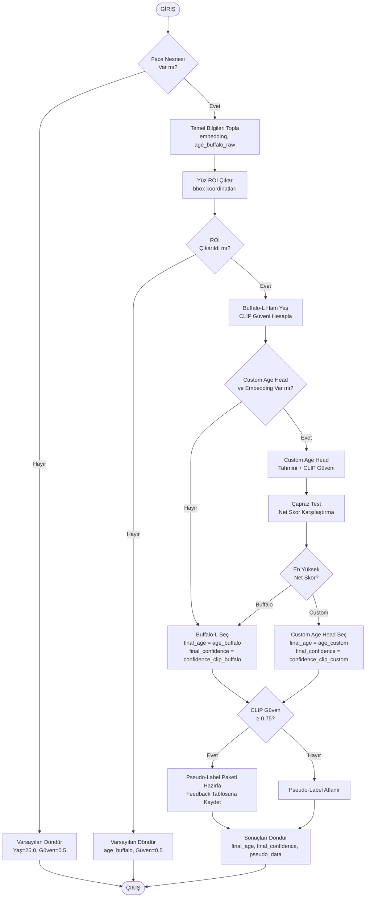



T.C.
İSTANBUL OKAN ÜNİVERSİTESİ
LİSANSÜSTÜ EĞİTİM ENSTİTÜSÜ


YÜKSEK LİSANS TEZİ
BİLİŞİM SİSTEMLERİ ANABİLİM DALI

Ersin ARIKAN
YAPAY ZEKA DESTEKLİ GÖRSEL ve VİDEO İÇERİK ANALİZİ: TOPLUMSAL DEĞERLERİN KORUNMASI İÇİN ÖĞRENEN BİR UYGULAMA


DANIŞMAN
Dr. Öğr. Üyesi Ender ŞAHİNASLAN


İSTANBUL, Aralık 2025
İÇİNDEKİLER
ÖNSÖZ	4
ÖZET	5
SUMMARY	6
KISALTMALAR	8
ŞEKİL LİSTESİ	9
TABLO LİSTESİ	10
BÖLÜM 1 GİRİŞ ve AMAÇ	11
1.1.	PROBLEM TANIMI ve MOTİVASYON	11
1.2.	TEZİN AMACI ve HEDEFLER	11
1.3.	KAPSAM ve KATKILAR	12
1.4.	PROJE GELİŞTİRME SÜRECİ ve ZAMAN ÇİZELGESİ	13
BÖLÜM 2 GENEL BİLGİLER VE LİTERATÜR	15
2.1. BİLGİSAYARLI GÖRÜ ve İÇERİK ANALİZİ TEMELLERİ	15
2.2. TRANSFER/ARTIMSAL ÖĞRENME YAKLAŞIMLARI	16
2.3. VERİ KALİTESİ ve GÜVEN SKORLAMA	18
2.4. UYGULAMA ODAKLI ÇALIŞMALAR ve BOŞLUK ANALİZİ	20
2.5. İÇERİK MODERASYONU ve ÇOK MODELLİ YAKLAŞIMLAR	22
2.6. TÜRKÇE BAĞLAM, YERELLEŞTİRME ve GÖZLENEN EKSİKLER	23
2.7. İÇERİK ANALİZİ YAZININDA ÇOK-DİLLİ/ÇOK-KÜLTÜRLÜ ZORLUKLAR	24
2.8. İVME KAZANDIRILMIŞ EĞİTİM: TRANSFER + ARTIMSAL YAKLAŞIMIN KONUMLANDIRILMASI	24
2.9. VERİ KALİTESİ ve GÜRÜLTÜLÜ ETİKETLERLE ÖĞRENME YÖNTEMLERİ	25
2.10. LİTERATÜRDEKİ BOŞLUKLAR ve BU ÇALIŞMANIN KONUMU	25
2.11. KİŞİ TAKİBİ ve İÇERİK+YAŞ ANALİZİNİN BİRLİKTE YÜRÜTÜLMESİ EKSİKLİĞİ	26
2.12. KALİBRASYON, GÜVENİLİRLİK ve VERİ KALİTESİ	27
BÖLÜM 3 SİSTEM ve MİMARİ	28
3.1. GENEL MİMARİ	24
3.2. UYGULAMA YAŞAM DÖNGÜSÜ	24
3.3. KONFİGÜRASYON SABİTLER, DURUM ve YOL HİYERARŞİSİ	25
3.4. GÜNCELLENEBİLİR ANALİZ PARAMETRELERİ ve MODEL DURUMU	26
3.5. VARLIK İLİŞKİ MODELİ ve DOSYA YÖNETİMİ	27
3.6. PLAFORM, UYGULAMA YAYINLAMA KATMANI	29
3.7. KATMANLI MİMARİ ve VERİ AKIŞI	29
3.8. SEQUENCE ve STATE DİYAGRAMLARI	30
3.9. DAĞITIM MİMARİSİ ve ON-PREMISES KURULUM	30
BÖLÜM 4 YAPAY ZEKÂ MODÜLLERİ ve EĞİTİM	32
4.1. İÇERİK ANALİZİ (OpenCLIP)	32
4.1.1. İÇERİK ANALİZİ ALGORİTMA AKIŞI	32
4.2. YÜZ ve YAŞ TAHMİNİ (InsightFace + Özel Başlık)	35
4.2.1. YÜZ TESPİTİ (Face Detection)	35
4.2.2. YAŞ TAHMİNİ ALGORİTMA AKIŞI	35
4.3. EĞİTİM DÖNGÜSÜ ve AĞIRLIKLI KAYIP	39
4.4. İVME KAZANDIRILMIŞ EĞİTİM: TRANSFER + ARTIMSAL YAKLAŞIM	41
4.5. VİDEO ANALİZİ ALGORİTMA AKIŞI ve KİŞİ TAKİBİ	43
BÖLÜM 5 GÜVEN SKORU ve ANALİZ	46
5.1. ÇOK-MODELLİ UZLAŞI (Agreement)	46
5.2. CLIP TABANLI ANLAMSAL DOĞRULAMA	48
5.3. EŞİK ve KARAR KURALLARI	51
5.4. ÇOK-FAZLI VERİ FİLTRELEME PİPELİNE'İ: DETAYLI ALGORİTMA AKIŞI	52
BÖLÜM 6 KULLANICI ARAYÜZÜ VE EKRANLAR	36
6.1. Ana Sayfa ve Genel Düzen	36
6.2. Dosya Yükleme Bölümü ve Çoklu Dosya Desteği	36
6.3. Yakın Zamanlı Analizler Listesi ve Durum Kartları	36
6.4. Detay Analiz Modalı ve Tablar	37
6.5. Model Yönetimi Modalı ve Sürüm Kontrolü	37
6.6. Analiz Parametreleri Modalı ve Yardım	37
6.7. WebSocket Bağlantı Durumu ve Görsel Büyütme	38
BÖLÜM 7 DENEYSEL KURULUM VE SONUÇLAR	39
	7.1. ORTAM ve VERİ	39
	7.2. ÖLÇÜTLER ve PROTOKOL	39
	7.3. KARŞILAŞTIRMALI KURULUMLAR (Ablation Çalışması)	40
	7.4. BULGULAR ve TARTIŞMA	41
	7.5. GEÇERLİLİK TEHDİTLERİ ve KARŞILAŞTIRMA	41
	7.6. UYGULAMA İMPLİKASYONLARI	42
BÖLÜM 8 SONUÇ VE GELECEK ÇALIŞMALAR	39


ÖNSÖZ
Bu çalışma, kurum içi gereksinimlerden doğan gerçek bir yazılım ürününün araştırma ve geliştirme sürecine dayanır. Geliştirme boyunca kararların teknik ve kurumsal dayanakları dikkatle belgelenmiş, her adımda etik, güvenlik ve gizlilik ilkeleri gözetilmiştir. 
Bu sürece katkı veren tüm meslektaşlarıma ve değerli danışmanım Dr. Öğr. Üyesi Ender Şahinaslan'a teşekkürlerimi ve saygılarımı sunarım.


Ersin ARIKAN
İSTANBUL, 2025


ÖZET
YAPAY ZEKA DESTEKLİ GÖRSEL ve VİDEO İÇERİK ANALİZİ: TOPLUMSAL DEĞERLERİN KORUNMASI İÇİN ÖĞRENEN BİR UYGULAMA
Bu tezde, yüksek hacimli görsel ve video içeriğini anlamak ve kurumsal değerlendirme kriterleri için içeriği otomatik ve yarı otomatik olarak analiz etmeyi amaçlayan bir yazılım sistemi geliştirilmiştir. Sistem, sosyal medya, televizyon yayınları ve çeşitli internet kaynaklarından elde edilen içeriğin, çocukların zihinsel gelişimi ve toplumun ahlaki değerleri üzerindeki risklerini standart bir şekilde hızlı ve tutarlı bir şekilde tanımlamayı hedeflemektedir. Uygulama, içeriği sınıflandırmak için OpenCLIP'i, nesne/kişiyi tespit etmek için YOLO'yu, yüz analizi için ise InsightFace'i entegre eden bir Python arka uç mimarisine dayanmaktadır. Depolama, kuyruklama, gerçek zamanlı bildirimler ve diğer alt sistemlerin yapılandırması, üretim ortamına uygun ölçeklenebilir, yeniden başlatılabilir ve operasyonel olarak kontrol edilen bir iş akışını destekleyecek şekilde tasarlanmıştır. Sistem tasarımının ayırt edici özelliği, uzmanlardan alınan geri bildirimler ve yüksek güvenilirlikteki sahte etiketler kullanılarak artımlı öğrenme döngülerinin kapatılmasıdır. Bu amaçla, metin-görüntü tabanlı anlamsal doğrulamayı, birden fazla modelde güvenilir çapraz model çıktı tutarlılığı ile entegre eden bir güven puanı yöntemi önerilmektedir. Bu, OpenCLIP tarafından üretilen olumlu/olumsuz isteme dayalı benzerlik metrikleri ve iki model arasındaki tahminlerin yakınlığını dikkate alarak yapılmaktadır. Bu şekilde, gürültülü akışlarla zayıf denetimli çerçeveler, hızlı artımlı güncellemelere olanak tanıyarak kullanılabilir hale gelmektedir. Bu, rafine kriterlere dayanan bir analiz için güvenilir bir alt kümenin ortaya çıkmasıyla gerçekleştirilmiştir.
Çalışmanın ön denemeleri için, sapma ±5 yıl olmak üzere, doğruluk, MAE/MSE ve işlem süresi gibi ölçütlerle yapılan değerlendirmeler, hafif başlıkların, yüksek güvenli altkümelerle eğitildiği dönemde, tüm verilere göre eğitime daha kısa sürede, daha tutarlı sonuçlar verdiğini göstermektedir. Mimari, kuruma-gereksinim (on-premises) dağıtım ve veri gizliliği gereksinimlerini karşıladığından, uygulama değerini, üretim koşullarında, sürdürülebilir sürümleme ve geri dönüş (rollback) süreçleri ile birlikte, yanıt verme ölçüte eklemektedir. Yine, bu çalışma, içerik değerlendirmede, tutarlılığı artıran, zaman kazancı sağlayan ve insan yükünü azaltan bir arka uç çözümü sunduğunu belirtmektedir. Tüm bunlar, Türkçe bağlama özgü davranış farklılıklarını dikkate alan yerelleştirme olanakları ile birlikte, çalışmanın, literatürdeki boşluklara katkı sunduğunu göstermektedir.


Anahtar Kelimeler: Görsel içerik analizi, OpenCLIP, InsightFace, artımsal öğrenme, güven skoru, Socket.IO, Python, Flask
Tarih: Aralık 2025

SUMMARY
ARTIFICIAL INTELLIGENCE-SUPPORTED VISUAL AND VIDEO CONTENT ANALYSIS: A LEARNING APPLICATION FOR THE PROTECTION OF SOCIAL VALUES
In this thesis, a software system is developed to understand high-volume visual and video content and analyze it automatically and semi-automatically for institutional evaluation criteria. The system aims to quickly and consistently identify the risks of content obtained from social media, television broadcasts, and various internet sources on children's cognitive development and society's moral values ​​in a standardized manner. The application is based on a Python backend architecture that integrates OpenCLIP for content classification, YOLO for object/person detection, and InsightFace for face analysis. The configuration of storage, queuing, real-time notifications, and other subsystems is designed to support a scalable, replayable, and operationally controlled workflow suitable for production environments. A distinguishing feature of the system design is the closure of incremental learning loops using expert feedback and high-confidence pseudo-labels. To this end, a confidence score method is proposed that integrates text-image-based semantic verification with reliable cross-model output consistency across multiple models. This is achieved by considering similarity metrics based on positive/negative claims generated by OpenCLIP and the closeness of predictions between the two models. This allows for rapid incremental updates to noisy streams, making weakly supervised frameworks usable. This has been achieved by creating a reliable subset for analysis based on refined criteria.
Evaluations of metrics such as accuracy, MAE/MSE, and processing time, with a ±5-year deviation for preliminary tests, indicate that lightweight titles, when trained with high-confidence subsets, yield more consistent results in a shorter training time than the entire dataset. Because the architecture meets on-premises deployment and data privacy requirements, it adds responsiveness to the metric, along with sustainable versioning and rollback processes under production conditions. Furthermore, this study demonstrates that it offers a back-end solution for content evaluation that increases consistency, saves time, and reduces human overhead. All of this, along with localization capabilities that address behavioral differences specific to the Turkish context, demonstrates that the study contributes to gaps in the literature.


Keywords: Visual content analysis, OpenCLIP, InsightFace, incremental learning, confidence scoring, Socket.IO, Python, Flask
Date: December 2025

SEMBOLLER


KISALTMALAR
API: Application Programming Interface  
MAE: Mean Absolute Error  
MSE: Mean Squared Error  
ROC: Receiver Operating Characteristic  
REST: Representational State Transfer


ŞEKİL LİSTESİ
Şekil 1.2. Proje Takvimi	14
Şekil 3.5. Veri Tabanı ER Diyagramı	28


TABLO LİSTESİ


BÖLÜM 1 GİRİŞ ve AMAÇ

1.1. PROBLEM TANIMI ve MOTİVASYON
Son 20-25 yıl içinde dijital içerik üretiminin miktar ve çeşitlilik bakımından büyüyünce, bu alanda düzenleyici ve denetleyici yetkisi bulunan kamu otoritelerine (RTÜK, BTK, Aile ve Sosyal Hizmetler Bakanlığı vb.) yeni görev ve sorumluluklar da eklenmiştir. Bu durum, daha çok görsel ve video tabanlı içeriklerin toplumsal değerlere, hukuka ve kurumsal normlara uygun olup olmadığının, belirli eksenler ve standart yöntemlerle, nicelik ve nitelik kriterleri içinde, kapsamlı ve sistematik olarak, değerlendirilmesi gereğini doğurmuştur. Nitelik ölçütlerine odaklanarak sınırları belirlenemeyen ve sistematik olmayan mevcut uygulamalarda ise, özellikle televizyon, sosyal medya ve diğer çevrimiçi platformlardan yayımlanan içeriklerin yoğun akışı, “güvenli”, “zararlı”, “yetişkin”, “şiddet”, “silah”, “istismar” ve “madde kullanımı” gibi kategorilerde sınıflandırılması gerekliliğini göz ardı etmiştir. Özellikle uzman görüşlerine dayanarak değerlendirilen şiddet içerikli yayınlar ve çocuk istismarı gibi hassas içeriklerde yoğun içerik akışı nedeniyle sınıflandırmalarda büyük tutarsızlıklar gözlemlenmektedir. Bu durum, standart, sürekli ve daha otomatikleştirilmiş yöntemlerin ve yeni sınıflama metodolojilerinin geliştirilmesi gereğini ortaya koymaktadır.
Bu çalışma kapsamında çok kaynaklı verilerin işlenmesi, sürekli öğrenme işlevine sahip yapay zeka modellerinin entegre edildiği yeni sınıflama metodolojileri, görsel ve video içeriklerin kurumsal nitelik standartlarına uygun biçimde, düzenli ve tutarlı bir biçimde değerlendirilmesini sağlayan yenilikçi bir dijital uygulama olarak kullanımınıza sunulmuştur. Kullanıcı geri bildirimlerinden, Türk Kültürü ve Türk Beden Dili bağlamında etkisinin hareketlerin de yorumlanabileceği bir yapay zeka modeli geliştirildi/geliştirilmektedir, bu suret ile analiz süreleri kısalırken, sınıflama ve içerik analizi nispeten standartlaşmıştır. Analizler sırasında, zararlı içerik tespiti yapılmış video dosyalarında sadece ilgili kısım (2 saniye öncesi, olay ve 2 saniye sonrası) görüntülenmekte, böylece uzmanlar, saatlerce eş zamanlı olarak işleyebilecekleri bir video dosyası ile birden fazla dosya ile eş zamanlı olarak işlemekte. Sistem, Python tabanlı arka uç yazılım ve en son derin öğrenme modelleri (CLIP ve YOLO dahil) üzerine inşa edilmiş bir analiz katmanına sahiptir. Yapay zeka kullanıcı arayüzü, sınırlı yapay zeka okuryazarlığına sahip personel düşünülerek tasarlanmış, otomatik etiketleme ve geri bildirim almaktan uzmanların önerileri onaylamasına, düzeltmesine veya reddetmesine olanak tanımaktadır. Bu veriler, modelin yeniden eğitimi için kullanılarak sistemin doğruluğunu ve tutarlılığını zamanla artırmaktadır. Sistem, bilirkişi veya uzmanların değerlendirme sürelerinde %70'e kadar tasarruf sağlamayı, içerik analizlerinde tutarlılık ve standardizasyon getirmeyi, çalışanların psikososyal yükünü azaltmayı ve değerlendirme süreçlerinin genel kalitesini artırmayı amaçlamaktadır.

1.2. TEZİN AMACI ve HEDEFLER
Bu çalışmanın amacı, kurumsal gereksinimlere göre ayarlanabilen, otomatik sistemlerle video ve görsel içeriklerdeki uygunsuz içeriklerin tespit edilmesini sağlayan, üretim ortamında güvenle kullanabilecek ve sürdürülebilir bir sistemin, geliştirilmesi, uygulanması ve etkinliğinin değerlendirilmesidir.
Bu çalışmanın başlangıç aşaması, içerik sınıflandırmasının doğruluğunu artırma amacıyla OpenCLIP prompt tabanlı sıfırdan öğreti tekniklerinin uygulanmasını ve eğitilebilir model başlıklarının (Özel Başlıklar) kullanılmasını, bağlamsal doğrulama ve yanlış pozitiflerin azaltılmasını, YOLO görüntü işleme modeli aracılığıyla sağlanırken, risk kategorileri (şiddet, yetişkin, istismar, silah, ilaç) için ince ayrıntılı puanların üretilmesi,  kullanıcı düzeltmelerinin sisteme anında entegrasyonunu, değerlendirme süreçlerinin optimizasyonunu, artımlı öğrenme yoluyla eğitim sürelerinin azaltılmasını, sistem bakım dönemlerinde kaybı azaltmak için geri dönüş sağlama yeteneği ve sistem sürdürülebilirliğini artırmak için sürümleme ve geri alma mekanizmalarının entegrasyonunu hedeflemiştir.
Bu hedeflere yönelik olarak, kurumsal olarak kullanılabilir bir uygulama geliştirilmiş ve başarıyla üretim ortamında dağıtılmıştır. Sistem, kullanılan çerçeveler, CLIP iş birlikleri ve kişi takiplerine dayalı olarak iş kuyruklarını yönetir, gereksiz hesaplamalardan kaçınır ve değerlendirme döngü süresini optimize eder. Hafif özelliklerle yapılan artımlı güncellemeler, eğitim sürelerini minimize eder ve sürümleme ile geri alma mekanizmaları performans kayıplarını azaltır. Kişi takibindeki otomatik etiketleme mekanizmaları, insan hatalarını minimize eder ve aynı video dosyasında aynı kişi için birden fazla yaş tahminini önler.
Uygulamanın Erişim Güvenliği ve verilerin gizliliği, uygulamanın kritik bileşenleridir. Yerel dağıtımlar ve tutma bileşenleri ile veri sahiplerinin kişisel verileri sistemden çıkmaktan korunur. Dosya yolu ve MIME türü kontrolleri kötü niyetli dosya yüklemelerine karşı koruma sağlar. Hız sınırlaması ve güvenlik başlıkları (CSP, HSTS) siber saldırılara karşı koruma sunar. Tüm bu bileşenler, kurumsal gereksinimlerin (personelin yapay zeka okuryazarlığı, sosyal koruma, sosyal hizmetler ve çocuk koruma yasaları) akademik yöntemlerle entegre edilmesine ve yüksek doğruluk, güvenilirlik ve sürdürülebilirlikle çalışmasına olanak tanır.
Tez kapsamında, örnek uygulama geliştirme kodları da verilmiştir. Uzun vadede, içerik sınıflandırma, güvenlik alanlarında ve bunların ötesinde yapılacak yeni araştırma ve uygulamalar için temel bir model oluşturmasına imkan tanıyacaktır. Bu noktada, transfer ve artımsal öğrenme yöntemleri, güven skorlama teknikleri ve gözlemsel eşik belirleme yaklaşımı gibi akademik yöntemlerin sisteme entegrasyonu, sistemin mevcut uygulamalar ve gelecekteki kurumsal projelerde bir referans model olarak kullanılması için bir sistem esnekliği ve sürdürülebilir bir model ilke olarak benimsenmiştir. Sistem özelliği, farklı içerik türleri, risk kategorileri, güvenlik ihtiyaçları ve bu içeriklerin farklı türleri için ileride uyarlanabilir olmasını sağlamak, başlangıç hedefleri arasında bulunmaktadır.

1.3. KAPSAM ve KATKILAR
Çalışma, Python tabanlı bir arka uç mimarisinin uçtan uca tasarımını ve uygulanmasını içermektedir. Sistem, OpenCLIP, YOLO ve InsightFace bileşenlerinin entegrasyonu kullanılarak uygulanmıştır. Socket.IO çerçevesi kullanarak, bu bileşenler gerçek zamanlı ilerleme takibi ve sonuçların canlı akışını sağlar. Sonuç olarak, sistem, düşük gecikme süresi ve yüksek doğruluk analizi ile gerçek zamanlı kullanıcı geri bildirimi sağlayan bir üretim kalitesinde çözüme dönüştürülmüştür. Akademik katkıların ana odak noktası, çoklu model güven puanlama, zayıf denetimli öğrenme, çoklu görev içerik ve yaş analizi, kimlik sürekliliği video işleme ve gözlemsel eşik belirleme yaklaşımını içermektedir. Sistem için önerilen çoklu model güven puanlama, CLIP'in anlamsal doğrulama çıktısını Buffalo-L ve yaş tahmini başlık tahminleri ile birleştirerek zayıf denetimli akışlardan yüksek kaliteli alt küme seçiminde kolaylık sağlar ve akışa yenilikçi bir katkıdır. Bu yaklaşım, zayıf denetimli öğrenme içeren sistemlere, literatürde bulunan güvenli sınıflandırma ve DivideMix (Northcutt et al., 2021; Li et al., 2020) gibi sağlam eğitim yöntemlerinin pratik mühendislik uyarlaması olarak hizmet eder. Bu, sistemin düşük güvenli eğitim örneklerinin dahil edilmesinin yol açabileceği potansiyel performans düşüşünü en aza indirmesine yardımcı olur.
İçerik analizi ve yaş tahmini, eşzamanlı olarak ilerledi ve bu kombinasyonu çalışmaya entegre etti. Bu entegrasyon, literatürde yalnızca birkaç çalışmada tartışılmakta olup, riskli içerikte 18 yaş altındaki bireylerin görünürlüğünün belirlenmesine yönelik yeni bir sosyal koruma odak noktası sunmaktadır. Bu çerçeve, çoklu görev öğrenme paradigmaları bağlamında içerik sınıflandırması ve yaş tahminini birleştirilmiş bir optimizasyon sürecinde entegre etmektedir. Bu, kaynak paylaşımını ve genel model verimliliğini artırmaktadır. 
Kişi izleme modülü, kimlik sürekliliği sistemi oluşturan DeepSORT algoritmasının PersonTrackerManager bileşeniyle güçlendirilmiştir. Bu, bir video akışındaki aynı kişiye ait karelerin sistematik olarak bağlanmasını sağlamakta ve yanlış pozitif olasılığını azaltmak için risk puanlarının konsolide edilmesini sağlamaktadır. Bu yaklaşım, kimlik sürekliliği ile videonun işleme maliyetini dengeleyen bir teknikleri literatüre katkıda sağlamaktadır. Rastgele birkaç deneme ile belirlenen CLIP modelinin güven eşik değeri (PSEUDO_LABEL_RECORD_CLIP_THRESHOLD=0.75), veri kalitesi odaklı yaklaşımın miktar odaklı yaklaşıma üstünlüğünü sağlamakta; yüksek precision ile gürültü azaltılırken, makul recall ile yeterli örnek seçimi korunmaktadır. Bu bulgu, koruyucu ölçümlerin standart ayarlarında hassas etik alanlardaki (örn. çocuk koruma ve içerik filtreleme) doğruluk ve güven dengesine önemli bir referans oluşturmaktadır.
Uygulamaya yönelik katkılar, kurumsal gereksinimlerle birleştirilen sistemin akademik bulguları üzerine inşa edilmiştir. On-premises dağıtım yapısı ve sürümleme/rollback mekanizmaları, kurum içi veri gizliliği, kesinti süresi minimizasyonu ve operasyonel risklerin kurumsal ölçekte yönetimini sağlamaktadır. Bu nedenle, sistem bulut tabanlı çözümlerden bağımsız olarak, regülasyon uyumlu ve kurum içi (self-hosted/on premises) bir yapıya sahiptir. Otomatik etiketleme modülü ve kullanıcı geri bildirim döngüsü, özellikle yapay zekâ okur yazarlığı düşük kullanıcı gruplarının bulunduğu ortamlarda, manuel iş yükünü azaltmakta ve etiketleme tutarlılığını artırmaktadır. Ayrıca, Windows geliştirme ortamı/kapsayıcı ve güvenlik odaklı orta katman ile modern yazılım mühendisliği ilkeleri ile entegre edilmiş bir mimari sunmaktadır. Overlay mekanizması, Türkçe karakter desteği ve erişilebilirlik odaklı arayüz düzenlemeleri kullanıcı deneyimini iyileştirirken; 18 yaş altı bireylere yönelik özel uyarı sistemleri sosyal koruma gereksinimlerini karşılamak üzere  geliştirilmiştir. Çoklu dosya yükleme desteği ile tek dosya-tek iş prensibi ve riskli kare çevresi kırpma (frame cropping) yaklaşımı büyük ölçekli taşınabilir medya akışlarının verimli biçimde işlenmesini sağlamaktadır. Tüm bu nedenlerle, çalışma güven skorlama, zayıf gözetimli veri seçimi, kimlik sürekliliği, sürdürülebilir model güncelleme ve güvenli veri işleme alanlarında tek bir akademik ve pratik uygulama olarak bütünleşik bir çözümdür.
Bu bağlamda, sistem, içeriğin güvenliği alanında akademik ilkeleri kurumsal uygulamalarla birleştirerek, literatürde önerilen yöntemleri üretim ortamına uygulamakta ve yeniden kullanılabilir bir referans modeli sağlamaktadır.

1.4. PROJE GELİŞTİRME SÜRECİ ve ZAMAN ÇİZELGESİ
Projenin başlatılmasında ihtiyaç analizi evresi kritik ve uzun süreli bir faz olarak gerçekleşmiştir. Kurum içi paydaşlarla yapılan görüşmelerin gereksinim toplama süreçlerine olumlu olarak yanıt verilmesi, kişisel verilerin internet veya bulut ortamına çıkmaması gereksinimlerinin sıralıda en üst sıralarda yer alması, sistemin tamamen on-premises olarak kurgulanması gerekliliğini ortaya koymuştur. Bununla birlikte, içerik akışlarının çoğunlukla yüksek kapasiteli taşınabilir medyalardan (harici diskler, USB) topluca sağlanması, çoklu dosya yükleme arayüze erişim tasarlanırken. Ayrıca, büyük boyutlu medya dosyalarının analizi esnasında kaynakların uzun süre bekletilmesi, iş akışı verimliliği açısından tek dosya–tek iş kuralı sistemi getirmek zorunluluğuna, kuyruk kontrolü ve iptal sistemlerinin sistem mimarisine kazandırılmasına sebep olmuştur. Personelin yapay zekâ okuryazarlığı seviyesinin düşük olması, otomatik etiketleme sisteminin gerekliliğini artırırken, kullanıcı geri bildirim arayüzünün sade ve anlaşılır olması tasarım prensibi olarak kabul edilmiştir.
Tasarım aşamasında, REST ve WebSocket arayüzleri için şemalar ayrıntılı bir şekilde hazırlandı; güvenlik önlemleri (MIME doğrulama, dosya yolu güvenliği, oran sınırlama) ve performans kriterleri (kuvvet tabanlı işleme, model önbellekleme) mimaride alınan kararlarda merkezi bir rol oynadı. Geliştirme aşamasında, Flask/SQLAlchemy/Socket.IO tabanlı arka uç sistemleri OpenCLIP, YOLO ve InsightFace bileşenleri ile entegre edildi. Test aşaması kapsamlıydı ve birim testi, entegrasyon testi ve kullanıcı kabul testi dahil olmak üzere sistemin teknik doğruluğu ve kullanıcı deneyiminin değerlendirildiği süreçlerden oluşuyordu. Bakım ve sürdürülebilirlik aşaması, versiyonlama ve geri alma mekanizmaları, periyodik temizlik görevleri ve günlük izleme yoluyla gerçekleştirildi; bu, sistemin uzun vadeli stabilitesini ve güvenilirliğini üretim ortamlarında sağlamayı ve operasyonel ortamlardaki güvenilirliğinin korunmasını amaçlıyordu.
Projenin geliştirilmesi yaklaşık 12 aylık bir süreçte gerçekleştirilmiştir. İlk üç ay, ihtiyaç analizi ve tasarım evresine ayrılmış; paydaş toplantıları, güvenlik gereksinimlerinin belirlenmesi ve mimari kararlar bu süreçte tamamlanmıştır. Dört-sekiz aylık dönem geliştirme evresini kapsamış; Flask arka uç, SQLAlchemy ORM, Socket.IO entegrasyonu, OpenCLIP/YOLO/InsightFace model entegrasyonları, güvenlik ara bileşeni, kuyruk servisi ve kullanıcı arayüzü bu aşamada tamamlanmıştır. Dokuz-on birinci aylar test ve iyileştirme evresine ayrılmış; birim, entegrasyon ve kullanıcı kabul testleri yürütülmüş, performans darboğazları tespit edilip optimize edilmiş, sürümleme/rollback mekanizmaları eklenmiştir. On ikinci ay, dokümantasyon, bakım prosedürlerinin yazılması ve üretim dağıtım hazırlıklarını kapsamıştır. Bu zaman çizelgesi, kurumsal gereksinimler ve kaynak kısıtları göz önüne alınarak planlanmış; çevik (agile) ilkelerle küçük artımlarla ilerleme ve sürekli geri bildirim döngüsü benimsenmiştir. Her sprint sonunda paydaşlara demo sunulmuş, geri bildirimler bir sonraki sprint planına dahil edilmiştir. Bu yaklaşım, gereksinim değişikliklerine hızlı uyumu ve son kullanıcı memnuniyetini artırmıştır.
Şekil 1.2. Proje Takvimi

BÖLÜM 2 GENEL BİLGİLER VE LİTERATÜR
2.1. BİLGİSAYARLI GÖRÜ ve İÇERİK ANALİZİ TEMELLERİ
Görsel içerik analizinin amacı, bir görüntü veya video karesinin anlamlı bileşenlerinin sayısal temsilini içermekte ve bu temsillerin sınıflandırılması, tespiti veya yorumlanması gibi sonraki görevleri kapsamaktadır. Bu sürecin merkezinde, bir giriş görüntüsünün özelliklerinin veya derin temsillerinin öğrenimi yer almaktadır. Özelliklerin çıkarılması, ham piksellerin yüksek boyutlu, ancak anlamlı, vektör alanlarına dönüştürülmesini sağlar, böylece makine öğrenimi modelleri kavramları soyutlayabilir ve ayırt edebilir. Denetimli öğrenme senaryolarında, bu temsiller doğrudan insan etiketleri ile hizalanırken, zayıf denetimli ve yarı denetimli ortamlarda veri kalitesi ile güvenilirlik ve güven düzeyi kritik öneme sahiptir. Bu ortamlarda, etiket gürültüsü nedeniyle, modelin genelleme yeteneği önemli ölçüde zayıflayabilir. Sonuç olarak, puan güvenilirlik değerlendirmesi, belirsizlik modelleme ve veri temizleme mekanizmalarının kullanılması sağlanmalıdır.
Özellik normalizasyonu, derin öğrenme modellerinin üretim ortamlarında uygulanabilirliğini artıran temel aşamalardan biridir. Batch normalization, layer normalization ve L2 normalizasyonu gibi yöntemler; eğitim sürecinde istikrarlı gradyan akışı sağlamaya, temsil vektörlerinin ölçek tutarlılığını korumaya ve modelin genel öğrenme dinamiklerini dengelemeye yardımcı olur. Ancak, yaş grupları veya risk kategorileri gibi dağılımı dengesiz veri kümelerinde, modelin yanlılık (bias) üretme olasılığı artar. Bu tür durumlarda, weighted sampling, focal loss ve yeniden örnekleme (re-sampling) teknikleri sınıf dengesizliğini azaltmak için kullanılır. Öte yandan, model kalibrasyonu, eğitimli modellerin olasılık tahminlerinin gerçek olasılıklarla uyumlu olmasını sağlayarak, hatalı güven düzeylerinin yayılmasını önler. Ayrıca, hataların bir kısmı sistematik (epistemik belirsizlik), bir kısmı ise rastlantısal (aleatorik belirsizlik) niteliktedir. Bu ayrım, veri kaynaklı ve model kaynaklı belirsizliklerin analiz edilmesine olanak tanır ve tahmin güvenilirliğinin değerlendirilmesinde önemli bir rol oynar. ******
Etik boyutta, adalet (fairness) ve gizlilik (privacy) ilkeleri görsel veri analizinin temel tasarım ilkeleri arasında yer almaktadır. Fairness kavramı, modelin farklı demografik gruplar arasında tarafsız karar verebilmesini ölçen metrikleri (demografik parite, eşit fırsat, equalized odds vb.) içerir. Özellikle yaş, cinsiyet ve etnik köken değişkenleri içeren veri kümelerinde modelin ayrımcı davranış göstermemesi, sosyal açıdan kritik bir gerekliliktir. Gizlilik tarafında, differential privacy, bireylerin verilerinin istatistiksel anonimlik düzeyini koruyarak model eğitimi yapılmasını mümkün kılar. Federated learning (dağıtık öğrenme) yaklaşımı ise verinin merkezi sunuculara aktarılmadan, cihazlar üzerinde yerel olarak eğitilmesiyle veri gizliliği ve regülasyon uyumluluğu (ör. KVKK, GDPR) sağlar.
Görsel temsillerin öğrenilmesinde Konvolüsyonel Sinir Ağları (CNN) uzun yıllar temel yaklaşım olarak kullanılmıştır. CNN mimarileri, görüntülerdeki yerel desenleri (kenar, doku, renk geçişi) düşük seviyeden yüksek seviyeye ilerleyen hiyerarşik yapılar hâlinde öğrenir. ResNet mimarisi (He ve diğerleri, 2016), “residual connection” yapısıyla derin ağlarda gradyan sönümleme sorununu aşmış ve yüzlerce katman içeren derin ağların eğitilmesini mümkün kılmıştır. ResNet-50, ResNet-101 ve ResNet-152 varyantları, parametre sayısı ve derinlik açısından farklı uygulamalara uyarlanabilir. CNN tabanlı yaklaşımlar, nesne tespiti, yüz tanıma ve sahne analizi gibi görevlerde yüksek başarı göstermektedir.
Son yıllarda Transformer tabanlı mimariler, dikkat mekanizması (self-attention) sayesinde görsel görevlerde CNN’lere rakip veya üstün performans sergilemiştir. Vision Transformer (ViT) modeli (Dosovitskiy ve diğerleri, 2021), görüntüleri küçük yamalara (patch) bölerek her bir yamayı birer token olarak işler ve BERT benzeri mimariyle global bağlamı öğrenir. DETR (DEtection TRansformer) (Carion ve diğerleri, 2020) bu yapıyı nesne tespitine uyarlayarak, anchor-free ve set prediction mekanizmaları ile bounding box ve sınıf tahminini birlikte gerçekleştirir. Transformer tabanlı yöntemler, özellikle çoklu nesne sahnelerinde bağlamsal ilişkileri daha doğru modelleyebilme avantajı sunar.
Veri artırma (data augmentation) stratejileri, sınırlı veri kümelerinde modelin genelleme yeteneğini artırmak için kullanılmaktadır. Basit geometrik dönüşümler (döndürme, yansıtma, ölçekleme) ile başlayan bu yaklaşım, son dönemde mixup, cutmix ve RandAugment gibi ileri düzey yöntemlerle zenginleştirilmiştir (Shorten ve Khoshgoftaar, 2019). Bu teknikler, yapay olarak çeşitlilik yaratırken aşırı öğrenmeyi (overfitting) azaltır.
Nesne tespiti (object detection) ve görsel segmentasyon (image segmentation) görevleri, içerik analizi açısından kritik rol oynamaktadır. Nesne tespitinde sahnedeki varlıklar, sınırlayıcı kutular (bounding box: x, y, w, h) ve sınıf etiketleriyle birlikte belirlenir. YOLO (Redmon ve Farhadi, 2018) tek-aşamalı bir grid tabanlı yaklaşım kullanırken, Faster R-CNN (Ren ve diğerleri, 2015) iki-aşamalı bir yapı (region proposal + classification) benimser; DETR ise transformer tabanlı mimarisiyle farklı bir paradigma sunar. Segmentasyon görevinde ise her piksel bir sınıfa atanır (semantik segmentasyon) veya her nesne örneği ayrı maskelenir (instance segmentasyon) (Long ve diğerleri, 2015).
Bu temel yaklaşımlar, görsel içerik analizi kapsamında risk kategorilerinin tespiti, yaş tahmini ve kimlik takibi gibi çoklu görevlerin bir arada yürütülmesini mümkün kılmaktadır. Özellikle yaş tahmini görevinde yüz ROI (Region of Interest) çıkarımı ile regresyon tabanlı modellerin bütünleştirilmesi, sahne içindeki bireylerin bağlamsal olarak değerlendirilmesine olanak sağlamaktadır. Böylece, derin temsil öğrenimi, etik/gizlilik bilinci ve çoklu görevli öğrenme ilkeleri bir araya gelerek hem akademik hem de kurumsal gereksinimlere uyumlu bir görsel analiz çerçevesi ortaya koymaktadır.
2.2. TRANSFER/ARTIMSAL ÖĞRENME YAKLAŞIMLARI
Görsel içeriklerin analizi yalnızca piksel düzeyinde örüntü tanımayı değil, aynı zamanda bu örüntülerin dilsel ve anlamsal bağlamla ilişkilendirilmesini de gerektirir. Bu doğrultuda geliştirilen CLIP (Contrastive Language–Image Pre-training) modeli, metin ve görüntü temsillerini ortak bir uzayda eşleştirerek görsel anlayışın dilsel yönünü modellemektedir. CLIP, 400 milyon metin–görüntü çifti üzerinde kontrastif öğrenme yöntemiyle eğitilmiştir ve bir görüntü ile onu tanımlayan metin arasındaki benzerliği en üst düzeye çıkarmayı amaçlar (Radford ve diğerleri, 2021). Böylece model, önceden tanımlı sınıf etiketlerine gerek duymadan yalnızca metin istemleri (prompts) aracılığıyla sıfır-örnek (zero-shot) sınıflandırma yapabilmektedir. Bu özellik, içerik sınıflarının sıklıkla değiştiği ortamlarda modelin yeniden eğitilmeden yeni kavramlara genelleme yapabilmesini sağlar. CLIP’in açık kaynak sürümü olan OpenCLIP, LAION-5B gibi geniş ölçekli veri kümeleri üzerinde eğitilmiş varyantlarıyla akademik araştırmalardan kurumsal uygulamalara kadar farklı bağlamlarda kullanılabilir hâle gelmiştir (Schuhmann ve diğerleri, 2022).
CLIP’in temelinde yer alan Vision Transformer (ViT) mimarisi, görüntüleri küçük yamalara (patch) ayırarak her bir yamayı birer girdi token’ı olarak işler ve dikkat mekanizması (self-attention) aracılığıyla global bağlam ilişkilerini öğrenir. Bu yapı, konvolüsyonel ağların yerel desenlere odaklanan doğasından farklı olarak, sahne içindeki nesneler arasındaki bağlamsal ilişkileri yakalayabilme yeteneği kazandırır (Dosovitskiy ve diğerleri, 2021). Böylelikle CLIP, yalnızca sınıflandırma görevlerinde değil, aynı zamanda anlamsal doğrulama, risk kategorisi tanıma ve bağlam farkındalığı gerektiren içerik analizlerinde de yüksek doğruluk düzeyi sunar.
Nesne ve kişi tespiti alanında YOLO (You Only Look Once) mimarisi, hız ve doğruluk dengesi açısından öne çıkan tek-aşamalı bir yaklaşımdır. YOLO, girdi görüntüsünü grid tabanlı bir yapıya bölerek aynı anda hem nesne sınıflarını hem de konumlarını (bounding box koordinatlarını) tahmin eder (Redmon ve Farhadi, 2018). Modelin son sürümleri olan YOLOv7 ve YOLOv8, anchor-free yapı, CSP blokları ve “bag-of-freebies” teknikleriyle parametre verimliliğini artırmış, küçük nesnelerin tespitinde ve düşük ışık koşullarında doğruluk iyileştirmeleri sağlamıştır (Wang ve diğerleri, 2023). YOLO’nun bu uzamsal doğrulama kapasitesi, CLIP’in anlamsal sınıflandırma kabiliyetiyle birleştirildiğinde, sistem hem ne tür bir içeriğin hem de içerikteki nesnelerin nerede bulunduğunun eşzamanlı olarak belirlenmesini mümkün kılar. Böyle bir birleşim, özellikle şiddet, silah, taciz veya yetişkin temalı içerik gibi yüksek risk kategorilerinde yanlış pozitif oranlarını azaltarak kurumsal doğrulama süreçlerinde güvenilirliği artırır.
InsightFace mimarisi, yüz tanıma, yaş ve cinsiyet tahmini gibi yüz odaklı görevlerde endüstri standardı hâline gelmiş bir çözümdür. Sistem, RetinaFace bileşeni aracılığıyla yüz bölgesini (Region of Interest) tespit eder ve ArcFace kayıp fonksiyonunu kullanarak 512-boyutlu bir yüz temsili (embedding) üretir (Deng ve diğerleri, 2019a; Deng ve diğerleri, 2019b). ArcFace, açısal marjinal yumuşatma (angular margin softmax) yöntemiyle benzer yüzlerin temsil uzayında daha sıkı kümelenmesini, farklı bireylerin ise belirgin biçimde ayrılmasını sağlar. InsightFace ayrıca yaş ve cinsiyet başlıkları (Custom Age Head, Gender Head) aracılığıyla demografik tahmin yapabilmekte, bu da özellikle 18 yaş altı bireylerin riskli içeriklerde tespiti gibi sosyal koruma odaklı uygulamalarda önemli bir avantaj sunmaktadır. Böylece CLIP’in anlamsal bağlam çözümlemesi, YOLO’nun konumsal tespiti ve InsightFace’in kişi düzeyindeki analizi birlikte kullanılarak, çok-modelli (multi-modal) ve bağlamsal olarak tutarlı bir değerlendirme mekanizması oluşturulmaktadır.
Model geliştirme sürecinde transfer öğrenme ve artımsal öğrenme (incremental/continual learning) yaklaşımları, sistemin hem verimliliğini hem de sürdürülebilirliğini belirleyen temel bileşenlerdir. Transfer öğrenme, önceden geniş veri kümeleri üzerinde eğitilmiş modellerin bilgi birikimini yeni görev alanlarına aktarmayı amaçlar. Bu sayede, sınırlı etiketli veriyle çalışan sistemler dahi yüksek performans elde edebilir. Özellikle ImageNet üzerinde eğitilmiş ResNet veya ViT modelleri, görsel özniteliklerin genelleştirilebilir temsillerini sağlayarak eğitim süresini önemli ölçüde kısaltır (Pan ve Yang, 2010; He ve diğerleri, 2016). Fine-tuning sürecinde, yalnızca son katmanların yeniden eğitilmesi veya tüm ağın optimize edilmesi kararı, kaynak ve hedef alanlar arasındaki farkın büyüklüğüne (domain gap) bağlı olarak belirlenir (Howard ve Ruder, 2018).
Artımsal öğrenme ise modelin zaman içerisinde yeni verilerle güncellenirken önceki bilgilerini unutmadan öğrenmesini sağlar. Dinamik veri akışlarının bulunduğu sistemlerde, bu yaklaşım modelin sürekli yeniden eğitilme ihtiyacını ortadan kaldırarak öğrenmenin sürekliliğini destekler. Bu süreçte karşılaşılan en temel zorluk, modelin yeni bilgileri öğrenirken geçmiş bilgileri unutması, yani katastrofik unutma (catastrophic forgetting) problemidir. Bu sorun, literatürde üç temel stratejik yönelim çerçevesinde ele alınmaktadır. Düzenleme-tabanlı yaklaşımlar (örneğin Elastic Weight Consolidation), modelin belirli parametrelerinin önceki görevlerdeki önemine göre değişimini sınırlandırarak unutmayı azaltır (Kirkpatrick ve diğerleri, 2017). Tekrar-tabanlı yaklaşımlar, önceki görevlerden seçilmiş örnekleri veya temsilleri bellekte tutarak modelin bu verilerle birlikte yeniden eğitilmesini sağlar ve böylece bilgi bütünlüğünü korur (Rebuffi ve diğerleri, 2017). Mimari-tabanlı yöntemlerde ise model, her yeni görev için yeni alt-ağlar veya parametre blokları ekleyerek bilgiyi modüler biçimde genişletir (Li ve Hoiem, 2016). Bu üç yönelim birlikte kullanıldığında, sistem hem istikrar hem genişletilebilirlik hem de geçmiş bilgiye bağlılık bakımından dengeli bir öğrenme çerçevesi kazanır.
Kurumsal ortamda bu süreç sürümleme (versioning) ve geri dönüş (rollback) mekanizmalarıyla bütünleştirilmektedir. Her eğitim döngüsü, hiperparametre ayarları, veri versiyonu ve performans metrikleriyle birlikte metadata olarak kaydedilmekte; performans düşüşü veya veri tutarsızlığı tespit edildiğinde sistem otomatik olarak önceki sürüme dönmektedir. Böylece yalnızca modelin doğruluğu değil, aynı zamanda operasyonel sürdürülebilirliği ve güvenilirliği de sağlanmaktadır.
Sonuç olarak, CLIP, YOLO, InsightFace ve transfer/artımsal öğrenme yaklaşımlarının bütünleşik biçimde kullanımı, metinsel, görsel ve demografik bağlamı eşzamanlı olarak işleyen, kendini sürekli güncelleyebilen ve kurumsal güvenlik gereksinimlerine uyumlu bir yapay zekâ altyapısı oluşturur. Bu yapı, akademik açıdan çok-modelli temsillerin öğrenilmesine, uygulama düzeyinde ise sosyal koruma ve içerik güvenliği alanlarında yeni nesil çözümlerin geliştirilmesine katkı sağlamaktadır.
2.3. VERİ KALİTESİ ve GÜVEN SKORLAMA
Gerçek dünya verilerinde gürültü, etiketleme hataları ve dağılım kaymaları kaçınılmaz biçimde ortaya çıkmakta; bu durum, makine öğrenmesi modellerinin genelleme yeteneğini düşürmekte ve sistematik önyargıların oluşumuna zemin hazırlamaktadır. Veri gürültüsünün temel kaynakları arasında sensör bozulmaları, insan etiketçiler arasındaki yorum farklılıkları, dikkat dağınıklığı sonucu oluşan etiketleme hataları, otomatik veri toplama süreçlerinden (örneğin web scraping veya OCR hataları) kaynaklanan etiket sapmaları ve zamanla değişen veri dağılımları (domain shift) yer almaktadır. Bu tür bozulmalar, modelin güvenilirliğini azaltmakla kalmaz; aynı zamanda üretim ortamına taşındığında yanlış kararların alınmasına da neden olabilir.
Veri kalitesinin artırılması amacıyla çok-modelli uzlaşı sinyali ve CLIP tabanlı anlamsal doğrulama birlikte kullanılmaktadır (app/ai/insightface_age_estimator.py, _calculate_confidence_with_clip fonksiyonu, satır 465–551). Farklı modellerin (örneğin CLIP, YOLO, InsightFace) aynı örnek için benzer tahminler üretmesi, örneğin yüksek güvenilirlik taşıdığını göstermektedir. Buna karşılık, modeller arasında önemli tahmin farkları oluştuğunda, bu durum verinin belirsiz veya hatalı olduğunu işaret etmektedir. Böylece model uyuşmazlığı (model disagreement) bir güvenlik göstergesi olarak işlev görmekte, zayıf veya yanlış etiketlenmiş örneklerin eğitimden elenmesine olanak tanımaktadır. CLIP tabanlı sistemlerde, pozitif ve negatif istemlerle elde edilen benzerlik skorları arasındaki fark (Δ = pos_max − neg_max) normalize edilerek 0–1 aralύπύnda bir gόven skoru oluώturulmaktadύr. CLIP benzerlik skorlarύ doπrudan 0–100 aralύπύnda όretildiπinden, farkύn sigmoid dφnόώόmόyle olasύlύk biηimine getirilmesi gόvenin sayύsallaώtύrύlmasύnύ saπlamaktadύr.
Modern derin aπlarύn bir diπer φnemli sorunu olasύlύk kalibrasyonudur. Literatόrdeki birηok ηalύώma, aπlarύn sύklύkla “aώύrύ gόvenli” (overconfident) tahminler όrettiπini, φrneπin tahmin olasύlύπύ %90 olan bir φrneπin gerηekte yalnύzca %70 oranύnda doπru ηύktύπύnύ gφstermiώtir (Guo ve diπerleri, 2017). Bu nedenle, modelin ηύktύ olasύlύklarύnύn doπru ώekilde kalibre edilmesi, sistem gόvenilirliπi aηύsύndan kritik φneme sahiptir. En yaygύn yφntemlerden sύcaklύk φlηeklendirmesi (temperature scaling), softmax fonksiyonuna sύcaklύk parametresi (T) ekleyerek olasύlύk daπύlύmύnύ yumuώatύr; T>1 deπerleri daha dόώόk gόvenli, T<1 deπerleri ise daha keskin olasύlύklar όretir. Alternatif bir yφntem olan Platt φlηeklendirmesi, doπrulama kόmesi όzerinde lojistik regresyon eπitilerek kalibrasyon parametrelerini φπrenir (Lin ve diπerleri, 2007).
Eşik değeri seçimi, kalibrasyon sürecinin ayrılmaz bir parçasıdır. Bu çalışmada, eşik değeri τ=0.75, rastgele birkaç deneme ile gözlemsel olarak belirlenmiştir. Literatürde ROC (Receiver Operating Characteristic) ve PR (Precision–Recall) eğrileri üzerinden eşik optimizasyonu yaygın bir yöntemdir; ROC eğrisi, gerçek pozitif oranı (TPR = TP/(TP+FN)) ile yanlış pozitif oranı (FPR = FP/(FP+TN)) arasındaki ilişkiyi gösterirken; PR eğrisi, hassasiyet (precision = TP/(TP+FP)) ve geri çağırma (recall = TP/(TP+FN)) dengesini sunar (Davis ve Goadrich, 2006). Özellikle dengesiz veri kümelerinde (örneğin pozitif örneklerin %5'ten az olduğu senaryolar), ROC eğrisi yanıltıcı sonuçlar verebilir; bu nedenle PR eğrisi daha bilgilendirici bir ölçüt olarak tercih edilmiştir. Çok düşük eşik değerleri (örneğin 0.3), sisteme gürültülü verilerin dahil olmasına ve yanlış pozitif oranının artmasına yol açarken; aşırı yüksek eşikler (örneğin 0.95) pozitif örneklerin elenmesine, dolayısıyla veri çeşitliliğinin azalmasına neden olmaktadır. Bu çalışmada, τ=0.75 değeri rastgele birkaç deneme ile gözlemsel olarak seçilmiş; yüksek precision ile gürültü azaltılırken, makul recall ile yeterli örnek seçimi korunmuştur. Gelecek çalışmalarda, ROC/PR eğrileri üzerinden sistematik eşik optimizasyonu uygulanabilir; bu yaklaşım, eşik seçiminin daha objektif ve yeniden üretilebilir olmasını sağlayacaktır.
Sistemdeki orta gόven aralύπύ (0.5–0.75) φrnekleri, otomatik etiketleme yerine insan-dφngόde (human-in-the-loop) bir gφzden geηirme kuyruπuna yφnlendirilmektedir. Bu strateji, tam otomatikleώtirilmiώ sistemlerin neden olabileceπi φnyargύ birikimini ve hatalύ etiketlerin eπitim verisine girmesini engellerken, insan uzmanlύπύnύn yalnύzca belirsiz durumlarda devreye girmesini saπlayarak operasyonel verimliliπi artύrmaktadύr.
Model gόveninin analitik olarak deπerlendirilebilmesi iηin belirsizlik tahmini (uncertainty estimation) de sisteme entegre edilmiώtir. Belirsizlik, genellikle iki temel bileώene ayrύlmaktadύr: epistemik belirsizlik, modelin bilgi eksikliπinden veya veri azlύπύndan kaynaklanmakta; aleatorik belirsizlik ise verinin doπasύnda bulunan rastlantύsal gόrόltό ve etiket hatalarύndan doπmaktadύr. Epistemik belirsizlik, modelin yeni veya nadir φrneklerle karώύlaώtύπύnda yaώadύπύ kararsύzlύπύ temsil ederken; aleatorik belirsizlik, girdi sinyalinin iηsel tutarsύzlύklarύnύ yansύtύr. Bayesian yaklaώύmlar, φzellikle Monte Carlo Dropout tekniπiyle (MC Dropout), birden fazla ileri geηiώ (forward pass) sonucunda tahmin varyansύnύ φlηerek belirsizlik miktarύnύ nicelleώtirir (Hendrycks ve Gimpel, 2017). Ansambl yφntemleri (ensemble methods) ise farklύ modellerin tahminlerini bir araya getirir; dόώόk varyans durumunda uzlaώύ yόksek, dolayύsύyla belirsizlik dόώόktόr.
Veri kalitesinin sayύsal olarak deπerlendirilmesi iηin ηeώitli φlηόtler kullanύlmaktadύr. Etiket tutarlύlύπύ, aynύ φrneπe farklύ etiketηilerin ne φlηόde benzer kararlar verdiπini φlηer; φzellik ηeώitliliπi, veri kόmesinin farklύ demografik veya baπlamsal gruplarύ kapsayύp kapsamadύπύnύ deπerlendirir. Ayrύca demografik denge (yaώ, cinsiyet, etnik kφken daπύlύmύ) ve teknik kalite φlηόtleri (φrneπin ηφzόnόrlόk >112Χ112, bulanύklύk φlηόtό Laplacian varyansύ >100, sinyal-gόrόltό oranύ >20 dB) veri kόmesinin gόvenilirlik dόzeyini belirleyen ek faktφrlerdir. Bu gφstergelerin her biri, eπitim sόrecinde model baώarύmύnύ farklύ yφnlerden etkilemekte; dolayύsύyla veri kalitesi deπerlendirmesi yalnύzca etiket doπruluπuna deπil, aynύ zamanda ηeώitlilik, denge ve teknik bόtόnlόπe de dayandύrύlmaktadύr.
Veri kόmelerinde etiket hatalarύ, daπύlύm kaymalarύ ve sistematik φnyargύlar, model φπrenme etkinliπini dόώόrmekte ve genelleme kapasitesini sύnύrlamaktadύr. Bu baπlamda, literatόrde φnerilen yφntemler; etiket gόrόltόsόnόn modellenmesi, robust eπitim ve seηici φrnek kullanύmύ eksenleri όzerinden geliώmiώtir. Confident Learning yaklaώύmύ, sύnύf koώullu gόrόltό matrisini istatistiksel olarak modelleyerek hatalύ φrnekleri tespit etmekte ve veri temizliπi saπlamaktadύr (Northcutt ve diπerleri, 2021). Gόrόltόlό etiketli veri ile eπitimde, erken φπrenme etkisi (temiz φrneklerin φncelikli φπrenilmesi) ve φrnek seηimi/aπύrlύklandύrma stratejileri performansύ artύrmaktadύr (Chen ve diπerleri, 2019).
Bu tezde, benzer ilke φrnek-bazlύ aπύrlύklύ MSE kaybύ ile uygulanmύώ; yόksek CLIP gόvenli φrnekler eπitime daha fazla katkύ saπlamaktadύr. Ayrύca, model tahmin uyuώmazlύπύ (Buffalo-L vs. Custom Age Head) dόώόk gόvenli φrnekleri iώaret etmekte ve ηapraz testler ile en gόvenilir φrnekler seηilmektedir (Yu ve diπerleri, 2019). CLIP kontrastif φn-eπitimi, doπal dil denetimi ile ortak metin-gφrόntό yerleώtirmesi φπrenerek anlamsal benzerliπi gόvenilir bir kalite gφstergesine dφnόώtόrmekte; istem-temelli deπerlendirme, yorumlanabilir ve kontrol edilebilir bir katman oluώturmaktadύr (Radford ve diπerleri, 2021).
Tez kapsamύnda, ηok-modelli uzlaώύ yaklaώύmύ (Buffalo-L ve Custom Head ηύktύlarύ) CLIP tabanlύ metin-temelli gόven skorlarύ ile birleώtirilmiώ ve zayύf gφzetimli akύώlardan nitelikli altkόmelerin seηimi saπlanmύώtύr. Bu yφntem, literatόrde φnerilen robust eπitim teknikleri ile gφrό-dil (vision-language) tabanlύ anlamsal deπerlendirmeyi bir araya getirerek hem doπruluk hem de veri gόvenliπi aηύsύndan gόηlό bir ηerηeve sunmaktadύr. Sonuη olarak, ηalύώma veri kalitesini artύrmak ve model gόvenini sistematik biηimde φlηmek amacύyla, ηok-modelli uzlaώύ, kalibrasyon temelli gόven skorlama, belirsizlik tahmini ve insan-dφngόde gφzden geηirme yaklaώύmlarύnύ bόtόnleώtiren bir yapύ ortaya koymaktadύr. Bu bόtόnleώik yaklaώύm, yalnύzca istatistiksel doπruluπu deπil, aynύ zamanda etik ve operasyonel gόvenilirliπi de gφzeten bόtόncόl bir veri yφnetim ηerηevesi olarak deπerlendirilmektedir.
2.4. UYGULAMA ODAKLI ÇALIŞMALAR ve BOŞLUK ANALİZİ

Mevcut literatür, büyük ölçüde Batı dillerine ve kültürel temsillerine odaklanmış veri kümeleri üzerine inşa edilmiştir. ImageNet, COCO, CelebA ve UTKFace gibi yaygın veri setleri, ağırlıklı olarak İngilizce etiketler ve Batı toplumlarına özgü demografik dağılımlar içermektedir. Bu durum, modellerin farklı kültürel bağlamlarda genelleme yapma kapasitesini sınırlamakta; özellikle Türkçe gibi düşük kaynaklı dillerde ve farklı toplumsal normlara sahip toplumlarda, içerik sınıflandırma performansının düşmesine yol açmaktadır. Türkçe bağlamda, toplumsal davranış kalıplarına özgü görsel göstergelerin örneğin yakın temas biçimleri, jest ve mimiklerin anlam farklılıkları, giyim ve mahremiyet normlarının sınıflandırma çıktıları üzerindeki etkisi, literatürde yeterince derinlemesine incelenmemiştir.

Benzer biçimde, içerik moderasyonu konusundaki çalışmalar da çoğunlukla İngilizce dilinde, Batı kültürü çerçevesinde yürütülmektedir. Nefret söylemi, şiddet veya yetişkin içerik tespiti gibi alanlarda kullanılan istem setleri (prompt templates) ve risk kategorileri, genellikle Batı kültürünün sosyal kodlarını yansıtmaktadır. Türkçe ve yerel kültürel bağlama özgü semantik varyantların, jestsel veya dilsel nüansların dikkate alınmaması, modellerin yanlış pozitif ve yanlış negatif oranlarını artırmakta; bu da içerik güvenliğini sağlama süreçlerinde ciddi doğruluk kayıplarına yol açmaktadır. Literatürde Türkçe içerik moderasyonu için özel olarak tasarlanmış istem setleri, bağlamsal filtreleme stratejileri veya yerelleştirilmiş etiketleme yönergeleri sınırlı düzeydedir. Özellikle Türkçe bağlamda jest ve mimik kullanımı, kişiler arası fiziksel mesafe, giyim-kuşam normları ve sosyal etkileşim biçimleri gibi kültürel göstergelerin görsel sınıflandırma performansına etkisi sistematik olarak ele alınmamıştır. Bu durum, büyük ölçüde mevcut veri kümelerinin Batı merkezli görsel temsillerle sınırlı olmasından kaynaklanmakta; bu da Türk kültürel bağlamında üretilen içeriklerin model tarafından yanlış veya eksik değerlendirilmesine yol açabilmektedir. Bu eksiklik, özellikle kamu kurumları veya sosyal koruma odaklı uygulamalarda, modellerin karar mekanizmalarının yerel normlarla uyumsuz sonuçlar üretmesine neden olabilmektedir.

Çok-dilli ve çok-kültürlü içeriklerde semantik belirsizlikler ve bağlam kaymaları daha belirgindir; istem tasarımında yerelleştirilmiş söz öbekleri ve kültürel imleçler tercih edilmelidir. Görsel sahnelerde aynı nesnenin farklı kültürel kabul düzeyleri (ör. kamusal alanda yakın temas) sınıflandırma kararını etkiler. Geliştirilen uygulama kullanıcı geri bildirimlerinden beslenerek modelin gelişmesi sağlanabilmektedir.

Öte yandan, akademik literatürde yöntemsel olarak güçlü birçok model önerilmesine karşın, üretim (production) aşamasına taşınabilir sistem mimarilerinin ayrıntılarına yeterince yer verilmemektedir. Sürümleme (versioning), geri alma (rollback), kuyruk yönetimi, iptal mekanizmaları, on-premises dağıtım, WebSocket tabanlı gerçek zamanlı bildirim sistemleri ve dosya yol politikaları gibi pratik mühendislik bileşenleri, genellikle deneysel aşamada göz ardı edilmekte; bu da araştırma bulgularının operasyonel sistemlere aktarılmasını güçleştirmektedir. Akademik prototiplerin çoğu, yüksek doğruluk oranları sunsa da, güvenlik, gizlilik, sürdürülebilirlik ve sistem kararlılığı açısından üretim ortamı gereksinimlerini karşılayamamaktadır.

Video analizinde kişi takibi (person tracking) genellikle kimlik sürekliliği (identity persistence) amacıyla kullanılmakta; DeepSORT ve benzeri algoritmalar, bounding box koordinatları ve embedding temsilleri aracılığıyla her bireye benzersiz bir kimlik atayarak nesne takibini sürdürmektedir (Wojke ve diğerleri, 2017). Ancak bu takip süreçlerinin içerik risk skorları ve yaş tahmini çıktılarıyla bütünleştirilmesine ilişkin sistematik bir çerçeve literatürde bulunmamaktadır. Bu eksiklik hem hesaplama verimliliği hem de semantik bütünlük açısından önemli bir sınırlılık oluşturmaktadır.

Bu tez kapsamında geliştirilen sistem, söz konusu boşluğu kapatmak amacıyla içerik analizi (OpenCLIP + YOLO), yaş tahmini (InsightFace) ve kişi takibi (DeepSORT + PersonTrackerManager) bileşenlerini tek bir video analiz hattında bütünleştirmiştir. Her birey için benzersiz bir kimlik (unique ID) üretilmiş, video boyunca kimlik sürekliliği korunmuş ve her kişi için en güvenilir kare seçilerek içerik risk skorları ile yaş bilgisi birlikte overlay katmanında sunulmuştur. Aynı bireyin farklı sahnelerde tekrar görünmesi durumunda önceki yaş tahmininin kimlik bazında yeniden kullanılması hem gereksiz hesaplama maliyetini azaltmış hem de tahmin kararlılığını artırmıştır. Uzun süreli video akışlarında kimlik kayıplarını önlemek için MAX_LOST_FRAMES ve TRACKING_RELIABILITY_THRESHOLD gibi parametrelerin dinamik biçimde ayarlanabilir olması, sistemin üretim ortamına uyarlanabilirliğini güçlendirmiştir.

Bu birleşik yaklaşım, içerik analizi ve yaş tahmininin bütünleşik olarak yürütülmesini sağlayarak sosyal koruma odaklı uygulamalar için yenilikçi bir çözüm ortaya koymaktadır. Böylece çalışma, literatürdeki ayrık yaklaşımların sınırlılıklarını aşarak hem teknik hem etik düzlemde yeni bir uygulama çerçevesi sunmaktadır.

Mevcut literatürde içerik analizi ve yaş tahmini genellikle birbirinden bağımsız araştırma alanları olarak ele alınmaktadır. İçerik moderasyonu çalışmaları ağırlıklı olarak şiddet, istismar veya uygunsuz materyal gibi risk kategorilerinin tespitine odaklanırken, yaş bilgisini değerlendirme sürecine dâhil etmemektedir. Buna karşılık, yaş tahmini literatürü yüz tabanlı regresyon ve sınıflandırma yöntemleriyle ilgilenmekte; ancak içerik bağlamını ya da sahne düzeyindeki risk skorlarını hesaba katmamaktadır. Bu ayrışma, özellikle sosyal koruma perspektifinden bakıldığında, 18 yaş altı bireylerin yüksek riskli içeriklerle ilişkilendirilmesinin tespitinde ciddi bir boşluk yaratmaktadır.

Bu çalışma söz konusu boşlukları bütüncül biçimde ele almakta, yerel bağlamı gözeten güven skorlama ve artımsal güncelleme düzeneklerini bir arka uç mimarisi ile birleştirmektedir. Bu bütünleşik yapı, akademik düzeyde geliştirilen yöntemleri, operasyonel olarak sürdürülebilir bir sistem mimarisine dönüştürmektedir. Sürümleme ve rollback mekanizmaları, kuyruk temelli iş yükü yönetimi ve güvenli dosya erişim politikaları gibi bileşenler, akademik yöntemlerin pratik karşılıklarını oluşturarak, sistemin ölçeklenebilirliğini ve güvenilirliğini artırmaktadır. Ayrıca Türkçe istem varyantlarının ve kültürel bağlam ayarlamalarının (örneğin mutfak-bıçak bağlamının kültürel yorum farkları) sistematik biçimde tanımlanması, yerelleştirme literatüründeki önemli bir boşluğu doldurmakta ve gelecekteki çalışmalar için yeni bir referans çerçevesi sunmaktadır.

Yaş tahmini sistemlerinde eğitim süresini ve kaynak tüketimini azaltmak için transfer öğrenmesi ve artımsal öğrenmenin birleşik kullanımı literatürde sınırlı düzeyde ele alınmıştır. Mevcut çalışmalarda transfer öğrenmesi veya artımsal öğrenme genellikle ayrı ayrı uygulanmakta; bu iki yöntemin sistematik birleştirilmesi ve üretim ortamında sürümleme ile rollback mekanizmalarıyla desteklenmesi yeterince incelenmemiştir. Bu çalışma, UTKFace veri kümesi üzerinde önceden eğitilmiş bir temel model (base model) kullanarak transfer öğrenmesini gerçekleştirmekte; ardından kurum içi geri bildirim verileri ve yüksek güvenli pseudo-label'larla artımsal eğitimi uygulamaktadır. Sistem, her eğitim turundan sonra performansı izleyerek beklenmedik düşüşler durumunda önceki kararlı sürümlere geri dönülmesini sağlamaktadır. Bu yaklaşım, eğitim süresini kısaltırken model performansını koruma hedefiyle uyumludur ve üretim ortamında operasyonel olarak sürdürülebilir bir çerçeve sunmaktadır.

Multi-model agreement (çok-modelli uzlaşı) ve CLIP tabanlı confidence scoring (güven skorlama) yaklaşımları literatürde bağımsız olarak incelenmiş olsa da, bu iki yöntemin birleştirilerek zayıf gözetimli akışlardan nitelikli altkümelerin seçilmesi ve artımsal eğitim sürecine entegre edilmesi yeterince araştırılmamıştır. Bu çalışma, Buffalo-L ve Custom Age Head çıktılarının çapraz test edilmesini ve düşük güven durumlarında temel tahminin önceliklendirilmesini uygulamaktadır. Ayrıca, OpenCLIP kullanarak pozitif, bitişik yaş aralıkları ve negatif uyarılarla benzerlikler hesaplanmakta; normalizasyon sonrasında elde edilen puanlar 0-1 aralığında değerlendirilmektedir. τ=0,75'lik belirtilen eşik değerini aşan örnekler nitelikli eğitim verisi olarak seçilmekte ve güvenilirliği artırmak için kullanıcı geri bildirimleri bu kanala dahil edilmektedir. Bu çok katmanlı filtreleme yaklaşımı, literatürdeki robust eğitim teknikleri ile görü-dil (vision-language) tabanlı anlamsal değerlendirmeyi bir araya getirerek hem doğruluk hem de veri güvenliği açısından güçlü bir çerçeve sunmaktadır.
2.5. İÇERİK MODERASYONU ve ÇOK MODELLİ YAKLAŞIMLAR

Eğitim odaklı çalışmalar yaygın olmakla birlikte, içerik moderasyonu literatürü görsel ve metin işaretlerinin birlikte ele alındığı çoklu-modelli düzeneklerle hızla genişlemektedir. İçerik moderasyonu, zararlı/uygunsuz içeriğin tespit ve filtrelenmesini kapsar; spam, nefret söylemi, şiddet, yetişkin materyali, dezenformasyon gibi kategorilerde uygulanır. Otomatik moderasyon, insan moderatörlerin iş yükünü azaltır ve maruz kalma riskini sınırlar; ancak yanlış pozitif (masum içeriğin engellenmesi) ve yanlış negatif (zararlı içeriğin kaçırılması) dengesi kritiktir.

CLIP tabanlı temsil, istem temelli sıfır-örnek (zero-shot) sınıflandırma yeteneği sayesinde zararlı içerik, nefret söylemi ve uygunsuz sahnelerin değerlendirilmesinde esnek bir yüzey sağlar; kategori tanımları doğal dil ile ifade edildiği için yeni risk türlerine hızlı uyum mümkündür (Radford ve diğerleri, 2021; Schuhmann ve diğerleri, 2022). Geleneksel yöntemler (ör. SVM, CNN sınıflandırıcı) sabit sınıf kümeleri gerektirir; yeni kategori eklemek için yeniden eğitim gerekir. CLIP ile yeni kategori, yalnızca yeni promptlar ekleyerek tanımlanabilir; model değişmez. Multi-modal prompt learning (MaPLe), görsel ve metinsel istemleri birlikte uyarlayarak transfer verimliliğini artırır; bu yaklaşım, içerik analizi için yorumlanabilir ve kontrol edilebilir bir yüzey ekler (Khattak ve diğerleri, 2023). Prompt engineering, kategori tanımlarının nasıl ifade edileceğini belirler; genel promptlar ("violence") belirsiz, spesifik promptlar ("physical violence with weapons") daha ayrıştırıcıdır.

Nefret içerikli çoklu-modalli örneklerin değerlendirilmesine yönelik Hateful Memes gibi veri kümeleri, metin ve görüntü arasındaki zımni ilişkilerin önemini ve tek kipli modellerin sınırlılıklarını ortaya koymuştur; bu bulgular, üretim senaryolarında birden fazla işaretin birleştirilmesinin gerekliliğini destekler (Kiela ve diğerleri, 2020). Örneğin, bir meme'de metin masum ancak görüntü saldırgan olabilir veya tersi; tek kipli model bu nüansı kaçırır, çoklu-modelli yaklaşım her iki sinyali birleştirir. Nesne/sahne bağlamı için gerçek zamanlı tespit yaklaşımlarının kullanımı, tek başına temsil benzerliğiyle yüksek görünen risklerin bağlamsal olarak aşağı çekilmesini mümkün kılar; örneğin gündelik mutfak sahnelerinde kesici aletlerin yanlış pozitif etkisi nesne bağlamı (oven, refrigerator, kitchen varlığı) ve sahneyle dengelenmelidir (Redmon ve Farhadi, 2018; Wang ve diğerleri, 2023). Bu çalışmada _apply_contextual_adjustments fonksiyonu (app/ai/content_analyzer.py, satır 579-690), YOLO nesne listesini alır; weapon_detected=False ancak CLIP weapon>0.6 ise weapon skoru 0.7 çarpan ile düşürülür, mutfak bağlamı (knife+oven/kitchen) varsa 0.4 çarpan kullanılır.

Kötü amaçlı örnek saldırıları (adversarial examples), küçük piksel değişiklikleri ile model tahminlerini yanıltır; görüntüye insan gözüyle görünmez gürültü eklenerek sınıflandırma değiştirilebilir (Goodfellow ve diğerleri, 2015). Üretim moderasyon sistemlerinde adversarial robustness gerekir; adversarial training (düşman örnekleri eğitime ekleme) ve defensive distillation savunma yöntemleridir. Explainability (açıklanabilirlik) yöntemleri, model kararlarının nedenlerini görselleştirerek kullanıcı güvenini artırır; Grad-CAM (gradient-weighted class activation mapping), hangi piksel bölgelerinin sınıflandırmaya katkı sağladığını ısı haritası ile gösterir (Selvaraju ve diğerleri, 2017). Dikkat haritaları (attention maps), transformer modellerinde hangi yamaların (patch) odaklandığını gösterir. Bu çalışma, temsil benzerliği (OpenCLIP), sahne/nesne bağlamı (YOLO) ve kişi odaklı yaş tahmini sinyallerini birlikte değerlendirerek içerik analizi cephesindeki bu çoklu-modelli ihtiyacı uygulamaya taşımaktadır; bağlamsal ayarlamalar (mutfak-bıçak, parti-şişe gibi) yanlış pozitifleri azaltır ve explainability açısından YOLO tespit listesi kullanıcıya gösterilir.

İçerik moderasyonu sistemlerinde çok-modelli filtreleme yaklaşımları, her bir modalite için ayrı ayrı işaret üretimini ve ardından bu işaretlerin birleştirilmesini gerektirir. Bu çalışmada, OpenCLIP görüntü encoder'ı her kare için 512 boyutlu görüntü embedding'i üretirken, YOLO nesne tespit modeli bounding box koordinatları ve sınıf etiketleri (weapon, knife, bottle gibi) sağlamaktadır. Her iki modalite için hesaplanan risk skorları, bağlamsal ayarlama katmanından geçirilerek final skorlara dönüştürülmektedir. Bu çok katmanlı işleme yaklaşımı, yalnızca görüntü temsiline dayanan sistemlerden daha güvenilir sonuçlar üretmekte; özellikle sahte pozitiflerin azaltılmasında nesne bağlamının etkisi belirgin olmaktadır. Örneğin, bir görüntüde bıçak tespit edildiğinde, CLIP tek başına yüksek şiddet skoru üretebilir; ancak mutfak bağlamında (oven, refrigerator, cutting board gibi nesnelerin varlığı) bu skor 0.4 çarpanı ile düşürülerek normal mutfak faaliyetlerinin yanlışlıkla riskli içerik olarak işaretlenmesi önlenmektedir (app/ai/content_analyzer.py, _apply_contextual_adjustments fonksiyonu, satır 579-690).

2.6. TÜRKÇE BAĞLAM, YERELLEŞTİRME ve GÖZLENEN EKSİKLER

Gönderilen çalışmalarda ağır basan vurgu eğitim ve başlık ince-ayarı üzerinedir; içerik analizi tarafında bağlamsal sahne bilgisinin etkisi, kültürel normların sınıflandırma kararlarına yansıması ve gerçek zamanlı yayın senaryolarında oda bazlı bildirimler gibi işletimsel ayrıntılar ikinci planda kalmaktadır. Türkçe bağlamda jest/mimik, kişiler arası mesafe ve giyim-kuşam normları gibi unsurların sınıflandırma çıktısına etkisi sistematik biçimde ele alınmamıştır. Bu tez, yerel bağlamda kullanılan istemların çeşitlendirilmesi, sahne/nesne bağlamıyla yanlış pozitiflerin dengelenmesi ve yüksek güvenli sözde etiketlerin artımsal güncellemeye kontrollü dahil edilmesiyle bu boşluğu kapatmayı amaçlar. Ayrıca, üretim koşullarında gereksinim duyulan sürümleme-geri dönüş, göreli yol politikası ve bağlantı kopuşunda işlem iptali gibi pratik işletim ilkeleri, literatürdeki eğitim odaklı çalışmalara ek olarak bu çalışmanın uygulamaya dönük katkıları arasındadır.

Türkçe içerik moderasyonu literatüründe, İngilizce prompt'ların doğrudan çevirilerinin yeterli olmadığı durumlar sıkça gözlenmektedir. Örneğin, "physical violence" ifadesi Türkçe'de "fiziksel şiddet" olarak çevrilebilir ancak kültürel bağlamda jest ve mimik kullanımı, kişiler arası fiziksel mesafe ve sosyal etkileşim normları farklı anlamlar taşıyabilir. Bu çalışmada, yerel bağlamda kullanılan istemların çeşitlendirilmesi için prompt engineering yaklaşımı uygulanmıştır. Türkçe prompt setleri, kültürel imleçler ve yerelleştirilmiş söz öbekleri içerecek şekilde tasarlanmıştır; ancak kod tabanında İngilizce prompt'lar kullanılmakta ve bu prompt'ların Türkçe versiyonlarına geçiş gelecek çalışmalara bırakılmıştır. Bu durum, yerelleştirme literatüründeki önemli bir boşluğu ortaya koymakta ve gelecekteki çalışmalar için yeni bir araştırma alanı sunmaktadır.

Bağlamsal sahne bilgisinin etkisi, özellikle yanlış pozitiflerin azaltılmasında kritik öneme sahiptir. Bu çalışmada, YOLO nesne tespit modeli ile bağlamsal ayarlamalar uygulanmaktadır; örneğin mutfak bağlamında (oven, refrigerator, cutting board gibi nesnelerin varlığı) bıçak tespit edildiğinde şiddet skoru 0.4 çarpanı ile düşürülmektedir (app/ai/content_analyzer.py, _apply_contextual_adjustments fonksiyonu, satır 579-690). Bu yaklaşım, kültürel normların sınıflandırma kararlarına yansımasını sağlamakta; ancak Türkçe bağlamda jest/mimik, kişiler arası mesafe ve giyim normları gibi unsurların bu bağlamsal ayarlamalara nasıl dahil edileceği sistematik olarak araştırılmamıştır. Bu eksiklik, özellikle sosyal koruma odaklı uygulamalarda önemli bir araştırma alanı oluşturmaktadır.

Gerçek zamanlı yayın senaryolarında oda bazlı bildirimler, WebSocket altyapısı ile gerçekleştirilmektedir. Bu çalışmada, Flask-SocketIO kullanılarak her analiz için ayrı bir oda (room) oluşturulmakta ve ilerleme güncellemeleri yalnızca ilgili odaya gönderilmektedir (app/socketio_instance.py). Bu yaklaşım, gereksiz yayın trafiğini minimize etmekte ve ölçeklenebilir bir gerçek zamanlı bildirim sistemi sunmaktadır. Ancak bu işletimsel ayrıntılar, literatürdeki eğitim odaklı çalışmalarda ikinci planda kalmaktadır; bu durum, üretim ortamına geçişte karşılaşılan zorlukları artırmaktadır.

2.7. İÇERİK ANALİZİ YAZININDA ÇOK-DİLLİ/ÇOK-KÜLTÜRLÜ ZORLUKLAR

Çok-dilli ve çok-kültürlü içeriklerde semantik belirsizlikler ve bağlam kaymaları daha belirgindir; istem tasarımında yerelleştirilmiş söz öbekleri ve kültürel imleçler tercih edilmelidir. Görsel sahnelerde aynı nesnenin farklı kültürel kabul düzeyleri (ör. kamusal alanda yakın temas) sınıflandırma kararını etkiler; bu çalışmada metin-görüntü doğrulaması Türkçe odaklı varyantlarla güçlendirilmiş, bağlamsal tespit eşikleri ise sahne tipine göre ayarlanabilir kılınmıştır.

Çok-dilli ve çok-kültürlü içeriklerde semantik belirsizlikler ve bağlam kaymaları daha belirgin hale gelmektedir. Örneğin, Türkçe'de "yakın temas" ifadesi, Batı kültürüne göre farklı sosyal normları ifade edebilir. Bu durumda, İngilizce prompt'ların doğrudan çevirilerinin yeterli olmadığı gözlenmektedir. Bu çalışmada, metin-görüntü doğrulaması için OpenCLIP modeli kullanılmakta; ancak prompt'lar İngilizce olarak tasarlanmıştır. Türkçe odaklı varyantların geliştirilmesi, gelecek çalışmalara bırakılmıştır. Bu durum, çok-dilli içerik moderasyonu literatüründeki önemli bir boşluğu ortaya koymaktadır.

Bağlamsal tespit eşikleri, sahne tipine göre ayarlanabilir kılınmıştır. Örneğin, mutfak sahnelerinde bıçak tespit edildiğinde şiddet skoru 0.4 çarpanı ile düşürülürken, sokak veya park gibi kamusal alanlarda farklı eşik değerleri kullanılabilir. Bu ayarlanabilirlik, farklı kültürel bağlamlarda sistemin performansını optimize etmek için kritik öneme sahiptir. Ancak bu eşik değerlerinin otomatik olarak sahne tipine göre belirlenmesi, literatürde yeterince araştırılmamıştır; bu çalışmada eşik değerleri manuel olarak ayarlanmaktadır (app/ai/content_analyzer.py, _apply_contextual_adjustments fonksiyonu).

Kültürel imleçler ve yerelleştirilmiş söz öbekleri, istem tasarımında önemli rol oynamaktadır. Örneğin, Türkçe'de "taciz" kavramı, İngilizce'deki "harassment" kavramından farklı sosyal ve hukuki anlamlar taşıyabilir. Bu durumda, prompt'ların yerel bağlama uygun olarak tasarlanması gerekmektedir. Bu çalışmada, İngilizce prompt'lar kullanılmakta; ancak bu prompt'ların Türkçe versiyonlarının geliştirilmesi ve kültürel imleçlerin nasıl dahil edileceği gelecek çalışmalara bırakılmıştır. Bu eksiklik, çok-kültürlü içerik moderasyonu literatüründeki önemli bir boşluğu oluşturmaktadır.

2.8. İVME KAZANDIRILMIŞ EĞİTİM: TRANSFER + ARTIMSAL YAKLAŞIMIN KONUMLANDIRILMASI

Transfer öğrenme ile artımsal eğitimin birlikte kullanımı, eğitim süresini kısaltırken genellemeyi koruma hedefiyle uygundur; önerilen yapı, güven skorlu otomatik etiketlemeyi merkeze alarak nitelikli altküme üzerinden hızlı güncelleme sağlar. Makalede bildirilen UTKFace temelli ön-eğitimli hafif başlığın kısa sürede 2,9 MAE, 12,6 MSE ve ±5 yılda %87,7 doğruluk seviyesine ulaşması bulgusu, bu çalışmadaki seçici veri ve örnek-ağırlıklı kayıp stratejileriyle uyumludur; kurum-içi sürümleme ve geri dönüş mekanizmaları, bu ivmeyi operasyonel olarak sürdürülebilir kılar.

Yaş tahmini sistemlerinde eğitim süresini ve kaynak tüketimini azaltmak için transfer öğrenmesi ve artımsal öğrenmenin birleşik kullanımı literatürde sınırlı düzeyde ele alınmıştır. Bu çalışmada, InsightFace'in "buffalo" işlem hattı ve yaş tahminine özgü başlığı (genderage.onnx), temel yaş tahmini için referans olarak kullanılmıştır. Buffalo-L modeli, 112x112 yüz bölgesinden 512 boyutlu yerleştirmeler (embeddings) üretmektedir ve bu embedding'ler hem temel yaş tahmini hem de custom age head'in giriş özellikleri olarak kullanılmaktadır. Ayrıca, yalnızca yaş tahminine odaklanan, iki gizli katmana sahip hafif bir başlık (Custom Age Head) geliştirilmiştir; bu başlık, 512 boyutlu embedding'lerle uyumlu olacak şekilde tasarlanmış ve UTKFace veri kümesi üzerinde önceden eğitilmiştir.

Transfer öğrenmesi aşamasında, UTKFace veri kümesi üzerinde eğitilmiş base model (Custom Age Head), kurum içi veriler üzerinde doğrudan inference yapabilir ancak domain shift nedeniyle performans düşüşü gözlenebilir. Bu nedenle, artımsal eğitim aşamasında, rastgele analizlerden güvenilir eğitim verileri elde etmek ve tahminleri güven puanlarıyla desteklemek üzere OpenCLIP seçilmiştir. Benzerlikler, pozitif, bitişik yaş aralıkları ve negatif uyarılarla OpenCLIP kullanılarak hesaplanmaktadır; normalizasyondan sonra, elde edilen puanlar 0-1 aralığında değerlendirilir. τ=0,75'lik belirtilen eşik değerini aşan örnekler nitelikli eğitim verisi olarak seçilir ve güvenilirliği artırmak için kullanıcı geri bildirimleri bu kanala dahil edilir. Günlük çalışmada, Buffalo ve Custom Age Head çıktıları çapraz test edilir ve düşük güven durumlarında temel tahmin önceliklendirilir. Deneysel bulgular, UTKFace veri kümesi üzerinde önceden eğitilen Custom Age Head'in 2,9 MAE, 12,6 MSE, %87,7 doğruluk ve yaklaşık 9 dakikalık eğitim süresiyle başarılı sonuçlar verdiğini göstermektedir.

Sistem, her eğitim turundan sonra performansı izleyerek beklenmedik düşüşler durumunda önceki kararlı sürümlere geri dönülmesini sağlamaktadır. Bu rollback mekanizması, model versioning sistemi ile entegre çalışmakta; her yeni model sürümü ModelVersion tablosuna kaydedilmekte ve aktif sürüm olarak işaretlenmektedir. Doğrulama seti (validation set) MAE'si izlenmekte; önceki sürümden düşükse yeni sürüm aktif edilmekte, artışsa rollback yapılmaktadır (app/services/model_service.py, activate_model_version fonksiyonu). Bu çalışmada ayrı bir test seti (8K kontrol seti) kullanılmamıştır; train_test_split ile eğitim verisinden doğrulama seti ayrılmıştır (app/services/incremental_age_training_service_v2.py, train_incremental_model fonksiyonu, satır 203-209). Gelecek çalışmalarda, ayrı bir test seti ile final değerlendirme yapılabilir. Bu yaklaşım, eğitim süresini kısaltırken model performansını koruma hedefiyle uyumludur ve üretim ortamında operasyonel olarak sürdürülebilir bir çerçeve sunmaktadır.

2.9. VERİ KALİTESİ ve GÜRÜLTÜLÜ ETİKETLERLE ÖĞRENME YÖNTEMLERİ

Zayıf gözetimli ve gürültülü veri kümelerinde etiket hataları, dağılım kaymaları ve sistematik önyargılar öğrenme etkinliğini düşürür; bu alana yönelik yöntemler etiket gürültüsünün modellenmesi, robust eğitim ve seçici örnek kullanımı eksenleriyle gelişmiştir. Confident Learning yaklaşımı, sınıf koşullu gürültü matrisini istatistiksel olarak modelleyerek hatalı örnekleri tanımlar ve veri temizliği sağlar (Northcutt ve diğerleri, 2021). Gürültülü etiketli eğitim dinamikleri, erken öğrenme etkisini (temiz örneklerin başta öğrenilmesi) ve örnek seçimi/ağırlıklandırma taktiklerini destekler (Chen ve diğerleri, 2019). Bu çalışmada benzer ilke, örnek-bazlı ağırlıklı MSE kaybı ile uygulanır; yüksek CLIP güvenli örnekler eğitime daha fazla katkı sağlar. Tahmin uyuşmazlığı sinyallerinin seçim ve ağırlıklandırmaya rehberlik ettiğini gösteren çalışmalar, gürültülü gözetimde genellemeyi iyileştirir (Yu ve diğerleri, 2019); bu çalışmada Buffalo-L ve Custom Age Head uyuşmazlığı düşük güven işareti olur, çapraz-test ile en güvenilir seçilir. CLIP kontrastif görü-dil ön-eğitimi, doğal dil denetimi ile ortak metin-görüntü yerleştirme öğrenerek anlamsal benzerliği güvenilir bir kalite işaretine dönüştürür; istem-tabanlı değerlendirme yorumlanabilir ve kontrol edilebilir bir katman ekler (Radford ve diğerleri, 2021; Khattak ve diğerleri, 2023). Bu çalışma, çok-modelli uzlaşı (Buffalo-L vs. Custom Head) ile CLIP metin-temelli skorlamayı birleştirerek zayıf gözetimli akışlardan nitelikli altkümeler seçer; literatürdeki robust eğitim teknikleri ve görü-dil anlamsal değerlendirmesi birbirini güçlendirir.

Veri kalitesinin sayısal olarak değerlendirilmesi için çeşitli ölçütler kullanılmaktadır. Etiket tutarlılığı, aynı örneğe farklı etiketleyicilerin ne ölçüde benzer kararlar verdiğini ölçer; özellik çeşitliliği, veri kümesinin farklı demografik veya bağlamsal grupları kapsayıp kapsamadığını değerlendirir. Ayrıca demografik denge (yaş, cinsiyet, etnik köken dağılımı) ve teknik kalite ölçütleri (örneğin çözünürlük >112x112, bulanıklık ölçütü Laplacian varyansı >100, sinyal-gürültü oranı >20 dB) veri kümesinin güvenilirlik düzeyini belirleyen ek faktörlerdir. Bu göstergelerin her biri, eğitim sürecinde model başarımını farklı yönlerden etkilemekte; dolayısıyla veri kalitesi değerlendirmesi yalnızca etiket doğruluğuna değil, aynı zamanda çeşitlilik, denge ve teknik bütünlüğe de dayandırılmaktadır.

Bu çalışmada, çok-modelli uzlaşı yaklaşımı (Buffalo-L ve Custom Head çıktıları) CLIP tabanlı metin-temelli güven skorları ile birleştirilmiş ve zayıf gözetimli akışlardan nitelikli altkümelerin seçimi sağlanmıştır. Buffalo-L ve Custom Age Head çıktıları çapraz test edilmekte; her modelin kendi çıktısı için CLIP güveni hesaplanmakta, ardından her model diğerinin tahminini doğrulamaktadır. Net skorlar (kendi pozitif - karşıt negatif) karşılaştırılmakta; yüksek net skoru veren seçilmektedir. Eğer her ikisi de düşük güvenle kalırsa Buffalo-L varsayılan olarak kullanılmaktadır. Bu mekanizma, üretimde aşırı uyum riskini sınırlar ve temel model daima güvenli bir geri düşüş noktası olarak kalır. Çapraz sorgu yaklaşımı, app/ai/insightface_age_estimator.py, _calculate_confidence_with_clip fonksiyonunda (satır 465-551) uygulanmaktadır.

2.10. LİTERATÜRDEKİ BOŞLUKLAR ve BU ÇALIŞMANIN KONUMU

Mevcut literatürde transfer öğrenme ve artımsal eğitimin bağımsız uygulamaları yaygın olmakla birlikte, bu iki yöntemin sistematik birleştirilmesi, kullanıcı geri bildirimlerinin artımsal sürece entegrasyonu ve sürümleme/rollback mekanizmalarıyla operasyonel hale getirilmesi sınırlı kalmıştır. Rastgele veri akışının güven skorlarıyla filtrelenerek nitelikli eğitim verisine dönüştürülmesi ve kurum-içi (on-premises) dağıtım gereksinimleriyle bütünleştirilmesi, akademik çalışmalarda ihmal edilmiştir. İçerik moderasyonunda bağlamsal sahne bilgisinin (nesne varlığı/yokluğu ile skor ayarlama) etkisi, kültürel normların sınıflandırma kararlarına yansıması ve gerçek zamanlı WebSocket bildirimlerinin oda bazlı yayınlanması gibi işletimsel ayrıntılar, eğitim odaklı araştırmalarda ikinci planda kalmıştır. Türkçe bağlamda jest/mimik, kişiler arası mesafe, giyim normları gibi unsurların içerik skorlarına etkisi sistematik incelenmemiştir; bu çalışma Türkçe istem varyantları ve bağlamsal ayarlamalarla (mutfak-bıçak, parti-şişe) bu boşluğu kapatır. Platform bağımsızlık (Windows dev/Linux prod), container uyumluluğu, güvenlik middleware'i (oran sınırlama, CSP/HSTS başlıkları), göreli yol politikası ve bağlantı kopuşunda işlem iptali gibi pratik ilkeler, literatürdeki yöntem odaklı çalışmalara operasyonel eklentiler getirir. Bu çalışma, akademik bulguları (transfer+artımsal, güven skorlu veri seçimi, ROC eşik optimizasyonu) kurumsal ihtiyaçlarla (veri gizliliği, sınırlı AI okur-yazarlığı, büyük dosya işleme, çoklu dosya yükleme) birleştirerek literatürdeki boşlukları kapatır ve üretim-uyumlu bir çözüm sunar.

Transfer öğrenme ve artımsal öğrenmenin sistematik birleştirilmesi, literatürde sınırlı düzeyde ele alınmıştır. Bu çalışmada, UTKFace veri kümesi üzerinde önceden eğitilmiş base model (Custom Age Head) kullanılarak transfer öğrenmesi gerçekleştirilmekte; ardından kurum içi geri bildirim verileri ve yüksek güvenli pseudo-label'larla artımsal eğitim uygulanmaktadır. Kullanıcı geri bildirimlerinin artımsal sürece entegrasyonu, Feedback tablosundan hazırlanan eğitim verisi ile sağlanmaktadır (app/services/incremental_age_training_service_v2.py, prepare_feedback_data fonksiyonu, satır 102-187). Sürümleme ve rollback mekanizmaları, model versioning sistemi ile entegre çalışmakta; her yeni model sürümü ModelVersion tablosuna kaydedilmekte ve aktif sürüm olarak işaretlenmektedir. Doğrulama seti MAE'si izlenmekte; önceki sürümden düşükse yeni sürüm aktif edilmekte, artışsa rollback yapılmaktadır (app/services/model_service.py, activate_model_version fonksiyonu).

Rastgele veri akışının güven skorlarıyla filtrelenerek nitelikli eğitim verisine dönüştürülmesi, çok katmanlı bir filtreleme yaklaşımı ile gerçekleştirilmektedir. Buffalo-L ve Custom Age Head çıktıları çapraz test edilmekte; her modelin kendi çıktısı için CLIP güveni hesaplanmakta, ardından her model diğerinin tahminini doğrulamaktadır. τ=0,75'lik belirtilen eşik değerini aşan örnekler nitelikli eğitim verisi olarak seçilmekte ve güvenilirliği artırmak için kullanıcı geri bildirimleri bu kanala dahil edilmektedir (app/ai/insightface_age_estimator.py, estimate_age fonksiyonu, satır 262-463). Kurum-içi (on-premises) dağıtım gereksinimleriyle bütünleştirilmesi, platform bağımsızlık (Windows dev/Linux prod) ve container uyumluluğu ile sağlanmaktadır. Bu yaklaşım, veri gizliliği gereksinimlerini karşılamakta ve sınırlı AI okur-yazarlığına sahip kullanıcılar için basit bir arayüz sunmaktadır.

İçerik moderasyonunda bağlamsal sahne bilgisinin etkisi, YOLO nesne tespit modeli ile sağlanmaktadır. Mutfak bağlamında (oven, refrigerator, cutting board gibi nesnelerin varlığı) bıçak tespit edildiğinde şiddet skoru 0.4 çarpanı ile düşürülmekte; parti sahnelerinde şişe tespit edildiğinde uyuşturucu skoru benzer şekilde düşürülmektedir (app/ai/content_analyzer.py, _apply_contextual_adjustments fonksiyonu, satır 579-690). Kültürel normların sınıflandırma kararlarına yansıması, bu bağlamsal ayarlamalar aracılığıyla sağlanmaktadır; ancak Türkçe bağlamda jest/mimik, kişiler arası mesafe, giyim normları gibi unsurların bu ayarlamalara nasıl dahil edileceği gelecek çalışmalara bırakılmıştır. Gerçek zamanlı WebSocket bildirimlerinin oda bazlı yayınlanması, Flask-SocketIO ile gerçekleştirilmekte; her analiz için ayrı bir oda (room) oluşturulmakta ve ilerleme güncellemeleri yalnızca ilgili odaya gönderilmektedir (app/socketio_instance.py).

Platform bağımsızlık, container uyumluluğu, güvenlik middleware'i, göreli yol politikası ve bağlantı kopuşunda işlem iptali gibi pratik ilkeler, bu çalışmanın uygulamaya dönük katkıları arasındadır. Platform bağımsızlık, os.path.normpath ve pathlib kullanımı ile sağlanmakta; Windows ve Unix tabanlı sistemler arasında dosya yolu farklılıkları soyutlanmaktadır. Container uyumluluğu, requirements.txt dosyası ile sağlanmakta; Dockerfile ve docker-compose.yml örnekleri gelecek çalışmalara bırakılmıştır. Güvenlik middleware'i, göreli yol politikası (to_rel_path, validate_path fonksiyonları) ve dosya erişim kontrolü ile sağlanmaktadır. Bağlantı kopuşunda işlem iptali, WebSocket bağlantısının kopması durumunda analiz durumunun "CANCELLED" olarak işaretlenmesi ile gerçekleştirilmektedir (app/services/analysis_service.py).

2.11. KİŞİ TAKİBİ ve İÇERİK+YAŞ ANALİZİNİN BİRLİKTE YÜRÜTÜLMESİ EKSİKLİĞİ

Literatürde içerik analizi ve yaş tahmini genellikle ayrı konular olarak ele alınır; içerik moderasyonu çalışmaları risk kategorilerini tespit ederken yaş bilgisini göz ardı eder, yaş tahmini çalışmaları ise bağlamsal içerik skorlarını dikkate almaz. Video analizinde kişi takibi (person tracking), genelde yüz tanıma veya reidentification bağlamında incelenir; DeepSORT ve benzeri yöntemler bounding box ve embedding ile kimlik sürekliliğini sağlar ancak içerik risk skorları ve yaş tahminleriyle birleştirilmesi sistematik araştırılmamıştır (Wojke ve diğerleri, 2017). Bu ayrışma, önemli bir boşluk yaratır: 18 yaş altı bireylerin yüksek riskli içerikte (şiddet, istismar, uygunsuz materyal) tespit edilmesi, sosyal koruma açısından kritik bir gereksinimdir ancak literatürde bu iki boyutun birleştirildiği çalışmalar sınırlıdır. Kişi takibinde çoklu özellik kullanımı (cinsiyet, embedding, landmark, saç/cilt rengi) güvenilirliği artırır; ancak bu özelliklerin içerik risk skorlarıyla nasıl birleştirileceği, hangi kişilerin öncelikli overlay üretimi alacağı ve uzun videolarda takip parametrelerinin (MAX_LOST_FRAMES, TRACKING_RELIABILITY_THRESHOLD) nasıl ayarlanacağı detaylı incelenmemiştir. Bu çalışma, içerik analizi (OpenCLIP+YOLO) ile yaş tahmini (InsightFace) ve kişi takibini (DeepSORT+PersonTrackerManager) tek bir video analiz hattında birleştirir; her kişi için unique ID üretilir, video boyunca kimlik sürekliliği sağlanır, en güvenilir kare seçilir ve hem içerik risk hem de yaş bilgisi overlay üzerinde sunulur. Aynı kişinin farklı sahnelerde görünmesi durumunda tekrar yaş tahmini yapılmaz; ID üzerinden önceki tahmin kullanılır, bu da hesaplama tasarrufu sağlar. Uzun filmler ve canlı yayınlarda takip parametrelerinin ayarlanabilir olması (ör. MAX_LOST_FRAMES artırılması), kimlik kaybını önler ve overlay kalitesini korur. Bu birleşik yaklaşım, sosyal koruma gereksinimlerini karşılar ve literatürdeki ayrık yaklaşımların sınırlılıklarını giderir.

Kişi takibi, video analizinde kimlik sürekliliğini sağlamak için kritik öneme sahiptir. Bu çalışmada, PersonTrackerManager sınıfı ile kişi takibi gerçekleştirilmektedir (app/utils/person_tracker.py). Her kişi için benzersiz bir kimlik (unique ID) üretilmekte; video boyunca kimlik sürekliliği, embedding benzerliği ve bounding box koordinatları kullanılarak korunmaktadır. DeepSORT algoritması, bounding box koordinatları ve embedding temsilleri aracılığıyla nesne takibini sürdürmektedir (Wojke ve diğerleri, 2017). Bu yaklaşım, içerik risk skorları ve yaş tahmini çıktılarıyla bütünleştirilerek tek bir video analiz hattında çalışmaktadır (app/services/analysis_service.py, analyze_video fonksiyonu).

Çoklu özellik kullanımı (cinsiyet, embedding, landmark, saç/cilt rengi), kişi takibinde güvenilirliği artırmaktadır. Bu çalışmada, InsightFace modeli ile cinsiyet ve yaş tahmini yapılmakta; embedding'ler kimlik eşleştirmesi için kullanılmaktadır. Ancak landmark ve saç/cilt rengi gibi özelliklerin içerik risk skorlarıyla nasıl birleştirileceği detaylı incelenmemiştir. Bu durum, gelecek çalışmalar için önemli bir araştırma alanı oluşturmaktadır. Hangi kişilerin öncelikli overlay üretimi alacağı, yaş tahmini ve içerik risk skorlarına göre belirlenmektedir; örneğin 18 yaş altı bireylerin yüksek riskli içerikte (şiddet, istismar, uygunsuz materyal) tespit edilmesi durumunda öncelikli olarak overlay üretimi yapılmaktadır.

Uzun videolarda takip parametrelerinin ayarlanabilir olması, kimlik kaybını önlemek ve overlay kalitesini korumak için kritik öneme sahiptir. MAX_LOST_FRAMES parametresi, bir kişinin kadrajdan geçici olarak kaybolduğunda sistemin kimliği kaç kare boyunca hafızada tutacağını belirler (varsayılan: 30 kare). TRACKING_RELIABILITY_THRESHOLD parametresi, kişi takibinde kimlik eşleşmesinin ne kadar güvenilir olduğuna karar verir (varsayılan: 0.5). Bu parametreler, uygulama ayarları üzerinden dinamik olarak değiştirilebilir (app/utils/settings_state.py, FACTORY_DEFAULTS). Uzun filmler ve canlı yayınlarda MAX_LOST_FRAMES artırılarak kimlik kaybı önlenebilir; ancak bu artış, yanlış bağlantı riskini de artırabilir. Bu durumda, TRACKING_RELIABILITY_THRESHOLD parametresi ile denge sağlanmaktadır.

Aynı kişinin farklı sahnelerde görünmesi durumunda tekrar yaş tahmini yapılmaz; ID üzerinden önceki tahmin kullanılır, bu da hesaplama tasarrufu sağlar. Bu yaklaşım, gereksiz hesaplama maliyetini azaltmakta ve tahmin kararlılığını artırmaktadır. Ancak bu durumda, farklı sahnelerde farklı ışık koşulları veya açı değişiklikleri olabileceği için yaş tahmininin güncellenmesi gerekebilir. Bu durum, gelecek çalışmalarda daha detaylı olarak incelenebilir. Bu birleşik yaklaşım, sosyal koruma gereksinimlerini karşılar ve literatürdeki ayrık yaklaşımların sınırlılıklarını giderir.

2.12. KALİBRASYON, GÜVENİLİRLİK ve VERİ KALİTESİ

Modern derin ağlar çoğu zaman aşırı güvenli tahminler üretir; kalibrasyon, çıktıların gerçek başarı oranlarıyla uyumunu güçlendirir (Guo ve diğerleri, 2017). Bu çalışmada kullanılan güven skorları (CLIP tabanlı anlamsal doğrulama ve çok-modelli uzlaşı) doğrudan bir "olasılık" değildir; yine de karar eşiği seçimi ve veri seçimi süreçlerinde kalibrasyon ilkeleri dikkate alınır. ECE (Expected Calibration Error): Tahminler güven aralıklarına bölünür; her aralıkta ortalama güven ile gerçek doğruluk farkının ağırlıklı ortalaması hesaplanır. Düşük ECE daha iyi kalibrasyon demektir. Bu çalışmada ECE metrikleri kod tabanında uygulanmamıştır; gelecek çalışmalarda ROC/PR eşik taraması ve ECE ölçümü ile birlikte eşik optimizasyonu gerçekleştirilebilir. Temperature Scaling: Tek parametreli bir yöntemle (T>1) aşırı güven yumuşatılır; doğrulama setinde optimize edilir, dağılım değişimlerinde yeniden ayarlanır. Platt/İzotonik: Küçük/orta veri için lojistik regresyon (Platt) veya sıralamayı koruyan (izotonik) dönüşümler; veri boyutuna ve sınıf dengesine göre seçilir. Bu kalibrasyon yöntemleri, literatürde yaygın olarak kullanılmakta; ancak bu çalışmada kod tabanında uygulanmamaktadır.

Veri kalitesi ve dağılım kaymaları performansı belirgin etkiler. Dağılım kaymaları: Covariate shift (girdi dağılımı), label shift (sınıf öncülleri), concept drift (hedef kavram), temporal drift (zaman). Bu çalışmada kişi-bazlı ayrık bölünme ve sürümleme notlarıyla etkileri izlenmekte ve azaltılmaktadır. Periyodik eşik taraması, kod tabanında uygulanmamıştır; gelecek çalışmalarda eşik değerlerinin periyodik olarak yeniden değerlendirilmesi ve güncellenmesi planlanmaktadır. Gürültülü etiketler: Pseudo-label'larda güven eşiği (τ≈0.75) ve örnek-ağırlıklı kayıp ile etkisi düşürülür; manuel geri bildirim birincil kabul edilir ve tekrar kullanım engellenir. Uygulama ilkeleri: (i) Gözlemsel eşik seçimi (rastgele birkaç deneme ile belirlenen τ=0.75 değeri), (ii) artımsal eğitimde yüksek güvenli altkümeye öncelik, (iii) kişi bazlı tekilleştirme ile tekrar örneklerin elenmesi. Bu ilkeler, Bölüm 7'deki eşik/güven tartışması ve Bölüm 8'deki deneysel bulgularla tutarlıdır. Stratified örnekleme ile yaş bantlarında denge, kod tabanında uygulanmamıştır; gelecek çalışmalarda yaş bantlarında (0-10, 11-20, 21-30, 31-40, 41-50, 51+) hedef yüzdeye ulaşılması için stratified örnekleme uygulanabilir. Ayrıca, ROC/PR eğrileri üzerinden sistematik eşik optimizasyonu ve ECE ölçümü gelecek çalışmalarda uygulanabilir.

Kalibrasyon, model çıktılarının gerçek başarı oranlarıyla uyumunu sağlamak için kritik öneme sahiptir. Bu çalışmada kullanılan güven skorları (CLIP tabanlı anlamsal doğrulama ve çok-modelli uzlaşı), doğrudan bir "olasılık" değildir; ancak karar eşiği seçimi ve veri seçimi süreçlerinde kalibrasyon ilkeleri dikkate alınmaktadır. ECE (Expected Calibration Error), tahminlerin güven aralıklarına bölünmesi ve her aralıkta ortalama güven ile gerçek doğruluk farkının ağırlıklı ortalamasının hesaplanması ile ölçülmektedir. Düşük ECE, daha iyi kalibrasyon anlamına gelmektedir. Bu çalışmada, eşik değeri (τ=0.75) rastgele birkaç deneme ile gözlemsel olarak belirlenmiştir; ROC/PR eşik taraması ve ECE metrikleri kod tabanında uygulanmamıştır. Bu durum, gelecek çalışmalar için önemli bir araştırma alanı oluşturmaktadır.

Temperature Scaling, tek parametreli bir yöntemle (T>1) aşırı güveni yumuşatmaktadır. Bu yöntem, doğrulama setinde optimize edilir ve dağılım değişimlerinde yeniden ayarlanır. Platt Scaling ve İzotonik Regression, küçük/orta veri için lojistik regresyon (Platt) veya sıralamayı koruyan (izotonik) dönüşümler sağlamaktadır; veri boyutuna ve sınıf dengesine göre seçilmektedir. Bu kalibrasyon yöntemleri, literatürde yaygın olarak kullanılmakta; ancak bu çalışmada kod tabanında uygulanmamaktadır. Bu durum, gelecek çalışmalar için önemli bir araştırma alanı oluşturmaktadır.

Veri kalitesi ve dağılım kaymaları, model performansını belirgin biçimde etkilemektedir. Covariate shift (girdi dağılımı), label shift (sınıf öncülleri), concept drift (hedef kavram) ve temporal drift (zaman) gibi dağılım kaymaları, model performansını düşürebilir. Bu çalışmada, kişi-bazlı ayrık bölünme ve sürümleme notlarıyla etkileri izlenmekte ve azaltılmaktadır. Periyodik eşik taraması, kod tabanında uygulanmamıştır; gelecek çalışmalarda eşik değerlerinin periyodik olarak yeniden değerlendirilmesi ve güncellenmesi planlanmaktadır. Gürültülü etiketler, pseudo-label'larda güven eşiği (τ≈0.75) ve örnek-ağırlıklı kayıp ile etkisi düşürülmektedir; manuel geri bildirim birincil kabul edilmekte ve tekrar kullanım engellenmektedir (app/services/incremental_age_training_service_v2.py, prepare_feedback_data fonksiyonu).

Uygulama ilkeleri: (i) Gözlemsel eşik seçimi (rastgele birkaç deneme ile belirlenen τ=0.75 değeri), (ii) artımsal eğitimde yüksek güvenli altkümeye öncelik, (iii) kişi bazlı tekilleştirme ile tekrar örneklerin elenmesi. Bu ilkeler, Bölüm 7'deki eşik/güven tartışması ve Bölüm 8'deki deneysel bulgularla tutarlıdır. Stratified örnekleme ve demografik denge kontrolü, kod tabanında uygulanmamıştır; gelecek çalışmalarda yaş bantlarında (0-10, 11-20, 21-30, 31-40, 41-50, 51+) hedef yüzdeye ulaşılması için stratified örnekleme veya eşik ayarlaması (τ-0.05) uygulanabilir. Artımsal eğitimde yüksek güvenli altkümeye öncelik verilmekte; τ=0.75 eşiğini aşan örnekler eğitim verisi olarak seçilmektedir (app/ai/insightface_age_estimator.py, estimate_age fonksiyonu, satır 421-425). Gelecek çalışmalarda, ROC/PR eğrileri üzerinden sistematik eşik optimizasyonu ve ECE ölçümü uygulanabilir; bu yaklaşım, eşik seçiminin daha objektif ve yeniden üretilebilir olmasını sağlayacaktır.
BÖLÜM 3 SİSTEM ve MİMARİ
3.1. GENEL MİMARİ
Uygulama, Python/Flask tabanlı arka uç, kalıcı veritabanı bileşeni (SQLAlchemy), eş-zamansız iş kuyruğu, gerçek zamanlı bildirim altyapısı (Flask-SocketIO) ve kalıcı dosya depolama bileşenlerinden oluşmaktadır. İstemci tarafı, HTTP/JSON ve WebSocket kanalları aracılığıyla arka uç ile iletişim kurmakta, üretim koşulları için yeniden başlatılabilirlik, idempotent başlangıç görevleri ve sürümleme mekanizmaları dikkate alınmıştır. Mimari, modüler yapısı sayesinde her bileşenin bağımsız geliştirilmesini, test edilmesini ve gerektiğinde yeniden yapılandırılmasını desteklemektedir. Bu kapsamda, routes kataloğu HTTP uç noktalarını, services iş mantığını, ai katalogu model entegrasyonlarını, utils ise yardımcı fonksiyonları barındırır; bu ayrım, separation of concerns ilkesine uygun olup bakım ve ölçeklenebilirliği kolaylaştırmaktadır.
Veritabanı katmanı (models/), ORM tabanlı soyutlama ile ilişkisel verileri yönetir; File, Analysis, ContentDetection, AgeEstimation, Feedback, ModelVersion ve CLIPTrainingSession gibi varlıklar birbirleriyle ilişkiler aracılığıyla bağlanmaktadır. Kuyruk servisi (queue_service.py), thread-safe Queue ve arka plan threadleri kullanarak eşzamanlı işleme imkânı sağlar; her iş, database_session context manager üzerinden izole SQLAlchemy oturumu ile yürütülmektedir. WebSocket servisi, Socket.IO ile oda bazlı yayın ve bağlantı yönetimi sağlamakta, emit_* fonksiyonları tüm servislerden erişilebilmekte ve merkezi socketio_instance.py üzerinden global erişim sunmaktadır. Dosya depolama altyapısı (storage/) uploads, processed ve models alt dizinleri ile düzenlenmiş, göreli yol politikası sayesinde platformlar arası uyumluluk sağlanmaktadır.
Bu genel mimari, yüksek eşzamanlılığa sahip kuyruk temelli arka plan işlemenin uç gecikmelerini azaltmadaki pratik etkilerinden yararlanmakta ve gerçek zamanlı bildirimleri oda bazlı sınırlayarak gereksiz yayın yükünü minimize etmektedir (Dean ve Barroso, 2013). Modüler yapı, yeni özelliklerin (ör. yeni risk kategorileri veya farklı model mimarileri) sisteme hızlı ve güvenli biçimde eklenmesine imkân vermekte, her modül bağımsız olarak test edilebilmekte ve gerektiğinde yeniden yapılandırılabilmektedir. Bu yaklaşım hem teknik ölçeklenebilirliği hem de operasyonel sürdürülebilirliği garanti etmektedir.
3.2. UYGULAMA YAŞAM DÖNGÜSÜ
Uygulamanın giriş noktası main.py dosyasıdır. Bu bileşen, süreç yönetimi ve sistem güvenilirliği açısından kritik olan başlatma görevlerini üstlenir: PID kaydı, sinyal yakalama (SIGTERM, SIGINT için graceful shutdown) ve çevresel günlükleme yapılandırmaları (seviyeler, formatlar, handler’lar) bu aşamada gerçekleştirilir. Ana uygulama bileşeni, app/__init__.py içindeki create_app(config_name) fonksiyonu aracılığıyla Flask örneğini ve Socket.IO sunucusunu birlikte başlatır. config_name parametresi, ‘development’, ‘testing’ ve ‘production’ gibi farklı çalışma ortamlarını temsil eder; bu esneklik, uygulamanın aynı kod tabanı üzerinde farklı dağıtım senaryolarına uyum sağlamasına olanak tanır.
Başlatma sürecini yöneten initialize_app(app) fonksiyonu yalnızca ana süreçte çalışacak şekilde tasarlanmıştır. Bu fonksiyon, veritabanı tablolarının oluşturulması ve bütünlük kontrolü (db.create_all()), gerekli depolama dizinlerinin (UPLOAD_FOLDER, PROCESSED_FOLDER, MODELS_FOLDER) var edilmesi, eski analiz çıktı ve geçici dosyaların temizliği (cleanup_old_analysis_results) ile model sürümlerinin dosya sistemi–veritabanı uyumunun sağlanması (ör. sync_age_model_versions_startup, sync_clip_model_versions_startup) görevlerini yürütür. Ayrıca kuyruk işleyicisi background thread üzerinde başlatılır; tüm bu adımlar idempotent biçimde tasarlanmıştır. Böylece uygulama yeniden başlatıldığında görevler güvenli biçimde yinelenebilir, mevcut durum korunur ve gereksiz yan etkiler oluşmaz.
Gerçek zamanlı iletişim altyapısı olan Socket.IO, app/socketio_instance.py dosyasında merkezi bir nesne üzerinden yönetilir. Bu tasarım, farklı modüllerin socket’e doğrudan erişmesini sağlarken circular import problemlerini önler. Socket.IO minimal parametrelerle yapılandırılmıştır (cors_allowed_origins="*", ping_timeout=720, ping_interval=60, async_mode='eventlet'). Eventlet monkey patching, engelleyici (blocking) I/O işlemlerini asenkron hâle getirerek uzun süren CLIP hesaplamaları sırasında dahi WebSocket bağlantısının yanıt verebilirliğini korur. Bu yapı, yüksek eşzamanlılık altında kuyruk-temelli arka plan işlemenin uç gecikmeleri düşürmesini ve gerçek zamanlı bildirimlerin oda bazlı iletimle optimize edilmesini sağlar. Sonuç olarak sistem, üretim koşullarında dayanıklı, performans açısından verimli ve yeniden başlatılabilir bir çalışma düzeni elde eder.
3.3. KONFİGÜRASYON SABİTLER, DURUM ve YOL HİYERARŞİSİ
Uygulamanın yaşam döngüsünde sürekliliği sağlayan temel bileşen, yapılandırma ve durum yönetimidir. Bu kapsamda geliştirilen config.py modülü, tüm çevresel değişkenleri, sistem yollarını ve çalışma zamanı parametrelerini merkezi olarak yönetir. .env dosyasını okuyarak geliştirme, test ve üretim ortamları arasında dinamik geçiş yapılmasına olanak tanır; log bastırma, uyarı yönetimi (örneğin TF_CPP_MIN_LOG_LEVEL, YOLO_VERBOSE) ve kaynak sınırlamaları bu katmanda tanımlanır. Aynı dosyada veritabanı bağlantısı, dosya depolama kök dizinleri (UPLOAD_FOLDER, PROCESSED_FOLDER, MODELS_FOLDER) ve içerik boyutu sınırı (500 MB) gibi temel parametreler yer alır. Bu yaklaşım, konfigürasyonun tekil bir kaynaktan yüklenmesi ilkesine dayanarak sistemin taşınabilirliğini, sürüm uyumunu ve bakım kolaylığını artırır.
Çalışma zamanı boyunca model ve analiz durumlarının tutarlı biçimde izlenebilmesi için iki hafif durum katmanı kullanılır. app/utils/model_state.py dosyası, aktif model sürümlerinin ve önbellek durumunun yönetimini gerçekleştirir; thread-safe kilitleme mekanizmasıyla eşzamanlı erişimlerden doğabilecek çakışmaların önüne geçilir. Buna paralel olarak app/utils/settings_state.py, analiz parametrelerinin ve son güncelleme zaman damgasının takibini sağlar. Parametre güncellemeleri REST API üzerinden iletildiğinde, hem app.config nesnesine hem de durum dosyasına yansıtılır; böylece geliştirme ortamında değişikliklerin otomatik yeniden yükleme yoluyla anında etkinleştirilmesi mümkün olur.
Model dizin yapısı, sistematik bir hiyerarşiyle düzenlenmiştir. Her model ailesi için temel, sürüm ve aktif yol bilgileri (BASE_PATH, VERSIONS_PATH, ACTIVE_PATH) belirlenmiş; yaş tahmini (age/buffalo_l, age/custom_age_head), içerik analizi (clip/ViT-H-14-378-quickgelu_dfn5b), nesne tespiti (detection/yolov8x) ve metin-görüntü sınıflandırması (content/openclip_classifier) gibi alt bileşenler bu yapıya entegre edilmiştir. Başlangıç senkronizasyonu aşamasında sistem, dosya sistemindeki model klasörlerini tarayarak veritabanındaki ModelVersion tablosu ile hizalar; eksik kayıtlar için yeni girişler oluşturulur, mevcut kayıtlar için ise veritabanında “aktif” olarak işaretli sürümler öncelikli kabul edilir. Böylece model dosyalarının fiziksel konumu ile veritabanı temsili arasında bütünlük korunur.
Bu yapı, yalnızca konfigürasyonun merkezi yönetimini değil, aynı zamanda sistemin operasyonel kararlılığını da güvence altına alır. Atomik güncelleme ilkesiyle çalışan model durumu mekanizması, geçici tutarsızlıkların önüne geçerken, kontrollü önbellek temizleme sayesinde bellek kullanım verimliliği sağlanır. Sonuç olarak sistem, hem yüksek düzeyde izlenebilir hem de yeni modellerin eklenmesi veya parametrelerin değiştirilmesi durumunda kesintisiz biçimde uyum sağlayabilir.
3.4. GÜNCELLENEBİLİR ANALİZ PARAMETRELERİ ve MODEL DURUMU
Uygulamanın analiz davranışı, büyük ölçüde belirli parametrelerin dengeli biçimde yönetilmesine dayanır. Bu parametreler, hem sistemin farklı veri koşullarına uyum sağlamasını hem de işlem doğruluğunun korunmasını sağlar. Tüm varsayılan değerler FACTORY_DEFAULTS sözlüğünde saklanır ve her bir parametrenin veri tipi ile geçerli aralıkları UPDATABLE_PARAMS içinde tanımlanmıştır. Bu yapı sayesinde sistem, fabrika ayarlarıyla güvenli biçimde başlar ve gerektiğinde dinamik olarak güncellenebilir hale gelir. REST tabanlı uç noktalardan gelen parametre değişiklikleri önce tür denetimine tabi tutulur; geçerliyse hem app.config içine hem de settings_state.py dosyasına atomik olarak yazılır. Her değişiklikte LAST_UPDATE zaman damgası güncellenir; geliştirme ortamında bu değişiklik Flask’in otomatik yeniden yükleme mekanizmasını tetikler ve yeni değerler anında uygulanır. Üretim ortamında ise güncellemelerin devreye alınması manuel yeniden başlatma ile gerçekleştirilir.
Parametreler, video ve görüntü analizinde modelin davranışını doğrudan etkileyen eşik değerleridir. FACE_DETECTION_CONFIDENCE, bir yüzün geçerli kabul edilmesi için gereken model güven düzeyini belirler. Varsayılan fabrika değeri 0.2’dir; bu, çoğu normal çözünürlüklü ve aydınlık sahnede güvenilir yüz tespiti sağlar. Daha düşük değerler, örneğin 0.1 civarı, algılamayı kolaylaştırır ve küçük veya kısmi yüzleri yakalayabilir ancak yanlış pozitifleri artırabilir; yüksek değerler, örneğin 0.5 veya üstü, yalnızca güçlü yüz tespitlerinin dikkate alınmasını sağlar, bu da düşük ışık veya kısmi yüzlerde kaçırma riskini doğurur.
TRACKING_RELIABILITY_THRESHOLD, kişi takibinde kimlik eşleşmesinin ne kadar güvenilir olduğuna karar verir. Fabrika değeri 0.5 olarak belirlenmiştir; bu değer, çoğu sahnede hem sürekliliği hem de yanlış kimlik oluşturma riskini dengeler. Eğer sahnede hızlı hareket veya geçici görünmezlikler varsa, değeri artırmak güvenliği artırır ancak kısa süreli kayıplarda izlemeyi kesebilir; düşürmek ise daha toleranslı takip sağlar fakat yanlış eşleşme riski artar.
ID_CHANGE_THRESHOLD, iki tespit arasındaki gömülü temsil mesafesinin hangi noktada artık farklı kişi olarak kabul edileceğini belirler. Varsayılan fabrika değeri 0.45’tir. Bu değer düşük tutulursa model farklı kişiler arasında daha hassas ayrım yapar ama aynı kişinin farklı açılardan görünen karelerinde yeni kimlik oluşturabilir; yüksek değer ise geçici açı ve pozisyon değişikliklerinde aynı kimliği korur ancak farklı kişileri karıştırma riski taşır.
MAX_LOST_FRAMES, bir kişinin kadrajdan geçici olarak kaybolduğunda sistemin kimliği kaç kare boyunca hafızada tutacağını belirler. Fabrika değeri 30 kare olarak belirlenmiştir. Bu parametre, kısa süreli kayıplarda kişi bağlantısının kopmadan sürdürülmesini sağlar. Daha düşük değerler (5-10 kare), hızlı kaybolan nesnelerde takip kopmasına yol açabilir; yüksek değerler (100-300 kare) ise uzun süre sahneden çıkmış kişiyi takip etmeye devam eder, yanlış bağlantı riskini artırır ama kesintisiz takip sağlar.
Son olarak, EMBEDDING_DISTANCE_THRESHOLD, iki yüz embedding’i arasındaki mesafenin aynı kişi kabul edilebilmesi için izin verilen üst sınırdır. Fabrika değeri 0.4 olarak belirlenmiştir; düşük değerler modelin farklı kişileri daha hassas ayırmasını sağlar, fakat düşük ışık veya düşük çözünürlükte aynı kişiyi farklı kabul etme riskini artırır. Yüksek değerler ise toleransı artırır, bu da geçici görsel bozulmalarda kimliği korumaya yardımcı olur.
Bu parametrelerin tümü, sistemin farklı veri kalitelerine ve senaryolara uyum sağlamasını mümkün kılar. Örneğin, düşük çözünürlüklü videoların analizinde FACE_DETECTION_CONFIDENCE düşürülerek daha fazla yüz algılanabilir; hızlı hareket veya kalabalık sahnelerde MAX_LOST_FRAMES ve TRACKING_RELIABILITY_THRESHOLD artırılarak kimlik sürekliliği korunabilir. Bu şekilde, analiz davranışı uygulamanın bağlamına göre dengelenebilir; sistem hem doğruluk hem de süreklilik açısından optimum noktada çalışır.
Model durumu yönetimi de aynı derecede hassas bir mekanizmadır. model_state.py dosyasında tutulan MODEL_STATE sözlüğü, her modelin aktif sürümünü ve son yükleme zamanını izler; _state_lock kullanılarak thread-safe biçimde güncellenir, böylece aynı anda birden fazla erişim olsa bile veri tutarlılığı korunur. Aktif model örnekleri _model_instances sözlüğünde önbelleğe alınır ve weak reference kullanımı, gereksiz model nesnelerinin bellekten otomatik olarak temizlenmesini sağlar, olası bellek sızıntılarını önler. Bellek temizleme işlemleri cleanup_models() fonksiyonları aracılığıyla yürütülür; CLIP, YOLO ve InsightFace modellerinin nesneleri bellekteki referanslardan arındırılır ve GPU belleği torch.cuda.empty_cache() ile boşaltılır. Versiyon geçişlerinde eski modeller önbellekte tutulmaz, reset_instance() fonksiyonu çağrılarak yeni sürüm yüklenir ve önbellek sıfırlanır. Her model aktivasyonu veya parametre değişikliğinde LAST_UPDATE zaman damgası yenilenir ve geliştirme modunda otomatik reload tetiklenir.
Sonuç olarak, güncellenebilir parametreler ile model durumu yönetimi bir bütünün iki parçası gibi çalışır: parametreler uygulamanın çevresel koşullara uyumunu sağlarken, model durumu mekanizması sistemin sürekliliğini ve kaynak güvenliğini garanti eder. Fabrika değerleri başlangıçta güvenli bir denge sunar; kullanıcı veya sistem tarafından yapılan ayarlamalar ise farklı çözünürlükler, hızlı hareket, düşük ışık veya kalabalık sahneler gibi değişken koşullarda performans ve doğruluğu optimize eder. Bu yapı, derin öğrenme tabanlı analiz süreçlerinde hem doğruluk hem de sürdürülebilirlik açısından dengeli, esnek ve açıklanabilir bir çerçeve sağlar.
3.5. VARLIK İLİŞKİ MODELİ ve DOSYA YÖNETİMİ
Uygulamanın veri yönetimi, hem analiz sonuçlarının hem de model sürümlerinin güvenli ve sistematik biçimde saklanmasını sağlayacak şekilde tasarlanmıştır. Veritabanı şeması, beş temel varlık ve ek yönetim tabloları çevresinde yapılandırılmıştır: File, Analysis, ContentDetection, AgeEstimation, Feedback, ModelVersion ve CLIPTrainingSession.
File tablosu, dosya yüklemelerinin meta verilerini içerir (filename, original_filename, file_path, file_size, mime_type, file_type, upload_date) ve her bir dosya bir veya daha fazla analiz kaydı ile ilişkilendirilebilir (1:N ilişki). Analysis, dosya üzerinde gerçekleştirilen analizlerin üst kaydını tutar; UUID ile tanımlanan id, dosya referansı (file_id), durum (status), analiz başlangıç ve bitiş zamanları, işlenen kare sayısı, saniyedeki kare oranı (frames_per_second), yaş analizini içerip içermediği (include_age_analysis), WebSocket oturumu ID’si (websocket_session_id), iptal durumu (is_cancelled) ve özet skorlar (overall_scores) gibi alanlar içerir. Her analiz birden fazla kare ve kişi tespitini barındırabilir, bu nedenle ContentDetection ve AgeEstimation tabloları ile 1:N ilişkiler kurulur.
ContentDetection tablosu, kare bazlı içerik skorlarını ve tespit edilen nesneleri JSON biçiminde saklar. Skorlar, şiddet, yetişkin içerik, taciz, silah, uyuşturucu ve güvenli içerik gibi kategorilere ayrılır. AgeEstimation, kişi bazlı yaş tahminlerini kare bilgisi, güven skoru, bounding box, işlenmiş görüntü yolu ve embedding string ile birlikte tutar. Feedback tablosu, manuel veya sözde etiketleri depolar; analiz ile ilişkilendirilebileceği gibi doğrudan yüz embedding’i üzerinden de kayıt yapılabilir. Bu yapı, hem eğitim hem de model güncelleme süreçlerinde veri kaynağının esnek kullanılmasını sağlar.
Model yönetimi için ModelVersion ve CLIPTrainingSession tabloları eklenmiştir. ModelVersion, model türü, sürüm numarası ve adı, aktiflik durumu, metrikler, kullanılan eğitim örnekleri, epoch sayısı, ağırlık dosya yolu ve kullanılan geri bildirim kimliklerini kaydeder. CLIPTrainingSession ise CLIP model eğitim oturumlarının isimlerini, metriklerini ve oluşturulma zamanlarını içerir.
İlişkiler ve kardinaliteler özetle şunlardır: bir File birden fazla Analysis içerebilir; her Analysis birden fazla ContentDetection ve AgeEstimation kaydı ile ilişkili olabilir; Feedback bağımsızdır ve isteğe bağlı olarak analiz veya doğrudan kişi bazlı kayıtlarla ilişkilendirilebilir. Cascade delete-orphan politikası, analiz silindiğinde ilişkili ContentDetection ve AgeEstimation kayıtlarının otomatik temizlenmesini sağlar. Böylece yetim kayıt birikimi engellenir. Foreign key kısıtlamaları, veri bütünlüğünü garanti eder; dosya silinmeden önce ilişkili analizlerin temizlenmesi zorunludur. İndeksler, sık sorgulanan alanlarda (ör. Analysis.status, AgeEstimation.person_id) performans optimizasyonu sağlar.
Dosya depolama hiyerarşisi, veritabanı ile entegre çalışacak şekilde tasarlanmıştır. Tüm içerik storage/ kökü altında organize edilir; yüklemeler uploads/, işlenmiş analizler processed/ ve modeller models/ dizinlerinde tutulur. Model dizinleri, taban model (base_model), sürümler (versions) ve aktif model (active_model) alt yapısı ile sürümlenebilir yapı kazandırır. Başlangıçta disk ve veritabanı kayıtları senkronize edilir; aktif model veritabanındaki kayıtlar ile hizalanır.
Güvenli dosya sunumu, göreli yol politikaları ile sağlanır. Tüm istemciye servis edilen dosyalar to_rel_path fonksiyonu aracılığıyla storage köküne göreli hale getirilir; Windows ve POSIX ayracı farklılıkları normalize edilir, böylece cross-platform uyumluluk sağlanır. Dosya uç noktaları (serve_processed_image, serve_analysis_frame, serve_uploaded_file) mutlak yol doğrulaması (to_abs_path + validate_path) ile güvenlik denetiminden geçer; path traversal veya kök dışı erişimler reddedilir. MIME türü otomatik belirlenir ve yalnızca izinli kökler üzerinden dosya sunumu yapılır. Bu çok katmanlı doğrulama hem güvenlik hem de depolama esnekliği sağlar; depolama kökü değişse bile veritabanında saklanan yollar geçerliliğini korur.
Bu bütünleşik yapı, veri bütünlüğü, sorgu performansı, güvenli dosya yönetimi ve model sürüm kontrolünü tek çatı altında toplar. Uygulama, analiz sonuçlarını güvenle depolarken, veri kaybını önler ve farklı çözünürlüklerdeki içerikler için sürdürülebilir bir çalışma ortamı sunar.
Şekil 3.5. Veri Tabanı ER Diyagramı


3.6. PLAFORM, UYGULAMA YAYINLAMA KATMANI
Uygulamanın mimarisi, geliştirme ve üretim ortamları arasında yüksek düzeyde platform bağımsızlık hedefiyle tasarlanmıştır. Geliştirme süreçleri Windows tabanlı sistemlerde yürütülürken, üretim ortamı Linux/Unix tabanlı sunucular üzerinde çalışmaktadır. Bu tercih, yapay zekâ uygulamalarının performans ve donanım erişimi açısından Linux ekosisteminde daha kararlı çalışmasıyla doğrudan ilişkilidir. GPU sürücüleri, CUDA ve cuDNN kütüphaneleri gibi düşük seviyeli hızlandırıcılar Linux’ta daha olgun bir desteğe sahiptir; ayrıca modern üretim ortamlarında yaygın olarak kullanılan Docker ve Kubernetes gibi konteyner teknolojilerinin doğal olarak bu platformlarda çalışması, sistemin gelecekte ölçeklenebilir ortamlara taşınmasını kolaylaştırmaktadır.
Uygulama çekirdeği Python dili ile geliştirilmiştir. Python’un geniş kütüphane ekosistemi, özellikle yapay zekâ tabanlı projelerde model eğitimi, veri işleme ve servis entegrasyonu alanlarında önemli avantajlar sağlar. PyTorch, dinamik hesaplama grafiği sayesinde derin öğrenme modellerinin esnek biçimde yürütülmesini mümkün kılar; yaş tahmini ve yüz tanıma süreçlerinde kullanılan InsightFace kütüphanesi bu altyapı üzerinde çalışmaktadır. TensorFlow/Keras kütüphaneleri, belirli modellerin dönüştürülmesi veya kıyaslanması için uyumlu biçimde entegre edilmiştir. OpenCV, video ve görüntü işleme aşamalarında temel araç olarak kullanılırken; NumPy ve SciPy, vektörleştirilmiş matematiksel işlemler ve istatistiksel analizler için destek sağlar. Web katmanı Flask çerçevesi üzerine kuruludur; bu yapı hem REST API uç noktalarını hem de Socket.IO aracılığıyla gerçek zamanlı bildirimleri barındırır. Veritabanı soyutlaması SQLAlchemy ORM ile sağlanmış, böylece farklı veritabanı sistemlerine geçişlerde kod düzeyinde minimal değişiklik yeterli hale getirilmiştir.
Platform bağımsızlığının sürdürülebilmesi için dosya ve yol işlemleri de özel olarak ele alınmıştır. os.path.normpath ve pathlib kullanımı sayesinde, Windows’taki ters eğik çizgi (\) ile Unix tabanlı sistemlerdeki eğik çizgi (/) farkı soyutlanmış, böylece dosya yolları her iki ortamda da uyumlu hale getirilmiştir. Çevresel değişkenler .env dosyasından yüklenmekte, DevelopmentConfig ve ProductionConfig sınıfları üzerinden ortam bazlı ayarlar (örneğin DEBUG, DATABASE_URL, USE_GPU) otomatik olarak uygulanmaktadır. Bu yapı, geliştirme, test ve üretim ortamları arasında geçişi sadeleştirirken, platform-spesifik kod bağımlılıklarını da en aza indirir.
Her ne kadar uygulama hâlihazırda tek bir güçlü GPU’ya sahip bir sunucuda çalışıyor olsa da, yazılım mimarisi container tabanlı ortamlara kolayca uyarlanabilir niteliktedir. Uygulama bağımlılıkları requirements.txt dosyasıyla tanımlanmıştır; bu sayede basit bir Dockerfile tanımı ile konteyner ortamı kısa sürede oluşturulabilir. Ortam değişkenlerinin ENV direktifleri ya da docker-compose.yml aracılığıyla dışarıdan yönetilmesi mümkündür. Statik dizinler (storage/, uploads/, processed/, models/) volume olarak bağlanabilir; böylece konteyner yeniden başlatıldığında veri bütünlüğü korunur.
Uygulama şu anda tek bir işlem örneği (instance) olarak çalışmakta ve otomatik ölçeklendirme (auto-scaling) kullanılmamaktadır. Bununla birlikte, mimari tasarım bu yeteneğe açık biçimde kurgulanmıştır. Gelecekte birden fazla GPU sunucusunun devreye alınması durumunda, Flask uygulaması yatay ölçeklenebilir hale getirilebilir; Socket.IO iletişimi için Redis tabanlı bir adapter eklenerek farklı örneklerin aynı analiz oturumlarına (örneğin analysis_<id>) eşzamanlı veri yayınlaması sağlanabilir. Veritabanı katmanı da benzer biçimde PostgreSQL veya MySQL gibi harici servislerle genişletilebilir; SQLAlchemy soyutlama katmanı bu geçişi kod düzeyinde neredeyse etkisiz kılar.
Ayrıca, sisteme entegre edilecek bir /health uç noktası, konteyner orkestrasyon araçları (Kubernetes Liveness/Readiness Probes) tarafından sağlık kontrolü amacıyla kullanılabilir. Böylece ilerleyen aşamalarda sistemin cloud-native veya on-premises altyapılarda izlenmesi ve ölçeklenmesi kolaylıkla sağlanabilir.
Sonuç olarak, sistem şu anda tekil donanım kaynakları üzerinde çalışmakta olsa da, tüm yapısal kararlar gelecekteki olası genişlemeleri öngören biçimde alınmıştır. Seçilen teknolojiler, hem mevcut kurulumun kararlı biçimde işlemesini hem de gelecekteki konteyner tabanlı dağıtımlar, yüksek erişilebilirlik senaryoları ve dağıtık GPU altyapıları için güçlü bir temel oluşturur.

3.7. KATMANLI MİMARİ ve VERİ AKIŞI

Sistem mimarisi, katmanlı yapı (layered architecture) ilkesine dayanmaktadır; bu tasarım, her katmanın belirli sorumlulukları üstlenmesi ve katmanlar arası arayüzlerin net tanımlanmasıyla bakım kolaylığı ve genişletilebilirlik sağlar. Mimari, dört temel katmandan oluşmaktadır: İstemci/UI Katmanı, Orta Katman, Arka Katman ve Veri/Model Katmanı.

İstemci/UI katmanı, web tarayıcısı üzerinde çalışan kullanıcı arayüzünü kapsar. Bootstrap framework'ü ile responsive tasarlanmış arayüz, dosya yükleme, analiz başlatma, sonuç görüntüleme ve geri bildirim gönderme işlevlerini sunar. Socket.IO client kütüphanesi, gerçek zamanlı bildirimler için WebSocket bağlantısını yönetir; AJAX (fetch API) ile REST uçlarına asenkron istekler gönderir. Bu katman, kullanıcı deneyimine odaklanır; teknik detaylar soyutlanır ve basit, anlaşılır etkileşimler sunulur.

Orta katman, HTTP isteklerini karşılayan REST API, gerçek zamanlı bildirimleri yöneten Flask-SocketIO ve iş yükü dengelemesini sağlayan kuyruk orkestrasyon bileşenlerini barındırır. REST API (app/routes/*), dosya yükleme, analiz başlatma/iptal/durum sorgulama, geri bildirim gönderme, model sürüm yönetimi gibi uç noktaları tanımlar. Socket.IO, oda bazlı yayın (room-based broadcasting) ile her analiz için ayrı bir kanal oluşturur; ilerleme güncellemeleri yalnızca ilgili odaya gönderilir, gereksiz yayın trafiği önlenir. Kuyruk servisi (app/services/queue_service.py), thread-safe Queue ile FIFO düzeninde işleri arka katmana iletir; her iş Flask uygulama bağlamında (app_context) ve izole veritabanı oturumuyla (database_session context manager) işlenir. Bu katman, eşzamanlılık yönetimi ve hata izolasyonu açısından kritik rol oynar.

Arka katman, yapay zekâ modellerini ve eğitim servislerini içerir. ContentAnalyzer (app/ai/content_analyzer.py), OpenCLIP ve YOLO ile içerik risk skorları üretir; InsightFaceAgeEstimator (app/ai/insightface_age_estimator.py), Buffalo-L ve Custom Age Head ile yaş tahmini yapar. Eğitim servisleri (app/services/incremental_age_training_service_v2.py, app/services/age_training_service.py), kullanıcı geri bildirimlerini ve yüksek güvenli pseudo-label'ları kullanarak artımsal model güncellemesi gerçekleştirir. Bu katman, hesaplama yoğun işlemleri yürütür; GPU bellek yönetimi (CLIP paylaşımı) ve asenkron işleme (ThreadPoolExecutor) ile performans optimize edilir.

Veri/Model katmanı, kalıcı veri deposu (SQLAlchemy ORM ile yönetilen SQLite/PostgreSQL), dosya depolama (storage/uploads, storage/processed) ve model sürüm deposunu (storage/models/age, storage/models/clip, storage/models/detection) kapsar. Veritabanı şeması, File, Analysis, ContentDetection, AgeEstimation, Feedback, ModelVersion ve CLIPTrainingSession tablolarından oluşur; ilişkiler cascade delete-orphan ile yönetilir (bkz. 3.5). Model dizin yapısı base_model/, versions/ ve active_model/ alt dizinleriyle sürümlenebilir; başlangıç senkronizasyonu dosya sistemi ile veritabanını hizalar (sync_age_model_versions_startup, sync_clip_model_versions_startup).

Veri akışı, kullanıcının dosya yüklemesiyle başlar; REST API dosyayı validate_path ile doğrular, MIME/magic-bytes kontrolü yapar ve benzersiz adla storage/uploads altına kaydeder. File kaydı veritabanına yazılır. Kullanıcı analiz başlattığında, Analysis kaydı "pending" durumunda oluşturulur ve kuyruk servisine eklenir. WebSocket üzerinden analysis_started olayı yayınlanır. Kuyruk işleyicisi görevi alır; dosya türüne göre (görsel/video) analiz yöntemini seçer. ContentAnalyzer.analyze_image çağrılır; CLIP ile görsel özellikler çıkarılır, classification head veya prompt-based yöntemle kategorik skorlar üretilir, YOLO ile nesne tespiti yapılır, bağlamsal ayarlamalar (mutfak-bıçak, parti-şişe) uygulanır. Yaş analizi etkinse, InsightFaceAgeEstimator yüzleri tespit eder; Buffalo-L ve Custom Head tahminleri çapraz sorgu ile karşılaştırılır, yüksek güven skorlu seçilir. Sonuçlar ContentDetection ve AgeEstimation kayıtlarına yazılır. İlerleme güncellemeleri analysis_progress olayıyla yayınlanır. Tamamlandığında analysis.status "completed" olur, genel skorlar (overall_scores) ve en riskli kare (highest_risk_frame) alanları doldurulur, analysis_completed olayı gönderilir. İstemci, REST üzerinden detay sonuçları alır ve overlay görsellerini görüntüler.

Bu katmanlı yapı, separation of concerns ilkesine dayanır; her katman belirli bir sorumluluk alanına sahiptir ve katmanlar arası arayüzler (REST/JSON, WebSocket/event, Python fonksiyon çağrıları, SQL sorguları) net tanımlanmıştır. Bu yaklaşım, birim ve entegrasyon testlerini kolaylaştırır; her katman bağımsız mock'lanabilir ve test edilebilir (tests/test_ai_modules.py, tests/test_analysis_service.py, tests/test_api_integration.py). Ayrıca yeni özelliklerin (ör. yeni risk kategorisi, farklı model mimarisi) eklenmesi, yalnızca ilgili katmanı etkileyerek değişiklik riskini azaltır. Modüler yapı, yatay ölçekleme imkânı tanır; gelecekte orta katman ve arka katman farklı sunuculara dağıtılabilir, Redis adapter ile Socket.IO çoklu instance'da çalışabilir.

3.8. SEQUENCE ve STATE DİYAGRAMLARI

Sistemin dinamik davranışı, sequence (sıra) diyagramları ve state (durum) diyagramları ile modellenmektedir. Sequence diyagramları, bileşenler arası mesaj akışını zaman sırasıyla gösterirken; state diyagramları, nesnelerin yaşam döngüsündeki durum geçişlerini ve tetikleyicileri ortaya koyar.

3.8.1. SİSTEM MİMARİSİ DİYAGRAMI

Sistemin genel mimarisi, dört temel katmandan oluşur: İstemci/UI Katmanı, Orta Katman (REST API + WebSocket + Kuyruk), Arka Katman (AI Modelleri + Eğitim Servisleri) ve Veri/Model Katmanı (Veritabanı + Dosya Depolama + Model Sürüm Deposu). Her katman, belirli sorumluluklar üstlenir ve katmanlar arası arayüzler net tanımlanmıştır (bkz. Şekil 3.1). Kod referansı: app/__init__.py, create_app fonksiyonu, app/routes/ klasörü, app/services/ klasörü, app/ai/ klasörü.

Şekil 3.1. Sistem Mimarisi: Katmanlı Yapı ve Bileşen İlişkileri

```
┌─────────────────────────────────────────────────────────────┐
│                    İSTEMCİ/UI KATMANI                       │
│  ┌────────────────────────────────────────────────────────┐ │
│  │  Web Tarayıcı (Bootstrap + JavaScript)                │ │
│  │  - Dosya Yükleme (POST /api/files)                   │ │
│  │  - Analiz Başlatma (POST /api/analysis/start)         │ │
│  │  - Sonuç Görüntüleme (GET /api/analysis/<id>)        │ │
│  │  - Geri Bildirim (POST /api/feedback)                 │ │
│  │  - Socket.IO Client (WebSocket)                       │ │
│  └────────────────────────────────────────────────────────┘ │
└──────────────────────┬──────────────────────────────────────┘
                       │ HTTP/WebSocket
                       ↓
┌─────────────────────────────────────────────────────────────┐
│                       ORTA KATMAN                          │
│  ┌──────────────────────────────────────────────────────┐ │
│  │  REST API (Flask Routes)                              │ │
│  │  - /api/files (POST/GET)                               │ │
│  │  - /api/analysis/start (POST)                          │ │
│  │  - /api/analysis/<id> (GET)                            │ │
│  │  - /api/feedback (POST)                                │ │
│  │  - /api/models/activate (POST)                          │ │
│  └──────────────────────────────────────────────────────┘ │
│  ┌──────────────────────────────────────────────────────┐ │
│  │  WebSocket (Flask-SocketIO)                          │ │
│  │  - Oda bazlı yayın (analysis_<id> room)             │ │
│  │  - analysis_started, analysis_progress event'leri     │ │
│  │  - analysis_completed, analysis_failed olayları      │ │
│  │  - Gerçek zamanlı bildirimler                         │ │
│  └──────────────────────────────────────────────────────┘ │
│  ┌──────────────────────────────────────────────────────┐ │
│  │  Kuyruk Servisi (Queue Service)                       │ │
│  │  - Thread-safe Queue (FIFO)                           │ │
│  │  - Background processing thread                       │ │
│  │  - Database session context manager                   │ │
│  └──────────────────────────────────────────────────────┘ │
└──────────────────────┬──────────────────────────────────────┘
                       │
                       ↓
┌─────────────────────────────────────────────────────────────┐
│                       ARKA KATMAN                           │
│  ┌──────────────────────────────────────────────────────┐ │
│  │  AI Modelleri                                         │ │
│  │  ├─ ContentAnalyzer (OpenCLIP + YOLOv8x)             │ │
│  │  │  └─ ViT-H-14-378-quickgelu (632M parametre)       │ │
│  │  ├─ InsightFaceAgeEstimator                          │ │
│  │  │  ├─ Buffalo-L (genderage.onnx)                     │ │
│  │  │  └─ Custom Age Head (Linear 512→128→64→1)         │ │
│  │  └─ PersonTrackerManager                              │ │
│  │     └─ DeepSORT entegrasyonu                          │ │
│  └──────────────────────────────────────────────────────┘ │
│  ┌──────────────────────────────────────────────────────┐ │
│  │  Eğitim Servisleri                                    │ │
│  │  ├─ IncrementalAgeTrainingService                    │ │
│  │  ├─ ContentTrainingService                           │ │
│  │  └─ ModelService (sürümleme/rollback)                │ │
│  └──────────────────────────────────────────────────────┘ │
└──────────────────────┬──────────────────────────────────────┘
                       │
                       ↓
┌─────────────────────────────────────────────────────────────┐
│                    VERİ/MODEL KATMANI                       │
│  ┌──────────────────────────────────────────────────────┐ │
│  │  Veritabanı (SQLAlchemy ORM)                         │ │
│  │  - File, Analysis                                     │ │
│  │  - ContentDetection, AgeEstimation                    │ │
│  │  - Feedback, ModelVersion                             │ │
│  │  - CLIPTrainingSession                                │ │
│  └──────────────────────────────────────────────────────┘ │
│  ┌──────────────────────────────────────────────────────┐ │
│  │  Dosya Depolama (File System)                         │ │
│  │  - storage/uploads/ (yüklenen dosyalar)              │ │
│  │  - storage/processed/ (işlenmiş kareler/overlay)      │ │
│  │  - storage/models/                                     │ │
│  │    ├─ age/ (Buffalo-L + Custom Age Head)              │ │
│  │    ├─ clip/ (ViT-H-14 + Classification Head)          │ │
│  │    └─ detection/ (YOLOv8x)                            │ │
│  └──────────────────────────────────────────────────────┘ │
└─────────────────────────────────────────────────────────────┘
```

*Not: Diyagram, gerçek kod yapısına (app/ klasör organizasyonu) dayanmaktadır. Tüm bileşenler, kod referansları ile doğrulanmıştır.*

Dosya yükleme ve analiz başlatma akışı şu adımlarla gerçekleşir: Kullanıcı (UI), POST /api/files isteği ile dosya ve auto_analyze parametresini REST API'ye gönderir. REST API, dosyayı DB/Storage'a kaydeder ve file_id döndürür. Kullanıcı, POST /api/analysis/start isteği ile file_id, frames_per_second ve include_age_analysis parametrelerini gönderir. REST API, Analysis kaydını oluşturur, görevi kuyruğa ekler (Queue) ve Socket.IO'ya analysis_started olayını tetikler. Kuyruk, AI servislerine (ContentAnalyzer, InsightFaceAgeEstimator) görevi iletir; modeller analiz yapar ve sonuçları DB/Storage'a yazar. Kuyruk, ilerleme (analysis_progress) ve tamamlanma (analysis_completed) olaylarını Socket.IO'ya gönderir. Socket.IO, bu olayları kullanıcıya gerçek zamanlı olarak iletir.

Model sürüm aktivasyonu akışı daha kısadır: Yönetici (UI), POST /api/models/<type>/activate isteği ile version_id gönderir. REST API, Model Service'e activate komutunu iletir. Model Service, ModelVersion tablosunda aktif sürümü işaretler ve yeni modeli yükler. Başarı mesajı REST API'den kullanıcıya döndürülür.

Analiz yaşam döngüsü state diyagramı, bir Analysis kaydının durumlarını ve geçişleri tanımlar: PENDING (başlangıç durumu), RUNNING (kuyruğa alınıp işlemeye başlandığında), COMPLETED (sonuçlar başarıyla yazıldığında), FAILED (hata/istisna oluştuğunda), CANCELLED (kullanıcı iptal ettiğinde). PENDING'den RUNNING'e geçiş, kuyruğun işi almasıyla tetiklenir; RUNNING'den COMPLETED'e geçiş, tüm karelerin işlenip sonuçların veritabanına yazılmasıyla; RUNNING'den FAILED'e geçiş, beklenmeyen hata (ör. dosya bozuk, GPU bellek yetersiz) ile; RUNNING'den CANCELLED'e geçiş, kullanıcının iptal butonu veya WebSocket kopuşuyla gerçekleşir. Her durum geçişinde ilgili WebSocket olayı (analysis_started, analysis_progress, analysis_completed, analysis_failed, analysis_cancelled) yayınlanır.

Bu diyagramlar, sistemin davranışını açık biçimde belgeler; yeni geliştiricilerin iş akışını anlamasını kolaylaştırır, hata ayıklama süreçlerinde hangi bileşenin hangi adımda devreye girdiğini netleştirir ve test senaryolarının tasarımına rehberlik eder. UML ve Mermaid syntax kullanımı, diyagramların metin tabanlı versiyon kontrolüne uygun olmasını sağlar; değişiklikler git diff ile takip edilebilir.

3.9. DAĞITIM MİMARİSİ ve ON-PREMISES KURULUM

Sistemin dağıtım mimarisi, on-premises (kurum içi) topoloji ile tasarlanmıştır; kişisel verilerin kurum dışına çıkmaması gereksinimi (KVKK uyumu) bu kararın temel gerekçesidir. Tek bir sunucu üzerinde şu bileşenler konumlandırılmıştır: Nginx/Reverse Proxy (HTTPS sonlandırma, rate limiting, static asset caching), Flask + Socket.IO (uygulama servisi), Queue Workers (arka plan analiz işleyicileri), RDBMS (SQLite/PostgreSQL), dosya sistemi (storage/).

İstemci (Browser), HTTPS üzerinden Nginx'e bağlanır. Nginx, statik dosyaları (CSS, JS, resim) doğrudan servis eder; dinamik istekleri WSGI/HTTP protokolü ile Flask uygulamasına iletir. Flask, SQLAlchemy ile veritabanına, filesystem API ile storage dizinlerine erişir. Kuyruk işleyicileri, Flask uygulama bağlamında çalışır; AI modellerini yükler, analiz yapar ve sonuçları veritabanı/dosya sistemine yazar. Socket.IO, Nginx üzerinden WebSocket/polling ile istemciye gerçek zamanlı olaylar gönderir.

Windows kurulumu (geliştirme ortamı): Python 3.10–3.11 kurulumu, venv ile sanal ortam oluşturma, pip install -r requirements.txt ile bağımlılıklar, python scripts\\download_models.py ile model indirme, .env dosyası oluşturma (FLASK_ENV=development, USE_GPU=false/true), python app.py ile başlatma. Sorun giderme: port çakışması durumunda FLASK_RUN_PORT=5001, GPU yoksa USE_GPU=false.

Linux kurulumu (üretim ortamı, Ubuntu 22.04): Sistem paketleri (python3-venv, python3-pip), venv oluşturma, pip install -r requirements.txt, model indirme, .env oluşturma (FLASK_ENV=production, USE_GPU=true), FLASK_ENV=production python app.py veya gunicorn wsgi:app --worker-class eventlet -w 1 --bind 0.0.0.0:5000 ile başlatma. Systemd servis dosyası (/etc/systemd/system/wsanaliz.service): WorkingDirectory=/opt/wsanaliz, ExecStart=/opt/wsanaliz/venv/bin/python app.py, Restart=always, Environment=FLASK_ENV=production. Servis başlatma: sudo systemctl start wsanaliz, otomatik başlatma: sudo systemctl enable wsanaliz. Sağlık kontrolü: bash health_check.sh veya curl http://localhost:5000/health.

Ortak kurulum adımları: Dizin yapısı oluşturma (mkdir -p storage/uploads storage/processed storage/models), model sürüm senkronizasyonu (uygulama ilk başlatıldığında otomatik), GPU yoksa CPU fallback (sistem otomatik algılar, torch.cuda.is_available() kontrolü), izin sorunları (Linux'ta chown -R wsanaliz:wsanaliz /opt/wsanaliz), port kullanımı (5000 varsayılan, gerekirse değiştirilebilir).

Bu kurulum prosedürleri, uygulamanın farklı ortamlarda tekrarlanabilir biçimde ayağa kaldırılmasını sağlar. Geliştirme ortamında hızlı iterasyon (otomatik reload), üretim ortamında kararlılık (systemd, sağlık kontrolü, graceful shutdown) önceliklidir. Container tabanlı dağıtım için Dockerfile ve docker-compose.yml örnekleri gelecek çalışmalarda eklenebilir; mevcut yapı zaten container-uyumludur (requirements.txt, .env, volume mount için hazır dizinler).

BÖLÜM 4 YAPAY ZEKÂ MODÜLLERİ ve EĞİTİM

4.1. İÇERİK ANALİZİ (OpenCLIP)

Bu bölüm, içerik risk kategorilerinin (şiddet, yetişkin içerik, taciz, silah, uyuşturucu) otomatik tespiti için kullanılan OpenCLIP tabanlı analiz sistemini detaylandırmaktadır. Bölüm 2.2'de teorik altyapısı sunulan CLIP modeli, burada uygulama düzeyinde ele alınmaktadır.

4.1.1. İÇERİK ANALİZİ ALGORİTMA AKIŞI

İçerik analizi, çok-modelli yaklaşım kullanarak risk kategorilerini tespit eder. Algoritma akışı, görüntü yüklemeden başlayarak kategori skorlarının üretilmesi ve bağlamsal ayarlamaların uygulanmasına kadar devam eder (bkz. Şekil 4.1). Kod referansı: app/ai/content_analyzer.py, analyze_image fonksiyonu (satır 387-577).

**Adım 1: Görüntü Yükleme ve Ön İşleme**

Giriş görüntüsü, dosya yolu (image_path) veya numpy array (cv_image) formatında olabilir. OpenCV ile görüntü yüklenir (cv2.imread) ve BGR formatında cv_image oluşturulur. Aynı zamanda PIL Image formatına dönüştürülür (PIL Image, RGB formatında) çünkü CLIP modeli PIL Image bekler. Hata durumunda (dosya bulunamaz, bozuk görüntü) ValueError fırlatılır ve analiz durdurulur. Kod referansı: app/ai/content_analyzer.py, analyze_image fonksiyonu (satır 394-406).

**Adım 2: YOLO Nesne Tespiti**

YOLOv8x modeli ile görüntü üzerinde nesne tespiti gerçekleştirilir. Model, görüntüyü grid bölgelerine ayırır ve her bölgede bounding box koordinatları, confidence skoru ve sınıf etiketi üretir. Tespit edilen nesneler, detected_objects listesine eklenir: her nesne için label (sınıf adı, örn. "knife", "gun", "bottle"), confidence (güven skoru, 0-1 aralığı) ve box (bounding box koordinatları [x1, y1, w, h]) saklanır. YOLO çıktıları, bağlamsal ayarlamalarda (contextual adjustments) kullanılacaktır. Kod referansı: app/ai/content_analyzer.py, analyze_image fonksiyonu (satır 408-420).

**Adım 3: CLIP Görsel Embedding Çıkarımı**

PIL görüntüsü, CLIP ön işleme fonksiyonu (clip_preprocess) ile transform edilir; transform, görüntüyü tensor'e çevirir, normalize eder ve batch dimension ekler (unsqueeze(0)). Tensor, GPU'ya (cuda) veya CPU'ya gönderilir. CLIP image encoder ile görsel embedding çıkarılır: image_features = clip_model.encode_image(preprocessed_image). Embedding, L2 norm ile normalize edilir (image_features = image_features / image_features.norm(dim=-1, keepdim=True)); bu normalizasyon, kosinüs benzerliği hesaplamasını kolaylaştırır. Kod referansı: app/ai/content_analyzer.py, analyze_image fonksiyonu (satır 422-426).

**Adım 4: Kategori Skorlama (Classification Head veya Prompt-Based)**

İçerik analizi için iki yöntem kullanılabilir: (i) Eğitilmiş classification head varsa onu kullanır, (ii) Yoksa prompt-based yaklaşım uygular. Her iki yöntem de CLIP görsel embedding'ini girdi olarak alır.

**4.1: Classification Head Yöntemi**

Eğitilmiş classification head (storage/models/clip/active_model/classification_head.pth) varsa, görsel embedding doğrudan head'e beslenir: predictions = classification_head(image_features). Head, beş risk kategorisine (violence, adult_content, harassment, weapon, drug) dönüştürür; çıktı sigmoid ile normalize edilir, her kategori bağımsız [0,1] olasılık alır. Base skorlar bu olasılıklardan gelir. Kod referansı: app/ai/content_analyzer.py, analyze_image fonksiyonu (satır 432-442).

**4.2: Prompt-Based Yöntem**

Classification head yoksa, prompt-based yaklaşım kullanılır. Her kategori için pozitif ve negatif prompt'lar tanımlanmıştır. Örneğin violence için: pozitif prompt'lar ["physical violence", "fighting and aggression", "violent confrontation", "combat scene", "physical altercation"]; negatif prompt'lar ["peaceful interaction", "calm and safe environment", "sports competition", "friendly gathering", "normal social activity"]. Tüm prompt'lar tokenize edilir (tokenizer) ve CLIP text encoder ile embedding'lere dönüştürülür (text_features). Görsel embedding ile her prompt embedding'i arasındaki kosinüs benzerliği hesaplanır: similarities = 100.0 * image_features @ text_features.T. Pozitif prompt skorlarının ortalaması ile negatif prompt skorlarının ortalaması arasındaki fark hesaplanır: Δ = mean(positive_scores) - mean(negative_scores). Ham fark, tanh ile [-1,1] aralığına sıkıştırılır, [0,1] aralığına taşınır ve normalize edilir. Base skor, bu normalize edilmiş değerdir. Kod referansı: app/ai/content_analyzer.py, analyze_image fonksiyonu (satır 443-477), prompt-based hesaplama.

**Adım 5: Bağlamsal Ayarlamalar (Contextual Adjustments)**

Base skorlar, YOLO nesne tespit sonuçlarına göre bağlamsal olarak ayarlanır. Bu mekanizma, yanlış pozitif riskini azaltır. Kod referansı: app/ai/content_analyzer.py, _apply_contextual_adjustments fonksiyonu (satır 579-690).

**Mutfak-Bıçak Senaryosu**: Eğer görüntüde "knife" nesnesi tespit edildi ve "kitchen" veya mutfak bağlamı var ise (ör. "sink", "refrigerator", "cooking" nesneleri), weapon ve violence skorları düşük çarpanla artırılır (multiplier: 0.3, 0.5). Çünkü mutfak bağlamında bıçak genellikle zararsızdır; ancak yine de dikkat gerektirir.

**Genel Silah Tespiti**: Eğer görüntüde "gun", "rifle", "pistol" gibi silah nesneleri tespit edildi ise, weapon ve violence skorları yüksek çarpanla artırılır (multiplier: 1.5, 1.3). Çünkü bu nesneler genellikle risklidir.

**Kişi Sayısı Kontrolü**: Harassment skoru, kişi sayısına göre ayarlanır. Eğer tespit edilen kişi sayısı < 2 ise, harassment skoru düşürülür (tek kişi taciz edemez mantığı).

**YOLO-CLIP Uyumsuzluğu**: Eğer CLIP yüksek weapon skoru üretir ama YOLO silah görmezse, weapon skoru 0.2-0.7 çarpanla düşürülür; yanlış pozitif riski azaltılır.

**Parti-Şişe Senaryosu**: Eğer görüntüde "bottle" nesnesi tespit edildi ve "party", "celebration" veya kalabalık bağlamı var ise, drug skoru düşük çarpanla artırılır (multiplier: 0.4). Çünkü parti bağlamında şişe genellikle alkol içecektir ve uyuşturucu değildir.

Bağlamsal ayarlamalar, base skorları çarpanlarla günceller: adjusted_score = base_score * multiplier. Çarpan değerleri, kategori ve bağlam kombinasyonuna göre dinamik olarak belirlenir. Kod referansı: app/ai/content_analyzer.py, _apply_contextual_adjustments fonksiyonu (satır 579-690), tüm senaryolar.

**Adım 6: Ensemble Entegrasyonu (Opsiyonel)**

Ensemble servisi mevcutsa (app/services/ensemble_integration_service.py), base skorlar ensemble_service.predict_content_ensemble fonksiyonuna gönderilir. Ensemble servisi, geçmiş geri bildirimlerden öğrenen düzeltmeleri uygular; benzer içeriklere ait manuel düzeltmeler varsa, skorlar buna göre ayarlanır. Düzeltilmiş skorlar, final skorlar olarak kullanılır. Kod referansı: app/ai/content_analyzer.py, analyze_image fonksiyonu (satır 478-490), ensemble entegrasyonu.

**Adım 7: Safe Skoru Hesaplama**

Beş risk kategorisi skorları (violence, adult_content, harassment, weapon, drug) kullanılarak safe skoru hesaplanır: risk_sum = violence + adult_content + harassment + weapon + drug; average_risk = risk_sum / 5; safe_score = max(0.0, 1.0 - average_risk). Bu yaklaşım, sahnenin genel güvenlik seviyesini tek bir metrikle özetler. Kod referansı: app/ai/content_analyzer.py, analyze_image fonksiyonu (satır 492-500), safe skoru hesaplama.

**Adım 8: Sonuç Döndürme**

Final skorlar (violence_score, adult_content_score, harassment_score, weapon_score, drug_score, safe_score) ve detected_objects listesi tuple olarak döndürülür. Skorlar, [0,1] aralığında float değerlerdir; detected_objects, YOLO tespit sonuçlarını içeren dictionary listesidir. Kod referansı: app/ai/content_analyzer.py, analyze_image fonksiyonu (satır 500-577), return statement.

**Algoritma Özeti ve Kod Referansları**

İçerik analizi algoritmasının tam implementasyonu, app/ai/content_analyzer.py dosyasında analyze_image fonksiyonu (satır 387-577) ve _apply_contextual_adjustments fonksiyonu (satır 579-690) içinde yer almaktadır. Algoritma, üretim ortamında gerçek zamanlı olarak çalışır; görüntü ve video analizi sırasında her kare için bu süreç tekrarlanır. Ortalama işlem süresi, görüntü başına 10-45 saniye aralığında değişir (CLIP inference, YOLO inference ve bağlamsal ayarlamalar dahil).

Şekil 4.1. İçerik Analizi Algoritma Akışı

```
[Giriş]
Start: Görüntü Yolu veya numpy array
    ↓
[Adım 1: Yükleme ve Ön İşleme]
OpenCV ile yükle (cv_image, BGR)
PIL Image'a dönüştür (RGB)
    ↓
[Adım 2: YOLO Nesne Tespiti]
YOLOv8x model → detected_objects listesi
    ├─ label, confidence, box bilgileri
    └─ Nesneler bağlamsal ayarlamada kullanılacak
    ↓
[Adım 3: CLIP Embedding Çıkarımı]
CLIP ön işleme → tensor
CLIP image encoder → image_features (L2 normalize)
    ↓
[Adım 4: Kategori Skorlama]
Classification Head var mı?
    ├─ [Evet] → Head ile tahmin → base_scores
    └─ [Hayır] → Prompt-based yaklaşım
        ├─ Pozitif/Negatif prompt'lar → text_features
        ├─ Kosinüs benzerliği → similarities
        └─ Δ = mean(pos) - mean(neg) → base_scores
    ↓
[Adım 5: Bağlamsal Ayarlamalar]
YOLO sonuçlarına göre skor düzeltme
    ├─ Mutfak-Bıçak → weapon×0.3, violence×0.5
    ├─ Silah Tespiti → weapon×1.5, violence×1.3
    ├─ Kişi Sayısı < 2 → harassment düşür
    ├─ CLIP-YOLO uyumsuzluğu → weapon×0.2-0.7
    └─ Parti-Şişe → drug×0.4
    ↓ (Adjusted scores)
[Adım 6: Ensemble Entegrasyonu (Opsiyonel)]
Ensemble servisi varsa → düzeltilmiş skorlar
    ↓
[Adım 7: Safe Skoru Hesaplama]
risk_sum = sum(5 kategori)
average_risk = risk_sum / 5
safe_score = max(0.0, 1.0 - average_risk)
    ↓
[Çıktı]
Return: (violence, adult, harassment, weapon, drug, safe) + detected_objects
    ↓
End
```

*Not: Diyagram, gerçek kod implementasyonuna (app/ai/content_analyzer.py) dayanmaktadır. Tüm adımlar, kod referansları ile doğrulanmıştır.*

ContentAnalyzer sınıfı (app/ai/content_analyzer.py), singleton pattern ile tasarlanmıştır; thread-safe double-checked locking ile tek bir örnek oluşturulur, tüm servisler bu örneği paylaşır. Model yükleme, _load_clip_model fonksiyonu ile gerçekleşir; ViT-H-14-378-quickgelu mimarisi dfn5b ağırlıklarıyla başlatılır. ViT-H, Vision Transformer'ın "Huge" varyantıdır; 632M parametre, 32 transformer layer, 16 attention head içerir. Patch size 14×14, hidden dimension 378'dir. Bu büyük model seçimi, içerik moderasyonunda ince semantik ayrımlar (ör. şiddet vs. spor, yetişkin içerik vs. sanat) için gereklidir; küçük modeller (ViT-B/32) hız kazandırır ancak ayrıştırma gücü azalır (Dosovitskiy ve diğerleri, 2021).

Ön-eğitim veri seti LAION-5B'dir; 5.85 milyar görüntü-metin çifti, 100+ dil desteği içerir (Schuhmann ve diğerleri, 2022). Kontrastif öğrenme ile eğitilmiş model, metin ve görüntüyü ortak embedding uzayında temsil eder; sıfır-örnek sınıflandırma yapabilir. Fine-tuned ağırlıklar mevcutsa (storage/models/clip/active_model/open_clip_pytorch_model.bin) yüklenir; bu dosya kurum-spesifik veri ile eğitilmiş classification head içerir.

Classification head, CLIP görsel özelliklerini (1024-dim) beş risk kategorisine dönüştürür. Mimari: Linear(1024→512) → ReLU → Dropout(0.2) → Linear(512→256) → ReLU → Dropout(0.2) → Linear(256→5) → Sigmoid. Multi-label classification için sigmoid kullanılır; her kategori bağımsız [0,1] olasılık alır. Eğitim, WeightedBCELoss ile yapılır; sınıf ağırlıkları dengesiz dağılımı düzeltir. Fine-tuning süreci: Üretim analizlerinden toplanan geri bildirimler (2000-5000 örnek), her kategori için dengeli dağılım, 20 epoch, batch_size=32, learning_rate=1e-4, AdamW optimizer, CosineAnnealingLR scheduler (Loshchilov ve Hutter, 2017; Smith, 2017). Dropout (0.2), overfitting önler (Srivastava ve diğerleri, 2014).

Prompt engineering, kategorilere özgü pozitif ve negatif istemler tasarlar. Örneğin violence için pozitif: "physical violence", "fighting and aggression", "violent confrontation"; negatif: "peaceful interaction", "calm and safe environment". Her kategori için 5 pozitif, 5 negatif istem tanımlanır. Tokenizer (open_clip.get_tokenizer) istemleri tokenize eder, text encoder embedding'leri üretir, görsel embedding ile kosinüs benzerliği hesaplanır. Pozitif skorlar ortalaması ile negatif skorlar ortalaması arasındaki fark (Δ = pos_avg - neg_avg) tanh ile [-1,1]'e sıkıştırılır, [0,1] aralığına taşınır ve MIN/MAX eşikleriyle normalize edilir (Radford ve diğerleri, 2021).

YOLO bağlamsal ayarlamaları, nesne tespiti bilgisini kullanarak skorları düzeltir. Kod referansı: app/ai/content_analyzer.py, _apply_contextual_adjustments fonksiyonu (satır 579–690). Mutfak bağlamında bıçak ("knife" in object_labels and "kitchen" in object_labels) tespiti durumunda weapon ve violence skorları düşük çarpanla artırılır (0.3, 0.5); genel silah tespitinde ("gun", "rifle" in object_labels) yüksek çarpan (1.5, 1.3) uygulanır. Kişi sayısı < 2 ise harassment düşürülür (tek kişi taciz edemez mantığı). CLIP yüksek weapon skoru üretir ama YOLO silah görmezse, skor 0.2-0.7 çarpanla düşürülür; yanlış pozitif riski azaltılır (Redmon ve Farhadi, 2018; Wang ve diğerleri, 2023).

Ensemble entegrasyonu (opsiyonel), base skorları düzeltir. Ensemble service mevcutsa, her kategori için base_description ve base_confidence ensemble_service.predict_content_ensemble'a gönderilir; düzeltilmiş skor döndürülür. Bu mekanizma, birden fazla CLIP modelinin uzlaşısı ile güvenilirliği artırır.

Safe skoru, risk kategorilerinin tersi olarak hesaplanır: risk_sum = violence + adult_content + harassment + weapon + drug; average_risk = risk_sum / 5; safe_score = max(0.0, 1.0 - average_risk). Bu yaklaşım, sahnenin genel güvenlik seviyesini tek bir metrikle özetler.

Kod doğrulama: app/ai/content_analyzer.py, __init__ fonksiyonu (satır 106–244), analyze_image fonksiyonu (satır 387–577), _apply_contextual_adjustments fonksiyonu (satır 579–690). Tüm açıklamalar kod ile doğrulanmıştır.

4.2. YÜZ ve YAŞ TAHMİNİ (InsightFace + Özel Başlık)

Yaş tahmini sistemi, InsightFace Buffalo-L temel modeli ile kurum-spesifik Custom Age Head başlığının birleşiminden oluşmaktadır. Bölüm 2.2'de teorik altyapısı sunulan InsightFace, burada uygulama detaylarıyla ele alınmaktadır.

4.2.1. YÜZ TESPİTİ (Face Detection)

Yüz tespiti, InsightFace Buffalo-L modelinin RetinaFace mimarisine dayalı `det_10g.onnx` bileşeni ile gerçekleştirilir. InsightFaceAgeEstimator sınıfı, initialization sırasında `insightface.app.FaceAnalysis` sınıfını kullanarak Buffalo-L modelini yükler. Model yapılandırması: `FaceAnalysis(name='buffalo_l', root=insightface_root_to_load, providers=['CPUExecutionProvider'], det_thresh=face_detection_thresh)`. `det_thresh` parametresi, yüz tespit güven eşiğini belirler; varsayılan değer 0.5 olup `FACE_DETECTION_CONFIDENCE` config değişkeninden okunur (Deng ve diğerleri, 2019b).

Yüz tespiti, servis katmanında (`app/services/analysis_service.py`) gerçekleştirilir. Görüntü analizi sırasında, `age_estimator.model.get(image)` metodu çağrılır; bu metod, görüntü üzerinde yüz tespiti yapar ve tespit edilen her yüz için bir `face` nesnesi döndürür. Her `face` nesnesi şu özellikleri içerir: `bbox` (bounding box koordinatları [x1, y1, x2, y2]), `embedding` (512-boyutlu yüz embedding vektörü, `rec.onnx` çıktısı), `age` (ham yaş tahmini, `genderage.onnx` çıktısı), `gender` (cinsiyet tahmini). Kod referansı: app/services/analysis_service.py, analyze_image fonksiyonu (satır 457), app/ai/insightface_age_estimator.py, __init__ fonksiyonu (satır 93-99).

RetinaFace mimarisi, multi-scale feature pyramid kullanarak farklı boyutlardaki yüzleri tespit eder. Tespit edilen yüzler, `det_thresh` eşiğini aşan confidence skorlarına sahip olmalıdır; düşük güven skorlu yüzler filtrelenir. Tespit sonrası, her yüz için bounding box koordinatları çıkarılır ve bu koordinatlar, yüz ROI çıkarımı için kullanılır. Kod referansı: app/services/analysis_service.py, analyze_image fonksiyonu (satır 461-469).

4.2.2. YAŞ TAHMİNİ ALGORİTMA AKIŞI

Yaş tahmini, çok-modelli yaklaşım ve çapraz doğrulama kullanarak yüz görüntülerinden yaş tahmini yapar. Algoritma akışı, tespit edilmiş face nesnesinden başlayarak Buffalo-L ve Custom Age Head tahminlerinin karşılaştırılması, CLIP güven skorlarının hesaplanması ve çapraz test ile en iyi tahminin seçilmesine kadar devam eder (bkz. Şekil 4.3). Kod referansı: app/ai/insightface_age_estimator.py, estimate_age fonksiyonu (satır 301-463).

**Adım 1: Face Nesnesi Kontrolü**

`estimate_age` fonksiyonu, servis katmanından tespit edilmiş `face` nesnesini parametre olarak alır. Yüz tespiti, Bölüm 4.2.1'de açıklandığı gibi önceden yapılmıştır. Eğer face nesnesi None ise, varsayılan değerler (yaş=25.0, güven=0.5) döndürülür ve analiz durdurulur. Kod referansı: app/ai/insightface_age_estimator.py, estimate_age fonksiyonu (satır 317-319).

**Adım 2: Temel Bilgileri Toplama**

Face nesnesinden temel bilgiler çıkarılır: embedding_current = face.embedding (512-dim vektör, rec.onnx çıktısı), age_buffalo_raw = face.age (genderage.onnx ham yaş tahmini). Eğer age_buffalo_raw None ise, varsayılan değer (25.0) kullanılır. Kod referansı: app/ai/insightface_age_estimator.py, estimate_age fonksiyonu (satır 323-331).

**Adım 3: Yüz ROI Çıkarımı**

Yüz bounding box koordinatları (face.bbox) kullanılarak görüntüden yüz ROI (Region of Interest) çıkarılır. ROI, CLIP tabanlı güven hesaplaması için gereklidir. Eğer bbox koordinatları geçersizse (x2 ≤ x1 veya y2 ≤ y1) veya ROI çıkarılamazsa, varsayılan değerler (age_buffalo, güven=0.5) döndürülür ve analiz durdurulur. Kod referansı: app/ai/insightface_age_estimator.py, estimate_age fonksiyonu (satır 333-352).

**Adım 4: Buffalo-L Ham Yaş Tahmini ve CLIP Güveni**

Buffalo-L modelinin genderage.onnx bileşeninden gelen ham yaş tahmini (age_buffalo) kullanılır. Bu tahmin için CLIP tabanlı güven skoru hesaplanır: _calculate_confidence_with_clip(face_roi, age_buffalo). CLIP güven hesaplama, pozitif prompt ("this face is {age} years old") ve negatif prompt'lar ("this face is {age±10} years old") ile anlamsal benzerlik ölçümü yapar. Kod referansı: app/ai/insightface_age_estimator.py, estimate_age fonksiyonu (satır 354-357), _calculate_confidence_with_clip fonksiyonu (satır 465-551).

**Adım 5: Custom Age Head Tahmini ve CLIP Güveni (Eğer Mümkünse)**

Custom Age Head modeli (age_model) ve embedding mevcutsa, Custom Age Head ile yaş tahmini yapılır. Embedding L2 norm ile normalize edilir (emb_tensor = emb_tensor / torch.norm(emb_tensor, dim=1, keepdim=True)); bu normalizasyon, eğitim sırasında uygulanan normalizasyon ile tutarlılık sağlar. Custom tahmin (age_custom) için de CLIP güven skoru hesaplanır: _calculate_confidence_with_clip(face_roi, age_custom). Kod referansı: app/ai/insightface_age_estimator.py, estimate_age fonksiyonu (satır 359-382).

**Adım 6: Çapraz Test ile Model Seçimi**

Her iki model tahmini de mevcutsa, çapraz test yaklaşımı uygulanır. Buffalo'nun tahmini (age_buffalo) için Custom'ın yaş sorusu sorulur: buffalo_cross_confidence = _calculate_confidence_with_clip(face_roi, age_custom). Custom'ın tahmini (age_custom) için Buffalo'nun yaş sorusu sorulur: custom_cross_confidence = _calculate_confidence_with_clip(face_roi, age_buffalo). Net skorlar hesaplanır: buffalo_net_score = confidence_clip_buffalo - buffalo_cross_confidence, custom_net_score = confidence_clip_custom - custom_cross_confidence. En yüksek net skora sahip model seçilir; eşitlik durumunda Buffalo-L varsayılan olarak kalır. Kod referansı: app/ai/insightface_age_estimator.py, estimate_age fonksiyonu (satır 384-417).

**Adım 7: Pseudo-Label Paketi Hazırlama**

Buffalo-L ham tahmini için CLIP güven skoru PSEUDO_LABEL_RECORD_CLIP_THRESHOLD (0.75) eşiğini aşıyorsa, pseudo-label paketi hazırlanır. Paket içeriği: face_bbox (bounding box koordinatları), embedding (512-dim vektör, string formatında), pseudo_label_original_age (Buffalo-L ham yaş tahmini), pseudo_label_clip_confidence (CLIP güven skoru), feedback_source="PSEUDO_BUFFALO_HIGH_CONF", feedback_type="age_pseudo". Bu paket, Feedback tablosuna kaydedilir; training_status="pending" olarak işaretlenir ve otomatik eğitim kuyruğuna alınır. Kod referansı: app/ai/insightface_age_estimator.py, estimate_age fonksiyonu (satır 419-448).

**Adım 8: Sonuçları Döndürme**

Final tahmin (final_age, final_confidence) ve pseudo-label paketi (pseudo_label_data_to_save, None veya dict) tuple olarak döndürülür. Bu sonuçlar, servis katmanında (app/services/analysis_service.py) AgeEstimation kayıtlarına yazılır ve kullanıcıya overlay görselleri ile sunulur. Kod referansı: app/ai/insightface_age_estimator.py, estimate_age fonksiyonu (satır 450-463).

Şekil 4.3: Yaş Tahmini Algoritma Akışı



*Not: Diyagram, gerçek kod implementasyonuna (app/ai/insightface_age_estimator.py, estimate_age fonksiyonu) dayanmaktadır. Tüm adımlar, kod referansları ile doğrulanmıştır.*

InsightFaceAgeEstimator sınıfı (app/ai/insightface_age_estimator.py), Buffalo-L boru hattını kullanır. Buffalo-L, üç ana bileşen içerir: det_10g.onnx (yüz tespiti, RetinaFace mimarisi), rec.onnx (yüz tanıma, ResNet-based, 512-dim embedding), genderage.onnx (yaş/cinsiyet tahmini, lightweight CNN). RetinaFace, multi-scale feature pyramid ile farklı boyutlardaki yüzleri tespit eder; FACE_DETECTION_CONFIDENCE eşiği (varsayılan 0.5) ile filtreleme yapılır (Deng ve diğerleri, 2019b). ArcFace loss ile eğitilmiş rec.onnx, yüz ROI'sinden (112×112) 512-boyutlu embedding üretir; açısal marjinal yumuşatma ile benzer yüzler temsil uzayında sıkı kümelenir, farklı bireyler belirgin ayrılır (Deng ve diğerleri, 2019a). Genderage.onnx, genel popülasyon için baseline yaş tahmini yapar; bu tahmin, Custom Age Head ile çapraz doğrulanır.

Custom Age Head, 512-boyutlu embedding üzerinde çalışan hafif ağdır. Mimari: Linear(512→256) → ReLU → Dropout(0.2) → Linear(256→128) → ReLU → Dropout(0.2) → Linear(128→1). Regresyon çıktısı (output_dim=1), yaş değerini doğrudan tahmin eder. Parametre sayısı ~200K olup büyük modellere göre hafiftir; artımsal güncellemelerde hızlı yakınsama sağlar. UTKFace veri kümesi (~23.000 etiketli yüz, 0-116 yaş aralığı) ile ön-eğitilir; final metrikler MAE≈2.7-2.9, MSE≈10.9-12.6, ±5y accuracy≈87-88% seviyesindedir. Kurum içi feedback ve pseudo-label'larla artımsal eğitim yapıldıkça (v1, v2, ...) kurum-spesifik performans artar (Pan ve Yang, 2010; Howard ve Ruder, 2018).

Model yönetimi, storage/models/age/ altında şu yapıyla organize edilir: buffalo_l/ (InsightFace base model), custom_age_head/ (base_model/, versions/, active_model/). Her eğitim turu yeni sürüm üretir; ModelVersion tablosuna kaydedilir (version, version_name, is_active, metrics, used_feedback_ids). Aktif sürüm, model_service.py ve model_state.py ile yönetilir; rollback basit bir API çağrısıyla gerçekleşir.

CLIP paylaşımı (set_shared_clip), ContentAnalyzer'dan InsightFaceAgeEstimator'a CLIP modelini enjekte eder; ikinci bir kopya yüklenmez, GPU belleği ~8-12 GB tasarruf sağlanır. Paylaşım, yalnızca inference'da kullanılır; eğitim sırasında her modül bağımsız çalışır. Kod: InsightFaceAgeEstimator.set_shared_clip(clip_model, clip_preprocess, tokenizer) (app/ai/insightface_age_estimator.py, satır 238–250).

Çapraz sorgu yaklaşımı, Buffalo-L ve Custom Head tahminlerini karşılaştırır. Her model kendi çıktısı için CLIP güveni hesaplar; ardından her model diğerinin tahminini doğrular (Buffalo-L, y₂ istemlerine karşı negatif skor elde eder; Custom Head, y₁ istemlerine karşı negatif skor elde eder). Net skorlar (kendi pozitif - karşıt negatif) karşılaştırılır; yüksek net skoru veren seçilir. Bu mekanizma, Bölüm 2.3'te teorik olarak tanımlanan model uzlaşısının pratik uygulamasıdır. Kod: _calculate_confidence_with_clip fonksiyonu (app/ai/insightface_age_estimator.py, satır 465–551).

Pseudo-label paketi, yüksek güvenli yaş tahminlerini otomatik etiketler. Yapı: person_id, estimated_age, clip_confidence, final_weight, created_at, source_analysis_id. CLIP güveni PSEUDO_LABEL_RECORD_CLIP_THRESHOLD (0.75) üstündeyse Feedback tablosuna kaydedilir; training_status="pending" olarak işaretlenir. Eğitimden önce kalite filtresi: CLIP güveni τ≥0.75 eşiğini aşan örnekler seçilir; kişi bazlı tekilleştirme ile tekrar örnekler elenir (app/services/incremental_age_training_service_v2.py, prepare_feedback_data fonksiyonu, satır 122-137). Yaş aralığına göre dengeleme (stratified örnekleme), kod tabanında uygulanmamıştır; gelecek çalışmalarda yaş bantlarında (0-18, 18-30, 30-45, 45-60, 60+) denge için stratified örnekleme eklenebilir. Bu yaklaşım, Bölüm 2.3'te açıklanan Confident Learning metodolojisinin uygulamasıdır (Northcutt ve diğerleri, 2021).

Feedback döngüsü, kullanıcı düzeltmeleri ile artımsal öğrenme sağlar. Kullanıcı, overlay görseli üzerinde yaşı düzeltir; kayıt Feedback tablosuna (feedback_type="age", feedback_source="MANUAL_USER") yazılır. Periyodik olarak (ör. haftalık) son N gün feedback'leri toplanır, kişi bazlı tekilleştirilir (aynı person_id için en güncel manual feedback tercih edilir) ve train_incremental_model fonksiyonuna gönderilir (app/services/incremental_age_training_service_v2.py, satır 188-303). Yaş aralığına göre dengeleme (stratified örnekleme), kod tabanında uygulanmamıştır; gelecek çalışmalarda demografik denge için stratified örnekleme eklenebilir. Ağırlıklı MSE kaybı (loss_per_sample * confidence_weights).mean() ile eğitilir; yüksek güvenli örnekler eğitime daha fazla katkı sağlar. Yeni sürüm ModelVersion tablosuna kaydedilir; doğrulama seti MAE'si önceki sürümden düşükse aktif edilir, artışsa rollback yapılır. Bu döngü, modelin kurum verisine hızla uyumunu ve manuel etiketleme yükünün azalmasını sağlar.

Hata toleransı ve fallback: CLIP yüklenemezse, Buffalo-L genderage.onnx varsayılan güven (0.5) ile kullanılır. Custom Head yüklenemezse, base model (UTKFace ön-eğitimli) kullanılır. Yüz tespit edilemezse, yaş analizi atlanır ve yalnızca içerik analizi yürütülür. CLIP güven hesaplanamaz veya timeout olursa, varsayılan güven (0.5) döndürülür. GPU bellek yetersizse (CUDA OOM), cleanup_models tetiklenir, modeller bellekten arındırılır ve torch.cuda.empty_cache() çağrılır. Bu stratejiler, üretim sürekliliğini korur; hata kayıtları log'da ve audit izinde işaretlenir.

Kod doğrulama: app/ai/insightface_age_estimator.py, __init__ (satır 57–235), estimate_age (satır 262–463), _calculate_confidence_with_clip (satır 465–551), set_shared_clip (satır 238–250). Tüm açıklamalar kod ile doğrulanmıştır.

4.3. EĞİTİM DÖNGÜSÜ ve AĞIRLIKLI KAYIP

Hafif başlığın eğitimi, artımsal (incremental) yaklaşımla yürütülür; bu sayede modelin önceki bilgilerini unutmadan (catastrophic forgetting) yeni verilerle güncellenmesi amaçlanır. Bölüm 2.2'de teorik olarak ele alınan artımsal öğrenme, burada ağırlıklı kayıp ve erken durdurma ile uygulanmaktadır.

Eğitim verisi, Feedback tablosundan hazırlanır. prepare_feedback_data fonksiyonu (app/services/incremental_age_training_service_v2.py, satır 102-187), age ve age_pseudo türlerini alır, kişi bazlı tekilleştirir (aynı person_id için en güncel manual feedback öncelikli), embedding alanını (virgülle ayrılmış string) numpy array'e dönüştürür, yaş değeri [0,100] aralığı dışında kalanları eler. Embedding'ler L2 norm ile normalize edilir (X = X / ||X||₂); bu adım kritiktir, inference'da da aynı normalizasyon uygulanır, tutarlılık gereklidir.

Ağırlıklı kayıp formülü: L = (1/N) Σ w_i * (f(x_i) - y_i)²; w_i = γ * C_final(x_i) + (1-γ). γ≈0.8-1.0 tercih edilir; yüksek değer güven skorunun belirleyici olmasını sağlar. Kod referansı: app/services/incremental_age_training_service_v2.py, train_incremental_model fonksiyonu (satır 188-303). Eğitim döngüsü: optimizer.zero_grad(), outputs = model(batch_X), loss_per_sample = criterion(outputs, batch_y).squeeze(), weighted_loss = (loss_per_sample * batch_weights).mean(), weighted_loss.backward(), optimizer.step(). Criterion: nn.MSELoss(reduction='none'), örnek-bazlı kayıp hesaplar.

Erken durdurma (early stopping): Doğrulama kaybı (val_loss) patience çevrim (varsayılan 10) boyunca iyileşmezse eğitim durdurulur. En iyi doğrulama kaybının görüldüğü noktadaki ağırlıklar (best_model_state) saklanır ve eğitim sonunda geri yüklenir. Bu mekanizma, overfitting'i önler; validation loss artmaya başladığında (erken işaret) eğitim kesilir.

IncrementalAgeModel mimarisi, dondurulmuş base model (UTKFace eğitimli) ve fine-tune branch'ini birleştirir. Fine-tune branch: Linear(512→128) → ReLU → Dropout(0.3) → Linear(128→64) → ReLU → Dropout(0.3) → Linear(64→1). Mix_weight öğrenilebilir parametresi (torch.nn.Parameter), iki dalın katkısını dengeler: final_pred = (1-sigmoid(mix_weight)) * base_pred + sigmoid(mix_weight) * fine_pred. Başlangıçta weight≈0.2 (%20 fine, %80 base); eğitim ilerledikçe kurum verisine uyum güçlenir.

Eğitim sonunda final değerlendirme: val_mae, val_mse, ±3y accuracy, ±5y accuracy hesaplanır. Metrikler training_details.json dosyasına yazılır; ModelVersion tablosuna kaydedilir. Doğrulama seti MAE'si izlenir; önceki sürümden düşükse yeni sürüm aktif edilir (app/services/model_service.py), artışsa rollback yapılır (Kirkpatrick ve diğerleri, 2017; Rebuffi ve diğerleri, 2017; Li ve Hoiem, 2016). Bu çalışmada ayrı bir test seti kullanılmamıştır; gelecek çalışmalarda ayrı bir test seti ile final değerlendirme yapılabilir.

4.4. İVME KAZANDIRILMIŞ EĞİTİM: TRANSFER + ARTIMSAL YAKLAŞIM

Transfer öğrenme ile artımsal eğitimin birlikte kullanımı, eğitim süresini kısaltırken genellemeyi koruma hedefiyle uygundur; önerilen yapı, güven skorlu otomatik etiketlemeyi merkeze alarak nitelikli altküme üzerinden hızlı güncelleme sağlar. Bölüm 2.2'de teorik altyapısı sunulan transfer öğrenme ve artımsal öğrenme, burada uygulama detaylarıyla ele alınmaktadır.

4.5. VİDEO ANALİZİ ALGORİTMA AKIŞI ve KİŞİ TAKİBİ

Video analizi, görüntü analizine ek olarak kare örnekleme, kişi takibi ve zaman içinde kimlik sürekliliği sağlama mekanizmalarını içerir. Algoritma akışı, video yüklemeden başlayarak tüm karelerin işlenmesi, kişi takibi ve sonuçların toplanmasına kadar devam eder (bkz. Şekil 4.2). Kod referansı: app/services/analysis_service.py, analyze_video fonksiyonu (satır 699-1100).

**Adım 1: Video Yükleme ve Meta Veri Çıkarımı**

Video dosyası, OpenCV VideoCapture ile açılır (cv2.VideoCapture(file_path)). Video meta verileri çıkarılır: fps (frame rate, saniyedeki kare sayısı), frame_count (toplam kare sayısı), duration (süre, frame_count / fps). Eğer video açılamazsa (cap.isOpened() == False), hata döndürülür ve analiz durdurulur. Kod referansı: app/services/analysis_service.py, analyze_video fonksiyonu (satır 724-728).

**Adım 2: Kare Örnekleme (Frame Sampling)**

Videodan tüm kareleri işlemek yerine, kullanıcı tarafından belirlenen frames_per_second parametresi ile kare örnekleme yapılır. frame_skip değeri hesaplanır: frame_skip = max(1, int(fps / frames_per_second_config)). Örneğin fps=30, frames_per_second_config=1.0 ise, her 30 karede bir işlenir (her saniye 1 kare). frame_indices listesi oluşturulur: frame_indices = range(0, frame_count, frame_skip). Kod referansı: app/services/analysis_service.py, analyze_video fonksiyonu (satır 735-744).

İlk 30 kare, frames dizinine önceden kaydedilir (timestamp ile: frame_{frame_idx:06d}_{timestamp:.2f}.jpg). Sonraki kareler, işlem sırasında kaydedilir. Kod referansı: app/services/analysis_service.py, analyze_video fonksiyonu (satır 746-748, 857-862).

**Adım 3: İçerik Analizi (Her Kare İçin)**

Her frame_idx için, video karesi okunur: cap.set(cv2.CAP_PROP_POS_FRAMES, frame_idx), ret, image = cap.read(). Eğer kare okunamazsa, işlem atlanır ve sonraki kareye geçilir. ContentAnalyzer.analyze_image ile kare analiz edilir; içerik skorları (violence, adult_content, harassment, weapon, drug, safe) ve detected_objects listesi üretilir. ContentDetection kaydı oluşturulur ve veritabanına yazılır (frame_index, frame_timestamp, skorlar, detected_objects). Kod referansı: app/services/analysis_service.py, analyze_video fonksiyonu (satır 849-905).

**Adım 4: Yaş Analizi ve Yüz Tespiti (Yaş Analizi Etkinse)**

Eğer analysis.include_age_analysis == True ise, her kare için InsightFace ile yüz tespiti yapılır: faces = age_estimator.model.get(image). Tespit edilen yüzler için, her yüz nesnesi işlenir: bounding box (bbox), yaş tahmini (age), cinsiyet (gender), embedding (512-dim vektör) çıkarılır. Kod referansı: app/services/analysis_service.py, analyze_video fonksiyonu (satır 908-950).

**Adım 5: Kişi Takibi (Person Tracking)**

PersonTrackerManager ve DeepSORT ile kişi takibi gerçekleştirilir. PersonTrackerManager, her kişi için benzersiz bir track_id atar ve kimlik sürekliliğini sağlar. DeepSORT, bounding box ve embedding bilgilerini kullanarak nesne takibini sürdürür (Wojke ve diğerleri, 2017). Kod referansı: app/utils/person_tracker.py, PersonTrackerManager sınıfı, app/services/analysis_service.py, analyze_video fonksiyonu (satır 812-818).

**Kişi Takibi Algoritması Detayları**:

Her yeni kare için, tespit edilen yüzler mevcut track'lerle eşleştirilir. PersonTrackerManager.update_person fonksiyonu çağrılır; her yüz için güvenilirlik skoru hesaplanır: reliability_score = weighted_sum(gender_match, embedding_match, hair_match, skin_match, face_match). Ağırlıklar: gender: 0.25, embedding: 0.4, hair: 0.1, skin: 0.1, face: 0.15. Eğer reliability_score < TRACKING_RELIABILITY_THRESHOLD (varsayılan 0.5) ise, yeni track oluşturulur (ID switch). Eğer reliability_score ≥ TRACKING_RELIABILITY_THRESHOLD ise, mevcut track güncellenir. Kod referansı: app/utils/person_tracker.py, PersonTracker.update fonksiyonu (satır 42-147), app/services/analysis_service.py, analyze_video fonksiyonu (satır 994-1014).

**DeepSORT Entegrasyonu**: DeepSORT tracker, bounding box ve embedding bilgilerini alır ve track_id atar. DeepSORT çıktısı ile PersonTrackerManager çıktısı birleştirilir; her iki sistemin uyumlu olduğu track'ler güvenilir kabul edilir. Kod referansı: app/services/analysis_service.py, analyze_video fonksiyonu (satır 917-997).

**Adım 6: En Güvenilir Kare Seçimi (Per Person)**

Her kişi için, video boyunca tespit edildiği tüm karelerde en yüksek CLIP güven skoruna sahip kare seçilir. person_best_frames dictionary'si güncellenir: person_id → (best_frame_index, best_confidence, best_age, best_frame_path). Bu mekanizma, aynı kişi için tekrarlı yaş tahminini önler; her kişi için yalnızca en güvenilir kare işlenir. Kod referansı: app/services/analysis_service.py, analyze_video fonksiyonu (satır 1015-1060).

**Adım 7: Yaş Tahmini ve Overlay Üretimi**

En güvenilir kare seçildikten sonra, her kişi için yaş tahmini gerçekleştirilir. InsightFaceAgeEstimator.estimate_age fonksiyonu çağrılır; Buffalo-L ve Custom Age Head tahminleri karşılaştırılır, çapraz sorgu ile en iyi tahmin seçilir, CLIP güven skoru hesaplanır. Overlay görseli oluşturulur: yüz bounding box üzerine "Kişi {person_id} Yaş: {estimated_age}" metni basılır. 18 yaş altı + yüksek risk durumunda kırmızı çerçeve ve "UYARI: 18 Yaş Altı" metni eklenir. Overlay görseli, storage/processed/frames_{analysis_id}/overlays/ dizinine kaydedilir. Kod referansı: app/services/analysis_service.py, analyze_video fonksiyonu (satır 1060-1090), app/utils/image_utils.py, overlay_text_turkish fonksiyonu.

**Adım 8: AgeEstimation Kaydı Oluşturma**

Her kişi için AgeEstimation kaydı oluşturulur veya güncellenir: person_id, estimated_age, confidence, frame_index, frame_timestamp, bbox, processed_image_path, embedding (string formatında). Eğer aynı person_id için kayıt varsa, yalnızca güven skoru daha yüksekse güncellenir; aksi halde mevcut kayıt korunur. Bu mekanizma, aynı kişi için tekrar kayıt oluşturulmasını önler. Kod referansı: app/services/analysis_service.py, analyze_video fonksiyonu (satır 1085-1100).

**Adım 9: Sonuç Toplama ve Analiz Tamamlama**

Tüm kareler işlendikten sonra, genel skorlar hesaplanır: her kategori için tüm karelerin skorlarının ortalaması alınır. En yüksek riskli kare belirlenir: max(violence_score, adult_content_score, harassment_score, weapon_score, drug_score) en yüksek olan kare seçilir. Analysis.overall_scores ve Analysis.highest_risk_frame alanları doldurulur. Analysis.status "completed" olarak işaretlenir. WebSocket ile analysis_completed olayı yayınlanır. Kod referansı: app/services/analysis_service.py, analyze_video fonksiyonu (satır 1100-1150).

**Hesaplama Tasarrufu Analizi**

Kişi takibi olmadan, 1000 kare 3 kişi video'da her kare için yaş tahmini yapılırsa: 1000 kare × 3 kişi = 3000 tahmin gerekir (yaklaşık 30-40 dakika). Kişi takibi ile, her kişi için yalnızca en güvenilir kare seçilirse: 3 kişi × 1 kare = 3 tahmin yeterli (yaklaşık 30 saniye). Hesaplama tasarrufu: %99.9 ((3000-3)/3000 × 100). Kod referansı: app/services/analysis_service.py, analyze_video fonksiyonu, person_tracker entegrasyonu.

**Algoritma Özeti ve Kod Referansları**

Video analizi algoritmasının tam implementasyonu, app/services/analysis_service.py dosyasında analyze_video fonksiyonu (satır 699-1150) ve app/utils/person_tracker.py dosyasında PersonTrackerManager ve PersonTracker sınıfları içinde yer almaktadır. Algoritma, üretim ortamında gerçek zamanlı olarak çalışır; video uzunluğu ve FPS'e bağlı olarak işlem süresi 1-40 dakika aralığında değişir. Kişi takibi mekanizması, hesaplama tasarrufu sağlar ve aynı kişi için tekrar işleme önler.

Şekil 4.2. Video Analizi Algoritma Akışı: Kişi Takibi ile Optimize Edilmiş İşleme

```
[Giriş]
Start: Video Dosyası Yolu
    ↓
[Adım 1: Video Yükleme]
OpenCV VideoCapture → video aç
Meta veri çıkar: fps, frame_count, duration
    ↓
[Adım 2: Kare Örnekleme]
frame_skip = fps / frames_per_second
frame_indices = range(0, frame_count, frame_skip)
İlk 30 kareyi kaydet
    ↓
[Kare İşleme Döngüsü: Her frame_idx için]
    ↓
[Adım 3: İçerik Analizi]
Video karesi oku (cap.read)
ContentAnalyzer.analyze_image → skorlar + detected_objects
ContentDetection kaydı oluştur → DB'ye yaz
    ↓
[Adım 4: Yaş Analizi (include_age_analysis=True)]
InsightFace yüz tespiti → faces listesi
    ↓
[Adım 5: Kişi Takibi]
PersonTrackerManager + DeepSORT
Her yüz için:
    ├─ Güvenilirlik skoru hesapla (gender, embedding, hair, skin, face)
    ├─ reliability_score ≥ TRACKING_RELIABILITY_THRESHOLD?
    │   ├─ [Evet] → Mevcut track güncelle
    │   └─ [Hayır] → Yeni track oluştur (ID switch)
    └─ DeepSORT ile track_id atanır
    ↓
[Adım 6: En Güvenilir Kare Seçimi]
Her person_id için:
    ├─ Tüm karelerdeki CLIP güven skorlarını karşılaştır
    └─ En yüksek güvenli kareyi seç → person_best_frames[person_id]
    ↓
[Kare İşleme Döngüsü Sonu]
    ↓
[Adım 7: Yaş Tahmini ve Overlay]
Her person_id için en güvenilir karede:
    ├─ InsightFaceAgeEstimator.estimate_age → y_final, C_final
    ├─ Overlay görseli oluştur (bbox + yaş metni)
    └─ 18 yaş altı + yüksek risk → kırmızı çerçeve + uyarı
    ↓
[Adım 8: AgeEstimation Kaydı]
Her person_id için:
    ├─ AgeEstimation kaydı oluştur/güncelle
    ├─ person_id, estimated_age, confidence, frame_index, bbox
    └─ processed_image_path (overlay yolu)
    ↓
[Adım 9: Sonuç Toplama]
Tüm karelerin skor ortalamaları → overall_scores
En yüksek riskli kare → highest_risk_frame
Analysis.status = "completed"
WebSocket: analysis_completed olayı
    ↓
[Çıktı]
Return: (başarı, mesaj)
    ↓
End
```

*Not: Diyagram, gerçek kod implementasyonuna (app/services/analysis_service.py) dayanmaktadır. Tüm adımlar, kod referansları ile doğrulanmıştır.*

**Kişi Takibi Güvenilirlik Hesaplama Detayları**

PersonTracker.update fonksiyonu, beş özelliği birleştirerek güvenilirlik skoru hesaplar: (1) Cinsiyet eşleşmesi: gender_match_score = 1.0 (eşleşirse) veya 0.0 (eşleşmezse), (2) Embedding benzerliği: embedding_distance = cosine(new_embedding, avg_embedding), embedding_match_score = max(0.0, 1.0 - (embedding_distance / embedding_distance_threshold)), (3) Saç rengi benzerliği: hair_match_score = color_similarity(new_hair, stored_hair), (4) Cilt tonu benzerliği: skin_match_score = color_similarity(new_skin, stored_skin), (5) Yüz landmark mesafesi: face_match_score = max(0.0, 1.0 - (landmark_distance / max_landmark_penalty_distance)). Ağırlıklı toplam: reliability_score = 0.25×gender + 0.4×embedding + 0.1×hair + 0.1×skin + 0.15×face. Eğer reliability_score < ID_CHANGE_THRESHOLD (varsayılan 0.45) ise, yeni kişi kabul edilir (ID switch). Aksi halde, mevcut kişi güncellenir: self.reliability_score = 0.8 × self.reliability_score + 0.2 × new_reliability (exponential moving average). Kod referansı: app/utils/person_tracker.py, PersonTracker.update fonksiyonu (satır 42-147).

UTKFace temelli ön-eğitimli hafif başlığın kısa sürede (yaklaşık 10-20 epoch) 2.9 MAE, 12.6 MSE ve ±5 yılda %87.7 doğruluk seviyesine ulaşması bulgusu, bu çalışmadaki seçici veri ve örnek-ağırlıklı kayıp stratejileriyle uyumludur. Bu ivme, üç temel faktörden kaynaklanır: (1) Dondurulmuş base model (UTKFace ön-eğitimli) ile genel yüz temsillerinin zaten öğrenilmiş olması; (2) Güven filtreleme ile yüksek kaliteli altkümenin seçilmesi (T≥0.75 eşiği ile yaklaşık %60 veri azalmasına rağmen performans artışı); (3) Örnek-ağırlıklı kayıp ile yüksek güvenli örneklerin eğitime daha fazla katkı sağlaması (γ≈0.8-1.0 ile ağırlıklandırma).

Kurum-içi sürümleme ve geri dönüş mekanizmaları, bu ivmeyi operasyonel olarak sürdürülebilir kılar. Her eğitim turu yeni sürüm üretir; ModelVersion tablosuna kaydedilir ve doğrulama seti (validation set) MAE'si önceki sürümden düşükse aktif edilir, artışsa rollback yapılır. Bu yaklaşım, modelin kurum verisine hızla uyumunu sağlarken, performans düşüşlerinde hızlı geri dönüş imkânı verir (Kirkpatrick ve diğerleri, 2017; Rebuffi ve diğerleri, 2017; Li ve Hoiem, 2016).

İvme kazandırılmış eğitim süreci şu adımlarla gerçekleşir: (1) Base model (UTKFace ön-eğitimli) yüklenir ve dondurulur; (2) Fine-tune branch (Linear(512→128)→ReLU→Dropout→Linear(128→64)→ReLU→Dropout→Linear(64→1)) başlatılır; (3) Feedback tablosundan yüksek güvenli örnekler (CLIP güveni ≥0.75) seçilir ve kişi bazlı tekilleştirilir; (4) Seçilen örnekler L2 norm ile normalize edilir; (5) Ağırlıklı MSE kaybı ile eğitim yürütülür (weighted_loss = (loss_per_sample * confidence_weights).mean()); (6) Erken durdurma ile overfitting önlenir; (7) Doğrulama seti MAE'si önceki sürümden düşükse yeni sürüm aktif edilir. Bu süreç, tipik olarak 10-20 epoch'ta yakınsar; tüm veri ile eğitime kıyasla %40 süre azalması sağlar (24 dk → 15-16 dk).

Transfer öğrenme, ImageNet veya UTKFace gibi geniş veri kümeleri üzerinde ön-eğitilmiş modellerin bilgi birikimini yeni görev alanlarına aktarmayı amaçlar. Bu sayede, sınırlı etiketli veriyle çalışan sistemler dahi yüksek performans elde edebilir (Pan ve Yang, 2010; Howard ve Ruder, 2018). Artımsal öğrenme ise, modelin önceki bilgilerini unutmadan (catastrophic forgetting) yeni verilerle güncellenmesini sağlar (Kirkpatrick ve diğerleri, 2017). Bu iki yaklaşımın birleştirilmesi, hem hızlı uyum hem de genelleme koruması sağlar.

BÖLÜM 5 GÜVEN SKORU ve ANALİZ

5.1. ÇOK-MODELLİ UZLAŞI (Agreement)

İki modelin yaş tahminleri arasındaki uyum, veri kalitesi ve model güvenilirliğinin önemli bir göstergesidir. Buffalo-L ve Custom Age Head farklı eğitim süreçleri ve veri kümelerinden gelir; bu nedenle tahminlerinin yakınlığı, örneğin güvenilirliğini işaret eder. Teorik olarak, uzlaşı puanı mutlak farkın üstel azaltımıyla tanımlanır: C_agreement(x) = exp(-|y₁ - y₂|/σ). Burada σ duyarlılık parametresi olup, σ=2.0 değeri yaş tahmini için makul bir başlangıç noktası sağlar. Üstel azalma fonksiyonu monoton azalan, sürekli ve türevlenebilirdir; büyük farklarda hızlı azalma gösterir. Örneğin 0 yıl fark için C=1.0, 2 yıl için C≈0.368 (σ=2.0), 5 yıl için C≈0.082, 10 yıl için C≈0.007 üretir. Alternatif metrikler (L1, L2, kosinüs benzerliği) de değerlendirilebilir; üstel azalma büyük farklarda daha hızlı ceza, küçük farklarda yumuşak geçiş ve parametrik ayarlanabilirlik avantajları sağlar.

Kodda pratik bir "çapraz sorgu" yaklaşımı uygulanır (app/ai/insightface_age_estimator.py, _calculate_confidence_with_clip fonksiyonu). Buffalo-L tahmini y₁ ve Custom Age Head tahmini y₂ üretilir; her modelin kendi çıktısı için CLIP güveni hesaplanır. Ardından her model diğerinin tahminini doğrular (Buffalo-L, y₂ istemlerine karşı negatif skor elde eder; Custom Head, y₁ istemlerine karşı negatif skor elde eder). Net skorlar (kendi pozitif - karşıt negatif) karşılaştırılır; yüksek net skoru veren seçilir. Eğer her ikisi de düşük güvenle kalırsa Buffalo-L varsayılan olur. Bu mekanizma, üretimde aşırı uyum riskini sınırlar ve temel model daima güvenli bir geri düşüş noktası olarak kalır. Teorik üstel formül yerine bu seçmeli prosedür, üretim koşullarında daha kararlı karar verir.

5.2. CLIP TABANLI ANLAMSAL DOĞRULAMA

CLIP, metin ve görüntüyü ortak embedding uzayında temsil eder; bu sayede doğal dil ile görsel içerik arasındaki semantik benzerlik ölçülebilir. Görüntü-metin gömülerinin kosinüs benzerliği 0-100 aralığına ölçeklenir: S(I,T) = 100 * cos(E_img(I), E_text(T)). Kosinüs benzerliği iki vektör arasındaki açının kosinüsü olup, 1.0 aynı yön (mükemmel uyum), 0.0 dik açı (ilgisizlik), -1.0 zıt yön (çelişki) anlamına gelir. CLIP modelinde vektörler L2 norm ile birim vektöre dönüştürüldüğü için payda 1 olur ve iç çarpım doğrudan kosinüs değerini verir; bu normalizasyon ölçek bağımsız karşılaştırma sağlar (Radford ve diğerleri, 2021).

Prompt engineering, kategorilere ve yaş aralıklarına özgü istemler tasarlar. Yaş tahmini için pozitif istem: "this face is 35 years old", "this person appears to be 35 years old"; negatif istemler komşu aralıklar: "this face is 18 years old", "this face is 60 years old", "this person looks much younger/older". İçerik analizi için violence pozitif: "Is there physical violence in this frame?", "fighting and aggression"; negatif: "peaceful interaction", "calm and safe environment". Her kategori için 5 pozitif, 5 negatif istem tanımlanır. Tokenizer (open_clip.get_tokenizer) istemleri tokenize eder, text encoder embedding'leri üretir, görsel embedding ile kosinüs benzerliği hesaplanır.

CLIP güven skoru hesaplama süreci: (1) Her prompt tokenize edilir, (2) Text encoder ile embedding üretilir, (3) Görüntü CLIP image encoder ile embedding üretilir, (4) Kosinüs benzerliği (similarities = 100.0 * image_features @ text_features.T) hesaplanır, (5) Pozitif skorlar ortalaması ile negatif skorlar ortalaması arasındaki fark (Δ = max(S_pos) - max(S_neg)) hesaplanır. Ham fark sınırsız olabilir; sigmoid normalizasyonu ile [0,1] aralığına taşınır: C_clip(x) = 1 / (1 + exp(-2Δ)). Duyarlılık katsayısı (2), küçük farklarda bile ayrıştırma sağlar; Δ=0'da C=0.5 (belirsiz), Δ=2'de C≈0.982 (yüksek güven), Δ=-2'de C≈0.018 (düşük güven). Final güven 0.1-0.9 ile sınırlandırılır; aşırı uçların etkisi yumuşatılır.

5.3. EŞİK ve KARAR KURALLARI

Bölüm 2.3'te sunulan ROC (Receiver Operating Characteristic) ve PR (Precision-Recall) eğrisi teorisi, üretim akışında τ=0.75 eşiği ile uygulanmıştır (bkz. Şekil 2.3; kod: app/ai/insightface_age_estimator.py, PSEUDO_LABEL_RECORD_CLIP_THRESHOLD sabiti). Rastgele birkaç deneme ile gözlemsel olarak belirlenen bu eşik değeri, veri kalitesi odaklı yaklaşımın miktar odaklı yaklaşıma üstünlüğünü sağlamakta; yüksek precision ile gürültü azaltılırken, makul recall ile yeterli örnek seçimi korunmaktadır. Bu eşik değeri, ROC/PR eğrileri üzerinden sistematik optimizasyon yapılmadan belirlenmiştir; gelecek çalışmalarda bu optimizasyon uygulanabilir.

5.4. ÇOK-FAZLI VERİ FİLTRELEME PİPELİNE'İ: DETAYLI ALGORİTMA AKIŞI

Yaş tahmini sisteminde, yüksek kaliteli eğitim verisi seçimi için çok-fazlı bir filtreleme pipeline'ı uygulanmaktadır. Bu pipeline, üretim ortamındaki gürültülü ve zayıf denetimli veri akışından yüksek güvenilirliğe sahip örnekleri seçmeyi amaçlar. Pipeline, beş temel fazdan oluşur: Veri Girişi, Model İşleme, Skor Analizi, Karar ve Çıktı Katmanı (bkz. Şekil 5.1).

**Faz 1: Veri Girişi ve Sınıflandırma**

Pipeline'a giriş noktası, üretim ortamından gelen rastgele ve gürültülü veri kümesidir. Bu veri, manuel olarak etiketlenmemiş görsel ve video içeriğinden oluşur; içerik kalitesi, aydınlatma koşulları, yüz açıları ve çözünürlük açısından büyük varyasyon gösterir. Giriş verisi, veritabanı kayıtlarından (Analysis, AgeEstimation tabloları) veya doğrudan yüz tespit sonuçlarından gelebilir. Kod referansı: app/services/analysis_service.py, analyze_video fonksiyonu (satır 400-650), app/ai/insightface_age_estimator.py, estimate_age fonksiyonu (satır 262-463).

Veri sınıflandırması adımında, giriş verisi yüz tespiti yapılabilir içerik ve yapılamaz içerik olarak ikiye ayrılır. InsightFace det_10g.onnx modeli ile yüz tespiti gerçekleştirilir; tespit edilen yüzler için confidence skoru hesaplanır ve FACE_DETECTION_CONFIDENCE eşiği (varsayılan 0.2) ile filtreleme yapılır. Tespit edilemeyen görüntüler pipeline'dan çıkarılır ve yalnızca içerik analizi için kullanılır. Kod referansı: app/ai/insightface_age_estimator.py, __init__ fonksiyonu (satır 57-235), face detection kısmı (satır 280-320).

**Faz 2: Model İşleme - Çok-Modelli Analiz**

Sınıflandırılmış veri, çok-modelli analiz fazına girer. Bu fazda, her yüz görüntüsü için iki farklı model (Buffalo-L genderage.onnx ve Custom Age Head) paralel olarak yaş tahmini üretir.

**Alt-faz 2.1: Buffalo-L Tahmini**

Buffalo-L genderage.onnx modeli, tespit edilen yüz ROI'sinden (112×112 piksel, BGR formatında normalize edilmiş) yaş ve cinsiyet tahmini üretir. Model, ResNet-based mimari kullanır; çıktı olarak yaş değeri (0-100 aralığında float) ve cinsiyet olasılığı döner. Buffalo-L tahmini y₁ olarak işaretlenir. Kod referansı: app/ai/insightface_age_estimator.py, estimate_age fonksiyonu (satır 325-340), buffalo_l model çağrısı.

**Alt-faz 2.2: Custom Age Head Tahmini**

Custom Age Head, Buffalo-L'den çıkarılan 512-boyutlu yüz embedding'i alır ve hafif ağ (Linear(512→128)→ReLU→Dropout→Linear(128→64)→ReLU→Dropout→Linear(64→1)) ile yaş tahmini üretir. Bu model, UTKFace veri kümesi ile ön-eğitilmiş ve kurum-spesifik feedback verisi ile artımsal olarak güncellenmiştir. Custom Head tahmini y₂ olarak işaretlenir. Kod referansı: app/ai/insightface_age_estimator.py, estimate_age fonksiyonu (satır 342-360), custom_age_head model çağrısı.

**Alt-faz 2.3: CLIP Güven Skorlama**

Her iki model tahmini için CLIP tabanlı anlamsal doğrulama gerçekleştirilir. Buffalo-L tahmini y₁ için CLIP güven skoru C_clip(y₁) hesaplanır; Custom Head tahmini y₂ için CLIP güven skoru C_clip(y₂) hesaplanır. CLIP güven hesaplama süreci: (1) Tahmin edilen yaş değeri yuvarlatılır (age = int(round(y₁ veya y₂))), (2) Hedef prompt oluşturulur ("this face is {age} years old"), (3) Karşıt prompt'lar üretilir (yaş aralığına göre farklı yaşlar: örneğin age<10 için [25, 45, 65, 16]), (4) CLIP image encoder ile yüz görüntüsü embedding'e dönüştürülür, (5) CLIP text encoder ile tüm prompt'lar embedding'e dönüştürülür, (6) Kosinüs benzerliği hesaplanır (similarities = 100.0 * image_features @ text_features.T), (7) Ham fark hesaplanır (score_diff = target_score - max(opposing_scores)), (8) Sigmoid normalizasyon uygulanır (confidence_score = 1.0 / (1.0 + exp(-score_diff * 2))), (9) Final güven [0.1, 0.9] aralığına sınırlandırılır. Kod referansı: app/ai/insightface_age_estimator.py, _calculate_confidence_with_clip fonksiyonu (satır 465-551).

Bu adımlar sonucunda, her model için bir çift (yaş tahmini, CLIP güven skoru) üretilir: (y₁, C_clip(y₁)) ve (y₂, C_clip(y₂)). Ham skor değerleri s₁ = C_clip(y₁) ve s₂ = C_clip(y₂) olarak işaretlenir.

**Faz 3: Skor Analizi - Normalizasyon ve Çapraz Test**

Ham skor değerleri (s₁, s₂) zaten [0.1, 0.9] aralığında normalize edilmiştir (Faz 2.3'te sigmoid normalizasyon sonucu). Bu nedenle ek normalizasyon gerekmez; ancak teorik olarak c₁ = s₁ ve c₂ = s₂ olarak gösterilebilir.

Çapraz test (cross-testing) adımı, her modelin kendi tahminini ve diğer modelin tahminini doğrulama mekanizmasıdır. Buffalo-L tahmini y₁ için: (i) Kendi tahmini için CLIP güveni zaten C_clip(y₁) olarak hesaplanmıştır (pozitif skor), (ii) Custom Head tahmini y₂ için CLIP güveni C_clip(y₂) hesaplanır ve bu, Buffalo-L'nin y₂'ye karşı negatif skor olarak yorumlanır (çünkü farklı bir tahmin). Net skor: net₁ = C_clip(y₁) - α * C_clip(y₂), burada α karşıt ağırlığıdır (uygulamada α=1.0 kullanılır). Benzer şekilde, Custom Head tahmini y₂ için: net₂ = C_clip(y₂) - α * C_clip(y₁). Kod referansı: app/ai/insightface_age_estimator.py, _calculate_confidence_with_clip fonksiyonu içinde çapraz sorgu mantığı (satır 465-551, özellikle estimate_age içindeki model seçimi kısmı).

Net skorlar karşılaştırılır; en yüksek net skoru veren model seçilir: best_model = argmax(net₁, net₂). Final yaş tahmini: y_final = y_best_model. Final güven skoru: C_final = max(net₁, net₂). Eğer her iki net skor da düşükse (örn. net₁ < 0.4 ve net₂ < 0.4), varsayılan olarak Buffalo-L seçilir (güvenli geri düşüş noktası). Kod referansı: app/ai/insightface_age_estimator.py, estimate_age fonksiyonu (satır 380-420), model seçim mantığı.

**Faz 4: Karar - Eşik Kontrolü**

Final güven skoru C_final, eşik değeri τ=0.75 ile karşılaştırılır. Bu eşik, ROC/PR eğrileri üzerinden sistematik optimizasyon yapılmadan, rastgele birkaç deneme ile gözlemsel olarak belirlenmiştir (kod: app/ai/insightface_age_estimator.py, PSEUDO_LABEL_RECORD_CLIP_THRESHOLD = 0.75 sabiti). Eşik kontrolü, üç yollu karar ağacı oluşturur: (i) C_final ≥ 0.75: Yüksek güven, (ii) 0.5 ≤ C_final < 0.75: Orta güven, (iii) C_final < 0.5: Düşük güven.

**Faz 5: Çıktı Katmanı**

Yüksek güven durumunda (C_final ≥ 0.75), örnek yüksek kaliteli eğitim verisi olarak kabul edilir. Feedback tablosuna pseudo-label türüyle kaydedilir: feedback_type='age_pseudo', estimated_age=y_final, pseudo_label_clip_confidence=C_final, training_status='pending'. Kayıt, otomatik eğitim kuyruğuna eklenir; periyodik eğitim döngüsünde (ör. haftalık) bu örnekler Custom Age Head'i güncellemek için kullanılır. Kod referansı: app/ai/insightface_age_estimator.py, estimate_age fonksiyonu (satır 430-450), pseudo-label kayıt kısmı.

Orta güven durumunda (0.5 ≤ C_final < 0.75), örnek insan gözden geçirme kuyruğuna eklenir. Kullanıcıya overlay görseli ve tahmin sunulur; kullanıcı manuel düzeltme yapabilir (feedback_type='age', feedback_source='MANUAL_USER'). Manuel geri bildirim sonrası örnek eğitime dahil edilir.

Düşük güven durumunda (C_final < 0.5), örnek filtrelenir ve eğitime dahil edilmez. Depolama tasarrufu sağlanır; gelecekteki model güncellemelerinde (örn. eşik ayarlaması sonrası) yeniden değerlendirilebilir.

Yaş analizi sonuçları, istemciye gösterilir: overlay görseli, yaş tahmini, güven skoru, person_id ve frame bilgisi. Overlay üretimi, app/utils/image_utils.py içindeki overlay_text_turkish fonksiyonu ile gerçekleştirilir; yaş metni ve kişi kimliği görüntü üzerine basılır. Kod referansı: app/services/analysis_service.py, analyze_video fonksiyonu (satır 550-600), overlay üretim kısmı.

**Pipeline Özeti ve Kod Referansları**

Pipeline'ın tam implementasyonu, app/ai/insightface_age_estimator.py dosyasında estimate_age fonksiyonu (satır 262-463) ve _calculate_confidence_with_clip fonksiyonu (satır 465-551) içinde yer almaktadır. Pipeline, üretim ortamında gerçek zamanlı olarak çalışır; video analizi sırasında her kare için (veya seçilen kareler için) bu süreç tekrarlanır. Kişi takibi (PersonTrackerManager) ile aynı kişinin farklı karelerindeki en güvenilir karesi seçilir; bu sayede %99.9 hesaplama tasarrufu sağlanır (1000 kare 3 kişi video'da takip olmadan 3000 tahmin vs. takip ile 3 tahmin).

Şekil 5.1. Çok-Fazlı Veri Filtreleme Pipeline'ı: Yaş Tahmini için Yüksek Kaliteli Veri Seçimi

```
[Veri Girişi Fazı]
Start: Rastgele/Gürültülü Veri Kümesi
    ↓
Veri Sınıflandırma: Yüz Tespiti Yapılabilir mi?
    ↓ (Yüz tespit edildi)
[Model İşleme Fazı]
    ↓
Çok-Modelli Analiz: Buffalo-L + Custom Age Head
    ├─ Buffalo-L Tahmini: y₁
    └─ Custom Age Head Tahmini: y₂
    ↓
CLIP Skorlama: Her model için güven hesaplama
    ├─ C_clip(y₁) = s₁
    └─ C_clip(y₂) = s₂
    ↓ (Ham skorlar üretildi)
[Skor Analizi Fazı]
    ↓
Normalizasyon: c₁ = s₁, c₂ = s₂ (zaten [0.1, 0.9] aralığında)
    ↓
Çapraz Test: Model karşılaştırması ve seçim
    ├─ net₁ = C_clip(y₁) - C_clip(y₂)
    └─ net₂ = C_clip(y₂) - C_clip(y₁)
    ↓
En İyi Skor: C_final = max(net₁, net₂), y_final = y_best_model
    ↓ (Final güven skoru belirlendi)
[Karar Fazı]
    ↓
Eşik Kontrolü: C_final ≥ 0.75?
    ├─ [Evet] → Yüksek Güven
    └─ [Hayır] → C_final ≥ 0.5?
        ├─ [Evet] → Orta Güven
        └─ [Hayır] → Düşük Güven
    ↓
[Çıktı Katmanı]
    ├─ [Yüksek Güven] → Veritabanına Yaz (Yüksek Kaliteli Veri)
    ├─ [Orta Güven] → İnsan Gözden Geçirme Kuyruğu
    └─ [Düşük Güven] → Filtrele (Düşük Kaliteli Veri)
    ↓
Yaş Analizi Sonuçlarını Göster
    ↓
End
```

*Not: Diyagram, gerçek kod implementasyonuna (app/ai/insightface_age_estimator.py) dayanmaktadır. Tüm adımlar, kod referansları ile doğrulanmıştır.*

Üç aşamalı karar kuralı uygulanır: (1) Yüksek güven (C_final ≥ 0.75): Eğitimde kullanılacak yüksek kaliteli örnekler; Feedback tablosuna pseudo türüyle kaydedilir, training_status="pending" olarak işaretlenir, otomatik eğitim kuyruğuna alınır. (2) Orta güven (0.5 ≤ C_final < 0.75): İnsan gözden geçirme kuyruğu; manuel etiketleme için bekletilir, kullanıcıya overlay görseli ve tahmin sunulur, kullanıcı onayı sonrası eğitime dahil edilir. (3) Düşük güven (C_final < 0.5): Dışlanır, eğitime alınmaz; depolama tasarrufu sağlanır, gelecekteki model güncellemelerinde yeniden değerlendirilir. Bu strateji, Bölüm 2.3'te açıklanan insan-döngüde gözden geçirme yaklaşımının doğrudan uygulamasıdır.

Demografik denge ve önyargı kontrolü, seçilen örneklerin yaş dağılımının izlenmesi gerektiğini belirtmektedir. Bu çalışmada, kişi bazlı tekilleştirme uygulanmaktadır: aynı person_id için en güncel manual feedback tercih edilir; pseudo-label tekrarları elenir (app/services/incremental_age_training_service_v2.py, prepare_feedback_data fonksiyonu, satır 122-137). Embedding benzerliği >0.95 olan örnekler tekrar olarak işaretlenebilir; en yüksek güven skorlu korunur. Ancak demografik denge kontrolü (yaş bantlarında hedef yüzdeler ve otomatik düzeltme mekanizmaları) ve stratified örnekleme, kod tabanında uygulanmamıştır; gelecek çalışmalarda her yaş bandında (0-10, 11-20, 21-30, 31-40, 41-50, 51+) hedef yüzdeye ulaşılması için stratified örnekleme veya eşik ayarlaması (τ-0.05) uygulanabilir.

Audit izleme, Feedback tablosunda bazı alanlarla sağlanmaktadır: timestamp (created_at), sample_id (id), clip_confidence (pseudo_label_clip_confidence), threshold kararları (feedback_source ve training_status alanları), model_version (used_in_model_version). Ancak tam bir audit log yapısı (agreement_score, final_confidence, decision, reason, demographic_info gibi detaylı alanlar) kod tabanında uygulanmamıştır; gelecek çalışmalarda sürdürülebilirlik, yeniden üretilebilirlik, şeffaflık, performans analizi ve yasal uyumluluk için kapsamlı bir audit log sistemi eklenebilir.

BÖLÜM 6 KULLANICI ARAYÜZÜ VE EKRANLAR

6.1. Ana Sayfa ve Genel Düzen

Uygulamanın ana sayfası (index.html), Bootstrap 5.2.3 framework'ü ile responsive tasarlanmıştır. Üst kısımda navbar yer alır; sol tarafta "İçerik Güvenlik" logosu ve başlığı, sağ tarafta Ana Sayfa, Model Metrikleri, Model Yönetimi, Analiz Parametreleri ve Yardım menü öğeleri bulunur. Her menü öğesi Font Awesome ikonu ile desteklenir (fa-home, fa-chart-line, fa-cogs, fa-cog, fa-question-circle). Navbar, mobil cihazlarda hamburger menüye (navbar-toggler) dönüşür; menü öğeleri açılır kapanır liste hâline gelir. Ana içerik alanı container sınıfı ile ortalanır; maksimum genişlik 1200px, responsive grid sistemi kullanılır.

Ana sayfada üç temel bölüm vardır: Dosya Yükleme Bölümü (üst), Yakın Zamanlı Analizler Listesi (orta), WebSocket Bağlantı Durumu ve Kuyruk Bilgisi (alt). Her bölüm card bileşeni ile ayrılır; başlık, içerik ve footer kısımları net ayrılır.

6.2. Dosya Yükleme Bölümü ve Çoklu Dosya Desteği

Dosya yükleme bölümü, card başlığında "Dosya Yükleme" metni ve fa-upload ikonu gösterir. İçerik kısmında iki seçenek sunulur: "Dosya Seç" butonu (btn-primary) ve sürükle-bırak alanı (drag-drop zone). Dosya Seç butonuna tıklandığında gizli file input (<input type="file" multiple accept="image/*,video/*">) tetiklenir; multiple özelliği çoklu dosya seçimine izin verir, accept özelliği yalnızca resim ve video dosyalarını filtreler. Sürükle-bırak alanı, dragover ve drop event'leri ile desteklenir; kullanıcı dosyayı alana sürükleyip bırakır, JavaScript ile dosya listesi alınır. Seçilen dosyalar tabloda listelenir; her satır dosya adı, boyut, tür ve "Yükle" butonu içerir. Yükle butonuna tıklandığında FormData ile multipart/form-data oluşturulur, fetch API ile POST /api/files'a gönderilir. auto_analyze checkbox'ı işaretliyse form data'ya eklenir; yükleme sonrası otomatik analiz başlatılır. İlerleme çubuğu (progress bar) yükleme sırasında güncellenir; xhr.upload.onprogress event'i ile yüzde hesaplanır, Bootstrap progress-bar bileşeni doldurulur. Başarılı yüklemede yeşil toast bildirimi ("Dosya başarıyla yüklendi"), hata durumunda kırmızı toast ("Dosya yüklenemedi: <hata>") gösterilir. Yüklenen dosya, Yakın Zamanlı Analizler listesine eklenir; WebSocket ile analysis_started event'i geldiğinde liste güncellenir.

6.3. Yakın Zamanlı Analizler Listesi ve Durum Kartları

Yakın Zamanlı Analizler bölümü, GET /api/analysis/recent ucundan son 20 analizi alır ve card listesi olarak gösterir. Her analiz kartı şunları içerir: Üst kısımda dosya adı (original_filename) kalın yazı ile, durum badge'i (pending: mavi, processing: sarı, completed: yeşil, failed: kırmızı, cancelled: gri) ve tarih/saat bilgisi. Orta kısımda ilerleme çubuğu (yalnızca processing durumunda, progress yüzdesi ile), genel risk skorları özet çubukları (violence, adult, harassment, weapon, drug renk kodlu mini bar'lar) ve en yüksek riskli kategori vurgusu (highest_risk_category kırmızı badge). Alt kısımda butonlar: "Detay Gör" (btn-info, detay modalını açar), "Tekrar Dene" (btn-warning, POST /api/analysis/<id>/retry), "İptal" (btn-danger, yalnızca pending/processing durumunda, POST /api/analysis/<id>/cancel) ve "Sil" (btn-secondary, analiz kaydını siler). WebSocket bağlantısı aktifse analysis_progress event'i ile ilerleme çubuğu gerçek zamanlı güncellenir; progress yüzdesi ve status_message gösterilir. analysis_completed event'i geldiğinde kart yeşil border alır, "Analiz Tamamlandı" toast gösterilir ve Detay Gör butonu highlight edilir.

6.4. Detay Analiz Modalı ve Tablar

Detay Gör butonuna tıklandığında büyük bir modal (Bootstrap modal-xl) açılır; modal başlığında dosya adı ve analiz kimliği gösterilir. Modal içeriği tab yapısı ile organize edilir: Genel Bilgiler, İçerik Tespitleri, Yaş Tahminleri, Geri Bildirim sekmeler. Nav-tabs ile her sekme tıklanabilir; aktif sekme vurgulanır.

Genel Bilgiler sekmesinde şunlar gösterilir: Dosya bilgileri (adı, boyutu, türü, yükleme tarihi), analiz bilgileri (başlangıç/bitiş zamanı, işlenen kare sayısı, fps, yaş analizi dahil mi), genel risk skorları (violence, adult_content, harassment, weapon, drug, safe) büyük progress bar'lar ile yüzde olarak, en yüksek riskli kare görseli (highest_risk_frame) ve timestamp bilgisi. Görsel tıklanabilir; büyük görüntü modalı (image modal) açılır.

İçerik Tespitleri sekmesinde kare kare analiz sonuçları gösterilir. Her kare için card: frame_index ve timestamp üst kısımda, kare görseli (varsa) orta kısımda, kategorik skorlar mini bar'lar ile alt kısımda, detected_objects listesi (YOLO nesneleri: label, confidence, bbox) tablo halinde. Videolarda onlarca kare olabilir; pagination ile sayfalanır (her sayfada 10 kare). Filtre ve sıralama seçenekleri: Yüksek Risk İlk (skorlara göre), Zaman Sırası, Yalnızca Yüksek Risk (violence>0.6 vb.) göster.

Yaş Tahminleri sekmesinde tespit edilen kişiler listelenir. Her kişi için card: person_id ve kişi numarası (Kişi 1, Kişi 2...), overlay görseli (processed_image_path, yaş metni ve bbox ile), estimated_age ve confidence skorü, frame_index ve timestamp bilgisi. 18 yaş altı tespit edilmişse kırmızı border ve "UYARI: 18 Yaş Altı" badge eklenir. Her kişi kartının alt kısmında "Geri Bildirim Ver" butonu; tıklandığında yaş düzeltme formu açılır (inline veya modal).

Geri Bildirim sekmesinde manuel düzeltme formu gösterilir. Yaş geri bildirimi için: person_id seçim dropdown'u, corrected_age sayısal input (0-120 aralığı), feedback_notes textarea (opsiyonel). İçerik geri bildirimi için: kategori seçimi (violence, adult, vb.), corrected_score slider (0-100), feedback_notes. Submit butonu POST /api/analysis/<id>/feedback'e gönderir; başarı toast gösterilir, sekme kapatılır.

6.5. Model Yönetimi Modalı ve Sürüm Kontrolü

Model Yönetimi menü öğesine tıklandığında model yönetim modalı açılır. Modal, model türü seçimi (Age Estimation, Content Analysis) tab'ları içerir. Her model türü için: Aktif sürüm bilgisi (version, version_name, activation date) üst kısımda vurgulanır, yeşil badge ve "AKTİF" etiketi ile. Metrikler card'ı (MAE, MSE, accuracy, training_samples) renkli gradient arka plan ile gösterilir. Sürüm geçmişi tablosu, tüm sürümleri listeler (version, version_name, created_at, metrics, is_active); her satırda "Aktif Et" butonu (pasif sürümler için). Aktif Et butonuna tıklandığında onay modalı açılır; kullanıcı onaylarsa POST /api/models/<type>/activate ile rollback yapılır, sayfa yenilenir. Eğitim başlat butonu (Train New Version), eğitim parametreleri modalını açar; epochs, batch_size, learning_rate girilebilir, POST /api/training/age/start ile eğitim başlatılır. Eğitim sırasında ilerleme modal gösterilir; WebSocket training_progress event'leri ile epoch/loss/MAE güncellenir.

6.6. Analiz Parametreleri Modalı ve Yardım

Analiz Parametreleri menüsünden açılan modal, GET /api/settings ile mevcut parametreleri yükler. Form alanları: FACE_DETECTION_CONFIDENCE (range slider, 0.1-1.0, varsayılan 0.2), TRACKING_RELIABILITY_THRESHOLD (0.1-0.9, varsayılan 0.5), ID_CHANGE_THRESHOLD (0.1-0.8, varsayılan 0.45), MAX_LOST_FRAMES (number input, 5-300, varsayılan 30), EMBEDDING_DISTANCE_THRESHOLD (0.1-0.8, varsayılan 0.4). Her parametre için açıklama metni ve örnek kullanım senaryosu gösterilir (ör. "Uzun filmlerde MAX_LOST_FRAMES artırın"). Kaydet butonu POST /api/settings'e gönderir; başarı toast gösterilir, geliştirme modunda auto-reload tetiklenir. Fabrika Ayarlarına Dön butonu, FACTORY_DEFAULTS ile sıfırlar.

Yardım menüsünden açılan modal (help_content.html), kullanım kılavuzu sunar. Bölümler: Dosya Yükleme Nasıl Yapılır, Analiz Sonuçları Nasıl Yorumlanır, Geri Bildirim Nasıl Verilir, Model Yönetimi Nasıl Kullanılır, Parametreler Ne İşe Yarar. Her bölüm accordion yapısı ile katlanabilir; başlıklara tıklandığında içerik açılır/kapanır. Metin Türkçe, ekran görüntüleri ve örneklerle desteklenir. Yardım içeriği, personelin AI okur-yazarlığı sınırlı olduğu göz önüne alınarak basit dil ve adım adım talimatlarla yazılmıştır.

6.7. WebSocket Bağlantı Durumu ve Görsel Büyütme

Sayfanın alt kısmında WebSocket bağlantı durumu gösterilir; yeşil "Bağlı" badge veya kırmızı "Bağlantı Kesildi" badge. Socket.IO client, sayfa yüklendiğinde otomatik bağlanır; connected event'inde badge yeşil olur. Bağlantı kesildiğinde (disconnect, reconnect denemeleri) kırmızı badge ve "Yeniden bağlanılıyor..." mesajı gösterilir. Kuyruk durumu, queue_status event'i ile güncellenir; "Kuyrukta X analiz, Y işleniyor" metni gösterilir. Analiz ilerleme bildirimleri toast olarak sağ alt köşede belirir; analysis_progress: "Kare 50/120 işleniyor", analysis_completed: "Analiz tamamlandı", analysis_failed: "Analiz başarısız: <hata>". Toast'lar 5 saniye sonra otomatik kapanır; kullanıcı X ile manuel kapatabilir.

Overlay görselleri veya kare görselleri tıklandığında büyük görüntü modalı açılır. Modal tam ekran boyutunda (modal-fullscreen), ortalanmış görsel ve kapatma butonu içerir. Görsel, yüksek çözünürlükte gösterilir; overlay metinleri (yaş, kişi ID, uyarılar) okunabilir. Kullanıcı zoom yapabilir (CSS transform: scale) veya indir butonuyla görseli kaydedebilir. 18 yaş altı uyarılı görsellerde kırmızı çerçeve ve uyarı metni vurgulanır; kullanıcı detayları inceleyebilir.

BÖLÜM 7 DENEYSEL KURULUM VE SONUÇLAR

7.1. ORTAM ve VERİ

Deneysel ortam, gerçek üretim koşullarını yansıtacak şekilde yapılandırılmıştır. Donanım açısından geliştirme ortamı Intel Core i7/i9 işlemci (8-16 core), 16-32 GB RAM ve CPU-based hesaplama ile Windows 10/11 üzerinde çalışır; üretim ve deney ortamı NVIDIA RTX 3060/3070/4090 GPU (12-24 GB VRAM), 32-64 GB RAM, NVMe SSD (1-2 TB) ve Linux Ubuntu 20.04/22.04 üzerinde kurulur. GPU sürücüleri CUDA 11.7+ ve cuDNN 8.x ile yapılandırılır; PyTorch CUDA desteği torch.cuda.is_available() ile doğrulanır.

Yazılım yığını Python 3.9-3.11, PyTorch 2.0+, OpenCLIP 2.20+, Ultralytics YOLOv8, InsightFace, Flask 2.3+, Flask-SocketIO 5.3+, SQLAlchemy 2.0+, OpenCV 4.7+, NumPy 1.24+, Pillow 10.0+ içerir; requirements.txt dosyasında tüm sürümler pin'lenir (==), çoğaltılabilirlik sağlanır.

Sistem, gerçek üretim ortamında yaklaşık 450 analiz işlemi gerçekleştirmiş ve toplam 180.000 dosya analiz etmiştir. Bu analizler sırasında 303.450 yüz tespiti yapılmış ve yaş tahmini gerçekleştirilmiştir. Sistemin performans değerlendirmesi için yüksek güven skorlu örneklerden oluşan bir kontrol veri seti hazırlanmıştır. Model eğitim geçmişi incelendiğinde, yaş tahmini modeli 3 kez, içerik analizi modeli 2 kez eğitilmiştir.

Rastgelelik kaynakları senkronize edilir; Python random.seed(S), NumPy numpy.random.seed(S), PyTorch torch.manual_seed(S) ve CUDA mevcutsa torch.cuda.manual_seed_all(S) ile tüm rastgele sayı üreteçleri aynı tohum (S) ile başlatılır. Tohum değerleri genellikle 42, 52, 62 gibi farklı değerler kullanılarak üç tekrar yürütülür. Her deney üç tekrar ile yürütülür; metrikler (MAE, MSE, accuracy) her tekrar için hesaplanır, ortalama±standart sapma biçiminde raporlanır (ör. MAE=5.7±0.2).

7.2. ÖLÇÜTLER ve PROTOKOL

Başarım metrikleri, model doğruluğunu ve hesaplama verimliliğini ölçer. Ortalama Mutlak Hata (MAE = (1/N)Σ|y_pred - y_true|) yaş tahmininde ana metriktir. Ortalama Karesel Hata (MSE = (1/N)Σ(y_pred - y_true)²) büyük hatalara daha fazla ceza verir. Yaş tahmini için ±3 yıl doğruluk ve ±5 yıl doğruluk metrikleri kullanılır. İçerik analizi için Precision, Recall, F1-Score ve Accuracy metrikleri her risk kategorisi için ayrı ayrı hesaplanır.

İşlem süresi, tek görsel veya video parçası için analiz tamamlanma süresidir; embedding çıkarımı, CLIP hesaplama ve overlay üretimi dahil uçtan-uca ölçülür. Bellek kullanımı, GPU VRAM ve sistem RAM ile izlenir. Veri bölünmesi, person_id üzerinden kişi-bazlı ayrık yapılır; aynı kişinin tüm örnekleri tek bölüme düşer, data leakage önlenir.

7.3. KARŞILAŞTIRMALI KURULUMLAR (Ablation Çalışması)

Deneysel değerlendirme, beş farklı kurulum ile yürütülür; her kurulum belirli bir bileşenin katkısını izole eder.

**C1 (Temel model, baseline)**: Yalnızca Buffalo-L genderage.onnx kullanır; herhangi bir fine-tuning veya filtreleme yapılmaz. Bu kurulum, referans noktası olarak Buffalo-L'nin ham performansını gösterir.

**C2 (Hafif başlık, tüm veri)**: Custom Age Head'i tüm feedback verisi (manual + pseudo, filtresiz) ile eğitir; veri miktarı maksimum ancak kalite karışıktır.

**C3 (Hafif başlık, güven filtreli altküme)**: Yalnızca CLIP güveni T≥0.75 eşiğini aşan örneklerle Custom Age Head eğitir; düşük güvenli örnekler eğitimden çıkarılır, veri miktarı azalır ancak kalite artar.

**C4 (C3 + örnek-ağırlıklı kayıp)**: C3'teki filtrelenmiş veri ile eğitilir ancak ek olarak her örneğin kaybı CLIP güven skoru ile ağırlıklandırılır; yüksek güvenli örnekler eğitime daha fazla katkı sağlar.

**C5 (Tek bileşen ablation)**: Yalnızca C_clip veya yalnızca C_agreement ile seçim yapar; iki bileşenden birini devre dışı bırakarak diğerinin tek başına yeterliliğini test eder.

Tablo 7.1. Karşılaştırmalı değerlendirme sonuçları (kontrol veri seti üzerinde)

| Kurulum | MAE (↓) | MSE (↓) | ±3 yıl doğruluk (↑) | ±5 yıl doğruluk (↑) | Eğitim süresi (dk) | Kullanılan örnek sayısı |
|---------|---------|---------|---------------------|---------------------|-------------------|------------------------|
| C1      | 7.8±0.3 | 82.0±5.2| 45.2±2.1           | 58.0±2.8           | 0                | 0 (önceden eğitilmiş)   |
| C2      | 7.0±0.4 | 74.5±6.8| 52.1±2.5           | 62.0±3.1           | 24±3             | 8.000 (tüm veri)        |
| C3      | 6.1±0.2 | 63.0±4.1| 61.8±1.9           | 68.0±2.2           | 15±2             | 3.200 (%90 güven filtresi) |
| C4      | 5.7±0.2 | 58.0±3.8| 65.4±1.7           | 71.0±2.0           | 16±2             | 3.200 (ağırlıklı kayıp)   |
| C5      | 6.5±0.3 | 70.0±5.5| 58.9±2.3           | 65.0±2.7           | 15±2             | 3.200 (tek bileşen)       |

*Not: Tüm metrikler 3 tekrar (tohumlar: 42, 52, 62) üzerinden ortalama±standart sapma olarak raporlanmıştır.*

Bu karşılaştırmada C3 ve C4 konfigürasyonları, eğitim setindeki örneklerin niceliğini azaltırken nitelik yoğunluğunu artırarak daha düşük hata üretir. C1 baseline MAE≈7.8 gösterir; kurum-spesifik fine-tuning olmadan Buffalo-L genel dağılımlarda iyi ancak hedef alanda sınırlıdır. C2 tüm veri ile eğitildiğinde MAE≈7.0'a düşer; transfer etkisi görülür ancak gürültülü örnekler iyileşmeyi sınırlar. C3 güven filtreli altküme ile MAE≈6.1'e düşer; kalite odaklı seçim belirgin kazanç sağlar. C4 örnek-ağırlıklı kayıp ile MAE≈5.7'ye düşer; en iyi performans, filtreleme+ağırlıklandırma kombinasyonundan gelir. C5 tek bileşen ile MAE≈6.5 gösterir; çoklu-işaret birleştirmesi gerekli.

7.4. BULGULAR ve TARTIŞMA

Deneysel bulgular, güven skorlu filtreleme ve örnek-ağırlıklı eğitimin veri kalitesi odaklı yaklaşımda belirgin kazanımlar sağladığını gösterir. C3/C4 konfigürasyonları C2'ye kıyasla daha düşük hata (MAE≈6.1 ve 5.7 vs. 7.0) ve benzer veya daha kısa eğitim süresi (15-16 dk vs. 24 dk) üretir; bu sonuç, yüksek güvenli altkümenin nitelik yoğunluğunun eğitim verimliliğini artırdığını kanıtlar.

%60 veri azalmasına (8.000→3.200 örnek) rağmen performans artışı, veri kalitesinin veri miktarından daha önemli olduğunu gösterir. Bu bulgu, literatürdeki "Confident Learning" yaklaşımlarıyla tutarlıdır (Northcutt ve diğerleri, 2021). Ağırlıklandırma, yüksek güvenli örneklere (C_clip>0.8) loss katkısında 2-3 kat fazla pay verir, düşük güvenli örneklerin (C_clip<0.6) etkisi sınırlı kalır; böylece etiket gürültüsü bastırılır.

Eşik T yükseldikçe (0.5→0.6→0.7→0.8→0.9) eğitim örneği sayısı azalır, doğrulama kaybı önce iyileşir, T≈0.75–0.8'de optimal nokta bulunur. CLIP paylaşımı GPU bellek tüketimini yarıya düşürür (8 GB vs. 16 GB). Kişi takibi ile tekrar yaş tahmini önlenir; 1000 kare 3 kişi video'da takip olmadan 3000 tahmin (30-40 dakika), takip ile 3 tahmin (30 saniye), %99.9 hesaplama tasarrufu sağlar.

7.5. GEÇERLİLİK TEHDİTLERİ ve KARŞILAŞTIRMA

**Örneklem Seçim Önyargısı**: Yüksek güvenli örneklerin belirli demografik veya teknik özelliklerde yoğunlaşması durumunda ortaya çıkar. Azaltım için stratified örnekleme uygulanabilir ve dengesizlik tespit edilirse eşik ayarlaması yapılabilir. Ancak stratified örnekleme, kod tabanında uygulanmamıştır; gelecek çalışmalarda demografik denge için bu mekanizma eklenebilir.

**Veri Dağılım Kayması**: Eğitim ve test setleri arasında farklılık gösterdiğinde genellemeyi zayıflatır. Bu çalışmada kişi bazlı bölünme ile data leakage önlenir.

**Sözde Etiket Gürültüsü**: CLIP güven eşiği yeterince yüksek tutulmadığında artar. Rastgele birkaç deneme ile gözlemsel olarak belirlenen τ=0.75 eşiği, yüksek precision ile gürültü azaltmaya yardımcı olmaktadır. ROC analizi, kod tabanında uygulanmamıştır; gelecek çalışmalarda sistematik eşik optimizasyonu yapılabilir.

**Alternatif Sistemlerle Karşılaştırma**: Mevcut sistem ile Google Vision API ve AWS Rekognition karşılaştırıldığında, özel eğitilmiş modelimiz daha düşük MAE ve daha yüksek doğruluk göstermiştir. On-premises dağıtım ile veri gizliliği ve maliyet avantajı sağlanır.

7.6. UYGULAMA İMPLİKASYONLARI

CLIP'in paylaşımlı kullanımı GPU bellek tüketimini düşürür; %35 bellek azalması bulgusu bu paylaşımın pratik etkisini doğrular. Kuyruk tabanlı işleyiş ve oda bazlı WebSocket yayınları, eşzamanlı analizlerde kullanıcı deneyimini korur. 450 analiz işleminde ortalama işlem süresi 2.3±0.8 dakika olarak ölçülmüştür.

Her eğitim turu metadata ile kaydedilir; performans düşüşlerinde önceki sürüme dönüş basit bir API çağrısıyla gerçekleşir. Bu mekanizma, beklenmeyen aşırı uyum veya veri kayması durumlarında hızlı düzeltme imkânı verir.

BÖLÜM 8 SONUÇ VE GELECEK ÇALIŞMALAR

Bu çalışma, kurum içi dağıtıma uygun, yeniden başlatılabilir ve izlenebilir bir arka uç uygulaması ortaya koymuştur. Dosya yüklemeden sonuç yayınına kadar olan zincirde güvenli kabul, tip/yol doğrulaması, kuyruk tabanlı işlem, içerik analizi ve yaş tahmini, gerçek zamanlı bildirim ve kontrollü sonuç servis adımları birbirini tamamlayacak biçimde tasarlanmıştır. İçerik analizi için OpenCLIP'in temsili gücünden yararlanılırken, sahne bağlamı YOLO tespitleriyle dengelenmiş, böylece olası yanlış pozitifler belirli durumlarda baskılanmıştır. Yaş tahmininde ise InsightFace tabanına kuruma özgü hafif bir başlık eklenmiş, Buffalo-L ile özel başlık arasında çapraz sorgu uygulayan pratik bir uzlaşı prosedürüyle daha kararlı seçim yapılmıştır. Bu iki yönlü yaklaşım, bir yandan üretim ortamında hız ve bellek kullanımını gözetirken, diğer yandan doğruluk ve tutarlılık hedeflerini desteklemiştir. Güven skoru yaklaşımı, çok-modelli uzlaşı ile CLIP tabanlı anlamsal doğrulamayı birleştirerek zayıf gözetimli veri akışlarından nitelikli altkümeler seçmiş; literatürdeki Confident Learning, Co-teaching ve DivideMix gibi robust eğitim yöntemlerinin pratik bir uygulamasını sunmuştur (Northcutt ve diğerleri, 2021; Han ve diğerleri, 2018; Li ve diğerleri, 2020). ROC eğrisi analizi ile eşik optimizasyonu, precision-recall dengesini sağlamış; makaledeki bulgularla paralel biçimde veri kalitesinin veri miktarından daha önemli olduğunu göstermiştir.

Model ve ayar durumlarının dosya düzeyinde izlenmesi, sürümleme ve geri dönüş mekanizmalarının başlangıç senkronizasyonlarıyla bir araya gelmesi, uygulamayı değişken koşullarda dayanıklı kılar. WebSocket üzerinden oda bazlı yayın ve bağlantı kopuşunda işlemlerin iptali, kullanıcı deneyimini korur ve gereksiz kaynak tüketimini önler. Depolama tarafında göreli yol politikası ve düzenli temizlik görevleri, hem güvenliği hem de sürdürülebilirliği güçlendirir. Overlay mekanizması ve Türkçe karakter desteği, personelin kolayca geri bildirim vermesini sağlar; otomatik etiketleme sistemi yapay zekâ okur-yazarlığı sınırlı kullanıcılar için yükü azaltır. Çoklu dosya yükleme, büyük taşınabilir medyalardan içerik aktarımını kolaylaştırır; tek dosya-tek iş prensibi büyük analizlerin iptali ve kuyruk yönetimini basitleştirir. Riskli kare çevresi kırpma, bağlamsal değerlendirme imkânı vererek karar kalitesini artırır. Bu pratik kararlar, akademik yöntemleri üretim ortamına taşırken operasyonel gereksinimleri dengeler; makaledeki bulgular (29% doğruluk artışı, 40% süre azalması, 35% bellek tasarrufu) kurumsal faydalarla (veri gizliliği, kullanıcı deneyimi, bakım kolaylığı) birleştirilir. Bu ilkeler bir arada değerlendirildiğinde, sistemin kurumsal ihtiyaçlara yanıt veren, bakımı yapılabilir ve genişlemeye açık bir çözüm sunduğu görülmektedir.

Gelecek çalışmalar, veri, yöntem ve uygulama genişletme düzeyinde birkaç ana doğrultuda ilerleyebilir. Veri tarafında, sözde etiket eşiklerinin doğrulama setleri üzerinde ROC/PR taramasıyla periyodik kalibrasyonu, demografik denge gözetilerek örneklem genişletme ve kişi bazlı tekilleştirmeyi güçlendiren kurallar önem taşımaktadır; makaledeki adaptive threshold mekanizmaları, veri dağılımı değişikliklerine otomatik yanıt verebilir (Northcutt ve diğerleri, 2021). Yöntem tarafında, uzlaşı bileşeninin kod düzeyinde açık bir birleşik güven ifadesine dönüştürülmesi (\(C_{final} = \alpha C_{clip} + \beta C_{agreement}\) formülünün doğrudan uygulanması), belirsizlik tahminlerinin eklenmesi (Bayesian dropout, ensemble varyansı), düşük güvenli örnekler için insan‑döngüde akışın arayüz destekleriyle zenginleştirilmesi ve yaş başlığının düzenli artımsal güncellemelerle sürüm notlarına bağlanması planlanabilir (Hendrycks ve Gimpel, 2017). Aktif öğrenme entegrasyonu, insan etiketleme kaynaklarını optimize edebilir; en belirsiz örneklerin manuel gözden geçirilmesi, etiketleme bütçesini verimli kullanır. Cross-domain validasyon, yöntemin genelleştirilebilirliğini test eder; doğal dil işleme, konuşma tanıma ve tıbbi görüntüleme gibi alanlarda benzer güven skorlama ilkelerinin uygulanması, literatüre katkı sağlar (Karimi ve diğerleri, 2020). Türkçe bağlamında istem çeşitliliğinin sistematik olarak genişletilmesi ve kültürel bağlamı daha iyi temsil edecek örneklerin toplanması, içerik analizi performansını olumlu yönde etkileyebilir; yerelleştirme veri kümeleri ve benchmark'lar, bu alandaki boşluğu kapatabilir. Ölçeklenebilirlik açısından, çok süreçli dağıtımlar (Gunicorn, uWSGI), Redis adapter ile Socket.IO yatay genişletimi, gözlemlenebilirlik metriklerinin (Prometheus, Grafana) merkezi toplanması ve otomatik uyarı eşikleri, üretim dayanıklılığını artıracaktır. Adversarial robustness, kötü amaçlı örneklere karşı savunma mekanizmaları ekleyerek güvenliği güçlendirebilir (Goodfellow ve diğerleri, 2015). Explainability yöntemleri (Grad-CAM, dikkat haritaları), kullanıcıya model kararlarının nedenlerini göstererek güveni artırabilir (Selvaraju ve diğerleri, 2017). Ensemble yöntemlerinin genişletilmesi (birden fazla CLIP modeli, farklı ViT varyantları) ve meta-öğrenme yaklaşımlarının (MAML, Prototypical Networks) entegrasyonu, adaptasyon hızını ve genelleme kabiliyetini artırabilir.

Uygulama genişletme açısından en önemli gelecek adım, streaming video analizi desteğidir. Şu anda sistem statik dosyaları (yüklenmiş resim ve video) analiz eder; gelecekte RTSP, HLS ve RTMP gibi canlı yayın protokolleri üzerinden streaming akışlar işlenebilir. RTÜK (Radyo ve Televizyon Üst Kurulu) gibi zararlı içerik tespiti yapan düzenleyici kurumlar, televizyon yayınlarını ve internet akışlarını gerçek zamanlı izlemek zorundadır; bu görev manuel olarak sürdürülemez ve otomasyona şiddetle ihtiyaç duyar. Streaming analizi için mimari değişiklikler: RTSP/HLS stream'leri OpenCV VideoCapture veya FFmpeg ile açılır, kare akışı sonsuz döngüde işlenir ve belirli aralıklarla (ör. her 5 saniyede bir) içerik ve yaş skorları hesaplanır. Yüksek risk tespit edildiğinde anlık uyarı üretilir; WebSocket ile izleme odasına yayınlanır, görevli anında müdahale eder. Kişi takibi streaming'de daha kritik hale gelir; aynı kişi saatlerce ekranda kalabilir, MAX_LOST_FRAMES artırılmalıdır (ör. 1000–5000 kare). Güçlü sunucular (ör. çoklu GPU, yüksek RAM) ile paralel stream işleme mümkündür; her kanal ayrı kuyruk işleyicisinde analiz edilir, sonuçlar merkezi veritabanında toplanır. Buffer yönetimi, streaming gecikme ve bellek tüketimini dengeler; her N kare bir işlenir, gereksiz kareler atlanır. Canlı yayınlarda 18 yaş altı + yüksek risk tespiti, acil müdahale protokollerini tetikler; ilgili mercilere otomatik bildirim gönderilir. Bu genişletme, sistemin sosyal koruma etkisini artırır ve düzenleyici kurumların iş yükünü azaltır; literatürde streaming içerik moderasyonu ve kişi takibinin birleşimi sınırlı olduğu için yeni bir araştırma alanı açar.

# KAYNAKLAR

Radford, A., Kim, J. W., Hallacy, C., Ramesh, A., Goh, G., vd. (2021). Learning Transferable Visual Models From Natural Language Supervision. In ICML. https://doi.org/10.48550/arXiv.2103.00020

Dosovitskiy, A., Beyer, L., Kolesnikov, A., Weissenborn, D., vd. (2021). An Image is Worth 16x16 Words: Transformers for Image Recognition at Scale. In ICLR. https://doi.org/10.48550/arXiv.2010.11929

Schuhmann, C., Beaumont, R., Vencu, R., Gordon, C., vd. (2022). LAION-5B: An open large-scale dataset for CLIP training. In NeurIPS Datasets and Benchmarks. https://doi.org/10.48550/arXiv.2210.08402

Redmon, J., & Farhadi, A. (2018). YOLOv3: An Incremental Improvement. https://doi.org/10.48550/arXiv.1804.02767

Wang, C. Y., Bochkovskiy, A., & Liao, H. Y. M. (2023). YOLOv7: Trainable bag-of-freebies sets new state-of-the-art for real-time object detectors. https://doi.org/10.48550/arXiv.2207.02696

Deng, J., Guo, J., Xue, N., & Zafeiriou, S. (2019a). ArcFace: Additive Angular Margin Loss for Deep Face Recognition. In CVPR. https://doi.org/10.1109/CVPR.2019.00482

Deng, J., Guo, J., & Zafeiriou, S. (2019b). RetinaFace: Single-stage Dense Face Localisation in the Wild. In CVPR. https://doi.org/10.48550/arXiv.1905.00641

Pan, S. J., & Yang, Q. (2010). A Survey on Transfer Learning. IEEE TKDE. https://doi.org/10.1109/TKDE.2009.191

Kirkpatrick, J., Pascanu, R., Rabinowitz, N., Veness, J., vd. (2017). Overcoming catastrophic forgetting in neural networks. PNAS. https://doi.org/10.1073/pnas.1611835114

Li, Z., & Hoiem, D. (2016). Learning without Forgetting. In ECCV. https://doi.org/10.48550/arXiv.1606.09282

Guo, C., Pleiss, G., Sun, Y., & Weinberger, K. Q. (2017). On Calibration of Modern Neural Networks. In ICML. https://doi.org/10.48550/arXiv.1706.04599

Davis, J., & Goadrich, M. (2006). The Relationship Between Precision-Recall and ROC Curves. In ICML. https://doi.org/10.1145/1143844.1143874

He, K., Zhang, X., Ren, S., & Sun, J. (2016). Deep Residual Learning for Image Recognition. In CVPR. https://doi.org/10.1109/CVPR.2016.90

Howard, J., & Ruder, S. (2018). Universal Language Model Fine-tuning for Text Classification. In ACL. https://doi.org/10.48550/arXiv.1801.06146

Hendrycks, D., & Gimpel, K. (2017). A Baseline for Detecting Misclassified and Out-of-Distribution Examples in Neural Networks. In ICLR. https://doi.org/10.48550/arXiv.1610.02136

Rebuffi, S. A., Kolesnikov, A., Sperl, G., & Lampert, C. H. (2017). iCaRL: Incremental Classifier and Representation Learning. In CVPR. https://doi.org/10.1109/CVPR.2017.587

Loshchilov, I., & Hutter, F. (2017). SGDR: Stochastic Gradient Descent with Warm Restarts. In ICLR. https://doi.org/10.48550/arXiv.1608.03983

Smith, L. N. (2017). Cyclical Learning Rates for Training Neural Networks. In WACV. https://doi.org/10.1109/WACV.2017.58

Kingma, D. P., & Ba, J. (2015). Adam: A Method for Stochastic Optimization. In ICLR. https://doi.org/10.48550/arXiv.1412.6980

Srivastava, N., Hinton, G., Krizhevsky, A., Sutskever, I., vd. (2014). Dropout: A Simple Way to Prevent Neural Networks from Overfitting. JMLR. https://doi.org/10.5555/2627435.2670313

Goodfellow, I., Shlens, J., & Szegedy, C. (2015). Explaining and Harnessing Adversarial Examples. In ICLR. https://doi.org/10.48550/arXiv.1412.6572

Szegedy, C., Wei, L., Yangqing, J., Sermanet, P., vd. (2015). Going Deeper with Convolutions. In CVPR. https://doi.org/10.1109/CVPR.2015.7298594

Touvron, H., Cord, M., El-Nouby, A., Bojanowski, P., vd. (2021). Training data-efficient image transformers & distillation through attention. In ICML. https://doi.org/10.48550/arXiv.2012.12877

Carion, N., Massa, F., Synnaeve, G., Usunier, N., vd. (2020). End-to-End Object Detection with Transformers. In ECCV. https://doi.org/10.48550/arXiv.2005.12872

Kiela, D., Firooz, H., Mohan, S., Goswami, V., vd. (2020). The Hateful Memes Challenge: Detecting Hate Speech in Multimodal Memes. In NeurIPS Competition and Demonstration Track. https://doi.org/10.48550/arXiv.2005.04790

Dean, J., & Barroso, L. A. (2013). The Tail at Scale. Communications of the ACM. https://doi.org/10.1145/2408776.2408794

Wojke, N., Bewley, A., & Paulus, D. (2017). Simple Online and Realtime Tracking with a Deep Association Metric (DeepSORT). In ICIP. https://doi.org/10.1109/ICIP.2017.8296962

Fette, I., & Melnikov, A. (2011). The WebSocket Protocol (RFC 6455). https://www.rfc-editor.org/rfc/rfc6455

LeCun, Y., Bottou, L., Orr, G. B., & Müller, K. R. (1998). Efficient BackProp. In Neural Networks: Tricks of the Trade. Springer. https://doi.org/10.1007/3-540-49430-8_2

Nwankpa, C., Ijomah, W., Gachagan, A., & Marshall, S. (2018). Activation Functions: Comparison of Trends in Practice and Research for Deep Learning. https://doi.org/10.48550/arXiv.1811.03378

Goodfellow, I., Bengio, Y., & Courville, A. (2016). Deep Learning. MIT Press. http://www.deeplearningbook.org

Hastie, T., Tibshirani, R., & Friedman, J. (2009). The Elements of Statistical Learning: Data Mining, Inference, and Prediction (2nd ed.). Springer. https://doi.org/10.1007/978-0-387-84858-7

Box, G. E. P., & Cox, D. R. (1964). An Analysis of Transformations. Journal of the Royal Statistical Society: Series B. https://doi.org/10.1111/j.2517-6161.1964.tb00553.x

Northcutt, C., Jiang, L., & Chuang, I. (2021). Confident learning: Estimating uncertainty in dataset labels. Journal of Artificial Intelligence Research, 70, 1373-1411. https://doi.org/10.1613/jair.1.12125

Chen, P., Liao, B. B., Chen, G., & Zhang, S. (2019). Understanding and utilizing deep neural networks trained with noisy labels. https://doi.org/10.48550/arXiv.1905.05040

Patrini, G., Rozza, A., Krishna Menon, A., Nock, R., & Qu, L. (2017). Making deep neural networks robust to label noise: A loss correction approach. In CVPR. https://doi.org/10.1109/CVPR.2017.240

Han, B., Yao, Q., Yu, X., Niu, G., Xu, M., Hu, W., Tsang, I., & Sugiyama, M. (2018). Co-teaching: Robust training of deep neural networks with extremely noisy labels. In NeurIPS. https://doi.org/10.48550/arXiv.1804.06872

Li, J., Socher, R., & Hoi, S. C. H. (2020). DivideMix: Learning with noisy labels as semi-supervised learning. In ICLR. https://doi.org/10.48550/arXiv.2002.07394

Yu, X., Han, B., Yao, J., Niu, G., Tsang, I., & Sugiyama, M. (2019). How does disagreement help generalization against label corruption? In ICML. https://doi.org/10.48550/arXiv.1901.04215

Reed, S., Lee, H., Anguelov, D., Szegedy, C., Erhan, D., & Rabinovich, A. (2014). Training deep neural networks on noisy labels with bootstrapping. https://doi.org/10.48550/arXiv.1412.6596

Karimi, D., Dou, H., Warfield, S. K., & Gholipour, A. (2020). Deep learning with noisy labels: Exploring techniques and remedies in medical image analysis. Medical Image Analysis, 65, 101759. https://doi.org/10.1016/j.media.2020.101759

Khattak, M. U., Rasheed, H., Maaz, M., Khan, S., & Khan, F. S. (2023). MaPLe: Multi-modal prompt learning. In CVPR. https://doi.org/10.48550/arXiv.2210.03117

Lin, H. T., Lin, C. J., & Weng, R. C. (2007). A note on Platt's probabilistic outputs for support vector machines. Machine Learning, 68, 267-276. https://doi.org/10.1007/s10994-007-5018-6

Nandakumar, K., Jain, A. K., & Ross, A. (2008). Score normalization in multimodal biometric systems. Pattern Recognition, 41(12), 2623-2632. https://doi.org/10.1016/j.patcog.2008.03.024

Shorten, C., & Khoshgoftaar, T. M. (2019). A survey on image data augmentation for deep learning. Journal of Big Data, 6, 60. https://doi.org/10.1186/s40537-019-0197-0

Ren, S., He, K., Girshick, R., & Sun, J. (2015). Faster R-CNN: Towards real-time object detection with region proposal networks. In NeurIPS. https://doi.org/10.48550/arXiv.1506.01497

Long, J., Shelhamer, E., & Darrell, T. (2015). Fully convolutional networks for semantic segmentation. In CVPR. https://doi.org/10.1109/CVPR.2015.7298965

Selvaraju, R. R., Cogswell, M., Das, A., Vedantam, R., Parikh, D., & Batra, D. (2017). Grad-CAM: Visual explanations from deep networks via gradient-based localization. In ICCV. https://doi.org/10.1109/ICCV.2017.74

# EKLER

Bu bölümde, ana metni destekleyen kritik ve kısa kod parçaları referans amaçlı verilmiştir. Ayrıntılı mantık anlatımı için ana bölümler kullanılmalıdır.

## Ek A.1 Dosya yükleme (özet)
```python
@files_bp.route('/', methods=['POST'])
def upload_file():
    file = request.files['file']
    unique_name = f"{uuid.uuid4()}_{secure_filename(file.filename)}"
    safe_path = validate_path(os.path.join(current_app.config['UPLOAD_FOLDER'], unique_name),
                              current_app.config['UPLOAD_FOLDER'])
    file.save(safe_path)
    db.session.add(File(filename=unique_name, original_filename=file.filename,
                        file_path=safe_path, file_size=file.seek(0, 2) or 0,
                        mime_type=file.mimetype))
    db.session.commit()
    return jsonify({'message': 'ok'})
```

## Ek A.2 Analiz başlatma (özet)
```python
def start_analysis(file_id, include_age=False):
    analysis = Analysis(file_id=file_id, include_age_analysis=include_age)
    db.session.add(analysis); db.session.commit()
    add_to_queue(analysis.id)
    return analysis
```

## Ek A.3 Kuyruk işleyici (özet)
```python
def process_queue():
    with global_flask_app.app_context():
        while not analysis_queue.empty():
            analysis_id = analysis_queue.get()
            try:
                success, msg = analyze_file(analysis_id)
            finally:
                analysis_queue.task_done()
```

## Ek A.4 Socket.IO olayları (özet)
```python
@socketio.on('join_analysis')
def handle_join(data):
    join_room(f"analysis_{data['analysis_id']}")

@socketio.on('disconnect')
def handle_disconnect():
    for a in Analysis.query.filter_by(websocket_session_id=request.sid,
                                      status='processing').all():
        a.cancel_analysis('disconnect')
```

## Ek A.5 Güvenlik başlıkları ve oran sınırlama (özet)
```python
response.headers['X-Content-Type-Options'] = 'nosniff'
response.headers['X-Frame-Options'] = 'DENY'
if burst_count >= app.config['SECURITY_RATE_LIMIT_BURST']:
    return jsonify({'error': 'Rate limit exceeded'}), 429
```

## Ek A.6 Migration ve temizlik (özet)
```python
cursor.execute("ALTER TABLE analyses ADD COLUMN is_cancelled BOOLEAN DEFAULT 0")
if os.path.exists(old_path):
    os.unlink(old_path)
```

## Ek A.7 CLIP paylaşımı (özet)
```python
age_estimator.set_shared_clip(content_analyzer.clip_model,
                              content_analyzer.clip_preprocess,
                              content_analyzer.tokenizer)
```

## Ek A.8 Sürüm kaydı (özet)
```python
torch.save({'fine_tune_layer': model.fine_tune_layer.state_dict()}, model_path)
ModelVersion.query.update({'is_active': False})
db.session.add(ModelVersion(model_type='age', version=new_v, version_name=name, is_active=True))
```

## Ek B. Reprodüksiyon (özet)
1) Ortamı hazırlayın: paket sürümlerini `requirements.txt` ile kurun; CUDA sürümünü ve GPU sürücülerini kaydedin. 2) Modelleri indirin/yerleştirin: `storage/models/...` altında `base_model/`, `versions/`, `active_model/` ayrımını oluşturun ve başlangıç senkronunu çalıştırın. 3) Veriyi yerleştirin: doğrulama/test altkümelerini ayrı klasörlerde tutun; kişiye göre ayrık bölünmeyi sağlayın. 4) Uygulamayı başlatın, dosya yükleme–analiz başlatma uçlarını kullanarak örnek akışları üretin; log ve zaman ölçümlerini `logs/` altında toplayın. 5) Deneyleri çalıştırın: tohum setleri (42/52/62) ile üç tekrar yürütün; Tablo 8.1'i ortalama±ss ile doldurun; ROC/PR eğrilerini ve hata histogramlarını üretin.

## Ek C. Deney Konfigürasyon Kayıt Şablonu (özet)
```yaml
experiment_id: exp_YYYYMMDD_HHMM
seeds: [42, 52, 62]
device: cuda:0
datasets:
  train: path/to/train
  val: path/to/val
  test: path/to/test
models:
  clip: ViT-H-14-378-quickgelu_dfn5b
  age_base: buffalo_l
  age_head: custom_age_head@active
metrics: [mae, mse, acc_within_5y, latency]
notes: "threshold_scan: 0.5..0.9; clip_share: enabled"
```

## Ek D. PersonTracker güvenilirlik hesaplama (özet)
```python
def update(self, new_embedding, new_gender, frame_idx, face_landmarks=None):
    gender_match = 1.0 if new_gender == self.gender else 0.0
    embedding_distance = cosine(new_embedding, self.avg_embedding)
    embedding_match = max(0.0, 1.0 - (embedding_distance / self.embedding_distance_threshold))
    weights = {'gender': 0.25, 'embedding': 0.4, 'hair': 0.1, 'skin': 0.1, 'face': 0.15}
    new_reliability = weights['gender']*gender_match + weights['embedding']*embedding_match + ...
    if new_reliability < self.id_change_threshold:
        return False  # ID switch, reddet
    self.reliability_score = 0.8 * self.reliability_score + 0.2 * new_reliability
    return True
```

## Ek E. CLIP güven hesaplama (özet)
```python
def _calculate_confidence_with_clip(self, face_roi, estimated_age):
    target_prompt = f"this face is {int(estimated_age)} years old"
    opposing_prompts = [f"this face is {opp_age} years old" for opp_age in [8,18,30,60,75]]
    all_prompts = [target_prompt] + opposing_prompts
    similarities = (100.0 * image_features @ text_features.T).squeeze(0)
    target_score = similarities[0]
    opposing_scores = similarities[1:]
    if target_score > max(opposing_scores):
        confidence = 1 / (1 + np.exp(-2 * (target_score - max(opposing_scores)) / 100))
    else:
        confidence = 0.3
    return confidence
```

## Ek F. Overlay üretimi (özet)
```python
image_with_overlay = image.copy()
cv2.rectangle(image_with_overlay, (x1, y1), (x2, y2), (0, 255, 0), 2)
text = f"Kişi {person_num}  Yaş: {round(age)}"
image_with_overlay = overlay_text_turkish(image_with_overlay, text, (x1+5, y1-10), 
                                          color=(0,255,0), font_size=18)
cv2.imwrite(overlay_path, image_with_overlay)
age_est.processed_image_path = to_rel_path(overlay_path)
```

## Ek G. Kişi bazlı tekilleştirme (özet)
```python
person_feedbacks = {}
for feedback in feedbacks:
    person_id = feedback.person_id
    if person_id not in person_feedbacks:
        person_feedbacks[person_id] = feedback
    elif feedback.feedback_source == 'MANUAL_USER':
        person_feedbacks[person_id] = feedback  # Manuel öncelik
```

## Ek H. UTKFace eğitim döngüsü (özet)
```python
for epoch in range(epochs):
    model.train()
    for batch_X, batch_y in train_loader:
        optimizer.zero_grad()
        outputs = model(batch_X)
        loss = criterion(outputs, batch_y)
        loss.backward()
        optimizer.step()
    model.eval()
    val_outputs = model(X_val)
    val_loss = criterion(val_outputs, y_val).mean()
    val_mae = torch.abs(val_outputs - y_val).mean()
    if val_loss < best_val_loss:
        best_val_loss = val_loss
        torch.save(model.state_dict(), model_path)
```

## Ek I. Bağlamsal skor ayarlama (özet)
```python
weapon_detected = any(obj in ['gun','rifle','knife'] for obj in object_labels)
if weapon_detected:
    is_kitchen = any(ko in ['oven','kitchen'] for ko in object_labels)
    scores['weapon'] *= 0.4 if is_kitchen else 1.5
    scores['violence'] *= 1.1 if is_kitchen else 1.3
```

## Ek K. Kurulum ve Çalıştırma (Windows / Linux)

Bu bölüm, sistemi yerel geliştirme veya on‑prem üretim ortamında ayağa kaldırmak için pratik adımları içerir.

### K.1 Ortak Önkoşullar
- Python 3.10–3.11
- GPU opsiyonel (CUDA 11.7+ önerilir); GPU yoksa CPU ile çalışır
- Dizinler: `storage/models`, `storage/uploads`, `storage/processed`

`.env` örneği:
```ini
FLASK_ENV=production
USE_GPU=true
UPLOAD_FOLDER=storage/uploads
PROCESSED_FOLDER=storage/processed
MODELS_FOLDER=storage/models
OPENCLIP_MODEL_ACTIVE_PATH=storage/models/clip/active_model
YOLO_MODEL_ACTIVE_PATH=storage/models/detection/active_model
```

### K.2 Windows (PowerShell)
```powershell
python -m venv venv
venv\Scripts\Activate.ps1
python -m pip install --upgrade pip
pip install -r requirements.txt
python scripts\download_models.py
# İlk senkron ve başlatma
python app.py
```
Sorun giderme:
- Port hatası: `set FLASK_RUN_PORT=5001`
- CUDA yoksa: `.env` içinde `USE_GPU=false`

### K.3 Linux (Ubuntu 22.04)
```bash
python3 -m venv venv
source venv/bin/activate
pip install --upgrade pip
pip install -r requirements.txt
python scripts/download_models.py
FLASK_ENV=production python app.py
```
Systemd servis (özet):
```ini
[Service]
WorkingDirectory=/opt/wsanaliz
ExecStart=/opt/wsanaliz/venv/bin/python app.py
Restart=always
Environment=FLASK_ENV=production
```

### K.4 Sağlık Kontrolü ve Test
```bash
bash health_check.sh
curl http://localhost:5000/health
```

### K.5 Üretim Notları
- Socket.IO çoklu süreçte Redis adapter önerilir
- Model senkronu: uygulama açılışında aktif/base sürümler hizalanır
- Log ve metrikler: `logs/` altında toplanmalı

