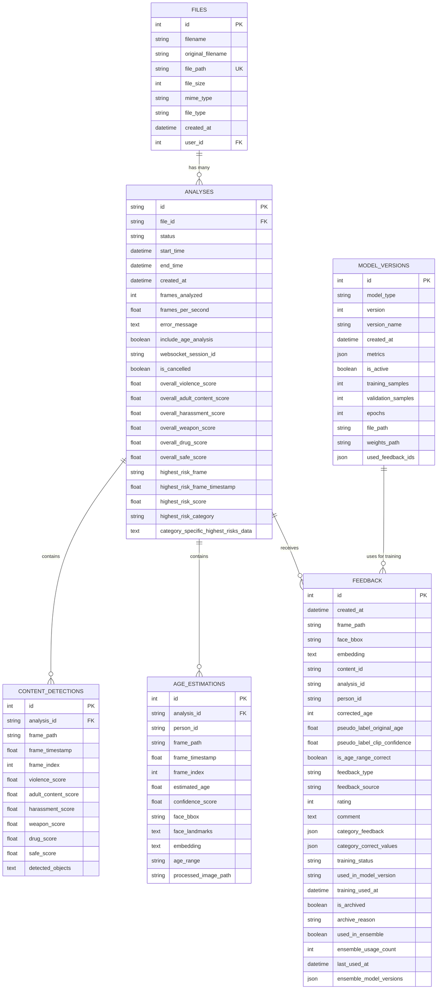

# WSANALIZ Veritabanı ER Diagramı

## Entity Relationship Diagram

## Tablo Açıklamaları

### FILES (Dosyalar)
- Yüklenen dosyaların temel bilgilerini saklar
- Her dosya birden fazla analize sahip olabilir
- Dosya türü (image/video) ve MIME tipi bilgileri

### ANALYSES (Analizler)
- Her dosya için yapılan analiz işlemlerini temsil eder
- Analiz durumu, zaman bilgileri ve genel skorları içerir
- WebSocket session takibi ve iptal mekanizması

### CONTENT_DETECTIONS (İçerik Tespitleri)
- Her kare için içerik analiz sonuçlarını saklar
- 5 risk kategorisi skorları (violence, adult_content, harassment, weapon, drug)
- Tespit edilen nesneler JSON formatında

### AGE_ESTIMATIONS (Yaş Tahminleri)
- Yüz tespit edilen her kişi için yaş tahmin sonuçları
- Kişi takibi için embedding ve person_id
- Yüz bounding box ve landmark bilgileri

### FEEDBACK (Geri Bildirimler)
- Kullanıcı geri bildirimleri ve sözde etiketler
- Eğitim sürecinde kullanım takibi
- Ensemble mekanizması için kullanım geçmişi

### MODEL_VERSIONS (Model Sürümleri)
- Eğitilmiş modellerin sürüm bilgileri
- Performans metrikleri ve eğitim parametreleri
- Hangi geri bildirimlerin kullanıldığı bilgisi

## İlişki Türleri

- **1:N** - Bir dosya birden fazla analize sahip olabilir
- **1:N** - Bir analiz birden fazla içerik tespiti içerebilir
- **1:N** - Bir analiz birden fazla yaş tahmini içerebilir
- **1:N** - Bir analiz birden fazla geri bildirim alabilir
- **1:N** - Bir model sürümü birden fazla geri bildirim kullanabilir

## Önemli Özellikler

1. **UUID Kullanımı**: Analysis ve person_id alanlarında UUID kullanımı
2. **JSON Alanlar**: Esnek veri saklama için JSON alanları
3. **İndeksleme**: Performans için kritik alanlarda indeksler
4. **Cascade Delete**: İlişkili kayıtların otomatik silinmesi
5. **Audit Trail**: Oluşturulma ve güncellenme zamanları

