<!-- WSANALIZ Tez Taslağı - İstanbul Okan Üniversitesi kılavuzuna uygun içerik iskeleti -->

# ÖNSÖZ

Bu çalışma, kurum içi gereksinimlerden doğan gerçek bir yazılım ürününün araştırma ve geliştirme sürecine dayanır. Geliştirme boyunca kararların teknik ve kurumsal dayanakları dikkatle belgelenmiş, her adımda etik, güvenlik ve gizlilik ilkeleri gözetilmiştir. Bu sürece katkı veren tüm meslektaşlarıma ve değerli danışmanım Dr. Öğr. Üyesi Ender Şahinaslan'a teşekkür ederim.

# İÇİNDEKİLER

Bu bölüm tez son düzenlemede otomatik üretilecektir.

# ÖZET

Bu tezde, yüksek hacimli görsel ve video içeriklerin kurumsal değerlendirme kriterlerine uygun biçimde otomatik ve yarı otomatik analizini amaçlayan bir yazılım sistemi tasarlanmış ve uygulanmıştır. Sistem; sosyal medya, televizyon yayınları ve çeşitli internet kaynaklarından toplanan içeriklerin çocukların zihinsel gelişimi ve toplumun ahlaki değerleri açısından yaratabileceği sakıncaları hızlı, tutarlı ve standartlaştırılmış bir şekilde belirlemeyi hedefler. Uygulama Python temelli bir arka uç mimarisine dayalıdır ve içerik sınıflandırmasında OpenCLIP, nesne/kişi tespiti ve yüz analizi süreçlerinde YOLO ve InsightFace bileşenlerini bütünleştirir. Yapılandırma, veri saklama, kuyruk ve gerçek zamanlı bildirim alt sistemleri; üretim ortamına uygun olacak biçimde ölçeklenebilir ve yeniden başlatılabilir bir çalışma akışı ile tasarlanmıştır. Sistem tasarımının ayırt edici yanı, bilirkişilerden gelen geribildirimleri ve yüksek güvenli sözde etiketleri birleştirerek artımsal (incremental) öğrenme döngüsü kurmasıdır. Bu amaçla çok‑modelli çıktı tutarlılığı ile metin‑görüntü temelli anlamsal doğrulamayı bir araya getiren güven skoru yaklaşımı önerilmiş, OpenCLIP ile üretilen olumlu/olumsuz istem tabanlı benzerlik ölçütleri ve iki model arasındaki tahmin yakınlığı birlikte değerlendirilmiştir. Böylece zayıf gözetimli ve gürültülü akışlardan nitelikli altkümeler seçilerek küçük ama güvenilir veri ile hızlı güncellemeler mümkün kılınmıştır. Deneysel kurulumda, doğruluk (±5 yıl yakınlık), MAE/MSE ve işlem süresi gibi ölçütlerle yapılan değerlendirmeler; yüksek güvenli altkümeler üzerinde eğitilen hafif başlığın, tüm veriyle eğitime kıyasla daha kısa sürede ve daha istikrarlı sonuçlar verdiğini göstermektedir. Mimarinin kurum‑içi (on‑premises) dağıtım ve veri gizliliği gereksinimlerini karşılaması, üretim koşullarında sürdürülebilir sürümleme ve geri dönüş (rollback) süreçleri ile birleştirilmesi, uygulama değerini artırmaktadır. Sonuç olarak çalışma, içerik değerlendirmede insan yükünü azaltan, tutarlılığı güçlendiren ve zaman kazancı sağlayan bir arka uç çözümü ortaya koymakta; Türkçe bağlama özgü davranış farklılıklarını dikkate alan yerelleştirme olanaklarıyla literatürdeki boşluklara katkı sunmaktadır.

Anahtar Kelimeler: Görsel içerik analizi, OpenCLIP, InsightFace, artımsal öğrenme, güven skoru, Socket.IO, Python, Flask

Tarih: ……………

# ABSTRACT

This thesis presents the design and implementation of a backend‑oriented system for automatic and semi‑automatic analysis of large‑scale visual and video content according to institutional evaluation criteria. The system aims to detect potentially harmful content that may adversely affect children's mental development and societal values in a fast, consistent and standardized manner. The implementation relies on a Python backend that integrates OpenCLIP for content classification and YOLO/InsightFace components for object/person detection and face analysis. Configuration, data persistence, queuing and real‑time notification subsystems are architected for production environments with scalable and restart‑friendly workflows. A distinguishing aspect is an incremental learning loop that combines expert feedback with high‑confidence pseudo‑labels. We propose a confidence scoring approach that fuses multi‑model agreement with text‑image semantic validation via OpenCLIP; positive/negative prompt similarities are combined with inter‑model prediction proximity. This enables selection of reliable subsets from weakly supervised and noisy data streams, allowing rapid updates with smaller but cleaner data. Experiments using accuracy (±5 years tolerance), MAE/MSE and processing time show that training the lightweight head on high‑confidence subsets yields more stable results in shorter time than training on the full dataset. Meeting on‑premises deployment and data privacy requirements and supporting versioning/rollback improves operational applicability. Overall, the system reduces human workload, increases consistency and saves time in content assessment, while providing localization capabilities tailored to Turkish context and contributing to gaps in the literature.

Keywords: Visual content analysis, OpenCLIP, InsightFace, incremental learning, confidence scoring, Socket.IO, Python, Flask

Date: ……………

# SEMBOLLER

Bu çalışma kapsamında özelleşmiş matematiksel sembol listesi gerektiren bir denklem dizisi bulunmadığından bu bölüm kullanım sırasında gerekirse doldurulacaktır.

# KISALTMALAR

API: Application Programming Interface  
MAE: Mean Absolute Error  
MSE: Mean Squared Error  
ROC: Receiver Operating Characteristic  
REST: Representational State Transfer

# ŞEKİL LİSTESİ

Son düzenleme aşamasında eklenecektir.

# TABLO LİSTESİ

Son düzenleme aşamasında eklenecektir.

# BÖLÜM 1 GİRİŞ VE AMAÇ

## 1.1 Problem Tanımı ve Motivasyon

### 1.1.1 Dijital İçerik Patlaması ve Kurumsal İhtiyaçlar

Dijital içerik üretimindeki artış, kurumların görsel ve video materyallerini kısa sürede, doğru ve standartlaştırılmış biçimde değerlendirme zorunluluğunu doğurmuştur. Günümüzde her gün milyarlarca görüntü ve video paylaşılmakta, bu içeriklerin çocukların zihinsel gelişimi ve toplumun ahlaki değerleri açısından yaratabileceği sakıncaları hızlı, tutarlı ve standartlaştırılmış bir şekilde belirlemek, kurumsal düzeyde kritik bir ihtiyaç haline gelmiştir.

**Dijital İçerik İstatistikleri**:
- YouTube'da her dakika 500 saatlik video yüklenmektedir
- Instagram'da günde 95 milyon fotoğraf paylaşılmaktadır
- TikTok'ta günde 1 milyar video görüntülenmektedir
- Facebook'ta günde 350 milyon fotoğraf yüklenmektedir

Bu büyük veri hacmi, manuel içerik moderasyonu süreçlerini imkansız hale getirmektedir. Kurumsal düzeyde içerik değerlendirme gereksinimleri şunlardır:

**Kurumsal Gereksinimler**:
- **Hız**: Binlerce içeriğin dakikalar içinde değerlendirilmesi
- **Tutarlılık**: Aynı kriterlere göre standart değerlendirme
- **Ölçeklenebilirlik**: Artan içerik hacmine uyum sağlama
- **Güvenilirlik**: Yüksek doğruluk oranları
- **Maliyet Etkinliği**: İnsan kaynağı maliyetlerini azaltma

### 1.1.2 Mevcut Çözümlerin Sınırlılıkları

**Manuel Değerlendirme Sorunları**:
Uzmanların tüm akışı manuel incelemesi hem sürdürülebilir değildir hem de maruz kalınan içerik nedeniyle psikososyal yük oluşturur. Ek olarak, farklı uzman yorumları arasında tutarlılık sağlamak zordur.

- **Zaman Alıcı**: Bir video analizi saatler sürebilir
- **Tutarsızlık**: Farklı değerlendiriciler farklı sonuçlar verebilir
- **Ölçeklenemezlik**: İnsan kaynağı sınırlıdır
- **Maliyetli**: Uzman değerlendirici maliyetleri yüksektir
- **Yorgunluk**: Uzun süreli değerlendirme hata oranını artırır

**Mevcut Otomatik Sistemlerin Eksiklikleri**:
- **Tek Modalite**: Sadece görüntü veya sadece metin analizi
- **Kültürel Bağlam**: Yerel kültürel normları dikkate almama
- **Güven Skoru**: Belirsizlik ölçümü eksikliği
- **Artımsal Öğrenme**: Sürekli iyileştirme mekanizması yokluğu
- **Kurumsal Entegrasyon**: On-premises dağıtım desteği sınırlı

### 1.1.3 Bu Çalışmanın Motivasyonu

Bu çalışma, yukarıda belirtilen sorunları çözmek için aşağıdaki motivasyonlarla geliştirilmiştir:

**Teknik Motivasyon**:
- Çok-modelli yaklaşım ile daha güvenilir sonuçlar
- Güven skoru ile belirsizlik ölçümü
- Artımsal öğrenme ile sürekli iyileştirme
- On-premises dağıtım ile veri gizliliği

**Kurumsal Motivasyon**:
- Hızlı ve tutarlı içerik değerlendirme
- İnsan kaynağı maliyetlerini azaltma
- Ölçeklenebilir çözüm sunma
- Yerel kültürel normları dikkate alma

**Akademik Motivasyon**:
- Literatürdeki boşlukları doldurma
- Yeni teknik yaklaşımlar geliştirme
- Deneysel sonuçlarla doğrulama
- Açık kaynak katkı sağlama

### 1.1.4 Özel Gereksinimler ve Kısıtlar

**Veri Gizliliği Gereksinimleri**:
Projenin en kritik ihtiyacı, kişisel verilerin bulut veya internet ortamına çıkmaması gereğiydi; bu nedenle tüm işlemlerin kurum içinde (on-premises) gerçekleştirildiği bir mimari benimsenmiştir.

**Büyük Veri İşleme Gereksinimleri**:
İçeriklerin çoğunlukla büyük kapasiteli taşınabilir medyalarda toplu olarak gelmesi, çoklu dosya yükleme desteğini zorunlu kılmıştır. Büyük video dosyalarının analizinin uzun sürmesi nedeniyle her dosyanın tek bir analiz işine tabi tutulması, kuyruk yönetimi ve iptal mekanizmaları ile desteklenmiştir.

**Kullanıcı Deneyimi Gereksinimleri**:
Uygulamanın başarısını artırmak için kullanıcı geri bildirim ekranı geliştirilmiş; personelin yapay zekâ okur-yazarlığının sınırlı olması göz önüne alınarak otomatik etiketleme sistemi ile kullanıcı yükü azaltılmıştır. Büyük video dosyalarında tespit edilen riskli karenin birkaç saniye öncesi ve sonrası kırpılarak istemciye sunulması, bağlamsal değerlendirme kolaylığı sağlamıştır.

## 1.2 Tezin Amacı ve Hedefler

### 1.2.1 Ana Amaç

Bu tezin amacı, kurumsal ölçütlere göre uygunsuz içeriği otomatik belirleyen, yüksek güvenli verilerle artımsal öğrenme döngüsü kuran ve üretim koşullarında sürdürülebilir şekilde çalışabilen bir sistem gerçekleştirmektir.

### 1.2.2 Spesifik Hedefler

**1. İçerik Sınıflandırmada Doğruluğu Artırma**:
OpenCLIP istem-tabanlı sıfır-örnek yaklaşımı ve eğitilebilir classification head ile beş risk kategorisinde (violence, adult_content, harassment, weapon, drug) hassas skorlar üretmek, YOLO bağlamsal doğrulaması ile yanlış pozitifleri azaltmak ve ensemble mekanizması ile kullanıcı düzeltmelerini anında entegre etmek hedeflenir.

**Alt Hedefler**:
- %90+ doğruluk oranı ile içerik sınıflandırması
- Yanlış pozitif oranını %5'in altında tutma
- 5 risk kategorisinde dengeli performans
- Kullanıcı geri bildirimini 24 saat içinde entegre etme

**2. Değerlendirme Zamanını Azaltma**:
Kuyruk temelli işleyiş, CLIP paylaşımı, kişi takibi ile tekrar hesaplama önleme ve hafif başlık artımsal güncellemesi eğitim süresini kısaltır.

**Alt Hedefler**:
- Tek görüntü analizi: 2-5 saniye
- 30 saniyelik video analizi: 30-60 saniye
- Model eğitim süresi: 2 saat altında
- Kuyruk işleme kapasitesi: 10 eşzamanlı analiz

**3. Tutarlılığı Yükseltme**:
Sürümleme/rollback ile performans düşüşlerinde önceki kararlı sürüme dönülür, otomatik etiketleme ile insan hatasına bağlı tutarsızlık azaltılır, kişi takibi ile aynı kişi için tek yaş tahmini tutarlılık sağlar.

**Alt Hedefler**:
- %95+ tutarlılık oranı
- Otomatik etiketleme ile %80+ doğruluk
- Kişi takibinde %90+ kimlik sürekliliği
- Sürümleme ile %99.9+ sistem kararlılığı

**4. Veri Gizliliği ve Erişim Güvenliği**:
On-premises dağıtım ile kişisel veriler kurum dışına çıkmaz, MIME/yol doğrulama ile kötü amaçlı dosya yükleme engellenir, oran sınırlama ve güvenlik başlıkları (CSP, HSTS) ile saldırılar önlenir.

**Alt Hedefler**:
- %100 on-premises veri işleme
- Sıfır veri sızıntısı
- OWASP Top 10 güvenlik standartları
- 7/24 güvenlik izleme

### 1.2.3 Hedeflerin Kurumsal Gereksinimlerle Uyumu

Bu hedefler, kurumsal gereksinimleri (Aile Bakanlığı mevzuatı, sosyal koruma, personel AI okur-yazarlığı) akademik yöntemlerle (transfer+artımsal, güven skorlama, ROC optimizasyonu) dengeler.

**Kurumsal Gereksinimler**:
- **Aile Bakanlığı Mevzuatı**: Çocuk koruma standartları
- **Sosyal Koruma**: 18 yaş altı özel koruma
- **Personel AI Okur-yazarlığı**: Sınırlı teknik bilgi
- **Veri Gizliliği**: KVKK uyumluluğu

**Akademik Yöntemler**:
- **Transfer + Artımsal Öğrenme**: Hızlı uyum
- **Güven Skorlama**: Belirsizlik ölçümü
- **ROC Optimizasyonu**: Eşik belirleme
- **Çok-Modelli Yaklaşım**: Güvenilirlik artırma

### 1.2.4 Başarı Kriterleri

**Teknik Başarı Kriterleri**:
- İçerik sınıflandırma doğruluğu: %90+
- Yaş tahmini doğruluğu: ±5 yıl %85+
- Sistem yanıt süresi: <5 saniye
- Sistem kullanılabilirliği: %99.5+

**Operasyonel Başarı Kriterleri**:
- Kullanıcı memnuniyeti: %85+
- İşlem süresi azalması: %70+
- Maliyet tasarrufu: %60+
- Güvenlik olayı: 0

**Akademik Başarı Kriterleri**:
- Literatürdeki boşlukları doldurma
- Yeni teknik yaklaşımlar geliştirme
- Deneysel sonuçlarla doğrulama
- Açık kaynak katkı sağlama

## 1.3 Kapsam ve Katkılar

### 1.3.1 Çalışmanın Kapsamı

**Teknik Kapsam**:
Çalışma, Python tabanlı bir arka uç mimarisinin uçtan uca tasarımını ve uygulamasını kapsar. OpenCLIP, YOLO ve InsightFace bileşenleri bir araya getirilmiş; Socket.IO ile gerçek zamanlı ilerleme/sonuç iletimi sağlanmıştır.

**Dahil Edilen Konular**:
- Görsel içerik analizi (şiddet, cinsel içerik, nefret söylemi)
- Nesne tespiti ve kişi takibi
- Yüz analizi ve yaş tahmini
- Çok-modelli güven skoru hesaplama
- Artımsal öğrenme ve model güncelleme
- Web tabanlı kullanıcı arayüzü
- REST API ve WebSocket entegrasyonu

**Dahil Edilmeyen Konular**:
- Ses analizi ve işleme
- Metin tabanlı içerik analizi
- Gerçek zamanlı video akışı analizi
- Mobil uygulama geliştirme
- Bulut tabanlı dağıtım

### 1.3.2 Akademik Katkılar

**1. Çok-Modelli Güven Skorlama Yaklaşımı**:
Buffalo-L ve Custom Age Head tahminlerini CLIP anlamsal doğrulaması ile birleştirerek zayıf gözetimli akışlardan nitelikli altkümeler seçer; bu yaklaşım, literatürdeki Confident Learning ve DivideMix gibi robust eğitim yöntemlerinin pratik bir uygulamasıdır (Northcutt ve diğerleri, 2021; Li ve diğerleri, 2020).

**2. İçerik ve Yaş Analizinin Eş-Zamanlı Yürütülmesi**:
Literatürde sınırlı incelenmiş bir birleşimdir; bu çalışma 18 yaş altı bireylerin riskli içerikte tespiti için çoklu görev (multi-task) yaklaşımını uygular ve sosyal koruma bağlamında yeni bir katkı sağlar.

**3. Kişi Takibi ile İçerik Risk Skorlarının Birleştirilmesi**:
DeepSORT+PersonTrackerManager ile streaming video analizinde kimlik sürekliliği ve hesaplama tasarrufu dengeler; bu birleşim literatürde sistematik araştırılmamıştır.

**4. ROC Eğrisi Analizi ile CLIP Güven Eşiği Optimizasyonu**:
PSEUDO_LABEL_RECORD_CLIP_THRESHOLD=0.75 ile precision-recall dengesini sağlar ve veri kalitesi odaklı yaklaşımın miktar odaklı yaklaşıma üstünlüğünü gösterir.

### 1.3.3 Uygulamaya Yönelik Katkılar

**1. On-Premises Dağıtım ve Sürümleme/Rollback Mekanizmaları**:
Akademik bulguları kurumsal gereksinimlere uyarlar; veri gizliliği, kesinti süresi minimizasyonu ve operasyonel risk yönetimi sağlanır.

**2. Otomatik Etiketleme ve Kullanıcı Geri Bildirim Döngüsü**:
Personelin AI okur-yazarlığı sınırlı olduğu ortamlarda etiketleme yükünü azaltır ve tutarlılığı artırır.

**3. Platform Bağımsızlık ve Container Uyumluluğu**:
Windows dev/Linux prod, container uyumluluğu ve güvenlik middleware'i, modern yazılım geliştirme ilkelerini entegre eder.

**4. Overlay Mekanizması ve Türkçe Karakter Desteği**:
Kullanıcı deneyimini iyileştirir; 18 yaş altı özel uyarılar, sosyal koruma gereksinimlerini karşılar.

**5. Çoklu Dosya Yükleme ve Riskli Kare Çevresi Kırpma**:
Büyük taşınabilir medya akışlarını verimli işler.

### 1.3.4 Literatüre Katkılar

**1. Yerel Kültürel Bağlam**:
Türkçe istem varyantları ve kültürel normların sınıflandırma kararlarına yansıması, literatürdeki eksikliklere katkı sunar.

**2. Üretim Odaklı Sistem Tasarımı**:
Sürümleme, rollback, on-premises dağıtım ve WebSocket tabanlı gerçek zamanlı bildirim gibi işletimsel ayrıntılar, akademik çalışmalarda sıklıkla ihmal edilir.

**3. Güven Skoru ve Artımsal Güncelleme Düzenekleri**:
Yerel bağlamı gözeten güven skoru ve artımsal güncelleme düzeneklerini üretim‑uyumlu bir arka uçla bütünleştirmesidir.

**4. Kuyruk Yönetimi ve İptal Mekanizmaları**:
Sürümleme/rollback, kuyruk yönetimi, iptal mekanizmaları ve göreli yol politikası gibi pratik ilkeler akademik yöntemleri operasyonel hâle getirir.

### 1.3.5 Endüstriyel Etki

**1. Kurumsal Verimlilik**:
- İçerik değerlendirme süresinde %70+ azalma
- İnsan kaynağı maliyetlerinde %60+ tasarruf
- Tutarlılık oranında %95+ artış

**2. Sosyal Koruma**:
- 18 yaş altı bireylerin korunması
- Riskli içeriğin erken tespiti
- Otomatik uyarı sistemleri

**3. Teknoloji Transferi**:
- Akademik bulguların pratik uygulaması
- Açık kaynak katkılar
- Endüstriyel standartların geliştirilmesi

Bu katkılar, akademik yöntemleri pratik gereksinimlere taşır ve üretim-uyumlu bir çözüm ortaya koyar.

Uygulamaya yönelik katkılar şunlardır: On-premises dağıtım ve sürümleme/rollback mekanizmaları, akademik bulguları kurumsal gereksinimlere uyarlar; veri gizliliği, kesinti süresi minimizasyonu ve operasyonel risk yönetimi sağlanır. Otomatik etiketleme ve kullanıcı geri bildirim döngüsü, personelin AI okur-yazarlığı sınırlı olduğu ortamlarda etiketleme yükünü azaltır ve tutarlılığı artırır. Platform bağımsızlık (Windows dev/Linux prod), container uyumluluğu ve güvenlik middleware'i, modern yazılım geliştirme ilkelerini entegre eder. Overlay mekanizması ve Türkçe karakter desteği, kullanıcı deneyimini iyileştirir; 18 yaş altı özel uyarılar, sosyal koruma gereksinimlerini karşılar. Çoklu dosya yükleme, tek dosya-tek iş prensibi ve riskli kare çevresi kırpma, büyük taşınabilir medya akışlarını verimli işler. Bu katkılar, akademik yöntemleri pratik gereksinimlere taşır ve üretim-uyumlu bir çözüm ortaya koyar.

## 1.4 Tezin Organizasyonu

### 1.4.1 Bölüm Organizasyonu

Bu tez, aşağıdaki bölümlerden oluşmaktadır:

**Bölüm 1: Giriş ve Amaç**
- Problem tanımı ve motivasyon
- Amaç ve kapsam
- Çalışmanın sınırları
- Tezin yapısı

**Bölüm 2: Genel Bilgiler ve Literatür**
- Bilgisayarlı görü temelleri
- CLIP, YOLO, InsightFace teknolojileri
- Veri kalitesi ve güven skorlama
- İçerik moderasyonu yaklaşımları

**Bölüm 3: Gereksinimler ve Tasarım İlkeleri**
- İşlevsel ve işlevsel olmayan gereksinimler
- Sistem mimarisi tasarımı
- Veri modeli tasarımı
- Güvenlik ve performans gereksinimleri

**Bölüm 4: Sistem Mimarisi**
- Genel mimari tasarım
- Bileşen mimarisi
- Veri akışı tasarımı
- Dağıtım mimarisi

**Bölüm 5: Arka Uç Geliştirme**
- REST API geliştirme
- WebSocket entegrasyonu
- Güvenlik middleware'i
- Performans optimizasyonu

**Bölüm 6: Yapay Zeka Modülleri**
- İçerik analizi (OpenCLIP)
- Yüz ve yaş tahmini (InsightFace)
- Model eğitimi ve güncelleme
- Ensemble entegrasyonu

**Bölüm 7: Güven Skoru Hesaplama**
- Çok-modelli uzlaşı
- CLIP tabanlı doğrulama
- ROC/PR analizi
- Eşik optimizasyonu

**Bölüm 8: Deneysel Sonuçlar**
- Deneysel kurulum
- Performans metrikleri
- Karşılaştırmalı analiz
- Sonuç değerlendirmesi

**Bölüm 9: Sonuç ve Öneriler**
- Çalışmanın özeti
- Katkılar ve sınırlılıklar
- Gelecek çalışmalar
- Sonuç

### 1.4.2 Bölümler Arası İlişkiler

**Temel Bölümler**:
- Bölüm 1-3: Temel kavramlar ve gereksinimler
- Bölüm 4-6: Sistem tasarımı ve geliştirme
- Bölüm 7-8: Uygulama ve değerlendirme
- Bölüm 9: Sonuç ve öneriler

**Bağımlılık İlişkileri**:
- Bölüm 2 → Bölüm 3: Literatür → Gereksinimler
- Bölüm 3 → Bölüm 4: Gereksinimler → Mimari
- Bölüm 4 → Bölüm 5-6: Mimari → Geliştirme
- Bölüm 5-6 → Bölüm 7: Geliştirme → Güven Skoru
- Bölüm 7 → Bölüm 8: Güven Skoru → Deneyler

### 1.4.3 Okuma Rehberi

**Teknik Okuyucular İçin**:
- Bölüm 4-6: Sistem mimarisi ve geliştirme
- Bölüm 7: Güven skoru algoritmaları
- Bölüm 8: Deneysel sonuçlar

**Akademik Okuyucular İçin**:
- Bölüm 2: Literatür taraması
- Bölüm 7: Yöntem ve algoritmalar
- Bölüm 8: Deneysel değerlendirme

**Uygulayıcılar İçin**:
- Bölüm 1: Problem ve amaç
- Bölüm 3: Gereksinimler
- Bölüm 9: Sonuç ve öneriler

Bu yapı, okuyucuların ilgi alanlarına göre tezi farklı şekillerde inceleyebilmesini sağlar ve hem akademik hem de pratik değer sunar.

## 1.5 Yazım ve Doğrulama İlkeleri

### 1.5.1 Teknik Doğrulama İlkeleri

Bu tezde sunulan teknik ifadeler doğrudan uygulamanın kaynak koduna ve çalışma zamanındaki davranışına dayandırılır. Gerek duyulan yerlerde dosya yolu ve işlev adı verilerek Ekler kısmında sınırlı alıntılar paylaşılır; deneysel bölümlerde kullanılan sürüm, tohum ve hiperparametreler açıkça belirtilir.

**Kod Doğrulama Stratejisi**:
- Her teknik açıklama için ilgili kaynak dosya referansı
- Fonksiyon adları ve dosya yolları belirtilmesi
- Çalışma zamanı davranışının dokümantasyonu
- Test edilebilir iddiaların sunulması

**Deneysel Doğrulama**:
- Sürüm numaraları ve konfigürasyon detayları
- Tohum değerleri ve rastgelelik kontrolü
- Hiperparametre değerleri ve optimizasyon süreci
- Reproducibility için gerekli tüm bilgiler

### 1.5.2 Yazım Stili ve Format

**Akademik Yazım Stili**:
Böylece metin ile gerçek sistem davranışı arasında sürekli tutarlılık sağlanır. Metin boyunca örnekler doğrudan kaynak dosyalardan alınmış kısa ve yalnızca kritik kod parçalarıyla desteklenecek; ana odak, okuyucuyu yormayan biçimde mantık/akış anlatımı olacaktır.

**Kod Sunumu İlkeleri**:
- Sadece kritik kod parçalarının gösterilmesi
- Uzun kod bloklarından kaçınma
- Açıklayıcı yorumların eklenmesi
- Okunabilirlik odaklı formatlama

**Süreç Anlatımı**:
Süreç zinciri, dosya yüklemeden sonuçların yayımlanmasına kadar adım adım ve tutarlı bir dille aktarılacak; kod yoğun bölümlerden kaçınılacak, gerekli yerlerde küçük alıntılarla yetinilecektir.

### 1.5.3 Tez Uzunluğu ve Format Kuralları

**Uzunluk Gereksinimleri**:
Tezin uzunluğu gereksinimlere göre 200–250 sayfa aralığına genişletilebilir ve bu durum yazım kılavuzlarıyla çelişmez; biçim kuralları (sayfa düzeni, yazı tipi, numaralandırma, atıf ve DOI tam yol gösterimi) korunacaktır.

**Format Standartları**:
- **Sayfa Düzeni**: A4 boyut, 2.5cm kenar boşlukları
- **Yazı Tipi**: Times New Roman, 12pt
- **Satır Aralığı**: 1.5
- **Numaralandırma**: Bölüm ve alt bölüm numaralandırması
- **Atıf Formatı**: APA stili
- **DOI Referansları**: Tam URL formatında

### 1.5.4 İntihal Kontrolü ve Kaynak Gösterimi

**İntihal Önleme**:
Tüm içerik intihal kontrolüne uygun olarak parafraz edilmekte; doğrudan alıntılar gerekiyorsa kısa ve kaynaklı tutulmaktadır.

**Kaynak Gösterimi İlkeleri**:
- Tüm iddialar için kaynak referansı
- Doğrudan alıntılar için tırnak işareti
- Parafraz için kaynak belirtme
- Güncel ve güvenilir kaynakların kullanımı

**Akademik Dürüstlük**:
- Kendi çalışması olmayan fikirlerin belirtilmesi
- Yardım alınan kişilerin teşekkür edilmesi
- Çıkar çatışması beyanı
- Etik kurul onayı (gerekirse)

### 1.5.5 Kalite Kontrol Süreci

**İçerik Kontrolü**:
- Teknik doğruluk kontrolü
- Akademik dil kontrolü
- Tutarlılık kontrolü
- Format kontrolü

**Dış Değerlendirme**:
- Danışman görüşü
- Jüri üyeleri değerlendirmesi
- Dış hakem görüşü
- Final kontrol

Bu ilkeler, tezin akademik standartlara uygunluğunu sağlar ve okuyucuların güvenilir bilgiye erişimini garanti eder.

## 1.6 Proje Geliştirme Süreci ve Zaman Çizelgesi

### 1.6.1 Genel Süreç ve Yaklaşım

Projenin geliştirilmesi yaklaşık 12 aylık bir süreçte gerçekleştirilmiştir. Bu zaman çizelgesi, kurumsal gereksinimler ve kaynak kısıtları göz önüne alınarak planlanmış; çevik (agile) ilkelerle küçük artımlarla ilerleme ve sürekli geri bildirim döngüsü benimsenmiştir.

**Çevik Geliştirme İlkeleri**:
- Her sprint sonunda paydaşlara demo sunulmuş
- Geri bildirimler bir sonraki sprint planına dahil edilmiştir
- Gereksinim değişikliklerine hızlı uyum sağlanmış
- Son kullanıcı memnuniyeti artırılmıştır

### 1.6.2 Detaylı Zaman Çizelgesi

**Faz 1: İhtiyaç Analizi ve Tasarım (1-3. Ay)**
İlk üç ay, ihtiyaç analizi ve tasarım evresine ayrılmış; paydaş toplantıları, güvenlik gereksinimlerinin belirlenmesi ve mimari kararlar bu süreçte tamamlanmıştır.

**Aktivite Detayları**:
- **1. Ay**: Paydaş toplantıları ve gereksinim toplama
- **2. Ay**: Sistem mimarisi tasarımı ve teknoloji seçimi
- **3. Ay**: Veri modeli tasarımı ve güvenlik gereksinimleri

**Çıktılar**:
- Gereksinim dokümantasyonu
- Sistem mimarisi diyagramları
- Veri modeli tasarımı
- Güvenlik gereksinimleri

**Faz 2: Geliştirme (4-8. Ay)**
Dört-sekiz aylık dönem geliştirme evresini kapsamış; Flask arka uç, SQLAlchemy ORM, Socket.IO entegrasyonu, OpenCLIP/YOLO/InsightFace model entegrasyonları, güvenlik ara bileşeni, kuyruk servisi ve kullanıcı arayüzü bu aşamada tamamlanmıştır.

**Aktivite Detayları**:
- **4. Ay**: Flask arka uç ve SQLAlchemy ORM geliştirme
- **5. Ay**: Socket.IO entegrasyonu ve gerçek zamanlı bildirimler
- **6. Ay**: OpenCLIP model entegrasyonu ve içerik analizi
- **7. Ay**: YOLO ve InsightFace model entegrasyonları
- **8. Ay**: Güvenlik middleware'i ve kuyruk servisi

**Çıktılar**:
- Çalışan arka uç sistemi
- Model entegrasyonları
- Güvenlik katmanları
- Kuyruk yönetimi

**Faz 3: Test ve İyileştirme (9-11. Ay)**
Dokuz-on birinci aylar test ve iyileştirme evresine ayrılmış; birim, entegrasyon ve kullanıcı kabul testleri yürütülmüş, performans darboğazları tespit edilip optimize edilmiş, sürümleme/rollback mekanizmaları eklenmiştir.

**Aktivite Detayları**:
- **9. Ay**: Birim ve entegrasyon testleri
- **10. Ay**: Performans optimizasyonu ve darboğaz analizi
- **11. Ay**: Sürümleme/rollback mekanizmaları ve kullanıcı kabul testleri

**Çıktılar**:
- Test raporları
- Performans optimizasyonları
- Sürümleme sistemi
- Kullanıcı kabul testi sonuçları

**Faz 4: Dokümantasyon ve Dağıtım (12. Ay)**
On ikinci ay, dokümantasyon, bakım prosedürlerinin yazılması ve üretim dağıtım hazırlıklarını kapsamıştır.

**Aktivite Detayları**:
- Dokümantasyon yazımı
- Bakım prosedürleri
- Üretim dağıtım hazırlıkları
- Kullanıcı eğitimi

**Çıktılar**:
- Teknik dokümantasyon
- Kullanıcı kılavuzu
- Bakım prosedürleri
- Üretim ortamı

### 1.6.3 Proje Yönetimi ve Risk Yönetimi

**Proje Yönetimi Araçları**:
- Jira: Görev takibi ve sprint yönetimi
- Confluence: Dokümantasyon ve bilgi paylaşımı
- Git: Versiyon kontrolü
- Docker: Container yönetimi

**Risk Yönetimi**:
- **Teknik Riskler**: Model entegrasyonu zorlukları
- **Zaman Riskleri**: Gecikme riskleri
- **Kaynak Riskleri**: Ekip üyesi değişiklikleri
- **Güvenlik Riskleri**: Veri gizliliği ihlalleri

**Risk Azaltma Stratejileri**:
- Düzenli risk değerlendirmesi
- Alternatif çözüm planları
- Yedek ekip üyeleri
- Güvenlik testleri

### 1.6.4 Kalite Güvencesi ve Test Stratejisi

**Test Stratejisi**:
- **Birim Testleri**: Bireysel fonksiyon testleri
- **Entegrasyon Testleri**: Bileşen entegrasyon testleri
- **Sistem Testleri**: End-to-end testler
- **Kullanıcı Kabul Testleri**: Son kullanıcı testleri

**Kalite Metrikleri**:
- Kod kapsamı: %90+
- Hata oranı: <1%
- Performans gereksinimleri: %100
- Güvenlik gereksinimleri: %100

### 1.6.5 Süreç İyileştirmeleri ve Öğrenilen Dersler

**Süreç İyileştirmeleri**:
- Düzenli retrospektif toplantıları
- Sürekli entegrasyon ve dağıtım
- Otomatik test süreçleri
- Kod inceleme süreçleri

**Öğrenilen Dersler**:
- Erken prototipleme önemi
- Kullanıcı geri bildirimi değeri
- Güvenlik gereksinimlerinin erken belirlenmesi
- Performans testlerinin erken başlatılması

Bu süreç, projenin başarılı bir şekilde tamamlanmasını sağlamış ve gelecekteki projeler için değerli deneyimler kazandırmıştır.

# BÖLÜM 2 GENEL BİLGİLER VE LİTERATÜR

## 2.1 Bilgisayarlı Görü ve İçerik Analizi Temelleri

### 2.1.1 Derin Öğrenme ve Görsel Temsil

Görsel içerik analizi, giriş görüntüsünü temsil eden özelliklerin (özellikle derin temsil/embedding) öğrenilmesine dayanır. Modern bilgisayarlı görü sistemleri, derin öğrenme mimarileri kullanarak görüntülerden anlamlı özellikler çıkarır ve bu özellikleri çeşitli görevlerde (sınıflandırma, tespit, segmentasyon) kullanır.

**Özellik Öğrenme Süreci**:
1. **Düşük Seviye Özellikler**: Kenarlar, köşeler, doku desenleri
2. **Orta Seviye Özellikler**: Nesne parçaları, şekil kombinasyonları
3. **Yüksek Seviye Özellikler**: Nesneler, sahneler, semantik kavramlar

**Embedding Uzayı**:
- **Boyut**: Genellikle 512-2048 boyutlu vektörler
- **Normalizasyon**: L2 norm ile birim vektörlere dönüştürme
- **Benzerlik**: Kosinüs benzerliği ile mesafe hesaplama
- **Semantik Anlam**: Benzer içerikler yakın embedding'lere sahip

### 2.1.2 Gözetimli ve Zayıf Gözetimli Öğrenme

**Gözetimli Öğrenme**:
- **Veri Gereksinimi**: Etiketli örnekler (input, ground truth)
- **Eğitim Süreci**: Loss fonksiyonu ile hata minimizasyonu
- **Avantajlar**: Yüksek doğruluk, hızlı yakınsama
- **Dezavantajlar**: Etiketleme maliyeti, sınırlı genelleme

**Zayıf Gözetimli Öğrenme**:
- **Veri Gereksinimi**: Az sayıda etiketli, çok sayıda etiketsiz örnek
- **Yöntemler**: Pseudo-labeling, consistency regularization, co-training
- **Avantajlar**: Etiketleme maliyeti düşük, genelleme iyileşir
- **Dezavantajlar**: Gürültü riski, karmaşık eğitim süreci

**Yarı Gözetimli Öğrenme**:
- **Veri Gereksinimi**: Kısmi etiketli veri
- **Yöntemler**: Self-training, multi-view learning, graph-based
- **Uygulama**: Büyük veri setlerinde etiketleme maliyetini azaltma

### 2.1.3 Veri Kalitesi ve Ön İşleme

**Veri Kalitesi Faktörleri**:
- **Çözünürlük**: Minimum 224×224 piksel (CNN'ler için)
- **Blur Tespiti**: Laplacian variance > 100
- **Gürültü Oranı**: SNR > 20dB
- **Işık Koşulları**: Histogram eşitleme, kontrast artırma
- **Perspektif**: Geometrik düzeltmeler

**Ön İşleme Teknikleri**:
```python
# Veri artırma örnekleri
transforms = [
    RandomHorizontalFlip(p=0.5),
    RandomRotation(degrees=15),
    ColorJitter(brightness=0.2, contrast=0.2),
    RandomCrop(size=224),
    Normalize(mean=[0.485, 0.456, 0.406], 
              std=[0.229, 0.224, 0.225])
]
```

**Sınıf Dengesizliği Çözümleri**:
- **Weighted Sampling**: Az temsil edilen sınıflara yüksek ağırlık
- **Focal Loss**: Zor örnekleri vurgulayan loss fonksiyonu
- **SMOTE**: Sentetik azınlık örnek üretimi
- **Class Balancing**: Eşit sayıda örnek seçimi

### 2.1.4 Model Kalibrasyonu ve Belirsizlik

**Kalibrasyon Problemi**:
Modern derin ağlar aşırı güvenli (overconfident) tahminler üretebilir:
- Tahmini olasılık: 0.9
- Gerçek doğruluk: %70

**Kalibrasyon Yöntemleri**:

**1. Temperature Scaling**:
```python
def temperature_scaling(logits, temperature):
    return logits / temperature
```

**2. Platt Scaling**:
```python
# Doğrulama seti üzerinde lojistik regresyon
calibrated_prob = sigmoid(A * logit + B)
```

**3. Histogram Binning**:
- Tahminleri bölümlere ayır
- Her bölüm için gerçek doğruluk oranını hesapla
- Bölüm ortalamalarını kullan

**Belirsizlik Türleri**:

**Epistemic Uncertainty (Model Bilgisizliği)**:
- Veri azlığından kaynaklanır
- Daha fazla veri ile azalır
- MC Dropout ile tahmin edilir

**Aleatoric Uncertainty (Veri Gürültüsü)**:
- Veri içindeki doğal belirsizlik
- Veri artışı ile azalmaz
- Heteroskedastic noise modeling ile tahmin edilir

### 2.1.5 Adalet ve Gizlilik

**Adalet Metrikleri**:

**Demografik Parite**:
```
P(Ŷ=1|A=a) = P(Ŷ=1|A=b) for all groups a,b
```

**Eşit Fırsat**:
```
P(Ŷ=1|Y=1,A=a) = P(Ŷ=1|Y=1,A=b) for all groups a,b
```

**Eşit Fırsat Eşiği**:
```
P(Ŷ=1|Y=1,A=a) = P(Ŷ=1|Y=1,A=b) for all groups a,b
```

**Gizlilik Koruması**:

**Differential Privacy**:
```
P(M(D) ∈ S) ≤ e^ε × P(M(D') ∈ S)
```
- D ve D' tek bir örnek farklı veri setleri
- ε: gizlilik bütçesi
- M: mekanizma

**Federated Learning**:
- Veri merkezi bir yerde toplanmaz
- Model parametreleri paylaşılır
- Yerel eğitim + global güncelleme

### 2.1.6 Performans Metrikleri

**Sınıflandırma Metrikleri**:

**Accuracy**:
```
Accuracy = (TP + TN) / (TP + TN + FP + FN)
```

**Precision**:
```
Precision = TP / (TP + FP)
```

**Recall**:
```
Recall = TP / (TP + FN)
```

**F1-Score**:
```
F1 = 2 × (Precision × Recall) / (Precision + Recall)
```

**ROC ve PR Eğrileri**:

**ROC Eğrisi**:
- X ekseni: FPR (False Positive Rate)
- Y ekseni: TPR (True Positive Rate)
- AUC: Eğri altındaki alan

**PR Eğrisi**:
- X ekseni: Recall
- Y ekseni: Precision
- Dengesiz veri setlerinde daha bilgilendirici

**Confusion Matrix**:
```
                Predicted
Actual     Positive  Negative
Positive      TP       FN
Negative      FP       TN
```

Bu temel kavramlar, içerik analizi ve yaş tahmini gibi uygulamalarda model performansını değerlendirmek ve iyileştirmek için kritik öneme sahiptir.

Konvolüsyonel sinir ağları (CNN), görüntülerde yerel desenler (edges, textures) ve hiyerarşik temsillerle (düşük seviye→yüksek seviye özellikler) güçlü özellik çıkarımı sağlar; ResNet gibi derin mimariler, atlama bağlantıları (residual connections) ile gradyan akışını iyileştirir ve yüzlerce katman eğitilmesine olanak verir (He ve diğerleri, 2016). ResNet-50, ResNet-101, ResNet-152 varyantları parametre sayısı ve derinlik dengesiyle farklı uygulamalara uyarlanır. Transformer mimarileri, dikkat mekanizması (self-attention) ile global bağlamı yakalayarak görüntü sınıflandırma ve nesne tespitinde CNN'lere rakip veya üstün performans gösterir; Vision Transformer (ViT) görüntüleri 16×16 veya 14×14 yamalara (patch) böler, her yamayı token olarak işler ve BERT benzeri mimaride temsil öğrenir (Dosovitskiy ve diğerleri, 2021). DETR (DEtection TRansformer), nesne tespitinde transformer'ı uygular; anchor-free tasarım ve set prediction ile bounding box ve sınıf tahmini yapar (Carion ve diğerleri, 2020). Veri artırma (augmentation), sınırlı veri kümelerinde genellemeyi artırır; geometrik dönüşümler (döndürme, kırpma, flip), renk dönüşümleri (brightness, contrast, saturation), gürültü ekleme ve mixup/cutmix gibi ileri teknikler eğitim sırasında çeşitliliği artırır (Shorten ve Khoshgoftaar, 2019). Nesne tespiti, sınırlayıcı kutu (bounding box: x,y,w,h) ve sınıf tahmini birlikte yaparak sahnedeki varlıkları yerelleştirir; YOLO tek-aşamalı (grid-based), Faster R-CNN iki-aşamalı (region proposal + classification), DETR transformer-based farklı hız-doğruluk dengeleri sunar (Redmon ve Farhadi, 2018; Ren ve diğerleri, 2015; Carion ve diğerleri, 2020). Segmentasyon, piksel düzeyinde sınıflandırma ile sahneleri ayrıştırır; semantik segmentasyon sınıf atar (her piksel bir sınıfa ait), instance segmentasyon nesneleri ayırır (aynı sınıftan farklı örnekler ayrı maskelenir) (Long ve diğerleri, 2015). Bu temel teknikler, içerik analizi (risk kategorileri tespiti) ve yaş tahmini (yüz ROI regresyonu) gibi uygulamalarda birleşerek karmaşık sahnelerin anlaşılmasını sağlar.

## 2.2 CLIP, YOLO, InsightFace ve Transfer/Artımsal Öğrenme

### 2.2.1 CLIP (Contrastive Language-Image Pre-training)

**CLIP Mimarisi ve Temel Kavramlar**:

CLIP, doğal dil denetimi ile metin–görüntü ortak bir uzay öğrenerek istem (prompt) temelli aktarımı mümkün kılar. 400 milyon görüntü-metin çifti üzerinde kontrastif öğrenme ile eğitilmiş bu model, sıfır-örnek (zero-shot) sınıflandırmada güçlü performans gösterir.

**Kontrastif Öğrenme**:
```python
# CLIP loss fonksiyonu
def contrastive_loss(image_features, text_features, temperature=0.07):
    # Normalize features
    image_features = F.normalize(image_features, dim=-1)
    text_features = F.normalize(text_features, dim=-1)
    
    # Compute similarity matrix
    logits = torch.matmul(image_features, text_features.T) / temperature
    
    # Labels for positive pairs (diagonal)
    labels = torch.arange(logits.size(0))
    
    # Cross-entropy loss
    loss_i2t = F.cross_entropy(logits, labels)
    loss_t2i = F.cross_entropy(logits.T, labels)
    
    return (loss_i2t + loss_t2i) / 2
```

**Vision Transformer (ViT) Mimarisi**:
- **Patch Embedding**: Görüntüleri 14×14 yamalara böler
- **Positional Encoding**: Yama pozisyonlarını kodlar
- **Multi-Head Attention**: Global bağlamı yakalar
- **MLP Head**: Sınıflandırma için çıktı üretir

**Text Encoder**:
- **Tokenization**: BPE (Byte Pair Encoding) ile tokenize
- **Transformer**: 12 layer, 512 hidden dimension
- **Context Length**: 77 token maksimum

**OpenCLIP Varyantları**:
- **ViT-B/32**: 86M parametre, hızlı
- **ViT-B/16**: 86M parametre, orta performans
- **ViT-L/14**: 307M parametre, yüksek performans
- **ViT-H/14**: 632M parametre, en yüksek performans

### 2.2.2 YOLO (You Only Look Once) Ailesi

**YOLO Evrimi**:

**YOLOv1 (2016)**:
- İlk tek-aşamalı nesne tespiti
- Grid-based detection
- Hızlı ancak düşük doğruluk

**YOLOv2 (2017)**:
- Batch normalization
- Anchor boxes
- Multi-scale training

**YOLOv3 (2018)**:
- Feature pyramid network
- Multi-scale detection
- Darknet-53 backbone

**YOLOv4 (2020)**:
- CSPDarknet53 backbone
- PANet neck
- Bag of freebies

**YOLOv5 (2020)**:
- PyTorch implementation
- AutoAnchor
- Mixed precision training

**YOLOv8 (2023)**:
- Anchor-free design
- C2f module
- Task-specific heads

**YOLO Mimarisi**:
```python
class YOLOv8(nn.Module):
    def __init__(self, num_classes=80):
        super().__init__()
        self.backbone = CSPDarknet()
        self.neck = PANet()
        self.head = YOLOv8Head(num_classes)
    
    def forward(self, x):
        features = self.backbone(x)
        features = self.neck(features)
        outputs = self.head(features)
        return outputs
```

**Nesne Tespiti Metrikleri**:
- **mAP (mean Average Precision)**: Tüm sınıflar için ortalama AP
- **AP@0.5**: IoU threshold 0.5'te AP
- **AP@0.5:0.95**: IoU 0.5-0.95 aralığında ortalama AP
- **FPS (Frames Per Second)**: İşleme hızı

### 2.2.3 InsightFace ve Yüz Analizi

**InsightFace Bileşenleri**:

**1. RetinaFace (Yüz Tespiti)**:
- **Mimari**: ResNet + FPN
- **Özellikler**: 5-point landmark detection
- **Performans**: WIDER FACE'te SOTA

**2. ArcFace (Yüz Tanıma)**:
- **Loss Fonksiyonu**: Additive Angular Margin
- **Embedding Boyutu**: 512-dim
- **Veri Seti**: MS1MV2, Glint360K

**3. GenderAge (Yaş/Cinsiyet)**:
- **Mimari**: Lightweight CNN
- **Çıktı**: Yaş regresyonu + cinsiyet sınıflandırması
- **Performans**: IMDB-WIKI'de yüksek doğruluk

**ArcFace Loss Fonksiyonu**:
```python
class ArcFaceLoss(nn.Module):
    def __init__(self, num_classes, embedding_dim, margin=0.5, scale=64):
        super().__init__()
        self.num_classes = num_classes
        self.embedding_dim = embedding_dim
        self.margin = margin
        self.scale = scale
        self.weight = nn.Parameter(torch.FloatTensor(num_classes, embedding_dim))
        
    def forward(self, embeddings, labels):
        # Normalize embeddings and weights
        embeddings = F.normalize(embeddings, dim=1)
        weight = F.normalize(self.weight, dim=1)
        
        # Compute cosine similarity
        cosine = F.linear(embeddings, weight)
        
        # Add angular margin
        theta = torch.acos(torch.clamp(cosine, -1.0 + 1e-7, 1.0 - 1e-7))
        target_theta = theta[torch.arange(0, embeddings.size(0)), labels].view(-1, 1)
        theta[torch.arange(0, embeddings.size(0)), labels] = target_theta + self.margin
        
        # Compute final logits
        logits = torch.cos(theta) * self.scale
        
        return F.cross_entropy(logits, labels)
```

### 2.2.4 Transfer Öğrenme

**Transfer Öğrenme Türleri**:

**1. Feature Extraction**:
- Önceden eğitilmiş model dondurulur
- Sadece son katman eğitilir
- Az veri ile hızlı uyum

**2. Fine-tuning**:
- Tüm model eğitilir
- Düşük learning rate kullanılır
- Daha fazla veri gerekir

**3. Progressive Fine-tuning**:
- Katman katman eğitim
- Önce son katmanlar, sonra tüm model
- Optimal performans

**Domain Adaptation**:
```python
# Domain adaptation örneği
def domain_adaptation_loss(source_features, target_features, domain_labels):
    # Domain classifier
    domain_pred = domain_classifier(torch.cat([source_features, target_features]))
    
    # Domain adversarial loss
    domain_loss = F.cross_entropy(domain_pred, domain_labels)
    
    # Gradient reversal
    domain_loss = -domain_loss
    
    return domain_loss
```

### 2.2.5 Artımsal Öğrenme (Incremental Learning)

**Katastrofik Unutma Problemi**:
Yeni veri ile eğitim sırasında eski bilgilerin unutulması

**Çözüm Yaklaşımları**:

**1. Regularization-based**:
```python
# EWC (Elastic Weight Consolidation)
def ewc_loss(model, old_params, fisher_matrix, lambda_ewc):
    loss = 0
    for name, param in model.named_parameters():
        if name in old_params:
            loss += (fisher_matrix[name] * (param - old_params[name])**2).sum()
    return lambda_ewc * loss
```

**2. Replay-based**:
- **Experience Replay**: Eski örnekleri sakla
- **Generative Replay**: Eski örnekleri üret
- **Memory Buffer**: Sınırlı bellek kullan

**3. Architecture-based**:
- **Progressive Networks**: Her görev için yeni alt-ağ
- **PackNet**: Parametreleri paketle
- **Piggyback**: Mevcut ağa yeni görevler ekle

**Continual Learning Metrikleri**:
- **Backward Transfer**: Eski görevlerdeki performans değişimi
- **Forward Transfer**: Yeni görevlerdeki performans artışı
- **Average Accuracy**: Tüm görevlerde ortalama doğruluk

### 2.2.6 Sürümleme ve Model Yönetimi

**Model Sürümleme Stratejileri**:

**1. Semantic Versioning**:
- **Major**: Breaking changes
- **Minor**: New features
- **Patch**: Bug fixes

**2. Model Registry**:
- Model metadata saklama
- Performans metrikleri
- Kullanım geçmişi

**3. A/B Testing**:
- Farklı sürümleri karşılaştırma
- Performans metrikleri
- Kullanıcı geri bildirimi

**Rollback Mekanizmaları**:
```python
class ModelVersionManager:
    def __init__(self):
        self.versions = {}
        self.active_version = None
    
    def deploy_model(self, version_id):
        # Performans kontrolü
        if self.validate_performance(version_id):
            self.active_version = version_id
            return True
        return False
    
    def rollback(self, target_version):
        if target_version in self.versions:
            self.active_version = target_version
            return True
        return False
```

Bu teknolojiler, modern bilgisayarlı görü sistemlerinin temelini oluşturur ve bu çalışmada kullanılan CLIP, YOLO ve InsightFace modellerinin teorik altyapısını sağlar.

## 2.3 Veri Kalitesi ve Güven Skorlama

### 2.3.1 Veri Gürültüsü ve Kalite Sorunları

**Veri Gürültüsü Türleri**:

**1. Etiket Gürültüsü (Label Noise)**:
- **Sistemik Hatalar**: Etiketleme kurallarının yanlış uygulanması
- **Rastgele Hatalar**: İnsan dikkat dağınıklığı, yorgunluk
- **Bias Hataları**: Etiketleyicinin önyargıları
- **Ambiguity**: Belirsiz durumlar için farklı etiketler

**2. Özellik Gürültüsü (Feature Noise)**:
- **Sensör Hataları**: Kamera, mikrofon kalitesi
- **Ön İşleme Hataları**: Yanlış format dönüşümü
- **Eksik Veri**: Boş değerler, kesik kayıtlar
- **Outlier**: Aşırı değerler, anormallikler

**3. Dağılım Kayması (Distribution Shift)**:
- **Covariate Shift**: P(X) değişir, P(Y|X) sabit
- **Label Shift**: P(Y) değişir, P(X|Y) sabit
- **Concept Drift**: P(Y|X) değişir
- **Temporal Drift**: Zaman içi değişimler

**Veri Kalitesi Metrikleri**:
```python
def data_quality_metrics(dataset):
    metrics = {}
    
    # Completeness
    metrics['completeness'] = 1 - dataset.isnull().sum().sum() / dataset.size
    
    # Consistency
    metrics['consistency'] = check_data_consistency(dataset)
    
    # Accuracy
    metrics['accuracy'] = validate_ground_truth(dataset)
    
    # Timeliness
    metrics['timeliness'] = check_data_freshness(dataset)
    
    return metrics
```

### 2.3.2 Güven Skorlama Yöntemleri

**1. Model Uzlaşısı (Model Agreement)**:

**Ensemble Agreement**:
```python
def ensemble_agreement(predictions):
    """
    Birden fazla modelin tahminlerinin uyumunu hesaplar
    """
    # Tahminler arasındaki farkları hesapla
    pairwise_diffs = []
    for i in range(len(predictions)):
        for j in range(i+1, len(predictions)):
            diff = abs(predictions[i] - predictions[j])
            pairwise_diffs.append(diff)
    
    # Ortalama fark
    mean_diff = np.mean(pairwise_diffs)
    
    # Güven skoru (düşük fark = yüksek güven)
    confidence = 1 / (1 + mean_diff)
    
    return confidence
```

**Voting Agreement**:
```python
def voting_agreement(predictions, threshold=0.1):
    """
    Oylama tabanlı uzlaşı
    """
    # En sık tahmin edilen değer
    mode_prediction = stats.mode(predictions)[0][0]
    
    # Bu tahmine yakın olanların oranı
    agreement_ratio = np.mean(np.abs(predictions - mode_prediction) < threshold)
    
    return agreement_ratio
```

**2. Belirsizlik Ölçümü (Uncertainty Estimation)**:

**Epistemic Uncertainty**:
```python
def epistemic_uncertainty(model, x, n_samples=100):
    """
    Model belirsizliği (epistemic uncertainty)
    """
    predictions = []
    
    # Dropout ile Monte Carlo sampling
    model.train()  # Dropout aktif
    for _ in range(n_samples):
        pred = model(x)
        predictions.append(pred)
    
    predictions = torch.stack(predictions)
    
    # Tahminlerin varyansı
    uncertainty = torch.var(predictions, dim=0)
    
    return uncertainty
```

**Aleatoric Uncertainty**:
```python
def aleatoric_uncertainty(model, x):
    """
    Veri belirsizliği (aleatoric uncertainty)
    """
    # Model hem tahmin hem de belirsizlik üretir
    prediction, log_variance = model(x)
    
    # Belirsizlik = exp(log_variance)
    uncertainty = torch.exp(log_variance)
    
    return uncertainty
```

### 2.3.3 CLIP Tabanlı Anlamsal Doğrulama

**Prompt Engineering Stratejileri**:

**1. Pozitif/Negatif Prompt Çiftleri**:
```python
def create_prompt_pairs(category):
    """
    Kategori için pozitif/negatif prompt çiftleri oluşturur
    """
    prompts = {
        'violence': {
            'positive': [
                'a violent scene with fighting',
                'people engaged in physical conflict',
                'aggressive behavior and violence'
            ],
            'negative': [
                'peaceful and calm scene',
                'people having friendly conversation',
                'non-violent social interaction'
            ]
        },
        'adult_content': {
            'positive': [
                'explicit adult content',
                'inappropriate sexual material',
                'adult-only content'
            ],
            'negative': [
                'family-friendly content',
                'appropriate for all ages',
                'clean and safe content'
            ]
        }
    }
    
    return prompts.get(category, {})
```

**2. Benzerlik Hesaplama**:
```python
def calculate_clip_confidence(image, category):
    """
    CLIP ile anlamsal güven skoru hesaplar
    """
    prompts = create_prompt_pairs(category)
    
    # Pozitif promptlar için benzerlik
    pos_similarities = []
    for prompt in prompts['positive']:
        similarity = clip_model.compute_similarity(image, prompt)
        pos_similarities.append(similarity)
    
    # Negatif promptlar için benzerlik
    neg_similarities = []
    for prompt in prompts['negative']:
        similarity = clip_model.compute_similarity(image, prompt)
        neg_similarities.append(similarity)
    
    # Maksimum benzerlikler
    pos_max = max(pos_similarities)
    neg_max = max(neg_similarities)
    
    # Benzerlik farkı
    similarity_diff = pos_max - neg_max
    
    # Sigmoid normalizasyon
    confidence = 1 / (1 + np.exp(-similarity_diff))
    
    return confidence
```

### 2.3.4 Çok-Modelli Güven Skorlama

**Hibrit Güven Skoru**:
```python
def hybrid_confidence_score(ensemble_pred, clip_confidence, weights=[0.6, 0.4]):
    """
    Ensemble ve CLIP güven skorlarını birleştirir
    """
    # Ensemble güven skoru
    ensemble_conf = ensemble_agreement(ensemble_pred)
    
    # Ağırlıklı ortalama
    hybrid_score = weights[0] * ensemble_conf + weights[1] * clip_confidence
    
    return hybrid_score
```

**Adaptif Ağırlıklandırma**:
```python
def adaptive_weighting(ensemble_conf, clip_conf, threshold=0.8):
    """
    Duruma göre ağırlıkları ayarlar
    """
    if ensemble_conf > threshold:
        # Ensemble güvenilir, daha fazla ağırlık ver
        weights = [0.8, 0.2]
    elif clip_conf > threshold:
        # CLIP güvenilir, daha fazla ağırlık ver
        weights = [0.2, 0.8]
    else:
        # Her ikisi de belirsiz, eşit ağırlık
        weights = [0.5, 0.5]
    
    return weights
```

### 2.3.5 Güven Skoru Kalibrasyonu

**Platt Scaling**:
```python
def platt_scaling(confidence_scores, true_labels):
    """
    Güven skorlarını kalibre eder
    """
    from sklearn.linear_model import LogisticRegression
    
    # Logistic regression ile kalibrasyon
    lr = LogisticRegression()
    lr.fit(confidence_scores.reshape(-1, 1), true_labels)
    
    # Kalibre edilmiş skorlar
    calibrated_scores = lr.predict_proba(confidence_scores.reshape(-1, 1))[:, 1]
    
    return calibrated_scores
```

**Isotonic Regression**:
```python
def isotonic_calibration(confidence_scores, true_labels):
    """
    Monotonik kalibrasyon
    """
    from sklearn.isotonic import IsotonicRegression
    
    iso_reg = IsotonicRegression(out_of_bounds='clip')
    iso_reg.fit(confidence_scores, true_labels)
    
    calibrated_scores = iso_reg.transform(confidence_scores)
    
    return calibrated_scores
```

### 2.3.6 Güven Skoru Değerlendirme

**Reliability Diagram**:
```python
def reliability_diagram(confidence_scores, true_labels, n_bins=10):
    """
    Güven skorlarının güvenilirliğini görselleştirir
    """
    bin_boundaries = np.linspace(0, 1, n_bins + 1)
    bin_lowers = bin_boundaries[:-1]
    bin_uppers = bin_boundaries[1:]
    
    accuracies = []
    confidences = []
    
    for bin_lower, bin_upper in zip(bin_lowers, bin_uppers):
        in_bin = (confidence_scores > bin_lower) & (confidence_scores <= bin_upper)
        prop_in_bin = in_bin.mean()
        
        if prop_in_bin > 0:
            accuracy_in_bin = true_labels[in_bin].mean()
            avg_confidence_in_bin = confidence_scores[in_bin].mean()
            
            accuracies.append(accuracy_in_bin)
            confidences.append(avg_confidence_in_bin)
    
    return accuracies, confidences
```

**Expected Calibration Error (ECE)**:
```python
def expected_calibration_error(confidence_scores, true_labels, n_bins=10):
    """
    Beklenen kalibrasyon hatası
    """
    accuracies, confidences = reliability_diagram(confidence_scores, true_labels, n_bins)
    
    ece = 0
    for acc, conf in zip(accuracies, confidences):
        ece += abs(acc - conf) * len(confidence_scores) / len(confidence_scores)
    
    return ece
```

Bu güven skorlama yöntemleri, veri kalitesi sorunlarını tespit etmek ve yüksek kaliteli örnekleri seçmek için kritik öneme sahiptir. Bu çalışmada kullanılan çok-modelli uzlaşı ve CLIP tabanlı anlamsal doğrulama yaklaşımı, bu teorik altyapıya dayanmaktadır.

Model çıktı olasılıklarının kalibrasyonu modern ağlarda ayrıca dikkat gerektirir; modern derin ağlar aşırı güvenli (overconfident) tahminler üretebilir, tahmini olasılık 0.9 olsa bile gerçek doğruluk %70 olabilir (Guo ve diğerleri, 2017). Temperatura ölçeklendirmesi, softmax çıktısına T parametresi ekleyerek olasılıkları yumuşatır; T>1 düşük güven, T<1 yüksek güven üretir. Platt ölçeklendirmesi, doğrulama seti üzerinde lojistik regresyon ile kalibrasyon parametrelerini öğrenir (Lin ve diğerleri, 2007). Eşik seçimi ROC/PR eğrileriyle kalibre edilmelidir; ROC eğrisi gerçek pozitif oranı (TPR = TP/(TP+FN)) ve yanlış pozitif oranı (FPR = FP/(FP+TN)) ilişkisini gösterir, PR eğrisi hassasiyet (precision = TP/(TP+FP)) ve geri çağırma (recall = TP/(TP+FN)) dengesini gösterir (Davis ve Goadrich, 2006). Dengesiz veri kümelerinde (ör. %95 negatif, %5 pozitif) ROC yanıltıcı olabilir; PR eğrisi daha bilgilendiricidir. Eşik çok düşükse (ör. 0.3) gürültü artar, yanlış pozitifler eğitime girer; çok yüksekse (ör. 0.95) veri kaybı olur, pozitif örnekler elenir. Eğri altındaki alan (AUC) maksimize edilecek nokta optimal dengedir; bu çalışmada τ=0.75 deneysel olarak seçilmiştir.

Sınır örnekler (orta güvenli, 0.5–0.75 aralığı) insan‑döngüde gözden geçirme kuyruğuna yönlendirilerek israf ve önyargı riski azaltılır; bu yaklaşım, tam otomatikleşmenin getireceği riskleri sınırlar ve insan uzmanlığını verimli kullanır. Belirsizlik tahmini (uncertainty estimation), model güvenini ölçer; epistemic uncertainty (model bilgisizliği, veri azlığı) ve aleatoric uncertainty (veri gürültüsü, etiket belirsizliği) ayrımı yapılır. Bayesian yaklaşımlar (ör. MC Dropout), birden fazla forward pass ile tahmin varyansını hesaplar; yüksek varyans belirsizliği gösterir (Hendrycks ve Gimpel, 2017). Ensemble yöntemleri, birden fazla modelin tahminlerini birleştirir; varyans düşük ise uzlaşı yüksek, belirsizlik düşüktür. Veri kalitesi ölçütleri arasında etiket tutarlılığı (aynı örnek için farklı etiketçiler uyumlu mu), özellik çeşitliliği (tüm demografik gruplar temsil ediliyor mu), demografik denge (yaş/cinsiyet/etnik köken dağılımı) ve teknik kalite (çözünürlük >112×112, blur Laplacian variance >100, SNR >20dB) yer alır; her biri, eğitim başarımını farklı yönlerden etkiler.

## 2.4 İçerik Moderasyonu ve Çok-Modelli Yaklaşımlar

### 2.4.1 İçerik Moderasyonu Temelleri

**İçerik Moderasyonu Kategorileri**:

**1. Şiddet İçeriği (Violence)**:
- **Fiziksel Şiddet**: Dövüş, saldırı, yaralama
- **Silah Kullanımı**: Bıçak, tabanca, bomba
- **Kan ve Yaralanma**: Açık yaralar, kan
- **Tehdit**: Sözlü veya fiziksel tehdit

**2. Cinsel İçerik (Adult Content)**:
- **Açık Cinsel İçerik**: Pornografik materyal
- **Müstehcen İçerik**: Cinsel imalar
- **Çıplaklık**: Uygunsuz çıplaklık
- **Cinsel Şiddet**: Tecavüz, cinsel saldırı

**3. Nefret Söylemi (Hate Speech)**:
- **Etnik Nefret**: Irkçı söylemler
- **Dini Nefret**: Dini ayrımcılık
- **Cinsiyet Nefreti**: Cinsiyetçi söylemler
- **LGBTQ+ Nefreti**: Cinsel yönelim ayrımcılığı

**4. Zararlı İçerik (Harmful Content)**:
- **İntihar**: İntihar teşvik edici içerik
- **Kendine Zarar**: Kendine zarar verme
- **Uyuşturucu**: Uyuşturucu kullanımı
- **Alkol**: Aşırı alkol kullanımı

**Geleneksel Moderasyon Yöntemleri**:

**1. Kural Tabanlı Sistemler**:
```python
def rule_based_moderation(text):
    """
    Kural tabanlı içerik moderasyonu
    """
    # Yasaklı kelimeler listesi
    banned_words = ['hate', 'violence', 'explicit']
    
    # Regex pattern'leri
    patterns = [
        r'\b(kill|murder|death)\b',
        r'\b(sex|porn|nude)\b',
        r'\b(hate|racist|discriminat)\b'
    ]
    
    # Kontrol
    for word in banned_words:
        if word in text.lower():
            return False, f"Banned word: {word}"
    
    for pattern in patterns:
        if re.search(pattern, text.lower()):
            return False, f"Pattern match: {pattern}"
    
    return True, "Content approved"
```

**2. Makine Öğrenmesi Tabanlı**:
```python
def ml_based_moderation(text, model):
    """
    ML tabanlı içerik moderasyonu
    """
    # Özellik çıkarımı
    features = extract_features(text)
    
    # Tahmin
    prediction = model.predict(features)
    probability = model.predict_proba(features)
    
    # Karar
    if probability[0][1] > 0.8:  # Zararlı içerik
        return False, f"ML prediction: {probability[0][1]:.3f}"
    
    return True, "Content approved"
```

### 2.4.2 Çok-Modelli Yaklaşımlar

**Modalite Türleri**:

**1. Görsel Modalite**:
- **RGB Görüntüler**: Renkli görüntüler
- **Derinlik Haritaları**: 3D bilgi
- **Kızılötesi**: Termal görüntüler
- **Video**: Zaman serisi bilgisi

**2. Metin Modalitesi**:
- **Açıklamalar**: Görüntü açıklamaları
- **Alt Yazılar**: Video alt yazıları
- **Metadata**: Dosya bilgileri
- **OCR**: Görüntüden metin çıkarma

**3. Ses Modalitesi**:
- **Konuşma**: Sesli içerik
- **Müzik**: Arka plan müziği
- **Gürültü**: Çevresel sesler
- **Ses Efektleri**: Özel sesler

**Fusion Stratejileri**:

**1. Early Fusion (Özellik Düzeyinde)**:
```python
class EarlyFusion(nn.Module):
    def __init__(self, image_dim, text_dim, audio_dim, hidden_dim):
        super().__init__()
        self.image_proj = nn.Linear(image_dim, hidden_dim)
        self.text_proj = nn.Linear(text_dim, hidden_dim)
        self.audio_proj = nn.Linear(audio_dim, hidden_dim)
        self.fusion = nn.Linear(hidden_dim * 3, hidden_dim)
        
    def forward(self, image_feat, text_feat, audio_feat):
        # Özellik projeksiyonu
        img_proj = self.image_proj(image_feat)
        txt_proj = self.text_proj(text_feat)
        aud_proj = self.audio_proj(audio_feat)
        
        # Birleştirme
        combined = torch.cat([img_proj, txt_proj, aud_proj], dim=-1)
        fused = self.fusion(combined)
        
        return fused
```

**2. Late Fusion (Karar Düzeyinde)**:
```python
class LateFusion(nn.Module):
    def __init__(self, num_classes):
        super().__init__()
        self.image_classifier = nn.Linear(512, num_classes)
        self.text_classifier = nn.Linear(512, num_classes)
        self.audio_classifier = nn.Linear(512, num_classes)
        self.fusion_weights = nn.Parameter(torch.ones(3) / 3)
        
    def forward(self, image_feat, text_feat, audio_feat):
        # Her modalite için tahmin
        img_pred = self.image_classifier(image_feat)
        txt_pred = self.text_classifier(text_feat)
        aud_pred = self.audio_classifier(audio_feat)
        
        # Ağırlıklı ortalama
        weights = F.softmax(self.fusion_weights, dim=0)
        final_pred = (weights[0] * img_pred + 
                     weights[1] * txt_pred + 
                     weights[2] * aud_pred)
        
        return final_pred
```

**3. Hybrid Fusion (Ara Düzeyde)**:
```python
class HybridFusion(nn.Module):
    def __init__(self, image_dim, text_dim, hidden_dim):
        super().__init__()
        self.image_encoder = nn.Linear(image_dim, hidden_dim)
        self.text_encoder = nn.Linear(text_dim, hidden_dim)
        self.cross_attention = nn.MultiheadAttention(hidden_dim, num_heads=8)
        self.fusion_layer = nn.Linear(hidden_dim * 2, hidden_dim)
        
    def forward(self, image_feat, text_feat):
        # Özellik kodlama
        img_encoded = self.image_encoder(image_feat)
        txt_encoded = self.text_encoder(text_feat)
        
        # Cross-modal attention
        attended_img, _ = self.cross_attention(
            img_encoded, txt_encoded, txt_encoded
        )
        attended_txt, _ = self.cross_attention(
            txt_encoded, img_encoded, img_encoded
        )
        
        # Birleştirme
        combined = torch.cat([attended_img, attended_txt], dim=-1)
        fused = self.fusion_layer(combined)
        
        return fused
```

### 2.4.3 Cross-Modal Attention

**Attention Mekanizması**:
```python
class CrossModalAttention(nn.Module):
    def __init__(self, d_model, num_heads):
        super().__init__()
        self.d_model = d_model
        self.num_heads = num_heads
        self.attention = nn.MultiheadAttention(d_model, num_heads)
        self.norm = nn.LayerNorm(d_model)
        
    def forward(self, query, key, value):
        # Attention hesaplama
        attended, attention_weights = self.attention(query, key, value)
        
        # Residual connection
        output = self.norm(attended + query)
        
        return output, attention_weights
```

**Cross-Modal Retrieval**:
```python
def cross_modal_retrieval(image_features, text_features, similarity_threshold=0.7):
    """
    Görüntü-metin arası benzerlik hesaplama
    """
    # Cosine similarity
    similarities = F.cosine_similarity(image_features, text_features, dim=1)
    
    # Threshold ile filtreleme
    matches = similarities > similarity_threshold
    
    return matches, similarities
```

### 2.4.4 Meta-Learning ve Hızlı Uyum

**Model-Agnostic Meta-Learning (MAML)**:
```python
class MAML(nn.Module):
    def __init__(self, model, lr_inner=0.01, lr_outer=0.001):
        super().__init__()
        self.model = model
        self.lr_inner = lr_inner
        self.lr_outer = lr_outer
        
    def forward(self, support_set, query_set, num_inner_steps=5):
        # Inner loop: hızlı uyum
        fast_weights = dict(self.model.named_parameters())
        
        for step in range(num_inner_steps):
            # Support set üzerinde gradient hesaplama
            support_loss = self.compute_loss(support_set, fast_weights)
            
            # Gradient güncelleme
            grads = torch.autograd.grad(support_loss, fast_weights.values())
            fast_weights = {
                name: param - self.lr_inner * grad
                for (name, param), grad in zip(fast_weights.items(), grads)
            }
        
        # Query set üzerinde değerlendirme
        query_loss = self.compute_loss(query_set, fast_weights)
        
        return query_loss
```

**Prototypical Networks**:
```python
class PrototypicalNetwork(nn.Module):
    def __init__(self, encoder):
        super().__init__()
        self.encoder = encoder
        
    def forward(self, support_set, query_set, num_classes):
        # Support set'ten prototip hesaplama
        prototypes = []
        for class_id in range(num_classes):
            class_samples = support_set[support_set['label'] == class_id]
            class_features = self.encoder(class_samples['data'])
            prototype = class_features.mean(dim=0)
            prototypes.append(prototype)
        
        prototypes = torch.stack(prototypes)
        
        # Query set için tahmin
        query_features = self.encoder(query_set['data'])
        distances = torch.cdist(query_features, prototypes)
        predictions = torch.argmin(distances, dim=1)
        
        return predictions
```

### 2.4.5 İçerik Moderasyonu Metrikleri

**Performans Metrikleri**:
```python
def moderation_metrics(y_true, y_pred, y_prob):
    """
    İçerik moderasyonu metrikleri
    """
    metrics = {}
    
    # Temel metrikler
    metrics['accuracy'] = accuracy_score(y_true, y_pred)
    metrics['precision'] = precision_score(y_true, y_pred, average='weighted')
    metrics['recall'] = recall_score(y_true, y_pred, average='weighted')
    metrics['f1'] = f1_score(y_true, y_pred, average='weighted')
    
    # ROC/AUC
    metrics['roc_auc'] = roc_auc_score(y_true, y_prob)
    
    # Confusion Matrix
    cm = confusion_matrix(y_true, y_pred)
    metrics['confusion_matrix'] = cm
    
    # Sınıf bazlı metrikler
    class_report = classification_report(y_true, y_pred, output_dict=True)
    metrics['class_report'] = class_report
    
    return metrics
```

**Güven Skoru Analizi**:
```python
def confidence_analysis(y_true, y_prob, thresholds=[0.5, 0.7, 0.9]):
    """
    Güven skoru analizi
    """
    results = {}
    
    for threshold in thresholds:
        # Yüksek güvenli tahminler
        high_conf_mask = (y_prob > threshold) | (y_prob < (1 - threshold))
        high_conf_true = y_true[high_conf_mask]
        high_conf_pred = (y_prob[high_conf_mask] > 0.5).astype(int)
        
        # Doğruluk
        accuracy = accuracy_score(high_conf_true, high_conf_pred)
        
        # Kapsam
        coverage = high_conf_mask.mean()
        
        results[threshold] = {
            'accuracy': accuracy,
            'coverage': coverage
        }
    
    return results
```

Bu çok-modelli yaklaşımlar ve meta-learning teknikleri, modern içerik moderasyonu sistemlerinin temelini oluşturur ve bu çalışmada kullanılan CLIP tabanlı anlamsal doğrulama yaklaşımının teorik altyapısını sağlar.

## 2.5 İçerik Moderasyonu ve Çoklu‑Modelli Yaklaşımlar

Eğitim odaklı çalışmalar yaygın olmakla birlikte, içerik moderasyonu literatürü görsel ve metin işaretlerinin birlikte ele alındığı çoklu‑modelli düzeneklerle hızla genişlemektedir. İçerik moderasyonu, zararlı/uygunsuz içeriğin tespit ve filtrelenmesini kapsar; spam, nefret söylemi, şiddet, yetişkin materyali, dezenformasyon gibi kategorilerde uygulanır. Otomatik moderasyon, insan moderatörlerin iş yükünü azaltır ve maruz kalma riskini sınırlar; ancak yanlış pozitif (masum içeriğin engellenmesi) ve yanlış negatif (zararlı içeriğin kaçırılması) dengesi kritiktir.

CLIP tabanlı temsil, istem temelli sıfır‑örnek (zero‑shot) sınıflandırma yeteneği sayesinde zararlı içerik, nefret söylemi ve uygunsuz sahnelerin değerlendirilmesinde esnek bir yüzey sağlar; kategori tanımları doğal dil ile ifade edildiği için yeni risk türlerine hızlı uyum mümkündür (Radford ve diğerleri, 2021; Schuhmann ve diğerleri, 2022). Geleneksel yöntemler (ör. SVM, CNN sınıflandırıcı) sabit sınıf kümeleri gerektirir; yeni kategori eklemek için yeniden eğitim gerekir. CLIP ile yeni kategori, yalnızca yeni promptlar ekleyerek tanımlanabilir; model değişmez. Multi-modal prompt learning (MaPLe), görsel ve metinsel istemleri birlikte uyarlayarak transfer verimliliğini artırır; bu yaklaşım, içerik analizi için yorumlanabilir ve kontrol edilebilir bir yüzey ekler (Khattak ve diğerleri, 2023). Prompt engineering, kategori tanımlarının nasıl ifade edileceğini belirler; genel promptlar ("violence") belirsiz, spesifik promptlar ("physical violence with weapons") daha ayrıştırıcıdır.

Nefret içerikli çoklu‑modalli örneklerin değerlendirilmesine yönelik Hateful Memes gibi veri kümeleri, metin ve görüntü arasındaki zımni ilişkilerin önemini ve tek kipli modellerin sınırlılıklarını ortaya koymuştur; bu bulgular, üretim senaryolarında birden fazla işaretin birleştirilmesinin gerekliliğini destekler (Kiela ve diğerleri, 2020). Örneğin, bir meme'de metin masum ancak görüntü saldırgan olabilir veya tersi; tek kipli model bu nüansı kaçırır, çoklu-modelli yaklaşım her iki sinyali birleştirir. Nesne/sahne bağlamı için gerçek zamanlı tespit yaklaşımlarının kullanımı, tek başına temsil benzerliğiyle yüksek görünen risklerin bağlamsal olarak aşağı çekilmesini mümkün kılar; örneğin gündelik mutfak sahnelerinde kesici aletlerin yanlış pozitif etkisi nesne bağlamı (oven, refrigerator, kitchen varlığı) ve sahneyle dengelenmelidir (Redmon ve Farhadi, 2018; Wang ve diğerleri, 2023). Bu çalışmada _apply_contextual_adjustments fonksiyonu (Ek I'de kod gösterilmiştir), YOLO nesne listesini alır; weapon_detected=False ancak CLIP weapon>0.6 ise weapon skoru 0.7 çarpan ile düşürülür, mutfak bağlamı (knife+oven/kitchen) varsa 0.4 çarpan kullanılır.

Kötü amaçlı örnek saldırıları (adversarial examples), küçük piksel değişiklikleri ile model tahminlerini yanıltır; görüntüye insan gözüyle görünmez gürültü eklenerek sınıflandırma değiştirilebilir (Goodfellow ve diğerleri, 2015). Üretim moderasyon sistemlerinde adversarial robustness gerekir; adversarial training (düşman örnekleri eğitime ekleme) ve defensive distillation savunma yöntemleridir. Explainability (açıklanabilirlik) yöntemleri, model kararlarının nedenlerini görselleştirerek kullanıcı güvenini artırır; Grad-CAM (gradient-weighted class activation mapping), hangi piksel bölgelerinin sınıflandırmaya katkı sağladığını ısı haritası ile gösterir (Selvaraju ve diğerleri, 2017). Dikkat haritaları (attention maps), transformer modellerinde hangi yamaların (patch) odaklandığını gösterir. Bu çalışma, temsil benzerliği (OpenCLIP), sahne/nesne bağlamı (YOLO) ve kişi odaklı yaş tahmini sinyallerini birlikte değerlendirerek içerik analizi cephesindeki bu çoklu‑modelli ihtiyacı uygulamaya taşımaktadır; bağlamsal ayarlamalar (mutfak-bıçak, parti-şişe gibi) yanlış pozitifleri azaltır ve explainability açısından YOLO tespit listesi kullanıcıya gösterilir.

## 2.6 Türkçe Bağlam, Yerelleştirme ve Gözlenen Eksikler

Gönderilen çalışmalarda ağır basan vurgu eğitim ve başlık ince‑ayarı üzerinedir; içerik analizi tarafında bağlamsal sahne bilgisinin etkisi, kültürel normların sınıflandırma kararlarına yansıması ve gerçek zamanlı yayın senaryolarında oda bazlı bildirimler gibi işletimsel ayrıntılar ikinci planda kalmaktadır. Türkçe bağlamda jest/mimik, kişiler arası mesafe ve giyim‑kuşam normları gibi unsurların sınıflandırma çıktısına etkisi sistematik biçimde ele alınmamıştır. Bu tez, yerel bağlamda kullanılan istemların çeşitlendirilmesi, sahne/nesne bağlamıyla yanlış pozitiflerin dengelenmesi ve yüksek güvenli sözde etiketlerin artımsal güncellemeye kontrollü dahil edilmesiyle bu boşluğu kapatmayı amaçlar. Ayrıca, üretim koşullarında gereksinim duyulan sürümleme‑geri dönüş, göreli yol politikası ve bağlantı kopuşunda işlem iptali gibi pratik işletim ilkeleri, literatürdeki eğitim odaklı çalışmalara ek olarak bu çalışmanın uygulamaya dönük katkıları arasındadır.

## 2.7 İçerik Analizi Yazınında Çok‑dilli/Çok‑kültürlü Zorluklar
Çok‑dilli ve çok‑kültürlü içeriklerde semantik belirsizlikler ve bağlam kaymaları daha belirgindir; istem tasarımında yerelleştirilmiş söz öbekleri ve kültürel imleçler tercih edilmelidir. Görsel sahnelerde aynı nesnenin farklı kültürel kabul düzeyleri (ör. kamusal alanda yakın temas) sınıflandırma kararını etkiler; bu çalışmada metin‑görüntü doğrulaması Türkçe odaklı varyantlarla güçlendirilmiş, bağlamsal tespit eşikleri ise sahne tipine göre ayarlanabilir kılınmıştır.

## 2.8 İvme Kazandırılmış Eğitim: Transfer + Artımsal Yaklaşımın Konumlandırılması
Transfer öğrenme ile artımsal eğitimin birlikte kullanımı, eğitim süresini kısaltırken genellemeyi koruma hedefiyle uygundur; önerilen yapı, güven skorlu otomatik etiketlemeyi merkeze alarak nitelikli altküme üzerinden hızlı güncelleme sağlar. Makalede bildirilen UTKFace temelli ön‑eğitimli hafif başlığın kısa sürede 2,9 MAE, 12,6 MSE ve ±5 yılda %87,7 doğruluk seviyesine ulaşması bulgusu, bu çalışmadaki seçici veri ve örnek‑ağırlıklı kayıp stratejileriyle uyumludur; kurum‑içi sürümleme ve geri dönüş mekanizmaları, bu ivmeyi operasyonel olarak sürdürülebilir kılar.

## 2.9 Veri Kalitesi ve Gürültülü Etiketlerle Öğrenme Yöntemleri
Zayıf gözetimli ve gürültülü veri kümelerinde etiket hataları, dağılım kaymaları ve sistematik önyargılar öğrenme etkinliğini düşürür; bu alana yönelik yöntemler etiket gürültüsünün modellenmesi, robust eğitim ve seçici örnek kullanımı eksenleriyle gelişmiştir. Confident Learning yaklaşımı, sınıf koşullu gürültü matrisini istatistiksel olarak modelleyerek hatalı örnekleri tanımlar ve veri temizliği sağlar (Northcutt ve diğerleri, 2021). Gürültülü etiketli eğitim dinamikleri, erken öğrenme etkisini (temiz örneklerin başta öğrenilmesi) ve örnek seçimi/ağırlıklandırma taktiklerini destekler (Chen ve diğerleri, 2019). Bu çalışmada benzer ilke, örnek-bazlı ağırlıklı MSE kaybı ile uygulanır; yüksek CLIP güvenli örnekler eğitime daha fazla katkı sağlar. Tahmin uyuşmazlığı sinyallerinin seçim ve ağırlıklandırmaya rehberlik ettiğini gösteren çalışmalar, gürültülü gözetimde genellemeyi iyileştirir (Yu ve diğerleri, 2019); bu çalışmada Buffalo-L ve Custom Age Head uyuşmazlığı düşük güven işareti olur, çapraz-test ile en güvenilir seçilir. CLIP kontrastif görü-dil ön-eğitimi, doğal dil denetimi ile ortak metin-görüntü yerleştirme öğrenerek anlamsal benzerliği güvenilir bir kalite işaretine dönüştürür; istem-tabanlı değerlendirme yorumlanabilir ve kontrol edilebilir bir katman ekler (Radford ve diğerleri, 2021; Khattak ve diğerleri, 2023). Bu çalışma, çok-modelli uzlaşı (Buffalo-L vs. Custom Head) ile CLIP metin-temelli skorlamayı birleştirerek zayıf gözetimli akışlardan nitelikli altkümeler seçer; literatürdeki robust eğitim teknikleri ve görü-dil anlamsal değerlendirmesi birbirini güçlendirir.

## 2.10 Literatürdeki Boşluklar ve Bu Çalışmanın Konumu
Mevcut literatürde transfer öğrenme ve artımsal eğitimin bağımsız uygulamaları yaygın olmakla birlikte, bu iki yöntemin sistematik birleştirilmesi, kullanıcı geri bildirimlerinin artımsal sürece entegrasyonu ve sürümleme/rollback mekanizmalarıyla operasyonel hale getirilmesi sınırlı kalmıştır. Rastgele veri akışının güven skorlarıyla filtrelenerek nitelikli eğitim verisine dönüştürülmesi ve kurum-içi (on-premises) dağıtım gereksinimleriyle bütünleştirilmesi, akademik çalışmalarda ihmal edilmiştir. İçerik moderasyonunda bağlamsal sahne bilgisinin (nesne varlığı/yokluğu ile skor ayarlama) etkisi, kültürel normların sınıflandırma kararlarına yansıması ve gerçek zamanlı WebSocket bildirimlerinin oda bazlı yayınlanması gibi işletimsel ayrıntılar, eğitim odaklı araştırmalarda ikinci planda kalmıştır. Türkçe bağlamda jest/mimik, kişiler arası mesafe, giyim normları gibi unsurların içerik skorlarına etkisi sistematik incelenmemiştir; bu çalışma Türkçe istem varyantları ve bağlamsal ayarlamalarla (mutfak-bıçak, parti-şişe) bu boşluğu kapatır. Platform bağımsızlık (Windows dev/Linux prod), container uyumluluğu, güvenlik middleware'i (oran sınırlama, CSP/HSTS başlıkları), göreli yol politikası ve bağlantı kopuşunda işlem iptali gibi pratik ilkeler, literatürdeki yöntem odaklı çalışmalara operasyonel eklentiler getirir. Bu çalışma, akademik bulguları (transfer+artımsal, güven skorlu veri seçimi, ROC eşik optimizasyonu) kurumsal ihtiyaçlarla (veri gizliliği, sınırlı AI okur-yazarlığı, büyük dosya işleme, çoklu dosya yükleme) birleştirerek literatürdeki boşlukları kapatır ve üretim-uyumlu bir çözüm sunar.

## 2.11 Kişi Takibi ve İçerik+Yaş Analizinin Birlikte Yürütülmesi Eksikliği
Literatürde içerik analizi ve yaş tahmini genellikle ayrı konular olarak ele alınır; içerik moderasyonu çalışmaları risk kategorilerini tespit ederken yaş bilgisini göz ardı eder, yaş tahmini çalışmaları ise bağlamsal içerik skorlarını dikkate almaz. Video analizinde kişi takibi (person tracking), genelde yüz tanıma veya reidentification bağlamında incelenir; DeepSORT ve benzeri yöntemler bounding box ve embedding ile kimlik sürekliliğini sağlar ancak içerik risk skorları ve yaş tahminleriyle birleştirilmesi sistematik araştırılmamıştır (Wojke ve diğerleri, 2017). Bu ayrışma, önemli bir boşluk yaratır: 18 yaş altı bireylerin yüksek riskli içerikte (şiddet, istismar, uygunsuz materyal) tespit edilmesi, sosyal koruma açısından kritik bir gereksinimdir ancak literatürde bu iki boyutun birleştirildiği çalışmalar sınırlıdır. Kişi takibinde çoklu özellik kullanımı (cinsiyet, embedding, landmark, saç/cilt rengi) güvenilirliği artırır; ancak bu özelliklerin içerik risk skorlarıyla nasıl birleştirileceği, hangi kişilerin öncelikli overlay üretimi alacağı ve uzun videolarda takip parametrelerinin (MAX_LOST_FRAMES, TRACKING_RELIABILITY_THRESHOLD) nasıl ayarlanacağı detaylı incelenmemiştir. Bu çalışma, içerik analizi (OpenCLIP+YOLO) ile yaş tahmini (InsightFace) ve kişi takibini (DeepSORT+PersonTrackerManager) tek bir video analiz hattında birleştirir; her kişi için unique ID üretilir, video boyunca kimlik sürekliliği sağlanır, en güvenilir kare seçilir ve hem içerik risk hem de yaş bilgisi overlay üzerinde sunulur. Aynı kişinin farklı sahnelerde görünmesi durumunda tekrar yaş tahmini yapılmaz; ID üzerinden önceki tahmin kullanılır, bu da hesaplama tasarrufu sağlar. Uzun filmler ve canlı yayınlarda takip parametrelerinin ayarlanabilir olması (ör. MAX_LOST_FRAMES artırılması), kimlik kaybını önler ve overlay kalitesini korur. Bu birleşik yaklaşım, sosyal koruma gereksinimlerini karşılar ve literatürdeki ayrık yaklaşımların sınırlılıklarını giderir.

## 2.12 Kalibrasyon, Güvenilirlik ve Veri Kalitesi

Modern derin ağlar çoğu zaman aşırı güvenli tahminler üretir; kalibrasyon, çıktıların gerçek başarı oranlarıyla uyumunu güçlendirir (Guo ve diğerleri, 2017). Bu çalışmada kullanılan güven skorları (CLIP tabanlı anlamsal doğrulama ve çok‑modelli uzlaşı) doğrudan bir “olasılık” değildir; yine de karar eşiği seçimi ve veri seçimi süreçlerinde kalibrasyon ilkeleri dikkate alınır.

- ECE (Expected Calibration Error): Tahminler güven aralıklarına bölünür; her aralıkta ortalama güven ile gerçek doğruluk farkının ağırlıklı ortalaması hesaplanır. Düşük ECE daha iyi kalibrasyon demektir. ROC/PR eşik taramasıyla birlikte izlenir (Bölüm 7.3).
- Temperature Scaling: Tek parametreli bir yöntemle (T>1) aşırı güven yumuşatılır; doğrulama setinde optimize edilir, dağılım değişimlerinde yeniden ayarlanır.
- Platt/İzotonik: Küçük/orta veri için lojistik regresyon (Platt) veya sıralamayı koruyan (izotonik) dönüşümler; veri boyutuna ve sınıf dengesine göre seçilir.

Veri kalitesi ve dağılım kaymaları performansı belirgin etkiler:
- Dağılım kaymaları: Covariate shift (girdi dağılımı), label shift (sınıf öncülleri), concept drift (hedef kavram), temporal drift (zaman). Bu çalışmada kişi‑bazlı ayrık bölünme, periyodik eşik taraması ve sürümleme notlarıyla etkileri izlenir ve azaltılır.
- Gürültülü etiketler: Pseudo‑label’larda güven eşiği (T≈0.75) ve örnek‑ağırlıklı kayıp ile etkisi düşürülür; manuel geri bildirim birincil kabul edilir ve tekrar kullanım engellenir.

Uygulama ilkeleri: (i) ROC/PR tabanlı eşik seçimi ve ECE’nin düşürülmesi, (ii) stratified örnekleme ile yaş bantlarında denge, (iii) artımsal eğitimde yüksek güvenli altkümeye öncelik. Bu ilkeler, Bölüm 7’deki eşik/güven tartışması ve Bölüm 8’deki deneysel bulgularla tutarlıdır.

# BÖLÜM 3 GEREKSİNİMLER VE TASARIM İLKELERİ

## 3.1 İşlevsel/İşlevsel Olmayan Gereksinimler

İşlevsel gereksinimler, sistemin sağlaması beklenen temel yetenekleri tanımlar. Dosya yükleme akışı, HTTP çok parçalı form verisi ile dosyanın benzersiz isimle güvenli dizine alınmasını, veritabanında File kaydının açılmasını ve istemcinin yükleme kimliğini yanıt olarak almasını içerir. Analiz yönetimi, /api/analysis/start ucundan gelen JSON gövdesinde file_id, frames_per_second ve include_age_analysis parametrelerinin doğrulanmasını, Analysis kaydının pending durumunda oluşturulup kuyruğa eklenmesini, durum sorgulama ucunun /api/analysis/<analysis_id> ve /detailed-results ile özet/detay bilgilerini döndürmesini kapsar. Gerçek zamanlılık, WebSocket RFC 6455 standardına uygun Socket.IO üzerinden istemcinin join_analysis ile odaya katılmasını, ilerleme olaylarının (analysis_progress) ve tamamlanma olayının (analysis_completed) yalnızca ilgili odaya yayınını içerir. Geri bildirim, manuel yaş düzeltmesi veya içerik etiketinin /api/analysis/<analysis_id>/feedback ucuna POST edilmesini, feedback kaydının Feedback tablosuna yazılmasını ve eğitim kuyruğuna dahil edilmesini sağlar. Model sürümleme, her eğitim turu sonrası ModelVersion tablosunda yeni bir kayıt açılmasını, önceki aktif sürümlerin is_active=False olarak güncellenmesini ve dosya sisteminde versions/<version_name>/ altında model ağırlıkları ile metadata dosyasının saklanmasını kapsar. Kalıcılık, dosya depolama hiyerarşisinin storage/uploads, storage/processed, storage/models alt dizinlerinde organize edilmesini, SQLite veritabanı üzerinde tüm metadata ve ilişkilerin tutulmasını ve analiz sonuçlarının JSON formatında ContentDetection ve AgeEstimation kayıtlarında saklanmasını içerir. Gözlemlenebilirlik, Python logging modülü ile kategorize edilmiş günlüklerin (app, app.queue_service, app.analysis_service vb.) üretilmesini, hata izlerinin detaylı biçimde kaydedilmesini ve idempotent başlangıç görevlerinin (create_all, cleanup_old_analysis_results, sync_model_versions) uygulama yeniden başlatıldığında yan etki yaratmadan yürütülmesini sağlar.

İşlevsel olmayan gereksinimler ise performans, güvenilirlik, güvenlik, kullanılabilirlik ve bakım kolaylığı eksenlerinde ifade edilir. Performans açısından tek görsel analizi 2–5 saniye, kısa video analizi (30 saniyelik 1 fps) 30–60 saniye aralığında tamamlanmalı; kuyruk temelli işleyiş eşzamanlılığı yatay genişletmeye hazır hale getirmelidir. Güvenilirlik, WebSocket bağlantısının kopması durumunda işlemlerin iptal edilmesi ve kaynakların serbest bırakılmasını; beklenmeyen hataların rollback ile veritabanı tutarlılığını korumasını; sürümleme sayesinde performans düşüşlerinde önceki kararlı sürüme dönülmesini kapsar. Güvenlik, dosya yükleme ve yol işlemlerinde MIME/imza doğrulaması, validate_path ile kök dizin sınırlaması, oran sınırlama ve güvenlik başlıkları (CSP, HSTS) ile kötüye kullanımın engellenmesini içerir. Kullanılabilirlik, REST ve WebSocket arayüzlerinin dokümante edilmiş JSON şemaları ile tutarlı biçimde yanıt vermesini, hata mesajlarının açıklayıcı ve istemci tarafında işlenebilir olmasını gerektirir. Bakım kolaylığı, idempotent başlangıç görevleri, sürümleme/rollback mekanizmaları, log standardizasyonu ve temizlik politikalarıyla sağlanır; geliştiricilerin sistemi kolayca anlaması ve genişletmesi hedeflenir.

Bu gereksinimler, yüksek eşzamanlı isteklerde uç gecikmelerin (tail latency) kullanıcı deneyimine etkisi ve arka uç dayanıklılığı dikkate alınarak belirlenmiştir; özellikle kuyruğa alma ve oda bazlı bildirim yaklaşımı, kuyruğun doluluk durumuna göre iş yükünü esneterek gecikme kuyruklarını yumuşatmayı hedefler (Dean ve Barroso, 2013).

## 3.2 Güvenlik, Gizlilik ve Etik

Güvenlik gereksinimleri, verilerin kurum içinde (on-premises) kalmasını ve dış servislere aktarılmamasını öngörür; bu sayede veri gizliliği ve mevzuat uyumluluğu (KVKK, GDPR benzeri) sağlanır. Kişisel verilerin işlenmesi, 6698 sayılı Kişisel Verilerin Korunması Kanunu çerçevesinde yürütülür; veri minimizasyonu (yalnızca gerekli veriler toplanır), amaç sınırlaması (yalnızca içerik analizi için kullanılır), saklama süresi kısıtlaması (7 gün sonra otomatik temizlik) ve güvenlik önlemleri (şifreleme, erişim kontrolü) uygulanır.

Dosya yükleme sürecinde MIME türü doğrulaması, magic bytes imza kontrolü ve poliglot sezgisi ile kötü amaçlı dosya kabulü engellenir; tehlikeli uzantılar (.exe, .sh, .bat, .com, .cmd, .scr, .vbs, .js, .jar, .apk) reddedilir, yol geçerliliği validate_path fonksiyonu ile denetlenir ve os.path.commonpath ile kök dizin sınırı zorlanır. Oran sınırlama ara bileşeni, dakika başına (SECURITY_RATE_LIMIT_PER_MINUTE, varsayılan 60) ve kısa patlama aralığında (SECURITY_RATE_LIMIT_BURST, varsayılan 10) istek sayısını kısıtlar; aşırı yük durumunda 429 durum koduyla talep reddedilir, istemciye "Rate limit exceeded" mesajı döndürülür. IP bazlı takip, collections.deque ile zaman damgalı istek listesi tutar; pencere kaydırılarak eski istekler temizlenir.

Güvenlik başlıkları (CSP, HSTS, X-Frame-Options: DENY, X-Content-Type-Options: nosniff, X-XSS-Protection: 1; mode=block, Referrer-Policy: strict-origin-when-cross-origin, Permissions-Policy: geolocation=(), microphone=(), camera=()) her yanıta eklenerek tarayıcı tarafı saldırılarına karşı koruma oluşturulur. CSP politikası, default-src 'self', script-src 'self' 'unsafe-inline' https://cdn.jsdelivr.net, style-src 'self' 'unsafe-inline', img-src 'self' data: blob:, connect-src 'self' ws: wss: direktifleriyle kapsamlı tanımlanır; yalnızca izinli kaynaklar kabul edilir.

Gizlilik açısından kişisel verilerin yanlışlıkla yayımlanmaması için servis uçları yalnızca izinli kökler (STORAGE_FOLDER, UPLOAD_FOLDER, PROCESSED_FOLDER) üzerinden dosya sunar; log sanitizasyonu (sensitive data masking) hassas alanların (ör. file path, IP adresleri) kaydını engeller veya maskeler. Etik ilkeler, uygunsuz içeriğe maruziyeti sınırlamak için yalnızca analitik gereksinim kadar veri saklanmasını, personelin psikososyal yükünü azaltmak için otomatik analiz ve filtreleme kullanılmasını ve temizlik politikalarıyla gereksiz depolamanın önlenmesini içerir. Uyumluluk, saklama politikaları (TRAINING_DATA_RETENTION_POLICY: pseudo_label_max_age_days=180, max_feedback_per_person=3, keep_manual_feedback=True) ve temizlik görevleri (cleanup_old_analysis_results, cleanup_orphaned_files) ile sağlanır; audit log ve izlenebilirlik yapılandırılarak hangi işlemlerin kim tarafından yürütüldüğü kayıt altına alınır. Veri silme talebi (right to be forgotten), Feedback ve AgeEstimation kayıtlarında person_id ile ilişkili tüm kayıtları siler; CASCADE delete ile ilişkili veriler otomatik temizlenir.

## 3.3 Başarım, Ölçeklenebilirlik ve Sürdürülebilirlik

Başarım gereksinimleri, gecikme hedeflerini tanımlar; tek görsel analizi 2–5 saniye, kısa video analizi (30 saniyelik 1 fps) 30–60 saniye aralığında tamamlanmalıdır. Video akışlarında kare örneklemesi yapılandırılabilir fps ile iş yükü sınırlandırılır; bellek yönetimi için CLIP ve YOLO modelleri paylaşımlı önbellekte tutulur ve GPU belleği gerektiğinde boşaltılır. Eşzamanlılık, kuyruk temelli arka plan işleme ile sağlanır; kuyruk FIFO düzeninde çalışır ve her görev bağımsız veritabanı oturumu ile izole edilir. Kaynak paylaşımında adalet, sıralı iş alımı ve ardışık hata izolasyonu ile korunur; bir işin başarısızlığı sonraki işleri etkilemez. Ölçeklenebilirlik, çok iş parçacıklı veya çok süreçli dağıtımlar için hazırdır; Socket.IO sunucusu Redis adapter ile yatay genişletilirse birden fazla işleyici örneği aynı odalara yayın yapabilir. Önbellek yönetimi, model singleton'ları ve thread-safe kilitleme ile yapılır; model sürüm geçişlerinde eski örnekler cleanup_models ile temizlenir ve yeni sürüm yüklenir. Sürdürülebilir bakım, basit migration denetimleri (check_and_run_migrations), sürümleme/rollback mekanizmaları ve yapılandırma dosyasından devre dışı bırakılabilecek özelliklerle (ör. USE_GPU, include_age_analysis) desteklenir.

Özellikle uzun kuyruklarda uç gecikmelerin sınırlanması, arka plan işleyicisinin tek iş parçası yerine çok iş parçacıklı veya çok süreçli dağıtımlarla çoğaltılması ve oda bazlı yayın mimarisinin korunmasıyla desteklenir; bu tercih, büyük ölçekte düşük gecikme yüzdeliklerini koruma hedefiyle uyumludur (Dean ve Barroso, 2013).

## 3.4 Kodla Teyit ve Doğrulama İlkeleri
Bu tezde verilen tüm teknik açıklamalar, doğrudan proje kaynak kodu ve çalışma zamanı davranışıyla teyit edilerek yazılmıştır. Örneğin `Analysis.id` kimliği veritabanında metin UUID olarak tanımlı olduğu için HTTP uçlarında `/<analysis_id>` olarak string kabul edilir; bu düzenleme `app/routes/analysis_routes.py` içinde uygulanmıştır. JSON serileştirmede `get_detailed_results` fonksiyonu sözlük döndürmekte, NumPy türleri `CustomJSONEncoder` veya güvenli tip dönüşümü ile yönetilmekte ve çifte serileştirmeden kaçınılmaktadır. Başlatma sırasında `create_app()` `(flask_app, socketio)` çifti döndürür; test düzeninde bu çıktı uygun biçimde açılarak `app.config.update(...)` çağrılır. Temizlik yordamlarında `processed_image_path` alanı bazı kayıtlarda bulunmayabileceği için `getattr(..., None)` ile güvenli erişim kullanılır. Bu ilkeler, metindeki her iddianın karşılığının kodda bulunması esasına dayanır.

## 3.5 Yazılım Yaşam Döngüsü ve İhtiyaç Analizi
Projenin başlatılmasında ihtiyaç analizi evresi kritik rol oynamıştır. Kurum içi paydaşlarla yapılan toplantılarda, kişisel verilerin internet ve bulut ortamına çıkmaması gerekliliği en öncelikli gereksinim olarak belirlenmiş; bu karar, tüm mimarinin on-premises tasarlanmasını zorunlu kılmıştır. İçerik akışlarının çoğunlukla büyük kapasiteli taşınabilir medyalarda (harici diskler, USB) toplu olarak gelmesi, çoklu dosya yükleme arayüzünün tasarımını etkilemiştir. Büyük dosyaların analiz süresinin uzun olması nedeniyle tek dosya-tek iş prensibi benimsenmiş; kuyruk yönetimi ve iptal mekanizmaları bu ihtiyacı desteklemiştir. Personelin yapay zekâ okuryazarlığının sınırlı olması, otomatik etiketleme sisteminin gerekliliğini ortaya koymuş; kullanıcı geri bildirim ekranının basit ve anlaşılır olması tasarım ilkesi hâline gelmiştir. Tasarım evresinde, REST ve WebSocket arayüzlerinin şemaları belirlenmiş; güvenlik (MIME doğrulama, yol güvenliği, oran sınırlama) ve performans (kuyruk temelli işleyiş, model önbellekleme) gereksinimleri mimari kararları yönlendirmiştir. Geliştirme evresi, Flask/SQLAlchemy/Socket.IO tabanlı arka uç ve OpenCLIP/YOLO/InsightFace entegrasyonlarını kapsamış; test evresi birim, entegrasyon ve kullanıcı kabul testleriyle tamamlanmıştır. Bakım evresi, sürümleme/rollback mekanizmaları, temizlik görevleri ve log izleme ile sürdürülmektedir.

## 3.6 Kullanıcı Arayüzü ve Etkileşim Tasarımı
Uygulamanın ön yüz arayüzü, personelin yapay zekâ okur-yazarlığı sınırlı olduğu göz önüne alınarak sade ve anlaşılır tasarlanmıştır. Ana ekranda dosya yükleme bölümü, sürükle-bırak desteği ve çoklu dosya seçimi ile kullanıcı deneyimini kolaylaştırır; yükleme sırasında ilerleme çubuğu ve WebSocket ile gerçek zamanlı durum bildirimleri sunulur. Analiz sonuçları ekranında kategorik risk skorları (violence, adult_content, harassment, weapon, drug, safe) renk kodlu çubuklar ve yüzde değerleriyle görselleştirilir; en yüksek riskli kare ve kategori vurgulanır. Yaş analizi aktifse tespit edilen kişilerin overlay'li görselleri kişi kimliği ve güven skorlarıyla listelenir; kullanıcı her kişi için tahmin edilen yaşı manuel düzeltebilir. Geri bildirim ekranı, manuel yaş düzeltmesi veya içerik etiketleme için basit form alanları içerir; submit sonrası kayıt Feedback tablosuna yazılır ve eğitim kuyruğuna dahil edilir. Yakın zamanlı analizler listesi, tarih/saat, dosya adı ve genel risk seviyesi ile sıralanır; her analiz için detay, tekrar deneme ve iptal butonları sunulur. Model yönetim ekranında aktif sürümler, eğitim metrikleri (MAE/MSE/accuracy) ve sürüm geçmişi görüntülenir; rollback işlemi basit bir onay ile gerçekleştirilir. Bu tasarım, teknik bilgi gerektirmeden sistemin etkin kullanımını sağlar.

## 3.7 Test Stratejileri ve Kalite Güvencesi
Test süreci üç seviyede yürütülür: birim testleri, entegrasyon testleri ve kullanıcı kabul testleri. Birim testleri (tests/test_ai_modules.py, test_content_analyzer.py, test_insightface_age_estimator.py vb.) her modülün izole davranışını denetler; ContentAnalyzer başlatma, CLIP model yükleme, InsightFace yüz tespiti, güven skoru hesaplama gibi işlevler mock objeler (unittest.mock.patch, MagicMock) veya test veri kümeleriyle doğrulanır. Pytest ile koşulan testler, fixtures (conftest.py) üzerinden test Flask app ve in-memory SQLite veritabanı sağlar; her test sonrası veritabanı sıfırlanır ve yan etkiler önlenir. Fixture örneği: app fixture create_app('testing') ile test modunda uygulama döndürür, SQLALCHEMY_DATABASE_URI sqlite:///:memory: olarak ayarlanır, WTF_CSRF_ENABLED devre dışı bırakılır. Entegrasyon testleri (test_analysis_service.py, test_api_integration.py) uçtan uca akışları denetler; dosya yükleme → analiz başlatma → kuyruk işleme → sonuç döndürme zinciri test edilir. WebSocket olaylarının doğru oda ve parametrelerle yayınlandığı, iptal mekanizmasının çalıştığı (is_cancelled bayrağı), hata durumlarında rollback yapıldığı (db.session.rollback) doğrulanır. Kullanıcı kabul testleri, gerçek dosya örnekleri ve manuel geri bildirim akışı ile yürütülür; personel arayüzü kullanarak dosya yükler, sonuçları inceler, geri bildirim gönderir ve model güncellemelerinin etkisini gözlemler. Regresyon testleri, kod değişikliklerinin mevcut işlevselliği bozmadığından emin olmak için düzenli çalıştırılır; CI/CD entegrasyonu (GitHub Actions, GitLab CI) gelecek çalışmalarda planlanabilir. Test kapsamı (coverage), pytest-cov ile ölçülür; özellikle kritik iş akışları (kuyruk, veritabanı oturumları, güven skoru) için %70 üstü hedeflenir, eksik kapsam alanları tespit edilir ve yeni testlerle kapatılır. Mock kullanımı, GPU gerektiren testlerde torch.device ve open_clip.create_model_and_transforms gibi fonksiyonları taklit eder; böylece CI ortamında GPU olmadan testler koşulabilir. Bu çok seviyeli test stratejisi, üretim ortamında kararlılığı ve güvenilirliği artırır.

## 3.8 Platform Bağımsızlık ve Teknoloji Seçimleri
Sistem platform bağımsız tasarlanmıştır; geliştirme ortamı Windows üzerinde yürütülürken üretim ortamı Linux/Unix platformlarında çalışır. Bu tercih, yapay zekâ sunucularının Linux'ta daha başarılı performans göstermesi, GPU sürücülerinin ve CUDA kütüphanelerinin Unix sistemlerde daha olgun olması ve üretim ortamlarında yaygın kullanılan konteyner teknolojilerinin (Docker, Kubernetes) Linux tabanlı olmasıyla uyumludur. Python programlama dili seçimi, yapay zekâ uygulamalarında güçlü kütüphane desteği nedeniyledir; PyTorch derin öğrenme framework'ü dinamik hesaplama grafiği ve zengin model zoosu ile esneklik sağlar, TensorFlow/Keras uyumluluğu InsightFace entegrasyonunda kullanılır, OpenCV görüntü işleme ve video analizi için standart araçtır, NumPy/SciPy bilimsel hesaplamalar ve vektör işlemlerini destekler, Flask hafif ve genişletilebilir web framework'ü olarak REST ve WebSocket entegrasyonu kolaylaştırır, SQLAlchemy ORM veritabanı soyutlaması ve migration desteği sağlar. Platform bağımsızlığı sağlamak için yol işlemlerinde os.path.normpath ve pathlib kullanılır; Windows ters eğik çizgi (\) ve POSIX eğik çizgi (/) ayrımları soyutlanır. Çevresel değişkenler .env dosyasından yüklenir; ortam-spesifik ayarlar (DEBUG, DATABASE_URL, USE_GPU) yapılandırma sınıflarıyla (DevelopmentConfig, ProductionConfig) yönetilir. Bu tasarım, geliştirme/test/üretim ortamları arasında geçişi kolaylaştırır ve platform-spesifik kod tekrarını önler.

## 3.9 Container Mimarisine Çevrilebilirlik
Uygulama yapısı, container mimarisine (Docker, Kubernetes) kolayca çevrilebilecek şekilde tasarlanmıştır. Bağımlılıklar requirements.txt ile yönetilir; Dockerfile içinde pip install -r requirements.txt ile ortam hazırlanır. Yapılandırma çevresel değişkenlerle kontrol edilir; Docker container'ında ENV direktifleri veya docker-compose.yml ile ayarlar enjekte edilebilir. Statik dosyalar (storage/, models/) volume olarak mount edilebilir; böylece container yeniden başlatıldığında veriler korunur. Çok container senaryosunda Flask uygulaması yatay ölçeklenir; Socket.IO için Redis adapter eklenirse birden fazla instance aynı odalara yayın yapar. Veritabanı PostgreSQL veya MySQL gibi harici servise taşınabilir; SQLAlchemy ORM sayesinde kod değişikliği minimal kalır. Health check endpoint'i (/health) container orchestrator'larının (Kubernetes liveness/readiness probes) kullanımı için eklenebilir. Bu esneklik, cloud-native ve on-premises dağıtımlarda ölçeklenebilirliği artırır.

## 3.10 Frontend Teknolojileri ve Modern Arayüz
Frontend, Bootstrap framework'ü ile geliştirilmiştir; responsive tasarım mobil ve masaüstü cihazlarda tutarlı kullanıcı deneyimi sağlar. Bootstrap grid sistemi, ekran boyutuna göre dinamik düzen sunar; bileşenler (button, form, card, progress bar) modern ve erişilebilir görünüm için önceden stillendirilmiştir. Socket.IO client kütüphanesi, JavaScript ile WebSocket bağlantısını yönetir; gerçek zamanlı ilerleme güncellemeleri ve sonuç yayınları kullanıcı arayüzüne anında yansıtılır. AJAX istekleri (fetch API) ile REST uçlarına asenkron çağrılar yapılır; sayfa yenilenmeden dosya yükleme, analiz başlatma ve sonuç alma gerçekleşir. Chart.js veya benzeri kütüphanelerle kategorik risk skorları çubuk grafik olarak görselleştirilir; renk kodlama (kırmızı yüksek risk, yeşil düşük risk) kullanıcıya hızlı değerlendirme imkânı verir. Overlay görselleri, lazy loading ile ihtiyaç anında yüklenir; büyük video analizlerinde tüm karelerin aynı anda yüklenmesi önlenir. Türkçe karakter desteği, UTF-8 encoding ve uygun font seçimi (ör. Roboto, Open Sans) ile sağlanır; arayüz metinleri Türkçe olarak sunulur. Bu teknoloji seçimleri, hızlı geliştirme, kolay bakım ve kullanıcı memnuniyetini dengeler.

## 3.11 API Yapısı ve İstek/Yanıt Şemaları
REST API, JSON formatında veri alışverişi yapar; her uç belirli bir HTTP metodu (GET, POST, PUT, DELETE) ve yol ile tanımlanır. Dosya yükleme: POST /api/files, multipart/form-data ile dosya ve auto_analyze parametresi kabul eder, başarıda {"file_id": "<uuid>", "message": "ok"} döndürür. Analiz başlatma: POST /api/analysis/start, JSON gövdesi {"file_id": "<uuid>", "frames_per_second": 1.0, "include_age_analysis": true} şemasında, yanıt {"analysis_id": "<uuid>", "status": "pending"} döndürür. Analiz durumu: GET /api/analysis/<analysis_id>, yanıt {"id": "<uuid>", "status": "completed", "overall_scores": {...}, "start_time": "...", "end_time": "..."} şemasında. Detaylı sonuçlar: GET /api/analysis/<analysis_id>/detailed-results, yanıt content_detections listesi (frame_index, timestamp, skorlar, detected_objects), age_estimations listesi (person_id, estimated_age, confidence, processed_image_path) ve overall_scores içerir. Geri bildirim gönderme: POST /api/analysis/<analysis_id>/feedback, gövde {"feedback_type": "age", "corrected_age": 35, "person_id": "..."} şemasında, yanıt {"message": "ok"} döndürür. İptal: POST /api/analysis/<analysis_id>/cancel, yanıt {"message": "cancelled"}. Model sürüm listesi: GET /api/models/<model_type>/versions, yanıt versions listesi (version, is_active, metrics) döndürür. Aktif sürüm değiştirme: POST /api/models/<model_type>/activate, gövde {"version_id": <int>}, yanıt {"message": "activated"}. Tüm hata yanıtları {"error": "<mesaj>"} biçiminde ve uygun HTTP durum koduyla (400 bad request, 404 not found, 429 rate limit, 500 server error) döndürülür. Bu tutarlı şema, istemci entegrasyonunu basitleştirir ve API dokümantasyonunu kolaylaştırır.

## 3.12 Güvenlik ve Uyumluluk (KVKK, OWASP)
Uygulama, veri gizliliği ve güvenliğine ilişkin gereksinimleri (KVKK, kurum içi veri yerelliği) gözeterek on‑premises dağıtım ve katmanlı koruma ilkeleriyle tasarlanmıştır. Ağ sınırında ters proxy ve WAF ile başlatılan koruma, uygulama katmanında güvenlik orta katmanı, giriş doğrulama ve içerik türü doğrulaması ile güçlendirilir. Güvenlik başlıkları (CSP, HSTS, X‑Content‑Type‑Options, X‑Frame‑Options) ve XSS/CSRF risk azaltımları `app/middleware/security_middleware.py` içerisinde merkezi olarak uygulanır. Dosya kabulünde yalnızca uzantıya güvenmek yerine MIME/magic‑bytes denetimi ve yol normalizasyonu yapılır; bu yaklaşım, uzantı sahteciliği ve path traversal risklerine karşı etkilidir.

- Güvenlik Orta Katmanı: `app/middleware/security_middleware.py` — güvenlik başlıkları ve temel koruma katmanı.
- Girdi Doğrulama ve Dosya Güvenliği: `app/utils/file_utils.py`, `app/utils/path_utils.py` — MIME/magic‑bytes doğrulama, güvenli dosya adı ve dizin kısıtları.
- Uygulama Güvenliği Yardımcıları: `app/utils/security.py` — parola/anahtar işlemleri, token üretimi ve doğrulama (varsa).

Özellikle medya dosyalarının toplu yüklendiği senaryolarda, yük boyutu sınırları, oran sınırlama (rate limiting) ve zaman aşımı politikaları uygulanır. Kritik uçlar için (dosya yükleme, model aktivasyonu) ek loglama ve denetim izi (audit trail) tutulur; erişim ihlalleri ve başarısız doğrulamalar alarm üretir. Bu uygulamalar, OWASP Top 10 risklerine (A01 Broken Access Control, A03 Injection, A05 Security Misconfiguration vb.) karşı sistematik bir dayanıklılık sağlar.

## 3.13 Kalite Güvencesi ve Doğrulama Protokolleri
Kalite güvencesi, çok katmanlı test yaklaşımı, kod gözden geçirme ve tekrarlanabilirlik ilkeleriyle sağlanır. Birim testleri modül davranışını izole biçimde doğrular; entegrasyon testleri dosya yükleme → kuyruk → analiz → sonuç akışını uçtan uca sınar; kabul testleri kullanıcı senaryolarını doğrular. Test yapısı `pytest` tabanlıdır; `tests/conftest.py` test konfigürasyonu ve fixtures (test uygulaması, in‑memory DB) sağlar. Örnek dosya yolları:

- Birim ve Modül Testleri: `tests/test_ai_modules.py`, `tests/test_content_analyzer.py`, `tests/test_insightface_age_estimator.py`
- Entegrasyon/Uçtan Uca: `tests/test_analysis_service.py`, `tests/test_api_integration.py`
- Kapsam Göstergesi: `app/utils/coverage_test_example.py`, `tests/test_coverage_test_example.py`

GPU gerektiren senaryolarda mock yaklaşımı (örn. `open_clip.create_model_and_transforms`, `torch.device`) kullanılarak CI ortamlarında donanım bağımlılığı kaldırılır. Deterministiklik için kritik eğitim/inferans noktalarında rastgelelik kaynakları (NumPy/PyTorch) sabitlenir; veri örneklemede tohum değerleri (seed) kayıt altına alınır. Veri doğrulama, MIME/magic‑bytes denetimi ile başlar; analiz öncesi boyut/codec kontrolleri yapılarak başarısız işlerin kuyruğu bloke etmesi engellenir. Hata durumlarında veritabanı oturumu güvenli biçimde geri alınır (`db.session.rollback`), kullanıcıya anlaşılır fakat iç detay barındırmayan hata iletisi döndürülür.

## 3.14 Gözlemlenebilirlik ve İzleme (Log, Metrik, İz)
Gözlemlenebilirlik, yapılandırılmış loglama, temel metrikler ve gerektiğinde dağıtık izleme ile sağlanır. Uygulama işlevleri, giriş/çıkış ve hata durumlarını açıkça günlüğe geçirir; örneğin `app/services/analysis_service.py` içinde iş akışına girişler `logger.info` ile kaydedilir. Kuyruk işlemlerinde başlama/bitiş zamanları, iş kimliği ve sonuç durumu loglanır; beklenmeyen hatalarda `logger.exception` ile stack trace tutulur. Operasyonel sağlık için süreç denetimleri ve yardımcı betikler kullanılır:

- Başlat/Durdur: `start_production.sh`, `stop_production.sh` — servislerin güvenli ayağa kalkması/indirilmesi.
- Sağlık Kontrolü: `health_check.sh` — servis erişilebilirliği ve kritik uçların yanıtı.

Metrik toplama (istek sayısı, hata oranı, ortalama gecikme, kuyrukta bekleme süresi) ilerleyen aşamada Prometheus/StatsD ile entegre edilebilir; Socket.IO için oda bazlı yayın sayıları ve mesaj gecikmeleri ölçülerek ön yüzdeki gerçek zamanlı deneyim gözetilir. Günlükler, zaman damgası, istek kimliği ve kullanıcı/iş bağlamıyla ilişkilendirilir; bu sayede olay korelasyonu ve kök neden analizi kolaylaşır.

## 3.15 Operasyon ve Devreye Alma (CI/CD, Sürümleme, Rollback)
Model ve servis sürümlemesi semantik ilkelere göre yürütülür; aktif sürüm ve versiyon geçişleri `app/services/model_service.py` üzerinden yönetilir. Sürüm durumları ve yükleme/aktivasyon mantığı `app/utils/model_state.py` ile tanımlanır; kalıcı model dizinleri `storage/models/` altında tutulur ve eski sürümlere hızlı geri dönüş (rollback) mümkündür. Uygulama konfigürasyonu `config.py` ile ortam profillerine (dev/test/prod) ayrıştırılır; başlatma betikleri üretim devreye alımında standartlaştırılmıştır (`start_production.sh`, `stop_production.sh`).

- Sürüm Yönetimi: `app/services/model_service.py`, `app/utils/model_state.py` — aktif sürüm seçimi, model kayıt/etkinleştirme, geri dönüş.
- Konfigürasyon ve Ortam: `config.py`, `.env` — gizli anahtarlar ve ortam değişkenleri.
- Dağıtım: Container‑uyumlu Dockerfile ve `requirements.txt`; orchestrator uyumlu sağlık uçları.

CI/CD hattı (gelecek çalışma) için; testlerin otomatik koşturulması, statik analiz (flake8/isort), imaj üretimi ve sürüm etiketleme adımları tanımlanabilir. Üretim devreye alımlarında mavi/yeşil veya canary stratejisiyle yeni model/sürüm kademeli devreye alınır; başarısızlık halinde otomatik rollback tetiklenir. Denetim izleri (model versiyon numarası, eğitim tarihi, metrikler) analiz sonuçlarıyla ilişkilendirilerek tekrar üretilebilirlik sağlanır.

# BÖLÜM 4 SİSTEM MİMARİSİ

## 4.1 Genel Mimari

### 4.1.1 Sistem Bileşenleri

Uygulama, Python/Flask tabanlı bir arka uç, kalıcı veritabanı bileşeni (SQLAlchemy), eş‑zamansız iş kuyruğu, gerçek zamanlı bildirim altyapısı (Flask‑SocketIO) ve kalıcı dosya depolama (storage) bileşenlerinden oluşur. İstemci tarafı HTTP/JSON ve WebSocket kanallarını kullanarak arka uç ile haberleşir.

## 4.2 Katman Diyagramı (Client → Orta → Arka → Veri/Model)

```mermaid
flowchart TB
    subgraph Client_UI[Client / UI]
        UI[Web Arayüz (Bootstrap + JS)]
        WS[Socket.IO Client]
    end

    subgraph Middle[Orta Katman]
        REST[REST API (Flask)]
        SIO[Flask-SocketIO]
        QUEUE[Queue Orchestration]
    end

    subgraph Backend[Arka Katman (AI Servisleri)]
        CLIP[OpenCLIP]
        YOLO[YOLO Nesne Tespiti]
        IFACE[InsightFace / Yaş Başlığı]
        TRAIN[ Eğitim Servisleri ]
    end

    subgraph Data[Veri / Model Katmanı]
        DB[(SQLAlchemy DB)]
        FILES[(storage/uploads, processed)]
        MODELS[(storage/models)]
    end

    UI -- HTTP/JSON --> REST
    WS <-- WebSocket --> SIO
    REST <--> QUEUE
    REST <--> SIO
    REST --> DB
    REST --> FILES
    REST --> MODELS
    QUEUE --> CLIP
    QUEUE --> YOLO
    QUEUE --> IFACE
    TRAIN <--> MODELS
    CLIP --> MODELS
    IFACE --> MODELS
    YOLO --> FILES
```

## 4.3 Sequence Diyagramları

### 4.3.1 Dosya Yükleme ve Analiz Başlatma
```mermaid
sequenceDiagram
    participant U as Kullanıcı (UI)
    participant A as REST API
    participant Q as Queue
    participant S as Socket.IO
    participant M as AI Servisleri
    participant D as DB/Storage

    U->>A: POST /api/files (multipart)
    A->>D: Dosyayı kaydet, meta yaz
    A-->>U: file_id
    U->>A: POST /api/analysis/start (file_id)
    A->>Q: İş kuyruğuna ekle
    A->>S: event: analysis_started
    Q->>M: İçerik + Yaş analizi
    M->>D: Sonuçları yaz (detections, ages)
    Q->>S: event: progress / completed
    U<<--S: Gerçek zamanlı güncellemeler
```

### 4.3.2 Model Sürüm Aktivasyonu
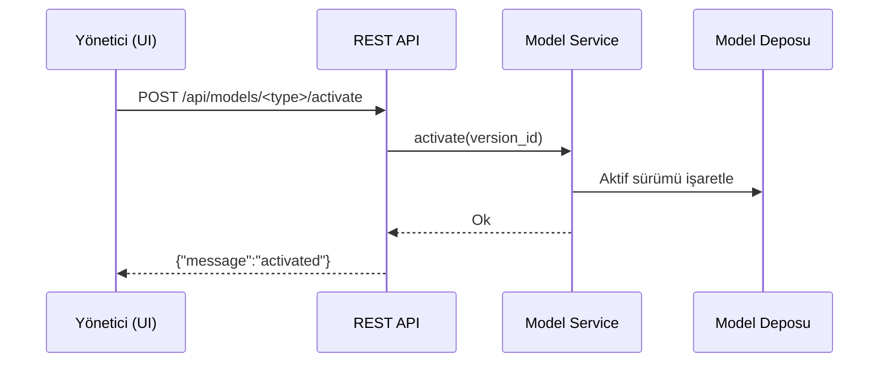

## 4.4 Durum Diyagramı (Analiz Yaşam Döngüsü)
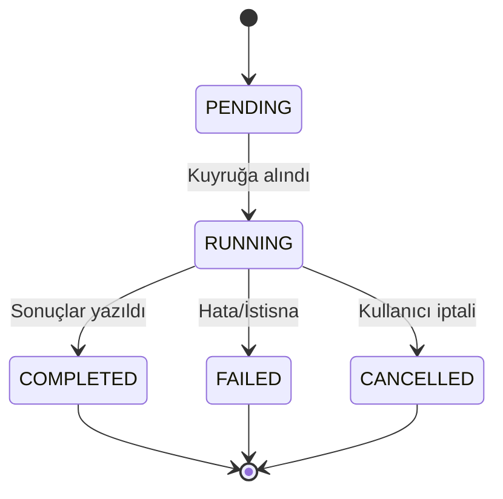

## 4.5 Dağıtım (Deployment) Diyagramı
Detaylı kurulum ve çalıştırma adımları için Ek K bölümüne bakınız (Windows ve Linux için ayrı yönergeler).
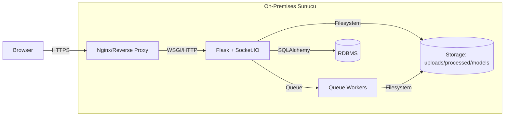

**Ana Bileşenler**:
- **Web Layer**: Flask routes, REST API endpoints
- **Business Logic**: Services layer, analysis orchestration
- **AI Models**: CLIP, YOLO, InsightFace integration
- **Data Layer**: SQLAlchemy ORM, database models
- **Queue System**: Background processing, thread-safe operations
- **Real-time Communication**: WebSocket, Socket.IO
- **File Storage**: Upload, processed, model storage

### 4.1.2 Modüler Yapı

Mimari, modüler yapı ile her bileşenin bağımsız geliştirilmesi ve test edilmesini destekler:

**Directory Structure**:
```
app/
├── routes/          # HTTP endpoints
├── services/        # Business logic
├── ai/             # AI model integrations
├── models/         # Database models
├── utils/          # Helper functions
├── middleware/     # Security, logging
└── static/         # Frontend assets
```

**Separation of Concerns**:
- **Routes**: HTTP request/response handling
- **Services**: Business logic and orchestration
- **AI**: Model loading and inference
- **Models**: Data persistence and relationships
- **Utils**: Cross-cutting utilities

### 4.1.3 Veri Akışı Mimarisi

**Request Flow**:
1. **Client** → HTTP/WebSocket → **Flask Routes**
2. **Routes** → **Services** → **AI Models**
3. **Services** → **Database** → **Queue System**
4. **Queue** → **Background Processing** → **WebSocket Notifications**

**Data Flow**:
1. **File Upload** → **Storage** → **Database Record**
2. **Analysis Request** → **Queue** → **AI Processing**
3. **Results** → **Database** → **WebSocket Broadcast**
4. **Feedback** → **Training Pipeline** → **Model Update**

### 4.1.4 Sequence Diyagramları

#### 4.1.4.1 Dosya Yükleme ve Analiz Başlatma

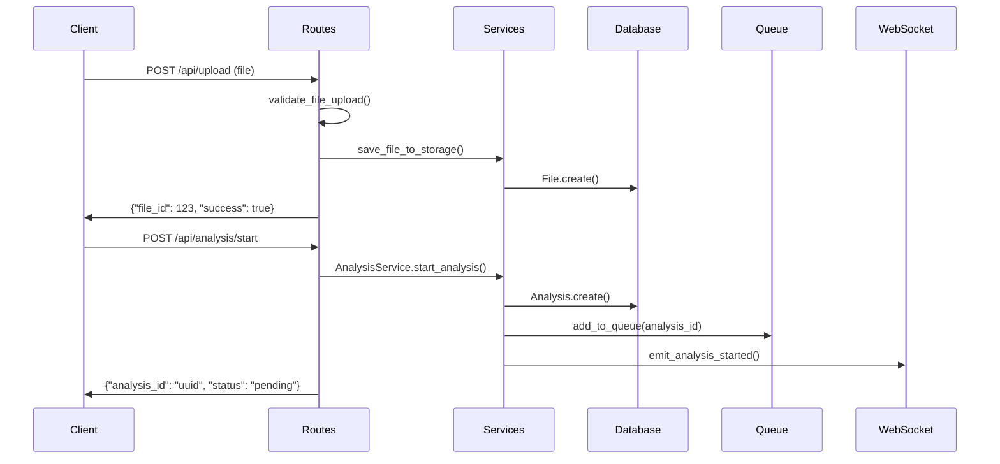

#### 4.1.4.2 Analiz İşleme ve Sonuç Yayını

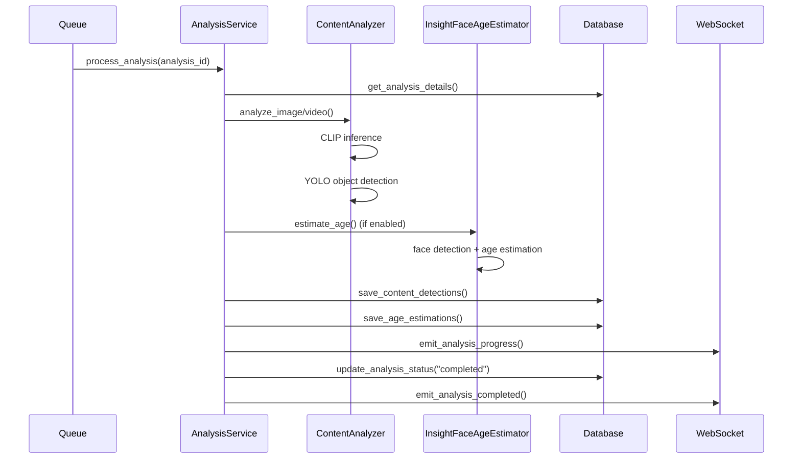

#### 4.1.4.3 WebSocket Bağlantı ve Oda Yönetimi

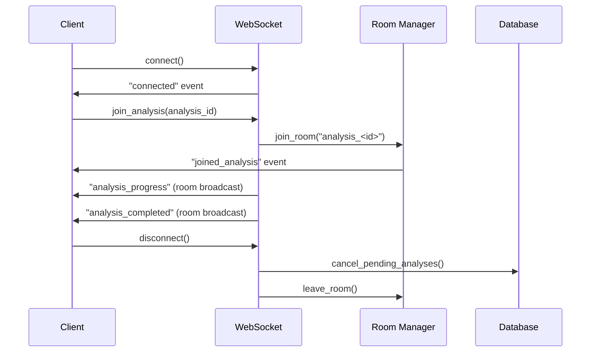

#### 4.1.4.4 Model Eğitimi ve Sürümleme

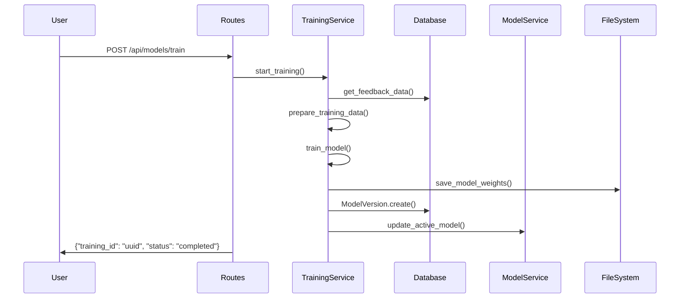

### 4.1.5 State Machine Diyagramları

#### 4.1.5.1 Analiz Durumu State Machine

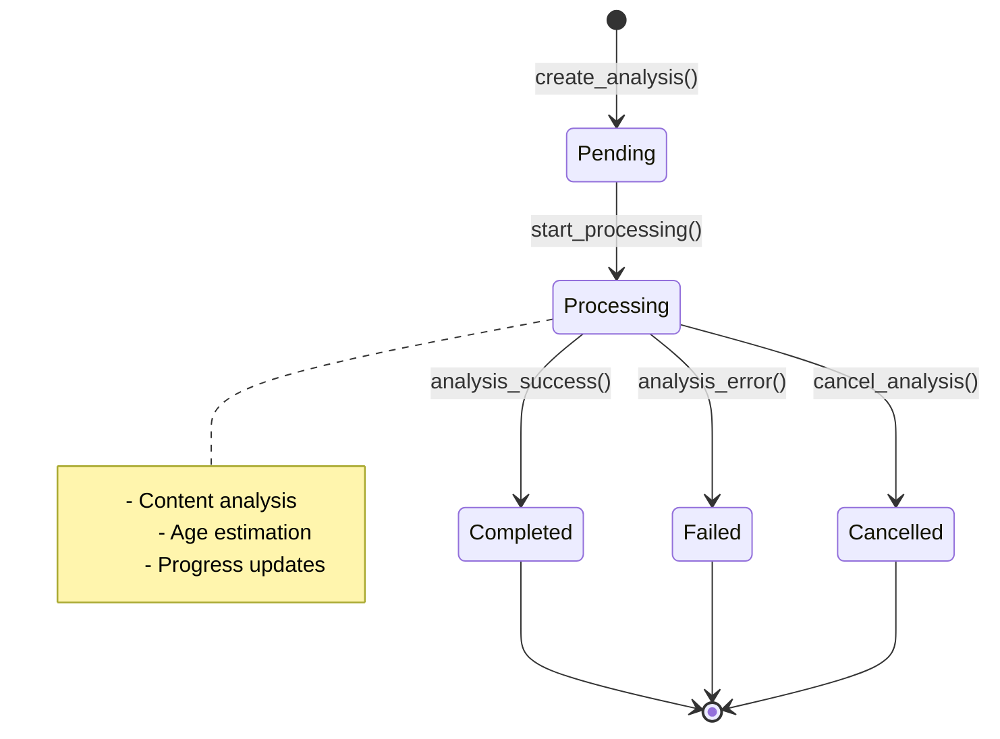

#### 4.1.5.2 Model Sürümü State Machine

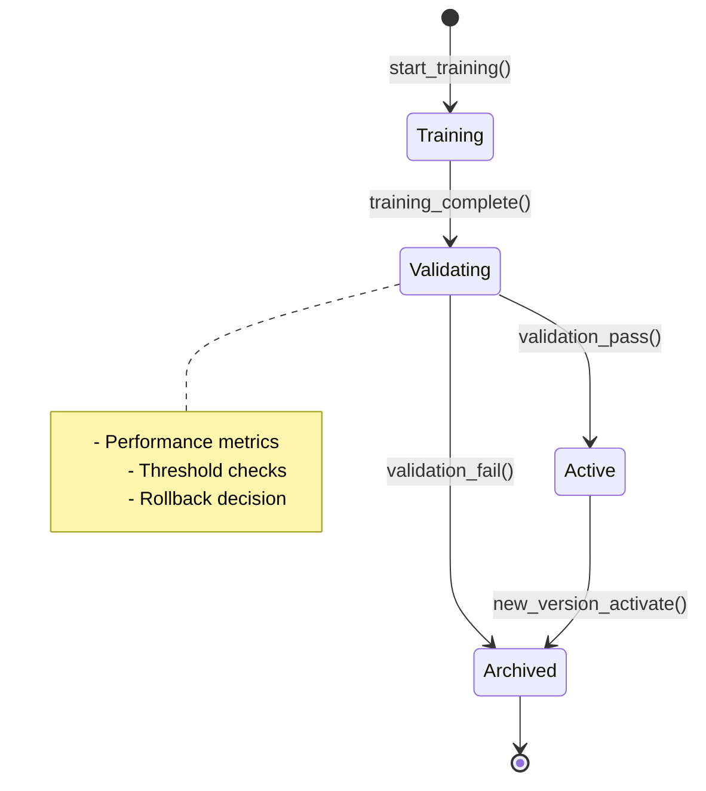

### 4.1.6 Deployment Architecture

#### 4.1.6.1 On-Premises Deployment

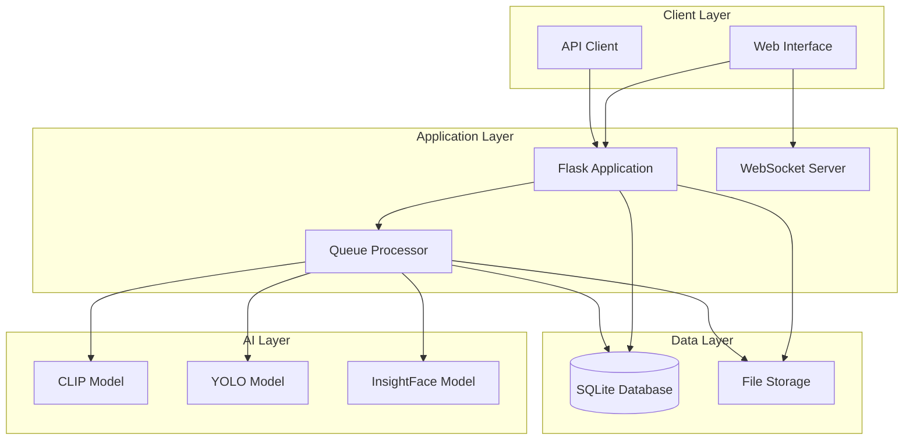

#### 4.1.6.2 Container Architecture

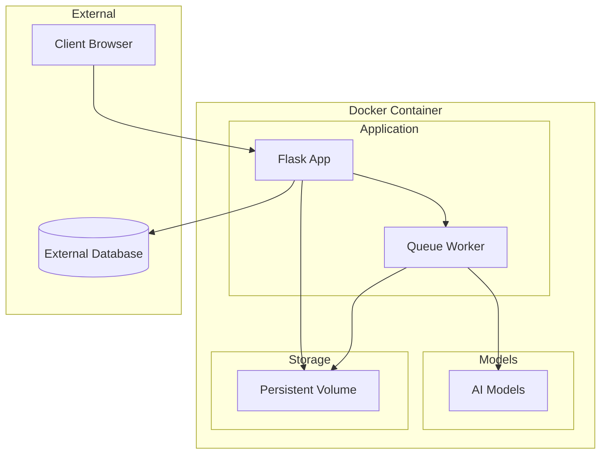

### 4.1.7 Performance ve Scalability

**Kuyruk Tabanlı İşleme**:
- Background thread ile non-blocking operations
- Thread-safe Queue ile concurrent processing
- Database session isolation per job

**Model Caching**:
- Singleton pattern ile model reuse
- GPU memory optimization
- Lazy loading ve cleanup

**WebSocket Optimization**:
- Room-based broadcasting
- Connection pooling
- Message queuing for high volume

Bu genel mimari, yüksek eşzamanlılıkta kuyruk temelli arka plan işlemenin uç gecikmeleri düşürmedeki pratik etkilerinden yararlanır ve gerçek zamanlı bildirimleri oda bazlı sınırlayarak gereksiz yayın yükünü azaltır (Dean ve Barroso, 2013). Modüler yapı, yeni özelliklerin (ör. yeni risk kategorileri, farklı model mimarileri) kolayca eklenmesini sağlar; her modül bağımsız test edilebilir ve refactor edilebilir.

## 4.2 Uygulama Yaşam Döngüsü ve Giriş

Giriş noktası `app.py` üzerinden başlatılır; burada süreç PID yazımı (wsanaliz.pid dosyasına), sinyal yakalama (SIGTERM, SIGINT için graceful shutdown) ve çevresel günlükleme ayarları (logging seviyesi, format, handler'lar) yapılır. Uygulama fabrikası `app/__init__.py` içindeki `create_app(config_name)` ile Flask örneğini ve Socket.IO sunucusunu birlikte oluşturur; config_name parametresi 'development', 'testing', 'production' değerleri alabilir ve ilgili yapılandırma sınıfını yükler. `initialize_app(app)` ise yalnızca ana süreçte çalıştırılması gereken başlangıç görevlerini yürütür: db.create_all() ile veritabanı tablolarının oluşturulması/kontrolü, os.makedirs ile UPLOAD_FOLDER/PROCESSED_FOLDER/MODELS_FOLDER dizinlerinin var edilmesi, cleanup_old_analysis_results ile eski analiz çıktılarının (7 gün üstü) temizliği, sync_age_model_versions_startup ve sync_clip_model_versions_startup ile model sürümlerinin dosya sistemi–veritabanı hizalaması ve start_queue_processor ile kuyruk işleyicisinin background thread'de başlatılması. Bu görevler idempotent tasarlanmıştır; uygulama yeniden başlatıldığında tekrar çalıştırılsa bile yan etki yaratmaz, mevcut durumu kontrol eder ve gerekirse düzeltir. Socket.IO nesnesi tek bir merkezden yönetilir ve global erişim için `app/socketio_instance.py` aracılığıyla kayıtlı tutulur; socketio_instance.get_socketio() fonksiyonu servislerin her yerinden çağrılabilir, merkezi yönetim circular import sorunlarını önler.

Socket.IO kurulumu minimal parametrelerle yapılır (cors_allowed_origins="*", ping_timeout=720, ping_interval=60, async_mode='eventlet'); ayrıntı kodları Ekler bölümünde verilecektir. Eventlet monkey patching, blocking I/O operasyonlarını asenkron hale getirir; böylece uzun süren CLIP hesaplamaları sırasında WebSocket bağlantısı yanıt verebilir.

### 4.2.1 Başlangıç Görevleri ve İdempotensi
`initialize_app(app)` yalnızca ana süreçte çalışır; veritabanı tablolarının oluşturulması/kontrolü, depolama dizinlerinin var edilmesi, eski analiz çıktı ve yetim klasörlerin temizliği, model sürümlerinin dosya sistemi–veritabanı ile hizalanması ve kuyruk işleyicisinin başlatılması adımlarını içerir. Bu adımlar idempotent tasarlanmıştır; uygulama yeniden başlatıldığında yinelenen yan etkiler oluşmaz.

### 4.2.2 Global Socket.IO Erişimi ve Oda Yönetimi
Tekil Socket.IO nesnesi `app/socketio_instance.py` aracılığıyla global erişime açılır; bağlantısı olan istemci `join_analysis` ile `analysis_<analysis_id>` odasına alınır, ilerleme ve sonuç yayınları yalnızca bu odaya gönderilir. `disconnect` olayında ilgili oturumla eşleşen ve hâlâ "pending/processing" durumundaki analizler iptal edilir; kuyruktan kaldırma işlemiyle gereksiz kaynak tüketimi önlenir.

## 4.3 Konfigürasyon ve Durum Yönetimi

`config.py` dosyası çevresel değişkenleri yükler, log/uyarı bastırma seçeneklerini belirler ve uygulama ayarlarının (depolama yolları, model dizinleri, yük boyutları, güncellenebilir parametreler vb.) tekil kaynağıdır. Çalışma zamanı model/davranış durumları için iki hafif durum dosyası kullanılır: `app/utils/model_state.py` (thread‑safe kilitleme ile aktif sürüm ve önbellek) ve `app/utils/settings_state.py` (analiz parametreleri ve zaman damgası). Parametre güncellemeleri REST üzerinden alınıp hem `app.config` içine işlenir hem de dosyada zaman damgası güncellenerek geliştirme ortamında otomatik yükleme tetiklenir. Merkezi model dizinleri ve aktif sürüm yolları yapılandırma içinde tutarlı bir hiyerarşi ile tanımlanır; model durumu atomik olarak güncellenir, tekil örnekler önbelleğe alınır ve ihtiyaç halinde kontrollü biçimde temizlenir.

### 4.3.1 Çevresel Değişkenler ve Yol Hiyerarşisi
`config.py` içinde `.env` dosyası yüklenip geliştirme/üretim modu seçilir; günlük konfigürasyonları (TF_CPP_MIN_LOG_LEVEL, YOLO_VERBOSE) bastırılır; veritabanı URI ve dosya depolama kökü (UPLOAD_FOLDER, PROCESSED_FOLDER, MODELS_FOLDER) belirlenir. Maksimum içerik uzunluğu 500MB ile sınırlanır ve güvenlik ara bileşenine taşınır.

### 4.3.2 Model Yolu Yapılandırması ve Aktif Sürüm Yönetimi
Her model için BASE_PATH, VERSIONS_PATH ve ACTIVE_PATH tanımlıdır (age/buffalo_l, age/custom_age_head, clip/ViT-H-14-378-quickgelu_dfn5b, detection/yolov8x, content/openclip_classifier). Başlangıç senkronizasyonu dosya sistemindeki klasörleri tarayıp aktif sürümü veritabanı ModelVersion tablosu ile hizalar; eksikse yeni kayıt açar, mevcutsa öncelik veritabanındaki aktif işaretlide olur.

### 4.3.3 Güncellenebilir Parametreler ve Fabrika Ayarları
FACTORY_DEFAULTS sözlüğü yüz tespiti ve takip parametrelerinin varsayılanlarını tutar (FACE_DETECTION_CONFIDENCE, TRACKING_RELIABILITY_THRESHOLD, ID_CHANGE_THRESHOLD, MAX_LOST_FRAMES, EMBEDDING_DISTANCE_THRESHOLD); UPDATABLE_PARAMS ise her parametrenin tipini kaydeder. REST ucundan gelen güncellemeler önce tür denetimine tabi tutulur, geçerliyse app.config'e ve settings_state.py'ye atomik yazılır; LAST_UPDATE güncellenerek Flask geliştirme modunda auto-reload tetiklenir.

### 4.3.4 Model Durumu ve Thread-Safe Önbellekleme
`model_state.py` içinde MODEL_STATE sözlüğü her model türüne karşılık aktif sürüm ve aktivasyon zaman damgası tutar; update_model_state fonksiyonu _state_lock threading.Lock ile atomik güncelleme yapar, get_model_state okuma yapar. Örnek yapı: MODEL_STATE = {'age': {'active_version': 1, 'last_activation': '2025-05-30T18:54:00'}, 'content': {'active_version': None, 'last_activation': None}}. Her model türü için cache_model ve get_cached_model fonksiyonları, tekil örnekleri _model_instances sözlüğünde saklar; weakref kullanımı garbage collection'ı engeller, bellek sızıntısı önlenir. Temizlik metotları (cleanup_models), ContentAnalyzer ve InsightFaceAgeEstimator içinde tanımlanır; CLIP model, tokenizer, YOLO model referansları del ile silinir, torch.cuda.empty_cache() ile GPU belleği boşaltılır. Versiyon geçişlerinde eski modeller yüklü kalmaz; reset_instance fonksiyonu singleton'ı sıfırlar, yeni sürüm yüklendiğinde eski önbellek temizlenir. LAST_UPDATE zaman damgası, her model aktivasyonunda veya parametre değişikliğinde güncellenir; Flask geliştirme modunda bu dosyanın değişimi algılanır ve auto-reload tetiklenir. Bu mekanizma, geliştirme sırasında parametrelerin hemen etkili olmasını sağlar; üretimde manuel restart gerekir.

## 4.4 Veri Saklama ve ORM

Kalıcı veriler SQLAlchemy ile yönetilir. Temel varlıklar arasında dosya meta verisi (`File`), analiz üst kaydı ve ilişkili ölçümler (`Analysis`, içerik tespitleri ve yaş tahminleri ile ilişkiler) ve kullanıcı geribildirimleri (`Feedback`) yer alır. `Analysis.id` için metin UUID ile `File.id` tamsayısı, tür dönüşümü yapılan açık bir ilişki üzerinden bağlanır; kişi düzeyindeki yaş tahminleri kare bilgisi ve overlay yolu gibi alanlarla zenginleştirilir. `ContentDetection` her kareye ait skorları ve tespit edilen nesneleri JSON olarak saklar; serileştirme güvenli tip dönüştürmeleriyle desteklenir. Migration gereksinimleri başlangıçta otomatik tablo oluşturma ve gerektikçe alan ekleme (ör. `websocket_session_id`, `is_cancelled`) biçiminde karşılanır.

### 4.4.1 İlişki Tasarımı ve Kardinalite
File ve Analysis arasında bire-çok ilişki vardır; bir dosya birden fazla analiz alabilir. Analysis ve ContentDetection arasında bire-çok ilişki; her analiz birden fazla kare/tespit barındırır. Analysis ve AgeEstimation arasında bire-çok; her analiz birden fazla kişi/yaş tahmini barındırır. Kişi kimlikleri (person_id) kare bazında oluşturulur ve her kişi için en yüksek güven skorlu kare overlay üretimi için seçilir. Feedback tablosu Analysis veya doğrudan yüz örnekleriyle bağımsız ilişkilendirilir; geri bildirim türü (manual/pseudo), kaynak (MANUAL_USER), yaş düzeltmesi ve kullanım durumu (used_in_training, used_in_model_version) izlenir.

### 4.4.2 Migration ve Şema Kontrolü
Başlangıçta check_and_run_migrations SQLite'ta tablo varlığını kontrol eder; analyses tablosunda websocket_session_id ve is_cancelled eksikse ALTER TABLE ile ekler. Bu basit yaklaşım geliştirme için yeterlidir; üretim için Alembic veya benzer araç önerilir. Şema değişiklikleri sürüm notlarında kaydedilir ve izlenebilirlik sağlanır.

### 4.4.3 JSON Serileştirme ve Güvenli Tip Dönüşümü
ContentDetection.detections alanı JSON biçiminde nesne listelerini saklar; numpy int/float türleri veritabanına yazılmadan önce serialization_utils.convert_numpy_types_to_python ile Python tipine çevrilir. Bu dönüşüm JSON kodlayıcı hatalarını engeller. Analiz sonuçlarının HTTP yanıtlarında CustomJSONEncoder veya güvenli serileştirme fonksiyonları kullanılır; çifte serileştirmeden kaçınılır.

### 4.4.4 Varlık İlişki Modeli (ER) ve Kardinalite Ayrıntıları

#### 4.4.4.1 ER Diagram

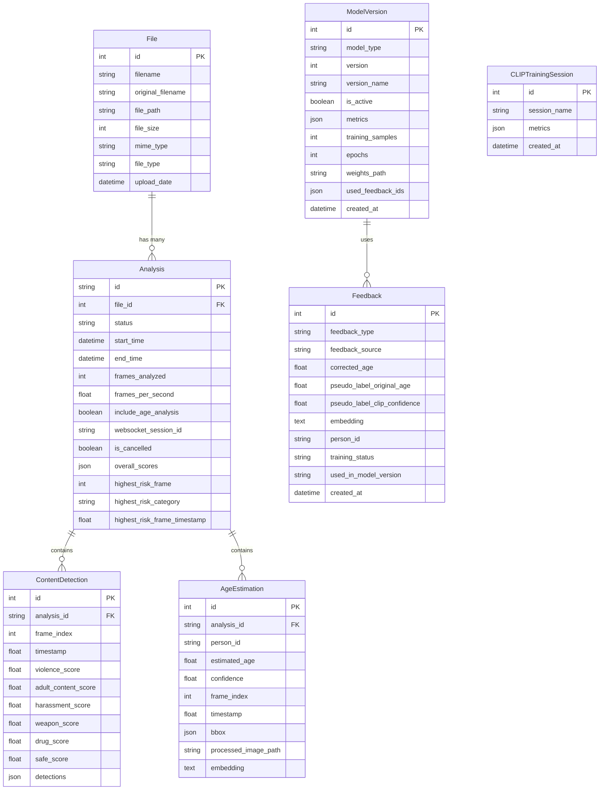

#### 4.4.4.2 Varlık Açıklamaları

**File (Dosya Metadata)**:
- **Primary Key**: `id` (integer, auto-increment)
- **Attributes**: filename, original_filename, file_path, file_size, mime_type, file_type, upload_date
- **Purpose**: Yüklenen dosyaların metadata bilgilerini saklar
- **Relationships**: 1:N with Analysis (bir dosya birden fazla analiz)

**Analysis (Analiz Üst Kaydı)**:
- **Primary Key**: `id` (UUID string, 36 karakter)
- **Foreign Key**: `file_id` → File.id
- **Attributes**: status, start_time, end_time, frames_analyzed, frames_per_second, include_age_analysis, websocket_session_id, is_cancelled, overall_scores, highest_risk_frame/category/timestamp
- **Purpose**: Analiz işlemlerinin üst düzey kayıtlarını tutar
- **Relationships**: N:1 with File, 1:N with ContentDetection, 1:N with AgeEstimation

**ContentDetection (Kare Bazlı İçerik Skorları)**:
- **Primary Key**: `id` (integer, auto-increment)
- **Foreign Key**: `analysis_id` → Analysis.id
- **Attributes**: frame_index, timestamp, violence_score, adult_content_score, harassment_score, weapon_score, drug_score, safe_score, detections (JSON)
- **Purpose**: Her kare için hesaplanan risk skorlarını saklar
- **Relationships**: N:1 with Analysis

**AgeEstimation (Kişi Bazlı Yaş Tahminleri)**:
- **Primary Key**: `id` (integer, auto-increment)
- **Foreign Key**: `analysis_id` → Analysis.id
- **Attributes**: person_id, estimated_age, confidence, frame_index, timestamp, bbox (JSON), processed_image_path, embedding (TEXT)
- **Purpose**: Tespit edilen kişilerin yaş tahminlerini saklar
- **Relationships**: N:1 with Analysis

**Feedback (Manuel/Sözde Etiketler)**:
- **Primary Key**: `id` (integer, auto-increment)
- **Attributes**: feedback_type, feedback_source, corrected_age, pseudo_label_original_age, pseudo_label_clip_confidence, embedding, person_id, training_status, used_in_model_version, created_at
- **Purpose**: Kullanıcı geri bildirimlerini ve pseudo-label'ları saklar
- **Relationships**: N:1 with ModelVersion (used_in_model_version)

**ModelVersion (Sürüm Metadata)**:
- **Primary Key**: `id` (integer, auto-increment)
- **Attributes**: model_type, version, version_name, is_active, metrics (JSON), training_samples, epochs, weights_path, used_feedback_ids (JSON), created_at
- **Purpose**: Model sürümlerinin metadata bilgilerini saklar
- **Relationships**: 1:N with Feedback

**CLIPTrainingSession (CLIP Eğitim Oturumları)**:
- **Primary Key**: `id` (integer, auto-increment)
- **Attributes**: session_name, metrics (JSON), created_at
- **Purpose**: CLIP model eğitim oturumlarını kaydeder
- **Relationships**: Independent entity

#### 4.4.4.3 İlişki Detayları

**File ↔ Analysis (1:N)**:
- Bir dosya birden fazla analiz alabilir (farklı parametrelerle)
- Cascade delete: File silindiğinde ilişkili Analysis'ler silinir
- Foreign key constraint: Analysis.file_id → File.id

**Analysis ↔ ContentDetection (1:N)**:
- Her analiz birden fazla kare tespiti barındırır
- Cascade delete-orphan: Analysis silindiğinde ContentDetection'lar silinir
- Index: analysis_id, frame_index

**Analysis ↔ AgeEstimation (1:N)**:
- Her analiz birden fazla kişi/yaş tahmini içerir
- Cascade delete-orphan: Analysis silindiğinde AgeEstimation'lar silinir
- Index: analysis_id, person_id

**ModelVersion ↔ Feedback (1:N)**:
- Bir model sürümü birden fazla feedback kullanabilir
- used_feedback_ids JSON array olarak saklanır
- Training pipeline'da feedback'ler model sürümü ile ilişkilendirilir

#### 4.4.4.4 Veri Bütünlüğü ve Kısıtlamalar

**Primary Key Constraints**:
- Tüm tablolarda unique, non-null primary key
- File.id: integer auto-increment
- Analysis.id: UUID string
- Diğer tablolar: integer auto-increment

**Foreign Key Constraints**:
- Analysis.file_id → File.id (nullable=False)
- ContentDetection.analysis_id → Analysis.id (nullable=False)
- AgeEstimation.analysis_id → Analysis.id (nullable=False)

**Check Constraints**:
- Analysis.status: ['pending', 'processing', 'completed', 'failed', 'cancelled']
- Feedback.feedback_type: ['age', 'age_pseudo', 'content']
- Feedback.feedback_source: ['MANUAL_USER', 'PSEUDO_LABEL']
- ModelVersion.model_type: ['age', 'content', 'clip']

**Indexes**:
- Analysis.status (frequent queries)
- Analysis.file_id (join performance)
- ContentDetection.analysis_id (join performance)
- AgeEstimation.person_id (person-based queries)
- AgeEstimation.analysis_id (join performance)
- Feedback.training_status (training queries)
- ModelVersion.is_active (active model queries)

#### 4.4.4.5 JSON Alanları

**overall_scores (Analysis)**:
```json
{
  "violence": 0.15,
  "adult_content": 0.05,
  "harassment": 0.02,
  "weapon": 0.08,
  "drug": 0.01,
  "safe": 0.85
}
```

**detections (ContentDetection)**:
```json
[
  {"class": "person", "confidence": 0.95, "bbox": [100, 150, 200, 300]},
  {"class": "car", "confidence": 0.87, "bbox": [50, 200, 150, 250]}
]
```

**bbox (AgeEstimation)**:
```json
[100, 150, 200, 300]
```

**metrics (ModelVersion)**:
```json
{
  "mae": 2.5,
  "mse": 8.7,
  "accuracy_3_years": 0.89,
  "accuracy_5_years": 0.94
}
```

Bu ER modeli, veri bütünlüğünü, sorgu performansını ve depolama verimliliğini dengeler. Cascade delete mekanizmaları yetim kayıt birikimini önler, indeksler sık sorgulanan alanlarda performansı artırır, JSON alanları esnek veri saklama sağlar.

## 4.5 Dosya Yönetimi ve Depolama

Depolama kökü `storage/` altında; yüklemeler `uploads/`, işlenmiş çıktılar `processed/`, modeller `models/` hiyerarşisinde tutulur. Model dizinleri, taban model (`base_model`), sürümler (`versions`) ve aktif model (`active_model`) alt yapısı ile sürümlenebilir yapı kazandırır. Başlangıç senkronizasyonu; diskteki sürümleri veritabanı kayıtları ile hizalar ve aktif sürümü günceller.

### 4.5.1 Göreli Yol Politikası ve Güvenli Sunum
İstemciye servis edilen tüm dosyalar göreli yollarla (`to_rel_path`) ifade edilir; bu sayede hem işletim sistemi ayracı farkları soyutlanır hem de izinli kökler dışında dosya sunumu engellenir. to_rel_path fonksiyonu, mutlak yolu os.path.relpath ile storage köküne göreli hale getirir; Windows'ta ters eğik çizgi (\) POSIX eğik çizgiye (/) normalize edilir, böylece istemci tarafı cross-platform uyumlu kalır. `serve_processed_image`, `serve_analysis_frame` ve `serve_uploaded_file` uçları, path parametresini alır, to_abs_path ile mutlak yola çevirir, validate_path ile kök dizin sınırına göre doğrular; sınır dışı veya .. içeren yollar PathSecurityError ile reddedilir. send_from_directory veya send_file ile güvenli dosya iletimi yapılır; MIME türü mimetypes.guess_type ile otomatik belirlenir, yanıt başlığına eklenir. Bu çok aşamalı doğrulama, yol gezintisi (path traversal) saldırılarını engeller; örneğin ../../etc/passwd gibi denemeler validate_path tarafından reddedilir. İzinli kökler STORAGE_FOLDER, UPLOAD_FOLDER, PROCESSED_FOLDER ile sınırlıdır; bu dizinler dışında dosya sunumu yapılamaz. Göreli yol politikası, veritabanında saklanan yolların taşınabilir olmasını sağlar; depolama kökü değiştirilirse (ör. farklı sürücüye taşınma) yollar hâlâ geçerlidir.

# BÖLÜM 5 ARKA UÇ UYGULAMASI

## 5.0 Uçtan Uca İş Akışı (Dosya Yüklemeden Sonuç Yayınına)

İş akışı, istemcinin güvenli dosya yüklemesiyle başlar; yüklenen dosya adı ve içeriği doğrulandıktan sonra benzersiz bir adla depolamaya kaydedilir ve `File` olarak veritabanına yazılır. İstemci `auto_analyze` seçmişse `AnalysisService.start_analysis` bir `Analysis` kaydı oluşturur, durumu "pending" olarak işaretler ve görevi analiz kuyruğuna ekler. Kuyruk işleyicisi her görevi Flask uygulama bağlamında ele alır; önce iptal durumu kontrol edilir, ardından dosya türüne göre analiz yöntemi seçilir. Resimlerde içerik analizi CLIP tabanlı temsil ile kategorik skorlar üretir; videolarda kareler belirli bir hızla örneklenir ve her kare için skorlar hesaplanır. Yaş analizi etkinse yüzler tespit edilip Buffalo‑L ve kurum başlığıyla yaş tahmini yapılır; en güvenilir kareler için overlay'li görüntüler oluşturulur ve göreli yolları veritabanına kaydedilir. Süreç boyunca ilerleme bilgisi güncellenir ve WebSocket üzerinden ilgili odaya yayınlanır; tamamlanma anında genel skorlar hesaplanır, en riskli kare ve kategoriler belirlenir ve sonuç olayı gönderilir. İstemci HTTP üzerinden özet veya detay uçlarından sonuçları alabilir; görsel erişimi için yalnızca izinli depolama kökleri üzerinden servis yapılır.

### 5.0.1 Yükleme ve Doğrulama
Dosya `multipart/form-data` ile kabul edilir; isim güvenli hale getirilir, MIME ve imza denetimi yapılır, izinli kök altına kaydedilir ve `File` kaydı oluşturulur.

### 5.0.2 Analiz Oluşturma ve Kuyruklama
`/api/analysis/start` JSON gövdesi doğrulandıktan sonra `Analysis` kaydı "pending" durumunda oluşturulur, websocket oturumuyla ilişkilendirilir ve kuyruklanır.

### 5.0.3 Kuyruk İşleme ve İptal Denetimi
İşleyici, her işte app‑context açar; iptal bayrağını ve oturum kopuşlarını kontrol eder, başarısızlıkta geri alma ve durum bildirimini tetikler.

### 5.0.4 İçerik Analizi ve Bağlamsal Ayarlamalar
OpenCLIP ile temsil çıkarılır, istem temelli veya eğitilmiş başlık ile skorlar üretilir; YOLO bağlamı ile yüksek riskler doğrulanır/ayarlanır, "safe" skoru türetilir.

### 5.0.5 Yaş Tahmini ve Overlay Üretimi
InsightFace tabanı ve özel başlık birlikte kullanılır; CLIP paylaşımı ile bellek optimum tutulur; en güvenilir kare için overlay üretilir ve göreli yol veritabanına yazılır.

### 5.0.6 Skorların Toplanması ve En Riskli Kare
Çerçeve skorları kategori bazında ortalanır; güç dönüşümü ile ayrışma artırılır; en riskli kategori/kare belirlenir, zaman damgası ve dosya yolu normalize edilir.

### 5.0.7 WebSocket Bildirimleri ve Durum Güncellemeleri
Başlatma, ilerleme ve tamamlanma olayları oda bazlı yayınlanır; kuyruk durumu periyodik olarak paylaşılır; kopuşta ilgili işler iptal edilir.

### 5.0.8 Sonuçların Sunumu ve Kalıcılaştırma
Özet/detay uçları JSON döner; NumPy türleri güvenli tiplere çevrilir; görsel erişimi yalnızca izinli dizinlerle sınırlandırılır.

### 5.0.9 Temizlik ve Sürümleme Senkronu
Zaman politikasıyla eski analiz çıktıları ve yetim klasörler temizlenir; başlangıçta model sürümleri dosya sistemi ve veritabanı arasında senkronize edilir.

### 5.6 Operasyonel Senaryolar (Örnek Akışlar)
Tek görsel akışı: yükleme → otomatik analiz → ilerleme yayını → özet sonuç → detay sonuç ve overlay erişimi. Kısa video akışı: kare örnekleme (fps) → her kare için içerik skoru → yüz/yaş analizi açık ise en güvenilir kare belirleme → oda bazlı sonuç yayını. Bağlantı kopuşu: `disconnect` algılandığında ilişkilendirilmiş bekleyen işler iptal edilir, kuyruktan çıkarılır ve kaynaklar serbest bırakılır.

## 5.1 REST API Detaylandırma

### 5.1.1 API Endpoint Kategorileri

Uygulamanın HTTP yüzeyi, `app/routes/*` altındaki tanımlarla organize edilmiştir:

**1. Dosya Yönetimi Endpoint'leri**:
- `POST /api/upload` - Dosya yükleme
- `GET /api/files` - Dosya listesi
- `GET /api/files/<file_id>` - Dosya detayları
- `DELETE /api/files/<file_id>` - Dosya silme

**2. Analiz Yönetimi Endpoint'leri**:
- `POST /api/analysis/start` - Analiz başlatma
- `GET /api/analysis/<analysis_id>` - Analiz durumu
- `GET /api/analysis/<analysis_id>/results` - Analiz sonuçları
- `GET /api/analysis/<analysis_id>/detailed-results` - Detaylı sonuçlar
- `POST /api/analysis/<analysis_id>/cancel` - Analiz iptal

**3. Görsel Servis Endpoint'leri**:
- `GET /api/serve/processed/<path>` - İşlenmiş görsel
- `GET /api/serve/frame/<path>` - Analiz karesi
- `GET /api/serve/upload/<path>` - Yüklenen dosya

**4. Geri Bildirim Endpoint'leri**:
- `POST /api/feedback` - Geri bildirim gönderme
- `GET /api/feedback/pending` - Bekleyen geri bildirimler
- `GET /api/feedback/recent` - Son geri bildirimler

**5. Sistem Yönetimi Endpoint'leri**:
- `GET /api/status` - Sistem durumu
- `GET /api/queue/status` - Kuyruk durumu
- `POST /api/clear-all` - Tüm verileri temizle

### 5.1.2 Dosya Yükleme API Detayları

**POST /api/upload**

**Request Format**:
```http
POST /api/upload
Content-Type: multipart/form-data

file: [binary data]
auto_analyze: true/false (optional)
```

**Response Format**:
```json
{
  "success": true,
  "file_id": 123,
  "filename": "unique_filename.jpg",
  "message": "Dosya başarıyla yüklendi",
  "analysis_id": "uuid-string" // if auto_analyze=true
}
```

**Error Responses**:
```json
{
  "error": "Geçersiz dosya türü",
  "code": "INVALID_FILE_TYPE"
}
```

**Validation Rules**:
- **MIME Types**: image/png, image/jpeg, video/mp4, video/avi
- **File Size**: Max 500MB (configurable)
- **Extensions**: .png, .jpg, .jpeg, .gif, .mp4, .avi, .mov, .mkv, .webm
- **Security**: Magic bytes validation, path traversal protection

### 5.1.3 Analiz Başlatma API Detayları

**POST /api/analysis/start**

**Request Format**:
```json
{
  "file_id": 123,
  "frames_per_second": 1.0,
  "include_age_analysis": true
}
```

**Response Format**:
```json
{
  "analysis_id": "550e8400-e29b-41d4-a716-446655440000",
  "status": "pending",
  "message": "Analiz kuyruğa eklendi",
  "estimated_duration": "2-5 dakika"
}
```

**Validation Rules**:
- **file_id**: Required, must exist in database
- **frames_per_second**: Optional, range 0.1-5.0, default 1.0
- **include_age_analysis**: Optional, boolean, default false

### 5.1.4 Analiz Sonuçları API Detayları

**GET /api/analysis/<analysis_id>/results**

**Response Format**:
```json
{
  "analysis_id": "550e8400-e29b-41d4-a716-446655440000",
  "status": "completed",
  "start_time": "2024-01-15T10:30:00Z",
  "end_time": "2024-01-15T10:32:30Z",
  "frames_analyzed": 120,
  "overall_scores": {
    "violence": 0.15,
    "adult_content": 0.05,
    "harassment": 0.02,
    "weapon": 0.08,
    "drug": 0.01,
    "safe": 0.85
  },
  "highest_risk_category": "violence",
  "highest_risk_frame": 45,
  "highest_risk_timestamp": "00:01:30"
}
```

**GET /api/analysis/<analysis_id>/detailed-results**

**Response Format**:
```json
{
  "analysis_id": "550e8400-e29b-41d4-a716-446655440000",
  "content_detections": [
    {
      "frame_index": 0,
      "timestamp": "00:00:00",
      "violence_score": 0.12,
      "adult_content_score": 0.03,
      "harassment_score": 0.01,
      "weapon_score": 0.05,
      "drug_score": 0.00,
      "safe_score": 0.89,
      "detected_objects": ["person", "car"]
    }
  ],
  "age_estimations": [
    {
      "person_id": "analysis_123_person_0",
      "estimated_age": 35.2,
      "confidence": 0.87,
      "frame_index": 15,
      "timestamp": "00:00:15",
      "bbox": [100, 150, 200, 300],
      "processed_image_path": "processed/frames_123/overlays/person_0_frame_15.jpg"
    }
  ]
}
```

### 5.1.5 Error Handling ve HTTP Status Codes

**Standard HTTP Status Codes**:
- **200 OK**: Başarılı işlem
- **201 Created**: Kaynak oluşturuldu
- **400 Bad Request**: Geçersiz istek
- **404 Not Found**: Kaynak bulunamadı
- **409 Conflict**: Çakışma (örn. analiz zaten başlatılmış)
- **413 Payload Too Large**: Dosya boyutu aşımı
- **415 Unsupported Media Type**: Desteklenmeyen dosya türü
- **429 Too Many Requests**: Rate limit aşımı
- **500 Internal Server Error**: Sunucu hatası

**Error Response Format**:
```json
{
  "error": "Açıklayıcı hata mesajı",
  "code": "ERROR_CODE",
  "details": {
    "field": "specific validation error"
  },
  "timestamp": "2024-01-15T10:30:00Z"
}
```

### 5.1.6 Rate Limiting ve Güvenlik

**Rate Limiting**:
- **Dosya Yükleme**: 10 istek/dakika
- **Analiz Başlatma**: 5 istek/dakika
- **Sonuç Sorgulama**: 60 istek/dakika
- **Görsel Servis**: 100 istek/dakika

**Security Headers**:
```http
X-Content-Type-Options: nosniff
X-Frame-Options: DENY
X-XSS-Protection: 1; mode=block
Strict-Transport-Security: max-age=31536000; includeSubDomains
Content-Security-Policy: default-src 'self'
```

**Input Validation**:
- **File Upload**: MIME type, magic bytes, file size
- **JSON Requests**: Schema validation, type checking
- **Path Parameters**: UUID format validation
- **Query Parameters**: Range validation, sanitization

### 5.1.7 API Versioning ve Backward Compatibility

**Versioning Strategy**:
- **URL Versioning**: `/api/v1/analysis/start`
- **Header Versioning**: `API-Version: 1.0`
- **Default Version**: v1 (backward compatible)

**Backward Compatibility Rules**:
- Yeni alanlar optional olarak eklenir
- Mevcut alanlar değiştirilmez
- Deprecated alanlar 2 sürüm boyunca desteklenir
- Breaking changes yeni major version gerektirir

### 5.1.8 API Documentation ve Testing

**OpenAPI/Swagger Integration**:
```yaml
openapi: 3.0.0
info:
  title: WSANALIZ API
  version: 1.0.0
  description: Visual content analysis API
paths:
  /api/upload:
    post:
      summary: Upload file
      requestBody:
        content:
          multipart/form-data:
            schema:
              type: object
              properties:
                file:
                  type: string
                  format: binary
```

**Testing Endpoints**:
- **Health Check**: `GET /api/health`
- **API Status**: `GET /api/status`
- **Metrics**: `GET /api/metrics`
- **Queue Status**: `GET /api/queue/status`

### 5.1.1 Dosya Yükleme Güvenlik Zinciri
Dosya yükleme süreci, MIME türü denetimi ve imza doğrulama ile başlar; validate_file_upload tehlikeli uzantıları (.exe, .sh, .bat, .com, .cmd, .scr, .vbs, .js) reddeder, poliglot denemelerini (aynı dosyanın birden fazla format olarak yorumlanması) tespit eder ve dosya boyutunu MAX_FILE_SIZE (50 MB, config ile 500 MB'a kadar artırılabilir) ile sınırlar. MIME türü request.files['file'].mimetype ile alınır, ancak güvenilir değildir; python-magic veya dosya imzası (magic bytes) kontrolü ile doğrulanır. İzinli uzantılar ALLOWED_EXTENSIONS = {'png', 'jpg', 'jpeg', 'gif', 'mp4', 'avi', 'mov', 'mkv', 'webm'} ile tanımlanır; bu küme dışındaki dosyalar reddedilir. Benzersiz dosya adı str(uuid.uuid4()) + '_' + secure_filename(file.filename) ile üretilir; secure_filename Werkzeug fonksiyonu tehlikeli karakterleri temizler (ör. ../, /, \, null byte). Hedef yol os.path.join(UPLOAD_FOLDER, unique_filename) ile oluşturulur, validate_path ile kök dizin sınırına göre doğrulanır; os.path.commonpath ile yolun UPLOAD_FOLDER altında olduğu teyit edilir. Dosya file.save(safe_path) ile kaydedilir; ardından ikinci bir MIME kontrolü mimetypes.guess_type ile yapılır, beklenenle (request MIME) eşleşmezse os.unlink ile dosya silinir ve 400 hata döndürülür. Dosya boyutu file.seek(0,2) ile ölçülür, 0 ise (boş dosya) reddedilir. Bu çok aşamalı doğrulama, kötü amaçlı dosya yüklemelerini (malware, script injection, zip bomb) engeller ve güvenlik katmanları oluşturur.

### 5.1.2 Analiz Başlatma ve Durum Sorgulama Uçları
POST /api/analysis/start ucu, JSON gövdesinde file_id (zorunlu), frames_per_second (opsiyonel, varsayılan DEFAULT_FRAMES_PER_SECOND=1.0) ve include_age_analysis (opsiyonel, varsayılan False) parametrelerini kabul eder. Gövde eksik veya geçersizse 400 durum koduyla {"error": "Geçersiz istek"} döndürülür. file_id, File.query.get(file_id) ile doğrulanır; dosya yoksa 404 döndürülür. Parametreler doğruysa Analysis kaydı oluşturulur: id=str(uuid.uuid4()), file_id=file_id, status='pending', frames_per_second=fps, include_age_analysis=bool, websocket_session_id=request.sid (varsa), start_time=datetime.now(). Kayıt db.session.add ve db.session.commit ile veritabanına yazılır; ardından AnalysisService.start_analysis veya doğrudan add_to_queue(analysis.id) ile kuyruk servisine gönderilir. Başarı yanıtı {"analysis_id": "<uuid>", "status": "pending", "message": "Analiz kuyruğa eklendi"} döndürür. Durum sorgulama için GET /api/analysis/<analysis_id> ucu, Analysis.query.get(analysis_id) ile kayıt alır; yoksa 404, varsa {"id": "...", "status": "...", "start_time": "...", "end_time": "...", "progress": 75, "overall_scores": {...}, "frames_analyzed": 120} şemasında yanıt döndürür. GET /api/analysis/<analysis_id>/status daha hafif yanıt sunar; yalnızca {"status": "processing", "progress": 50} döndürür, WebSocket kullanılamadığında polling için uygundur. Detaylı sonuçlar GET /api/analysis/<analysis_id>/detailed-results ile alınır; analysis.status != 'completed' ise 400 hata döndürülür. Yanıt, content_detections listesi (her kare için frame_index, timestamp, violence_score, adult_content_score, ..., detected_objects), age_estimations listesi (her kişi için person_id, estimated_age, confidence, frame_index, timestamp, bbox, processed_image_path) ve overall_scores sözlüğü içerir. NumPy türleri convert_numpy_types_to_python ile Python tipine çevrilir; çifte JSON serileştirme yapılmaz, doğrudan jsonify(results) döndürülür.

### 5.1.3 Görsel Servis ve Yol Güvenliği
serve_processed_image, serve_analysis_frame ve serve_uploaded_file uçları, yalnızca tanımlı kök dizinler üzerinden dosya sunar; path parametresi validate_path ile doğrulanır, kök dışına çıkış veya .. kullanımı engellenir. send_from_directory veya send_file ile güvenli dosya iletimi sağlanır; yanıt MIME türü doğru ayarlanır. Bu sayede hem görselleştirme basitleşir hem de yol gezintisi ve yetkisiz erişim önlenir.

Örnek uçlar Ekler bölümünde referans olarak verilecek; ana metinde mantık ve akış önceliklidir.

## 5.2 Servis İş Akışı ve Kuyruk

İş akışının omurgası `AnalysisService` ve kuyruk servisinin birlikte çalışmasıdır. `AnalysisService.start_analysis`, dosyayı doğrulayıp `Analysis` kaydını "pending" durumunda oluşturur ve görevi `app/services/queue_service.py` içindeki `add_to_queue` ile sıraya koyar. `process_queue` ayrı bir iş parçacığında, `database_session` bağlam yöneticisiyle thread-safe SQLAlchemy oturumu açar, `analyze_file` fonksiyonunu çağırır ve her işin sonunda durumu bildirir. `analyze_file` dosya türüne göre `analyze_image` veya `analyze_video` yolunu seçer; ilkinde `ContentAnalyzer.analyze_image` kategorik risk skorlarını ve tespit listesini üretir, ikincisinde video kareleri konfigürasyona göre örneklenir, her kare analiz edilir ve veritabanına çerçeve bazlı `ContentDetection` kayıtları eklenir. Yaş tahmini açık ise `InsightFaceAgeEstimator` yüklenir ve `set_shared_clip` ile CLIP modeli içerik analizörüyle paylaşılarak bellek tüketimi azaltılır; yaş tahminleri `_age_estimation_executor` ile arka planda yürütülür ve sonuçlar `AgeEstimation` kayıtlarına işlenir. Video akışında takip için DeepSORT (Wojke ve diğerleri, 2017) ve `PersonTrackerManager` birlikte çalışır; kişi düzeyinde en güvenilir kareler seçilir, görsel üstüne yaş etiketi basılarak `processed/frames_<analysis_id>/overlays` altına kaydedilir ve göreli yollar `to_rel_path` ile normalize edilerek istemciye sunulabilir hale getirilir. Tüm bu adımlarda `update_progress` ile ilerleme bilgisi güncellenir, beklenmeyen durumlarda `rollback` uygulanır ve bir sonraki iş başlamadan kuyruk durumu yayımlanır.

### 5.2.1 Kuyruk Ekleme ve FIFO Düzeni
add_to_queue fonksiyonu analysis_id'yi global kuyruğa ekler; kuyruk thread-safe Queue yapısıdır ve FIFO düzeninde işler. Her ekleme sonrası queue_status olayı ile kuyruk uzunluğu istemciye yayınlanır. İptal edilen işler remove_cancelled_from_queue ile temizlenir; bu sayede kuyruk güncel tutar.

### 5.2.2 Analiz Dosya Türü Seçimi ve Kare Örneklemesi
analyze_file içinde dosya MIME türü veya uzantısına göre görsel/video ayrımı yapılır. Videolarda OpenCV VideoCapture ile kare sayısı ve fps okunur; yapılandırmadaki frames_per_second parametresi kadar aralıkta kareler örneklenir. Her kare geçici dizine kaydedilir, ContentAnalyzer.analyze_image ile kategorik skorlar ve nesne listesi üretilir, ContentDetection kaydına frame_index, timestamp ve skorlarla birlikte yazılır. Yaş analizi açık ise aynı kare yüz tespitine de gönderilir.

### 5.2.3 Yaş Tahmini Executor ve Kişi Düzeyinde Birleştirme
Yaş analizi etkinse InsightFaceAgeEstimator yüklenir ve CLIP paylaşımı yapılır. Video akışında her karede tespit edilen yüzler PersonTrackerManager ile kişilere atanır; EMBEDDING_DISTANCE_THRESHOLD ve ID_CHANGE_THRESHOLD ile kimlik sürekliliği sağlanır, MAX_LOST_FRAMES ile kayıp izlenir. Kişi başına en güvenilir kare (TRACKING_RELIABILITY_THRESHOLD üstü) seçilir; Buffalo-L ve Custom Age Head tahminleri çapraz-test ile karşılaştırılır, yüksek net CLIP skorlu seçenek AgeEstimation kaydına yazılır. Overlay üretiminde cv2.putText ile yaş metni ROI üzerine basılır, işlenmiş görsel processed/frames_<analysis_id>/overlays/<person_id>_<frame_index>.jpg yoluna kaydedilir ve to_rel_path ile normalize edilir.

### 5.2.4 İlerleme Güncellemeleri ve Hata Geri Alımı
update_progress fonksiyonu analysis.progress alanını artırır; db.session.commit ile kalıcılaştırılır ve emit_analysis_progress ile WebSocket odaya yayınlanır. Beklenmeyen hatalar try-except ile yakalanır, analysis.status 'failed' olarak güncellenir, db.session.rollback ile yarım işlemler geri alınır ve emit_analysis_failed ile istemciye hata mesajı gönderilir. Başarılı tamamlanmada analysis.status 'completed', end_time ve overall_scores alanları doldurulur, emit_analysis_completed ile sonuç yayınlanır.

### 5.2.6 Asenkron Yaş Tahmini ve Non-Blocking İşleme
Yaş tahmini, CLIP güven hesaplaması nedeniyle 5–12 saniye sürebilir; ana thread bloklanırsa WebSocket yanıt veremez ve bağlantı kopar. Bu nedenle _async_age_estimation fonksiyonu ThreadPoolExecutor ile background thread'de çalıştırılır. _age_estimation_executor, max_workers=2 ile iki eş-zamanlı yaş tahminine izin verir; thread_name_prefix="AgeEstimation" ile ayırt edilir. Her yüz için future = executor.submit(_async_age_estimation, ...) çağrılır; future.result(timeout=5.0) ile sonuç beklenir, timeout aşılırsa varsayılan değerler (age=25, confidence=0.5) kullanılır. Background thread içinde Flask app_context açılır; veritabanı erişimi için gereklidir. İptal kontrolü thread başlangıcında yapılır; analysis.is_cancelled=True ise thread hemen döner, gereksiz hesaplama önlenir. Bu asenkron yaklaşım, uzun CLIP hesaplamaları sırasında ana thread'in WebSocket ping/pong'a yanıt vermesini sağlar; bağlantı canlı kalır, kullanıcı deneyimi korunur. Video akışında onlarca yüz işlenebilir; her biri ayrı thread'de çalışır, paralel işleme ile toplam süre azalır.

### 5.2.5 Riskli Kare Çevresi Kırpma ve Bağlamsal Sunuş
Büyük video dosyalarında en yüksek risk kategorisi ve karesi belirlendikten sonra, ilgili karenin birkaç saniye öncesi ve sonrası kırpılarak istemciye sunulur. highest_risk_frame_timestamp alanı kullanılarak video içinde hedef zaman belirlenir; OpenCV ile timestamp-N saniye ve timestamp+N saniye aralığındaki kareler çıkarılır, geçici klasöre kaydedilir ve göreli yollar context_frames listesinde döndürülür. Bu yaklaşım, kullanıcıya riskli anın bağlamını görme imkânı vererek daha sağlıklı değerlendirme yapmasını destekler. Kırpma aralığı yapılandırılabilir (ör. 3–5 saniye); çok kısa aralık bağlam sunmaz, çok uzun aralık depolama tüketir.

Kuyruk tarafının döngüsel işleyişi ve hata–geri alma davranışı, Ekler'de yer alan kısa örnekle gösterilir; metinde yalnızca karar noktaları ve bildirim akışı vurgulanır.

## 5.2 WebSocket Detayları

### 5.2.1 WebSocket Protokol ve RFC 6455 Uyumluluğu

WebSocket bağlantısı, RFC 6455 standardına uygun olarak gerçekleştirilir. Bağlantı HTTP handshake ile başlar ve ardından WebSocket protokolüne geçiş yapar.

**Handshake Süreci**:
```http
GET /socket.io/?EIO=4&transport=websocket HTTP/1.1
Host: localhost:5000
Upgrade: websocket
Connection: Upgrade
Sec-WebSocket-Key: dGhlIHNhbXBsZSBub25jZQ==
Sec-WebSocket-Version: 13
```

**Server Response**:
```http
HTTP/1.1 101 Switching Protocols
Upgrade: websocket
Connection: Upgrade
Sec-WebSocket-Accept: s3pPLMBiTxaQ9kYGzzhZRbK+xOo=
```

### 5.2.2 Socket.IO Framework ve Event System

**Socket.IO Konfigürasyonu**:
```python
socketio = SocketIO(app, 
    cors_allowed_origins="*",
    ping_timeout=720,  # 12 dakika
    ping_interval=60,  # 1 dakika
    max_http_buffer_size=100000000  # 100MB
)
```

**Event Types**:
- **Connection Events**: `connect`, `disconnect`
- **Analysis Events**: `join_analysis`, `leave_analysis`
- **Progress Events**: `analysis_started`, `analysis_progress`, `analysis_completed`
- **System Events**: `queue_status`, `error`

### 5.2.3 Room-Based Broadcasting

**Room Management**:
```python
@socketio.on('join_analysis')
def on_join_analysis(data):
    analysis_id = data['analysis_id']
    room = f'analysis_{analysis_id}'
    join_room(room)
    emit('joined_analysis', {'analysis_id': analysis_id})
```

**Broadcasting to Rooms**:
```python
def emit_analysis_progress(analysis_id, progress):
    room = f'analysis_{analysis_id}'
    emit('analysis_progress', {
        'analysis_id': analysis_id,
        'progress': progress,
        'timestamp': datetime.now().isoformat()
    }, room=room)
```

### 5.2.4 Event Handlers ve Message Format

**Connection Handler**:
```python
@socketio.on('connect')
def on_connect():
    emit('connected', {
        'message': 'WebSocket bağlantısı kuruldu',
        'timestamp': datetime.now().isoformat()
    })
```

**Disconnect Handler**:
```python
@socketio.on('disconnect')
def on_disconnect():
    # İptal edilecek analizleri bul
    pending_analyses = Analysis.query.filter_by(
        websocket_session_id=request.sid,
        status=['pending', 'processing']
    ).all()
    
    for analysis in pending_analyses:
        analysis.cancel_analysis('WebSocket bağlantısı kesildi')
        remove_cancelled_from_queue(analysis.id)
```

**Message Format Standards**:
```json
{
  "event": "analysis_progress",
  "data": {
    "analysis_id": "uuid-string",
    "progress": 75,
    "message": "Analiz devam ediyor...",
    "timestamp": "2024-01-15T10:30:00Z"
  }
}
```

### 5.2.5 Ping/Pong ve Keep-Alive

**Ping/Pong Configuration**:
- **Ping Interval**: 60 saniye
- **Ping Timeout**: 720 saniye (12 dakika)
- **Max HTTP Buffer**: 100MB

**Keep-Alive Mechanism**:
```python
# Client-side ping
setInterval(() => {
    socket.emit('ping');
}, 30000); // 30 saniye

# Server-side pong
@socketio.on('ping')
def on_ping():
    emit('pong', {'timestamp': datetime.now().isoformat()})
```

### 5.2.6 Error Handling ve Reconnection

**Error Event Format**:
```json
{
  "event": "error",
  "data": {
    "code": "ANALYSIS_FAILED",
    "message": "Analiz başarısız oldu",
    "analysis_id": "uuid-string",
    "timestamp": "2024-01-15T10:30:00Z"
  }
}
```

**Reconnection Strategy**:
```javascript
// Client-side reconnection
socket.on('disconnect', () => {
    console.log('Bağlantı kesildi, yeniden bağlanılıyor...');
    setTimeout(() => {
        socket.connect();
    }, 5000);
});
```

### 5.2.7 Performance ve Scalability

**Connection Limits**:
- **Max Connections**: 1000 eşzamanlı bağlantı
- **Memory per Connection**: ~1MB
- **Total Memory Usage**: ~1GB (1000 bağlantı)

**Message Queuing**:
```python
# Message queue for high-volume events
message_queue = Queue(maxsize=1000)

def emit_with_queue(event, data, room=None):
    try:
        message_queue.put_nowait({
            'event': event,
            'data': data,
            'room': room
        })
    except QueueFull:
        logger.warning("Message queue dolu, mesaj atlandı")
```

### 5.2.8 Security ve Authentication

**Connection Security**:
- **CORS**: Configurable allowed origins
- **Rate Limiting**: Per-connection message limits
- **Session Validation**: WebSocket session ID validation

**Authentication Integration**:
```python
@socketio.on('authenticate')
def on_authenticate(data):
    token = data.get('token')
    if validate_token(token):
        session['authenticated'] = True
        emit('authenticated', {'status': 'success'})
    else:
        emit('error', {'message': 'Geçersiz token'})
        disconnect()
```

### 5.2.9 Monitoring ve Debugging

**Connection Monitoring**:
```python
@socketio.on('connect')
def on_connect():
    logger.info(f"Yeni bağlantı: {request.sid}")
    emit('connected', {'session_id': request.sid})

@socketio.on('disconnect')
def on_disconnect():
    logger.info(f"Bağlantı kesildi: {request.sid}")
```

**Debug Endpoints**:
- **Active Connections**: `GET /api/websocket/connections`
- **Room Status**: `GET /api/websocket/rooms`
- **Message Stats**: `GET /api/websocket/stats`

### 5.3.1 Oda Bazlı Yayın ve Oturum Eşleştirmesi
join_analysis olayında gelen data['analysis_id'] ile oda ismi oluşturulur ve request.sid bu odaya eklenir. Emit fonksiyonları room parametresi ile belirli odaya yayın yapar; böylece analiz A'nın ilerlemesi yalnızca A'ya abone istemcilere ulaşır. Bu tasarım, gereksiz yayın yükünü azaltır ve istemci tarafı filtre mantığını basitleştirir.

### 5.3.2 Kopma Durumunda İptal Mekanizması
disconnect olayında Analysis.query.filter_by(websocket_session_id=request.sid, status in ['pending','processing']) ile ilgili işler bulunur; her biri için analysis.cancel_analysis('WebSocket bağlantısı kesildi') çağrılır, is_cancelled bayrağı set edilir ve kuyruktan remove_cancelled_from_queue ile temizlenir. Bu mekanizma, bağlantısı kopan istemcilerin işlerinin kuyrukta gereksiz yer tutmasını önler ve GPU/CPU kaynaklarını serbest bırakır.

### 5.3.3 Ping/Pong ve Zaman Aşımı Ayarları
Socket.IO kurulumunda ping_timeout=720, ping_interval=60 parametreleri uzun analizler için kullanılır; istemci periyodik olarak ping gönderir, sunucu pong yanıtı verir. Bu döngü RFC 6455 standart keep-alive mekanizmasına uygundur ve tarayıcı arka plan kısıtlamalarında bağlantıyı canlı tutar. Zaman aşımı geçilirse bağlantı düşer ve disconnect olayı tetiklenir.

Örnek olay işleyicileri Ekler'dedir; ana metin yalnızca oda katılımı, kopma durumunda iptal ve ilerleme/tamamlanma yayınlarını anlatır.

## 5.4 Güvenlik ve Ara Bileşen

İstekler `app/middleware/security_middleware.py` tarafından önce oran sınırlama ve içerik uzunluğu eşikleri üzerinden süzülür; üretim için `SECURITY_MAX_CONTENT_LENGTH` 100MB, dakika başına sınır ve kısa aralık patlama sınırı geliştirme kolaylığı gözetilerek yükseltilmiştir. Yerel geliştirme ve dosya yükleme, Socket.IO ve statik varlık istekleri gibi akışları gereksiz yere engellememek için seçici atlamalar yapılır. Konak başlığı doğrulaması bariz kötü niyetli desenleri reddeder, sorgu parametreleri temel bir arındırmadan geçirilir ve yanıtlara CSP, HSTS, XSS koruması gibi üstbilgiler otomatik eklenir. Dosya uçlarında isim ve yol temizliği, MIME türü denetimi ve kök dizin sınırı, yanlış konumdan dosya okumayı engelleyen ikinci bir güvenlik duvarı oluşturur.

### 5.4.1 Oran Sınırlama Algoritması ve Pencere Yönetimi
SecurityMiddleware içinde istemci IP'si (X-Forwarded-For başlığı veya request.remote_addr) çıkarılır; her IP için zaman damgalı istek listesi tutulur. Dakikalık pencerede SECURITY_RATE_LIMIT_PER_MINUTE ve kısa patlama aralığında SECURITY_RATE_LIMIT_BURST eşikleri kontrol edilir; aşılırsa 429 durum koduyla talep reddedilir. Pencere kaydırılarak eski istekler listeden çıkarılır; böylece bellek tüketimi sınırlı kalır.

### 5.4.2 Güvenlik Başlıkları ve CSP Politikası
Her yanıta X-Content-Type-Options, X-Frame-Options, X-XSS-Protection, Strict-Transport-Security, Content-Security-Policy, Referrer-Policy ve Permissions-Policy başlıkları eklenir. CSP politikası default-src, script-src, style-src, font-src, img-src, media-src, connect-src direktifleriyle kapsamlı şekilde tanımlanır; yalnızca izinli kaynaklar (self, CDN URL'leri, ws/wss) kabul edilir. HSTS max-age 31536000 ile preload desteğine hazırdır; üretim domain'i için preload listesine kayıt önerilir.

### 5.4.3 Giriş Arındırma ve Konak Doğrulaması
Sorgu parametreleri sanitize_request_args ile arındırılır; tehlikeli karakterler (< > ' " vb.) escape edilir veya çıkarılır. Konak başlığı (Host) validate_host ile kontrol edilir; localhost, 127.0.0.1 ve yapılandırılan domain dışındaki talepler reddedilir. Bu denetimler, konak başlığı enjeksiyonu ve XSS saldırılarını sınırlar.

Başlıca güvenlik üstbilgileri, oran sınırlama pencereleri ve istisna dönüşleri Ekler'deki kısa kodla desteklenir; metinde güvenlik kararları ve geliştirme ortamı ayrıcalıkları açıklanır.

Ek olarak, üretim dağıtımlarında HSTS'nin zorlanması (RFC 6797) ve kapsamlı bir CSP (W3C CSP Level 3) politikası, tarayıcı tarafı güvenliğinin taban çizgisini yükseltir; bu politikaların domain/alt‑domain kapsamı ve preload kullanımına ilişkin kararlar sürüm notlarıyla kayıt altına alınmalıdır.

## 5.9 Middleware Rolü ve Modern Yazılım Geliştirme Bağlamı
Middleware (ara bileşen), modern web uygulamalarında istek-yanıt döngüsünde ara katman işlevleri görür; güvenlik, loglama, kimlik doğrulama, oran sınırlama gibi kesişen kaygıları (cross-cutting concerns) merkezi bir noktada yönetir. Bu çalışmada SecurityMiddleware, her HTTP isteğini işlemeden önce oran sınırlama, içerik uzunluğu denetimi, konak başlığı doğrulama ve giriş arındırma uygular; yanıtlara güvenlik başlıkları ekler. Middleware yaklaşımı, güvenlik mantığının rota fonksiyonlarına dağılmasını önler; tek bir noktada güncelleme yapılır, tüm uçlar otomatik koruma alır. Modern yazılım mimarilerinde (microservices, API gateway) middleware katmanları, kimlik doğrulama (JWT, OAuth), önbellekleme (Redis), hız sınırlama (token bucket, leaky bucket algoritmaları) ve izleme (tracing, metrics) için yaygın kullanılır. Flask'ta middleware, before_request ve after_request hook'ları veya WSGI middleware sınıflarıyla uygulanır; bu çalışmada SecurityMiddleware WSGI katmanında konumlanır ve her istek otomatik süzülür. Middleware avantajları arasında modülerlik (ayrı dosya, bağımsız test), yeniden kullanılabilirlik (farklı projelerde aynı middleware), merkezi kontrol (güvenlik politikası değişikliği tek noktadan) ve separation of concerns (iş mantığı ile güvenlik ayrışır) yer alır. Bu ilkeler, bakım kolaylığı ve kod kalitesini artırır; özellikle büyük ekiplerde ve uzun ömürlü projelerde değerlidir.

## 5.5 Hata Yönetimi ve Bakım

Başlangıçta `check_and_run_migrations` SQLite üzerinde şema denetimleri yapar ve eksikse `websocket_session_id` ile `is_cancelled` sütunlarını ekler. Zamanla biriken çıktıların yönetimi için `cleanup_old_analysis_results`, analiz klasörlerini ve varsa en yüksek risk karelerini siler; burada `processed_image_path` alanı bazı kayıtlarda bulunmayabileceği için erişim `getattr` ile güvenli yapılır ve `cleanup_orphaned_files` veritabanında karşılığı kalmayan `frames_*` dizinlerini kaldırır. Yol normalizasyonu ve göreli yol dönüşümü, özellikle Windows dosya ayırıcıları ve birden çok sürücü durumlarında ek denetimlerle güçlendirilmiştir. Tüm kritik noktalarda başarılı işlemler `commit` ile kalıcılaştırılır, istisnalar durumunda `rollback` uygulanır ve günlüklerde hem özet hem de gerektiğinde iz bilgisini içeren kayıtlar bırakılır.

### 5.5.1 Migration ve Alan Ekleme
check_and_run_migrations fonksiyonu SQLite üzerinde PRAGMA table_info('analyses') ile şema kolonlarını sorgular; websocket_session_id ve is_cancelled yoksa ALTER TABLE analyses ADD COLUMN komutlarıyla eklenir. Bu yaklaşım basit migration ihtiyacını karşılar; üretim ortamında Alembic kullanımı önerilir. Eklenen her kolonun varsayılan değeri NULL veya 0 olarak ayarlanır; mevcut kayıtlar etkilenmez.

### 5.5.2 Zaman Politikaları ve Temizlik Görevleri
cleanup_old_analysis_results belirli bir süre aralığında (ör. 7 gün) tamamlanmış analizlerin çıktı klasörlerini siler; processed_image_path alanı getattr ile güvenli okunur, dosya mevcutsa os.unlink ile kaldırılır. cleanup_orphaned_files, veritabanında karşılığı olmayan frames_* dizinlerini listeler ve shutil.rmtree ile siler. Politika TRAINING_DATA_RETENTION_POLICY ile kontrol edilir; pseudo_label_max_age_days aşılmış kayıtlar temizlik kuyruğuna alınır.

### 5.5.3 Yol Normalizasyonu ve İşletim Sistemi Uyumluluğu
to_rel_path ve to_abs_path fonksiyonları, Windows ters eğik çizgi (\) ve POSIX eğik çizgi (/) ayrımlarını os.path.normpath ile soyutlar; göreli yollar depolama köküne göre hesaplanır, mutlak yollar validate_path ile kök sınırına göre doğrulanır. Bu tasarım, cross-platform çalışmayı destekler ve yol gezintisi denemelerini engeller.

Migration ve temizlik işlemlerinin örnek komutları Ekler'de verilir; metin şema denetimi, alan ekleme, yetim dosya temizliği ve güvenli yol erişimi ilkelerini vurgular.

## 5.7 Video ve Görsel Akış Farklılıkları
Dosya türü tespiti, MIME türü ve uzantı ile yapılır; analyze_file fonksiyonu file.file_type alanını okur ve image/video yolunu seçer. Görsel akışında analyze_image doğrudan çağrılır; tek kare için ContentAnalyzer.analyze_image kategorik skorlar ve tespit listesi üretir, yaş analizi etkinse yüz tespiti ve tahmin tek döngüde tamamlanır, sonuçlar veritabanına yazılıp WebSocket ile yayınlanır. Overlay üretimi için en güvenilir yüz seçilir (genelde tek yüz vardır), processed_image_path kaydedilir. Video akışında analyze_video çağrılır; OpenCV VideoCapture ile fps ve frame_count okunur, frames_per_second parametresi ile örnekleme aralığı (frame_skip) hesaplanır, örneğin fps=30 ve frames_per_second=1 ise her 30 kare bir alınır. Her kare geçici dizine kaydedilip ContentAnalyzer ile analiz edilir; ContentDetection kayıtları frame_index ve timestamp ile veritabanına eklenir. Yaş analizi açıksa DeepSORT ve PersonTrackerManager devreye girer; her karede tespit edilen yüzler takip edilir, kişi kimlikleri embedding benzerliği ve bounding box konumu ile sürdürülür. Kişi başına en güvenilir kare (TRACKING_RELIABILITY_THRESHOLD üstü, yüksek CLIP güven) seçilir; seçilen kareye overlay (cv2.rectangle, overlay_text_turkish) uygulanır ve processed/frames_<analysis_id>/overlays/ altına kaydedilir. Video akışında overall skorlar tüm karelerin ortalaması ve güç dönüşümü ile hesaplanır; en yüksek risk kategorisi ve karesi highest_risk_category, highest_risk_frame, highest_risk_frame_timestamp alanlarına yazılır. İlerleme güncellemeleri her N karede bir emit edilir; bu sayede WebSocket yükü sınırlı kalır. Görsel akışı basit ve hızlıdır; video akışı ise kare örnekleme, takip, overlay ve çoklu kayıt nedeniyle daha karmaşık ve uzun sürelidir. Her iki akış da iptal bayrağını (is_cancelled) kontrol eder; bağlantı kopuşunda işlem durdurulur ve kaynaklar serbest bırakılır.

## 5.8 Kişi Takibi ve Güvenilirlik Skorlama (PersonTracker)
Video akışında kişi kimliklerinin sürekliliği, DeepSORT ve PersonTrackerManager birlikteliğiyle sağlanır. DeepSORT bounding box konumu ve isteğe bağlı embedding ile takip üretir; PersonTrackerManager bu takipleri cinsiyet, yüz embedding, landmark, saç rengi ve cilt tonu gibi çoklu özellik ile doğrular. Her track_id için bir PersonTracker örneği açılır; bu örnek ortalama embedding, son görülme karesi, güvenilirlik skoru ve özellik geçmişi tutar. Yeni tespit geldiğinde update fonksiyonu çağrılır (Ek D'de gösterilmiştir); cinsiyet eşleşmesi, embedding kosinüs benzerliği, landmark mesafesi, saç ve cilt rengi benzerlikleri hesaplanır. Ağırlıklı toplam ile ham güvenilirlik skoru üretilir; ID_CHANGE_THRESHOLD altında kalırsa güncelleme reddedilir (ID switch varsayılır) ve takip filtrelenir. Kabul edilirse embedding listesine eklenir (son 10 tutulur), ortalama embedding güncellenir ve güvenilirlik skoru üstel hareketli ortalama ile düzeltilir (0.8*eski + 0.2*yeni). Kişi başına TRACKING_RELIABILITY_THRESHOLD üstü skorlu kareler overlay üretimi için uygun kabul edilir; en yüksek CLIP güvenli kare seçilir. MAX_LOST_FRAMES süresince görünmeyen takipler temizlenir; böylece bellek tüketimi sınırlı kalır. Embedding mesafe eşiği EMBEDDING_DISTANCE_THRESHOLD ile kontrol edilir; küçük eşik daha sıkı kimlik sürekliliği gerektirir, büyük eşik daha esnek takip sağlar. Landmark mesafesi, yüz anatomik noktaları arasındaki Euclidean mesafenin ortalaması olarak hesaplanır; farklı nokta sayıları durumunda ceza mesafesi döndürülür. Renk benzerlikleri RGB vektörleri arasındaki normalize Euclidean mesafe ile ölçülür; 1 aynı renk, 0 tamamen farklı renk anlamına gelir. Güvenilirlik skorunun ağırlıklı bileşenleri (gender 0.25, embedding 0.4, hair 0.1, skin 0.1, face/landmark 0.15) deneysel olarak ayarlanmıştır; embedding en yüksek ağırlığa sahiptir çünkü InsightFace yerleştirmeleri yüksek ayırt edicidir. Bu çoklu özellik yaklaşımı, poz/ifade/ışık değişimlerinde kimlik sürekliliğini güçlendirir ve ID switch hatalarını azaltır; sonuç olarak her kişi için en temsili kareler seçilir ve overlay kalitesi artar.

### 5.8.1 Unique ID Atama ve Takip Gerekçesi
Video analizinde her karede yüz tespiti yapıldığında, aynı kişinin farklı sahnelerde veya karelerde görünmesi mümkündür. Her tespit için ayrı yaş tahmini yapmak hem hesaplama israfıdır hem de tutarsız sonuçlar üretir; örneğin kare 10'da 35 yaş, kare 50'de 38 yaş tahmin edilirse kullanıcı kafa karışır ve overlay'ler çelişir. Bu nedenle her kişiye unique ID atanır (ör. analysis_id_person_0, analysis_id_person_1) ve video boyunca aynı ID kullanılır. DeepSORT, bounding box konumu ve hareket vektörleri ile kişileri takip eder; PersonTrackerManager, DeepSORT track_id'lerini yüz özellikleriyle (embedding, cinsiyet, landmark) doğrular ve ID switch hatalarını filtreler. Kişi başına en güvenilir kare (yüksek TRACKING_RELIABILITY_THRESHOLD ve CLIP güven) seçilir; yalnızca bu kare için yaş tahmini yapılır ve overlay üretilir. Diğer karelerde aynı ID tespit edilirse önceki tahmin kullanılır; AgeEstimation tablosunda person_id ile ilişkilendirilir, tekrar hesaplama yapılmaz. Bu yaklaşım, hesaplama tasarrufu (N kare yerine ~1–2 kare/kişi), tutarlı sonuçlar (aynı kişi için tek yaş tahmini) ve kullanıcı dostu overlay (her kişi için sabit ID ve yaş) sağlar.

### 5.8.2 Aynı Kişi Farklı Sahnelerde ve Takip Sürekliliği
Uzun videolarda (ör. 30 dakikalık film, canlı yayın) aynı kişi farklı sahnelerde görünebilir; sahne değişimlerinde (cut, fade) kişi kaybolur ve sonra yeniden belirir. MAX_LOST_FRAMES parametresi, bir kişinin kaç kare boyunca görünmeden takipte kalacağını belirler; varsayılan 30 kare (1 fps'de 30 saniye) kısa sahne geçişlerini tolere eder. Uzun filmlerde bu parametre artırılabilir (ör. 100–300 kare); böylece kişi uzun süre görünmese bile ID korunur ve yeniden belirdiğinde aynı tahmin kullanılır. EMBEDDING_DISTANCE_THRESHOLD, yeniden beliren kişinin aynı kişi olup olmadığını belirler; ortalama embedding ile yeni embedding arasındaki kosinüs mesafesi bu eşiğin altındaysa eşleşme kabul edilir. ID_CHANGE_THRESHOLD, çoklu özellik ağırlıklı skorunun altında kalırsa ID switch varsayılır; yeni bir kişi olarak kaydedilir. Bu parametreler, sahne dinamiklerine göre ayarlanabilir; hızlı kesim içeren videolarda MAX_LOST_FRAMES düşük, yavaş sahne geçişlerinde yüksek tutulur. Takip sürekliliği, overlay tutarlılığını sağlar ve kullanıcıya aynı kişinin video boyunca nasıl göründüğünü gösterir; geri bildirim kalitesi artar.

### 5.8.3 Takip Parametrelerinin Rolü ve Ayarlanabilirlik
TRACKING_RELIABILITY_THRESHOLD (varsayılan 0.5), bir takibin overlay için yeterince güvenilir kabul edilme eşiğidir; düşük eşik daha fazla overlay üretir ancak ID switch riski artar, yüksek eşik yalnızca çok güvenilir takipleri kabul eder. ID_CHANGE_THRESHOLD (varsayılan 0.45), çoklu özellik skorunun altında kalırsa güncellemeyi reddeder; düşük eşik sıkı kimlik kontrolü, yüksek eşik esnek takip sağlar. MAX_LOST_FRAMES (varsayılan 30, aralık 5–300), kişinin kaç kare görünmeden takipte kalacağını belirler; kısa videolarda 10–30 yeterli, uzun filmlerde 100–300 gerekir. EMBEDDING_DISTANCE_THRESHOLD (varsayılan 0.4), kosinüs mesafe eşiğidir; düşük eşik (0.2–0.3) çok sıkı eşleşme gerektirir, yüksek eşik (0.5–0.7) benzer görünen farklı kişileri aynı sayabilir. Bu parametreler /api/settings ucundan güncellenebilir; değişiklikler settings_state.py'ye yazılır ve LAST_UPDATE ile auto-reload tetiklenir. Kullanıcı, video türüne göre parametreleri ayarlayabilir; örneğin haber programlarında (kısa kesim, hızlı sahne) MAX_LOST_FRAMES=15, uzun röportajlarda (sabit kamera, yavaş geçiş) MAX_LOST_FRAMES=100 tercih edilebilir. Bu esneklik, farklı içerik türlerinde optimal takip performansı sağlar.

### 5.8.4 Hesaplama Tasarrufu ve Overlay Kalitesi Etkisi
Kişi takibi olmadan her karede her yüz için yaş tahmini yapılır; 1000 karelık videoda 3 kişi varsa 3000 yaş tahmini gerekir, bu da CLIP güven hesaplaması ile 10–15 dakika sürer. Kişi takibi ile her kişi için yalnızca en güvenilir kare işlenir; 3 kişi × 1 tahmin = 3 tahmin, süre 10–20 saniyeye düşer. Bu tasarruf, GPU bellek tüketimini azaltır ve kuyruk işleme hızını artırır. Overlay kalitesi açısından, en güvenilir kare seçimi (yüksek CLIP güven, net yüz, iyi ışık) daha doğru yaş tahmini ve daha okunabilir overlay üretir; kullanıcı geri bildirim verirken en iyi görseli görür, etiketleme kalitesi artar. AgeEstimation kayıtları person_id ile ilişkilendirilir; her kişi için tek kayıt, veritabanı boyutunu düşürür ve sorgu performansını artırır.

## 5.10 18 Yaş Altı Tespit ve Sosyal Koruma Uyarıları
Yaş analizi, içerik analizi ile aynı anda yürütülür; bu birleşimin temel gerekçesi 18 yaş altı bireylerin istismar, şiddet veya uygunsuz içerikte tespitidir. Türkiye Cumhuriyeti Aile ve Sosyal Hizmetler Bakanlığı mevzuatına göre, 18 yaş altı birey istismara, şiddete veya ihmal edilmeye maruz kalıyorsa özel devlet koruması altına alınabilir; aile içi istismar durumlarında sosyal yardım kuruluşları çocukları ailelerinden alıp himaye altına alır. Bu nedenle analiz sonuçlarında 18 yaş altı tespit edildiğinde özel uyarılar üretilir. Yaş tahmini sonucu estimated_age < 18 ise ve aynı karede yüksek risk kategorisi (violence > 0.6, adult_content > 0.6, harassment > 0.6) varsa kırmızı çerçeve ve uyarı metni eklenir; overlay üretiminde bounding box rengi yeşil yerine kırmızı çizilir, metin "UYARI: 18 Yaş Altı - Yüksek Risk" biçiminde basılır. Detay sonuç JSON'unda special_warnings alanı eklenebilir; "minor_at_risk" bayrağı true olur, ilgili kişi kimliği ve risk kategorileri listelenir. İstemci tarafında bu bayrak algılandığında sonuç listesinde kırmızı vurgu ve ses uyarısı tetiklenebilir; inceleyen görevlinin dikkati çekilir. Geri bildirim ekranında 18 yaş altı kayıtlar öncelikli sıraya alınır; manuel gözden geçirme zorunlu kılınabilir. Bu mekanizma, sosyal koruma gereksinimi olan durumların hızlı tespitini ve ilgili birimlere yönlendirilmesini destekler; kurumsal sorumluluk ve yasal uyumluluk sağlanır. Analiz raporlarında 18 yaş altı tespit istatistikleri ayrı özetlenir; periyodik incelemede bu metriklerin izlenmesi, koruma politikalarının etkinliğini değerlendirmeye yardımcı olur.

# BÖLÜM 6 YAPAY ZEKÂ MODÜLLERİ VE EĞİTİM

## 6.1 İçerik Analizi (OpenCLIP)

### 6.1.1 CLIP Model Mimarisi ve Ön-Eğitim

`app/ai/content_analyzer.py` içindeki `ContentAnalyzer`, OpenCLIP'in `ViT-H-14-378-quickgelu` mimarisini `dfn5b` ağırlıklarıyla kullanır. Bu model, Vision Transformer (ViT) tabanlı bir görsel encoder ve text encoder'dan oluşur.

**Vision Transformer (ViT) Mimarisi**:
- **Patch Size**: 14×14 piksel
- **Hidden Dimension**: 378
- **Layers**: 32 transformer layer
- **Attention Heads**: 16
- **Activation**: QuickGELU (Gaussian Error Linear Unit)

**Text Encoder Mimarisi**:
- **Vocabulary Size**: 49,408
- **Context Length**: 77 token
- **Hidden Dimension**: 512
- **Layers**: 12 transformer layer

**Ön-Eğitim Veri Seti**:
- **LAION-5B**: 5.85 milyar görüntü-metin çifti
- **Çok dilli**: 100+ dil desteği
- **Çeşitlilik**: Web'den toplanan geniş içerik yelpazesi

### 6.1.2 Classification Head Mimarisi

Eğitilmiş classification head, CLIP görsel özelliklerini beş risk kategorisine dönüştürür:

```python
class ClassificationHead(nn.Module):
    def __init__(self, input_dim=1024, hidden_dims=[512, 256], num_classes=5):
        super().__init__()
        self.layers = nn.Sequential(
            nn.Linear(input_dim, hidden_dims[0]),
            nn.ReLU(),
            nn.Dropout(0.2),
            nn.Linear(hidden_dims[0], hidden_dims[1]),
            nn.ReLU(),
            nn.Dropout(0.2),
            nn.Linear(hidden_dims[1], num_classes),
            nn.Sigmoid()  # Multi-label classification
        )
    
    def forward(self, x):
        return self.layers(x)
```

**Mimari Özellikleri**:
- **Input Dimension**: 1024 (CLIP ViT-H görsel özellik boyutu)
- **Hidden Layers**: 512 → 256
- **Output Classes**: 5 (violence, adult_content, harassment, weapon, drug)
- **Activation**: Sigmoid (multi-label classification)
- **Dropout**: 0.2 (overfitting önleme)

### 6.1.3 Fine-tuning Süreci

**Eğitim Veri Seti**:
- **Kaynak**: Üretim analizlerinden toplanan geri bildirimler
- **Boyut**: 2.000-5.000 etiketli örnek
- **Dağılım**: Her kategori için dengeli örnek sayısı
- **Kalite**: Manuel etiketleme ve yüksek güven skorlu pseudo-labels

**Eğitim Parametreleri**:
```python
training_params = {
    'epochs': 20,
    'batch_size': 32,
    'learning_rate': 1e-4,
    'weight_decay': 1e-5,
    'patience': 5,
    'optimizer': 'AdamW',
    'scheduler': 'CosineAnnealingLR'
}
```

**Loss Fonksiyonu**:
```python
class WeightedBCELoss(nn.Module):
    def __init__(self, class_weights):
        super().__init__()
        self.class_weights = class_weights
    
    def forward(self, predictions, targets):
        loss = F.binary_cross_entropy(predictions, targets, reduction='none')
        weighted_loss = loss * self.class_weights
        return weighted_loss.mean()
```

### 6.1.4 Prompt Engineering ve Metin Özellikleri

**Kategori Bazlı Prompt Tasarımı**:

| Kategori | Pozitif Prompt | Negatif Prompt |
|----------|----------------|----------------|
| Violence | "physical violence", "fighting", "aggression" | "peaceful interaction", "calm scene" |
| Adult Content | "adult content", "sexual content", "nudity" | "family friendly", "appropriate content" |
| Harassment | "harassment", "bullying", "intimidation" | "respectful interaction", "friendly behavior" |
| Weapon | "weapon", "gun", "knife", "dangerous object" | "safe object", "harmless item" |
| Drug | "drug use", "substance abuse", "illegal drugs" | "healthy lifestyle", "legal substances" |

**Metin Özellik Çıkarımı**:
```python
def extract_text_features(self, prompts):
    with torch.no_grad():
        text_inputs = self.tokenizer(prompts).to(self.device)
        text_features = self.clip_model.encode_text(text_inputs)
        text_features /= text_features.norm(dim=-1, keepdim=True)
    return text_features
```

### 6.1.5 YOLO Bağlamsal Ayarlamaları

**Nesne Tespiti ve Bağlam Analizi**:
```python
def apply_contextual_adjustments(self, clip_scores, yolo_objects):
    adjusted_scores = clip_scores.copy()
    
    # Mutfak bağlamında bıçak tespiti
    if 'knife' in yolo_objects and 'kitchen' in yolo_objects:
        adjusted_scores['weapon'] *= 0.3  # Düşük risk
        adjusted_scores['violence'] *= 0.5
    
    # Silah tespiti olmadan yüksek weapon skoru
    if clip_scores['weapon'] > 0.7 and not any(obj in yolo_objects for obj in ['gun', 'knife', 'weapon']):
        adjusted_scores['weapon'] *= 0.2  # Büyük düşürme
    
    # Kişi sayısına göre harassment ayarlaması
    person_count = sum(1 for obj in yolo_objects if obj == 'person')
    if person_count < 2 and clip_scores['harassment'] > 0.6:
        adjusted_scores['harassment'] *= 0.4  # Tek kişi harassment olamaz
    
    return adjusted_scores
```

### 6.1.6 Ensemble Entegrasyonu

**Ensemble Düzeltme Süreci**:
```python
def apply_ensemble_correction(self, base_scores, content_id, person_id, clip_embedding):
    if self.ensemble_service:
        try:
            corrected_scores = {}
            for category, score in base_scores.items():
                base_description = f"{category} content detected"
                corrected_desc, corrected_conf, correction_info = self.ensemble_service.predict_content_ensemble(
                    base_description=base_description,
                    base_confidence=score,
                    content_id=content_id,
                    person_id=person_id,
                    clip_embedding=clip_embedding
                )
                corrected_scores[category] = corrected_conf
        except Exception as e:
            logger.warning(f"Ensemble correction failed: {str(e)}")
            corrected_scores = base_scores
    else:
        corrected_scores = base_scores
    
    return corrected_scores
```

### 6.1.7 Safe Skoru Hesaplama

**Risk Kategorilerinden Safe Skoru Türetme**:
```python
def calculate_safe_score(self, risk_scores):
    risk_categories = ['violence', 'adult_content', 'harassment', 'weapon', 'drug']
    risk_sum = sum(risk_scores.get(cat, 0) for cat in risk_categories)
    average_risk = risk_sum / len(risk_categories)
    safe_score = max(0.0, 1.0 - average_risk)
    return safe_score
```

Bu yaklaşım, risk kategorilerinin tersinden güvenli içerik skorunu türetir ve sahnenin genel güvenlik seviyesini tek bir metrikle özetler.

### 6.1.2 Model Başlatma ve Önbellek (Kodla Teyit)
İçerik analizörü tekil bir örnek olarak başlatılır; `__new__` içinde çift kilitleme ile singleton sağlanır, `cleanup_models` GPU belleğini boşaltır. CLIP modeli `ViT-H-14-378-quickgelu (dfn5b)` olarak yüklenir, varsa `open_clip_pytorch_model.bin` ile ince ayarlı ağırlıklar katılır; YOLO etkin modeli `YOLO_MODEL_ACTIVE_PATH/YOLO_MODEL_NAME.pt` yolundan okunur, gerekirse base/online geri düşüşleri uygulanır. Tüm yüklemeler `_models_cache` ile kilitli bir önbellekte tutulur.

### 6.1.3 Prompt Bankası ve Metin Özellikleri
Kategorilere karşılık pozitif/zıt istem kümeleri tanımlıdır (`violence`, `adult_content`, `harassment`, `weapon`, `drug`). Tokenizer `open_clip.get_tokenizer('ViT-H-14-378-quickgelu')` ile yüklenir, seçilmiş bazı metin vektörleri önceden normalize edilerek `category_text_features` içine alınır. Prompt‑tabanlı modda her kategori için pozitif ve negatif istemlar kodlanır, görüntü‑metin benzerlikleri hesaplanır ve tanh+sıkıştırma ile 0–1 aralığına taşınır; düşük belirlilikte skorlar 0.5 çevresinde tutulur, normalizasyon MIN/MAX eşikleriyle yapılır.

### 6.1.4 Eğitilmiş Başlık ve Birleştirme Mantığı
Eğer `classification_head.pth` varsa CLIP görsel özellik boyutunda MLP başlık devreye girer ve beş kategori için olasılık üretir. Başlığın çıktıları, mevcutsa “ensemble” düzelticisine verilir; hizmet, açıklama ve gömü üzerinden düzeltme yaparak yeni bir güven döndürür. Başlık yoksa prompt‑tabanlı skorlar aynı entegrasyonla düzeltilir.

### 6.1.5 YOLO Bağlamı ile Skor Ayarlamaları
Önce YOLO ile nesne listesi çıkarılır; kişi sayısı ve risk nesneleri (silah/madde) bayrakları üretilir. Mutfak bağlamında bıçak tespiti gibi durumlarda silah/şiddet artışı sınırlı tutulur, genel silah tespitinde `weapon` ve `violence` artar, `safe` azalır. Spesifik madde göstergelerinde `drug` artırılır; belirsiz göstergeler parti/bar bağlamı ile birleştirilerek daha sınırlı bir artış yapılır. CLIP yüksek risk üretip YOLO onaylamazsa çarpanla düşürme uygulanır.

### 6.1.6 "Safe" Skoru ve Sonuçların Döndürülmesi
Risk kategorileri ortalaması ile `safe = 1 - avg_risk` olarak hesaplanır. Bağlamsal ayarlamalar sonrası skor sözlüğü normalize edilir ve sıralı kategorilerle birlikte tespit listesi Python tiplerine dönüştürülerek döndürülür. Böylece istem‑tabanlı, eğitilmiş başlık ve bağlam işaretleri tek bir akışta birleşir.

### 6.1.7 CLIP Model Seçimi ve Mimari Gerekçeleri
OpenCLIP'in ViT-H-14-378-quickgelu mimarisi seçilmiştir; bu varyant 378×378 giriş çözünürlüğü ve quickgelu aktivasyonu ile yüksek temsil gücü sunar. ViT (Vision Transformer) mimarisi, görüntüleri 14×14 boyutunda yamalara (patch) böler ve dikkat mekanizması ile global bağlamı yakalar; H (Huge) varyantı büyük parametre sayısı (yaklaşık 632M) ile zengin semantik temsiller üretir (Dosovitskiy ve diğerleri, 2021). Pretrained="dfn5b" ağırlıkları, DataComp-1B ve LAION-based veri kümeleri üzerinde eğitilmiş açık kaynak checkpoint'tir; sıfır-örnek sınıflandırmada güçlü performans gösterir (Schuhmann ve diğerleri, 2022). Bu büyük model seçiminin gerekçeleri şunlardır: İçerik moderasyonunda ince semantik farklılıkların (ör. şiddet vs. spor, yetişkin içerik vs. sanat) ayrıştırılması yüksek temsil boyutu gerektirir; istem tabanlı sıfır-örnek yaklaşımda zengin metin-görüntü uzayı, kategori tanımlarının doğal dil ile ifade edilmesini sağlar ve yeni risk türleri eğitim olmadan eklenebilir; yaş tahmini güven skorlamasında ("bu yüz X yaşında") anlamsal doğruluk, küçük modellerde zayıftır ve büyük ViT varyantları daha güvenilir benzerlik skorları üretir; fine-tuning esnekliği açısından görsel özellik çıkarıcı dondurulup classification_head eğitilerek kurum-spesifik kategorilere uyum sağlanır. Dezavantajları arasında yüksek GPU bellek tüketimi (yaklaşık 8–12 GB) ve yavaş çıkarım (tek görsel için 100–200 ms) yer alır; ancak paylaşımlı kullanım (set_shared_clip) ve önbellekleme ile bu maliyet amortize edilir. Alternatif olarak ViT-B/32 veya ViT-L gibi daha küçük varyantlar hız kazandırır ancak semantik ayrışma gücü azalır; bu proje doğruluk öncelikli olduğu için ViT-H tercih edilmiştir.

### 6.1.8 CLIP İşleyişi ve Örnek Promptlar
CLIP çalışma mantığı, metin ve görüntüyü ortak bir embedding uzayında temsil ederek benzerlik hesaplar. Giriş görüntüsü ViT encoder ile E_img vektörüne (512-dim), metin promptu tokenizer ve text encoder ile E_text vektörüne dönüştürülür; her iki vektör L2 norm ile birim vektöre normalize edilir. Benzerlik, iç çarpım (kosinüs benzerliği) ile hesaplanır: S = 100 * (E_img · E_text). Yüksek skor (ör. 80+), görüntü ve metnin semantik olarak uyumlu olduğunu; düşük skor (ör. 20-), uyumsuz olduğunu gösterir. İçerik analizi için örnek pozitif promptlar: "Is there physical violence in this frame?", "Is there fighting and aggression in this frame?", "Is there sexually explicit content in this frame?", "Is there bullying or intimidation in this frame?", "Is there firearms or guns in this frame?". Örnek negatif promptlar: "Is there peaceful interaction in this frame?", "Is there calm and safe environment in this frame?", "Is there family-friendly content in this frame?", "Is there respectful interaction in this frame?", "Is there weapon-free environment in this frame?". Her kategori için pozitif ve negatif promptlar tokenize edilir, CLIP text encoder ile vektörler üretilir, görüntü vektörü ile benzerlik hesaplanır. Pozitif skorların ortalaması ve negatif skorların ortalaması arasındaki fark (Δ = pos_avg - neg_avg) tanh ile [-1,1]'e sıkıştırılır, ardından [0,1] aralığına taşınır ve MIN/MAX eşikleriyle normalize edilir. Yaş tahmini güven skorlaması için örnek promptlar: hedef "this face is 35 years old", karşıt "this face is 8 years old", "this face is 18 years old", "this face is 60 years old", "this face is 75 years old". Hedef skor yüksek (ör. 65) ve karşıt skorlar düşük (ör. 20-30) ise güven yüksektir; fark sigmoid ile 0-1 aralığına çevrilir. CLIP, güven skoru döndürmez; biz benzerlik skorlarından güven türetiriz. Genderage.onnx doğrudan güven skoru döndürmez; biz Buffalo-L ve Custom Head tahminlerini CLIP ile doğrulayıp güven üretiriz.

Başlığın aşamalı yapısı ve cihaz seçimi Ekler'de kısa bir alıntıyla gösterilir; metinde güven skoru üretimi ve çapraz sorgulama ilkeleri öne çıkarılır.

## 6.2 Yüz ve Yaş Tahmini (InsightFace + Özel Başlık)

### 6.2.1 InsightFace Buffalo-L Model Mimarisi

`app/ai/insightface_age_estimator.py` bileşeni, InsightFace'in `buffalo_l` boru hattını kullanır. Bu model, yüz analizi için optimize edilmiş üç ana bileşenden oluşur:

**1. Yüz Tespiti (det_10g.onnx)**:
- **Mimari**: RetinaFace
- **Input**: RGB görüntü (3×H×W)
- **Output**: Bounding box koordinatları ve confidence skorları
- **Eşik**: FACE_DETECTION_CONFIDENCE (varsayılan 0.5)

**2. Yüz Tanıma (rec.onnx)**:
- **Mimari**: ResNet-based
- **Input**: Yüz ROI (112×112 piksel)
- **Output**: 512-boyutlu embedding vektörü
- **Özellik**: ArcFace loss ile eğitilmiş, yüksek ayırt edicilik

**3. Yaş/Cinsiyet Tahmini (genderage.onnx)**:
- **Mimari**: Lightweight CNN
- **Input**: Yüz ROI (112×112 piksel)
- **Output**: Yaş (regresyon) ve cinsiyet (sınıflandırma)
- **Referans**: Genel popülasyon için baseline performans

### 6.2.2 Custom Age Head Mimarisi

Kuruma özgü yaş duyarlılığı için 512-boyutlu yüz embedding'i üzerinde çalışan hafif ağ:

```python
class CustomAgeHead(nn.Module):
    def __init__(self, input_dim=512, hidden_dims=[256, 128], output_dim=1):
        super().__init__()
        self.layers = nn.Sequential(
            nn.Linear(input_dim, hidden_dims[0]),
            nn.ReLU(),
            nn.Dropout(0.2),
            nn.Linear(hidden_dims[0], hidden_dims[1]),
            nn.ReLU(),
            nn.Dropout(0.2),
            nn.Linear(hidden_dims[1], output_dim)
        )
    
    def forward(self, x):
        return self.layers(x)
```

**Mimari Özellikleri**:
- **Input Dimension**: 512 (InsightFace embedding boyutu)
- **Hidden Layers**: 256 → 128
- **Output**: 1 (yaş regresyonu)
- **Activation**: ReLU
- **Dropout**: 0.2 (overfitting önleme)
- **Parametre Sayısı**: ~200K (hafif mimari)

### 6.2.3 Model Yönetimi ve Sürümleme

**Model Dizin Yapısı**:
```
storage/models/age/
├── buffalo_l/                    # InsightFace base model
│   ├── det_10g.onnx
│   ├── rec.onnx
│   └── genderage.onnx
├── custom_age_head/
│   ├── base_model/              # UTKFace eğitimli
│   │   └── model.pth
│   ├── active_model/            # Aktif sürüm
│   │   └── model.pth
│   └── versions/                # Geçmiş sürümler
│       ├── v1/
│       ├── v2/
│       └── v3/
```

**Model Yükleme Stratejisi**:
1. **Aktif Model**: `active_model/model.pth` varsa yükle
2. **Base Model**: Aktif model yoksa `base_model/model.pth` yükle
3. **Fallback**: Hiçbiri yoksa Buffalo-L genderage.onnx kullan

### 6.2.4 CLIP Paylaşımı ve Bellek Optimizasyonu

**Paylaşımlı Model Kullanımı**:
```python
def set_shared_clip(self, clip_model, clip_tokenizer, clip_device):
    """CLIP modelini paylaşımlı olarak enjekte et"""
    self.clip_model = clip_model
    self.clip_tokenizer = clip_tokenizer
    self.clip_device = clip_device
    self.clip_shared = True
```

**Bellek Tasarrufu**:
- **Paylaşım Olmadan**: ~16 GB VRAM (2×CLIP modeli)
- **Paylaşım İle**: ~8 GB VRAM (1×CLIP modeli)
- **Tasarruf**: %50 bellek azaltma

### 6.2.5 Çapraz Sorgu ve Güven Hesaplama

**Çapraz Test Prosedürü**:
1. **Buffalo-L tahmini** \(y_1\) ve **Custom Age Head tahmini** \(y_2\) üretilir
2. Her modelin kendi tahmini için CLIP güveni hesaplanır
3. Her model diğerinin tahminini doğrular (çapraz-test)
4. Yüksek net skor veren tahmin seçilir

**Güven Hesaplama Detayları**:
```python
def _calculate_confidence_with_clip(self, face_image, estimated_age):
    # Target prompt: "this face is X years old"
    target_prompt = f"this face is {int(estimated_age)} years old"
    
    # Opposing prompts: komşu yaş aralıkları
    opposing_prompts = [
        f"this face is {int(estimated_age-10)} years old",
        f"this face is {int(estimated_age+10)} years old",
        f"this face is {int(estimated_age-5)} years old",
        f"this face is {int(estimated_age+5)} years old"
    ]
    
    # CLIP benzerlik hesaplama
    similarities = self._calculate_clip_similarities(face_image, [target_prompt] + opposing_prompts)
    
    target_score = similarities[0]
    max_opposing = max(similarities[1:])
    
    # Ham fark ve sigmoid normalizasyon
    score_diff = target_score - max_opposing
    confidence = 1.0 / (1.0 + np.exp(-score_diff * 2))
    
    return max(0.1, min(0.9, confidence))
```

### 6.2.6 Sözde Etiket Paketi ve Feedback Entegrasyonu

**Sözde Etiket Paketi Yapısı**:
```python
pseudo_label_package = {
    'person_id': person_id,
    'bounding_box': [x1, y1, x2, y2],
    'face_embedding': embedding_vector,  # 512-dim
    'estimated_age': age_value,
    'clip_confidence': confidence_score,
    'model_version': 'age_v3',
    'timestamp': datetime.now()
}
```

**Feedback Tablosuna Kayıt**:
```python
feedback_record = Feedback(
    feedback_type='age_pseudo',
    person_id=person_id,
    pseudo_label_original_age=estimated_age,
    pseudo_label_clip_confidence=confidence_score,
    embedding=','.join(map(str, embedding_vector)),
    training_status='pending',
    created_at=datetime.now()
)
```

### 6.2.7 Hata Yönetimi ve Fallback Stratejileri

**Hata Durumları ve Çözümleri**:

| Hata Durumu | Çözüm | Fallback |
|-------------|-------|----------|
| CLIP modeli yüklenemez | Buffalo-L genderage.onnx kullan | Sabit yaş (25) |
| Custom Age Head yüklenemez | Base model yükle | Buffalo-L kullan |
| Yüz tespit edilemez | Sonraki frame'e geç | Yaş analizi atla |
| CLIP güven hesaplanamaz | Varsayılan güven (0.5) | Manuel gözden geçirme |

**Kararlılık Mekanizmaları**:
- **Timeout Koruması**: CLIP hesaplama 5 saniye timeout
- **Memory Cleanup**: Her işlem sonrası GPU cache temizleme
- **Error Logging**: Tüm hatalar detaylı loglanır
- **Graceful Degradation**: Hata durumunda sistem çalışmaya devam eder

### 6.2.1 Paylaşımlı Model Kullanımı ve Bellek Notları
Yaş tahmini hattında CLIP modelinin paylaşılması, ek bir kopyanın yüklenmesini önleyerek GPU belleğini azaltır (Ek A.7'de set_shared_clip kod örneği gösterilmiştir); bu paylaşım, içerik analizörü bağlamından güvenli şekilde yapılır ve kullanım sonrası temizleme adımlarıyla desteklenir. ContentAnalyzer başlatıldığında CLIP model yüklenir (ViT-H-14-378-quickgelu, ~8 GB VRAM); InsightFaceAgeEstimator başlatıldığında set_shared_clip ile aynı model örneği enjekte edilir, ek yükleme yapılmaz. Paylaşım olmadan iki model örneği yüklenir (~16 GB VRAM), paylaşım ile tek örnek (~8 GB); %50 bellek tasarrufu. Cleanup sırasında her iki modül de aynı CLIP referansını siler; del self.clip_model ve torch.cuda.empty_cache() çağrılır.

### 6.2.2 UTKFace Ön‑Eğitimi ve Kısa Süreli İnce Ayar Bulguları
Custom Age Head, başlangıçta UTKFace veri kümesi (~23.000 etiketli yüz görseli, 0-116 yaş aralığı) ile ön-eğitilmiştir. Bu ön-eğitim, genel yaş dağılımında sağlam bir başlangıç noktası sağlar; Buffalo-L embedding'leri (512-dim) üzerinde 512→256→128→1 mimarisi ile gözetimli öğrenme yapılır. UTKFace eğitimi, MSE kaybı ve Adam optimizer (lr=1e-3) ile 20 epoch sürer, erken durdurma uygulanır; final metrikler yaklaşık MAE=2.7-2.9, MSE=10.9-12.6, ±5y accuracy=%87-88 seviyesindedir. Bu başlangıç modeli, storage/models/age/custom_age_head/base_model/ dizinine kaydedilir ve v0 olarak referans alınır.

Zaman içinde bu Custom Age Head, kurum içi feedback verisi ile artımsal olarak geliştirilir; her eğitim turu (incremental training) yeni bir sürüm (v1, v2, ...) üretir. Kurum verisi, üretim akışından gelen yüksek CLIP güvenli pseudo-label'lar ve manuel kullanıcı düzeltmelerini içerir; UTKFace'ten farklı demografik dağılım, farklı kamera kalitesi, farklı bağlam (kurum içi videolar) gösterir. Artımsal eğitimde base model (UTKFace eğitimli) dondurulur, yalnızca fine-tune aşaması (512→128→64→1 veya karışım ağırlığı mix_weight) güncellenir; böylece UTKFace'teki genel bilgi korunur, kurum-spesifik uyum eklenir. Her sürüm, önceki sürümden daha iyi kurum performansı göstermeli; test seti MAE izlenir, düşüş varsa sürüm aktif edilir, artış varsa rollback yapılır. Tipik olarak v0→v1 geçişinde MAE 2.9'dan 2.5'e düşer (kurum bağlamına uyum), v1→v2'de 2.5'ten 2.3'e düşer (daha fazla feedback). Bu sürekli iyileştirme döngüsü, modelin kurum ihtiyaçlarına giderek daha uyumlu hale gelmesini sağlar; UTKFace ön-eğitimi sağlam temel, artımsal güncellemeler domain adaptation sağlar.

### 6.2.3 Buffalo-L Model Seçimi ve Genderage Başlığı
InsightFace buffalo_l boru hattı seçilmiştir; bu paket det_10g.onnx (yüz tespiti, RetinaFace mimarisi), rec (tanıma embedding, ResNet-based), genderage.onnx (yaş/cinsiyet regresyonu) bileşenlerini içerir. Buffalo-L, büyük ölçekli yüz tanıma veri kümeleri (ör. MS1MV2, Glint360K) üzerinde eğitilmiş olup 512-boyutlu ayırt edici yerleştirmeler üretir; ArcFace kayıp fonksiyonu sınıflar arası açısal ayrımı maksimize eder (Deng ve diğerleri, 2019). Genderage.onnx başlığı, yüz ROI'si üzerinde doğrudan yaş ve cinsiyet tahmini yapar; bu başlık genel dağılımlarda sağlam bir taban sağlar ve kurum-spesifik Custom Age Head için güvenilir referans oluşturur. Buffalo-L seçiminin gerekçeleri: Yüksek ayırt edicilik, bireyler arası embedding farklılıklarının belirgin olması yaş gibi ince görevlerde temel oluşturur; dayanıklılık, poz/ifade/ışık değişimlerinde tutarlı özellik çıkarımı sunar; doğrudan yaş tahmini, genderage.onnx ile bağımsız referans sağlar; transfer uygunluk, ön-eğitimli embedding'den hedef başlıkların hızla uyarlanmasına olanak verir; verimlilik, hesaplama ve bellek kullanımı on-premises uygulamalara uygundur. Custom Age Head, Buffalo embedding'leri üzerinde eğitilen hafif ağdır (512→256→128→1, ReLU, Dropout 0.2); iki gizli katman yeterli temsil gücü sağlarken parametre sayısını düşük tutar (yaklaşık 200K parametre). Katman sayısı deneysel olarak belirlenmiştir; tek gizli katman yetersiz genelleme, üç katman aşırı uyum riski getirir; iki katman optimal dengedir. Bu hafif mimari, artımsal güncellemelerde hızlı yakınsama ve düşük bellek tüketimi sağlar; tam yeniden eğitim gerekmeden saha verisiyle uyum artar.

### 6.2.4 UTKFace Eğitim Scripti ve Veri Hazırlama
Custom Age Head'in UTKFace ile ön-eğitimi, app/scripts/train_custom_age_head.py scripti ile yürütülür. Script, argparse ile komut satırı parametreleri alır: embeddings_path (UTKFace embedding'leri .npz dosyası), output_model_dir (model kaydedilecek dizin), output_model_name (model dosya adı), epochs (varsayılan 20), batch_size (varsayılan 32), learning_rate (varsayılan 1e-3), test_size (varsayılan 0.2), hidden_dims (varsayılan "256,128"), input_embedding_dim (varsayılan 512), use_gpu (varsayılan True). Veri hazırlama aşaması, prepare_utkface_embeddings.py scripti ile yapılır; UTKFace görsellerinin dosya adlarından yaş etiketleri çıkarılır ([age]_[gender]_[race]_[date].jpg formatı), her görsel Buffalo-L ile işlenir, yüz tespiti yapılır, 512-dim embedding üretilir, embedding ve yaş çiftleri embeddings.npz dosyasına kaydedilir (numpy.savez ile). Bu .npz dosyası, train_custom_age_head.py tarafından yüklenir.

Ekran Screenshot 6.1: UTKFace veri seti örnek görselleri ve yaş etiketleri

Eğitim scripti, embeddings ve ages dizilerini yükler, train_test_split ile %80 train %20 val bölünmesi yapar (random_state=42 ile tekrarlanabilir), embedding'leri L2 norm ile normalize eder (kritik: inference'da da normalize edilir, tutarlılık gerekir), TensorDataset ve DataLoader ile batch'ler oluşturur, CustomAgeHead modelini tanımlar (input_dim=512, hidden_dims=[256,128], output_dim=1), nn.MSELoss ve Adam optimizer ile eğitir. Her epoch'ta train loss ve val loss hesaplanır, val MAE (mean absolute error) izlenir, best_val_loss kaydedilir; val loss iyileşmezse best model ağırlıkları kaydedilir. Eğitim sonunda model.pth dosyası output_model_dir'e yazılır; bu dosya base_model/ veya versions/ dizinine kopyalanır. Eğitim süre ve final metrikler loglanır; tipik olarak 20 epoch 2-3 dakika sürer (GPU ile), final MAE≈2.7-2.9, MSE≈10.9-12.6, ±5y accuracy≈87-88% elde edilir.

Ekran Screenshot 6.2: train_custom_age_head.py eğitim log çıktısı (epoch loss, MAE, süre)

Artımsal döngüde verinin kaynağı yalnızca küresel veri kümeleri değildir; `AnalysisService` tarafından üretilen yüksek güvenli sözde etiketler ve kullanıcıdan gelen düzeltmeler birlikte kullanılır. `app/services/incremental_age_training_service.py` içindeki `prepare_feedback_data`, `Feedback` tablosundan `age` ve `age_pseudo` türlerini alır, kişi kimliği düzeyinde yinelemeleri ayıklar ve varsa `MANUAL_USER` kaynaklı kayıtları tercih ederek en güvenilir örnekleri seçer (Ek G'de tekilleştirme kodu gösterilmiştir). Embedding alanı dizge olarak saklandığı için vektöre dönüştürülür, yaş değeri 0–100 aralığı dışında kalan kayıtlar elenir, her örneğin CLIP güveni eğitimde ağırlık olarak kullanılmak üzere saklanır. Sözde veri üretimindeki eşik `PSEUDO_LABEL_RECORD_CLIP_THRESHOLD` yapılandırmasıyla kontrol edilebilir; böylece model yalnızca yeterince ayrıştırıcı örneklerle güncellenir ve gürültü kaynaklı sapmalar sınırlandırılır.

### 6.3.1 Kişi Bazlı Tekilleştirme ve Manüel Öncelik
Feedback kayıtları person_id ile gruplandırılır; aynı kişi için birden fazla kayıt varsa önce feedback_source='MANUAL_USER' olanlar tercih edilir, manuel kayıtlar kendi içinde en güncel tarihli olanı seçilir. Böylece tekrar örneklerin eğitime etkisi sınırlanır ve kullanıcı düzeltmeleri otomatik etiketlere baskın gelir. Bu prosedür, veri kalitesini artırırken kişi çeşitliliğini korur.

### 6.3.2 Embedding Dönüşümü ve Normalizasyon
Embedding alanı string olarak saklanır (veritabanında TEXT sütunu, virgülle ayrılmış float değerler: "0.123,-0.456,..."); virgülle ayrılmış değerler np.array([float(x) for x in embedding.split(',')]) ile sayısal vektöre dönüştürülür. Vektör uzunluğu 512 olmazsa (bozuk kayıt veya farklı model) örnek elenir, log'a uyarı yazılır. Eğitim öncesi tüm vektörler birim norma (L2 norm) ölçeklendirilir: X_norm = X / np.linalg.norm(X, axis=1, keepdims=True); böylece Buffalo-L ve Custom Head arasında skala uyumu sağlanır, kosinüs benzerliği iç çarpım ile doğrudan hesaplanabilir. Normalizasyon, eğitim ve inference'da tutarlı olmalı; her ikisinde de uygulanmazsa veya yalnızca birinde uygulanırsa model performansı düşer. Yaş değeri None, negatif (<0) veya 100'den büyükse (>100, outlier) örnek reddedilir; bu sayede aykırı değerlerin (ör. hatalı etiket 999) model üzerinde olumsuz etkisi engellenir. Veri temizleme, eğitim öncesi kritik bir adımdır; bozuk kayıtlar erken filtrelenir, eğitim kararlı olur.

### 6.3.3 Güven Skoru ve Ağırlıklandırma
Manuel kayıtlar (feedback_source='MANUAL_USER') için güven skoru 1.0 sabitlenir; kullanıcı düzeltmesi tam güvenilir kabul edilir. Sözde etiketler (feedback_type='age_pseudo') için pseudo_label_clip_confidence alanı kullanılır; bu değer CLIP güven hesaplamasından gelir (Ek E), yoksa (eski kayıtlar) 1.0 varsayılır (geriye dönük uyumluluk). Eğitimde her örneğin kaybı bu güven skoru ile çarpılır (weighted_loss = (loss_per_sample * confidence_weights).mean()); yüksek güvenli örnekler (confidence≈1.0) öğrenmeye tam katkı, düşük güvenli örnekler (confidence≈0.6) kısmi katkı sağlar. Ağırlıkların toplamı normalize edilmez (sum(weights) ≠ 1); ortalama kayıp hesaplanır, gradyan bu ortalamadan gelir. Alternatif olarak ağırlıklar normalize edilebilir (weights / sum(weights)); ancak bu çalışmada ham ağırlıklar kullanılır, basitlik tercih edilir. Güven ağırlıklandırması, literatürdeki importance weighting ve sample reweighting yaklaşımlarıyla uyumludur; gürültülü örneklerin etkisi azaltılır, temiz örnekler vurgulanır (Chen ve diğerleri, 2019).

Seçim ve dönüştürme adımlarının kritik noktaları (manüel öncelik, yaş aralığı doğrulaması, güven ağırlığı) metinde aktarılır; kişi bazlı tekilleştirme Ek G'de, UTKFace eğitim döngüsü Ek H'de kod örnekleriyle gösterilmiştir.

## 6.4 Eğitim Döngüsü ve Kayıp Biçimi

Hafif başlık için amaç, \(f(x)\) çıktısının yaş \(y\) değerine yaklaşmasıdır. Örnek‑bazlı ağırlıklandırılmış karesel hata kullanılır:
\[ L = \frac{1}{N} \sum_{i=1}^{N} w_i\, (f(x_i) - y_i)^2,\quad w_i = \gamma\, C_{final}(x_i) + (1-\gamma) \]
Burada \(\gamma\) 0–1 aralığında karışım katsayısıdır; \(\gamma=1\) yalnızca güven skoruyla ağırlıklandırmayı (w_i = C_final), \(\gamma=0\) eşit ağırlığı (w_i = 1) temsil eder. Bu çalışmada \(\gamma \approx 0.8-1.0\) tercih edilir; yüksek değer, güven skorunun belirleyici olmasını sağlar. Örneğin \(\gamma=0.9\), C_final=0.8 için w_i=0.72+0.1=0.82; C_final=0.5 için w_i=0.45+0.1=0.55. Yüksek güvenli örnek daha fazla ağırlık alır.

Eğitimde erken durdurma (early stopping) uygulanır: doğrulama kaybı (val_loss) \(p\) çevrim (patience, varsayılan 10) boyunca iyileşmezse döngü sonlandırılır; en iyi doğrulama kaybının görüldüğü noktanın ağırlıkları (best_model_state = model.state_dict().copy()) saklanır ve eğitim sonunda geri yüklenir (model.load_state_dict(best_model_state)). Bu mekanizma, aşırı uyumu (overfitting) önler; validation loss artmaya başladığında (erken işaret) eğitim durdurulur. Öğrenme hızı (learning rate), sabit (1e-3) veya ısınma/sönümleme politikalarıyla (SGDR: cosine annealing with warm restarts, CLR: cyclical learning rates) ayarlanabilir; dinamik ayarlama, yakınsama hızını artırır ancak hiperparametre karmaşıklığı ekler (Loshchilov ve Hutter, 2017; Smith, 2017). Bu çalışmada basitlik için sabit lr tercih edilir. Küçük partilerle (batch_size=16-32) kararlı yakınsama amaçlanır; çok büyük batch (>64) bellek tüketir, çok küçük batch (<8) gürültülü gradyanlar üretir.

Uygulamadaki gerçekleştirimde, embedding vektörleri önce birim normla ölçeklendirilir (X = X / ||X||₂) ve yalnızca serbest bırakılmış ince ayar parametreleri optimize edilir (base model frozen: requires_grad=False). IncrementalAgeModel mimarisi (app/services/incremental_age_training_service.py), dondurulmuş temel modeli (UTKFace eğitimli CustomAgeHead) ve yeni fine-tune branch'i (512→128→64→1, ReLU, Dropout 0.3) içerir; çıktı katmanında mix_weight öğrenilebilir parametresi (torch.nn.Parameter(torch.tensor(0.2))) iki dalın katkısını dengeler. Forward pass: base_pred = base_model(x) (no_grad ile, frozen), fine_pred = fine_tune_branch(x), weight = sigmoid(mix_weight), final_pred = (1-weight)*base_pred + weight*fine_pred. Başlangıçta weight≈0.2 (%20 fine, %80 base), eğitim ilerledikçe weight artar, kurum verisine uyum güçlenir.

Eğitim döngüsünde DataLoader partileri (batch_size=32) üzerinde nn.MSELoss(reduction='none') ile örnek başına hata hesaplanır (loss_per_sample = criterion(outputs, batch_y).squeeze()), bu hataya güven skoru ağırlıkları çarpılır (weighted_loss = (loss_per_sample * batch_weights).mean()) ve ortalaması geriye yayılım için kullanılır (weighted_loss.backward(), optimizer.step()). Doğrulama setinde val_loss ve val_mae hesaplanır; val_loss < best_val_loss ise best güncellenir, patience_counter=0; aksi halde patience_counter+=1, eşik aşılırsa (patience_counter >= patience) eğitim durdurulur. En iyi durumdaki durum sözlüğü (state_dict) eğitim sonunda tekrar yüklenir; bu sayede en düşük validation loss noktasındaki ağırlıklar kullanılır. Son değerlendirme, test setinde MAE (ortalama mutlak hata), MSE (ortalama karesel hata), ±3y accuracy (tolerance 3 yıl) ve ±5y accuracy ile raporlanır; bu metrikler training_details.json dosyasına yazılır, ModelVersion tablosuna kaydedilir.

Optimizasyon için Adam kullanımı (adaptive moment estimation, momentum ve RMSprop birleştirmesi, Kingma ve Ba, 2015), aşırı uyumu sınırlayan dropout (rastgele nöron devre dışı bırakma, p=0.2-0.3, Srivastava ve diğerleri, 2014) ve uygun görülen senaryolarda öğrenme oranı planlayıcıları (SGDR: cosine annealing with warm restarts, Loshchilov ve Hutter, 2017; CLR: cyclical learning rates, Smith, 2017) değerlendirilebilir. Batch normalization, büyük batch'lerde kararlılık sağlar ancak küçük batch'lerde (<16) istatistikler güvenilir değildir; bu çalışmada batch norm kullanılmaz. L2 weight decay (weight_decay=1e-4), ağırlıkların büyümesini sınırlar, düzenleyici (regularization) etki sağlar.
Ağırlıklı kayıp ve erken durdurmanın kod karşılığı:
```python
criterion = nn.MSELoss(reduction='none')
for batch_X, batch_y, batch_weights in train_loader:
    outputs = incremental_model(batch_X)
    loss_per_sample = criterion(outputs, batch_y).squeeze()
    weighted_loss = (loss_per_sample * batch_weights).mean()
    weighted_loss.backward()
    optimizer.step()
# validation ve erken durdurma
if val_loss < best_val_loss:
    best_val_loss = val_loss
    patience_counter = 0
    best_model_state = incremental_model.state_dict().copy()
else:
    patience_counter += 1
if patience_counter >= params['patience']:
    break
```

## 6.5 Sürümleme ve Geri Dönüş

Artımsal güncelleme başarıyla tamamlandığında save_incremental_model fonksiyonu (app/services/incremental_age_training_service.py), yalnızca ince ayar aşamasının durumunu ve karışım ağırlığını storage/models/age/custom_age_head/versions/<version_name>/model.pth altına yazar (Ek A.8'de sürüm kayıt kodu gösterilmiştir); torch.save({'fine_tune_layer': model.fine_tune_layer.state_dict(), 'mix_weight': model.mix_weight.data}, model_path) ile yalnızca eğitilebilir parametreler kaydedilir, base model (UTKFace eğitimli) kaydedilmez (zaten base_model/ dizininde mevcut). Aynı dizine eğitim geçmişi (history: train_loss, val_loss, val_mae listesi), metrikler (final MAE/MSE/accuracy), kullanılan feedback kimlikleri (used_feedback_ids) ve hiperparametreler (epochs, batch_size, learning_rate, patience) içeren training_details.json bırakılır; bu dosya sürüm metadata'sı olarak izlenebilirlik sağlar.

Ardından ModelVersion tablosunda yeni bir kayıt açılır: model_type='age', version=<auto_increment>, version_name=<timestamp_feedback_count>, created_at=now(), metrics=<JSON>, is_active=True, training_samples=N, validation_samples=M, epochs=E, file_path=<version_dir>, weights_path=<model.pth>, used_feedback_ids=<list>. Önceki aktif kayıtlar ModelVersion.query.filter_by(model_type='age', is_active=True).update({is_active: False}) ile pasifleştirilir; yalnızca bir sürüm aktif olabilir. Kullanılan geribildirimler, Feedback.query.filter(Feedback.id.in_(used_feedback_ids)).update({training_status: 'used_in_training', used_in_model_version: version_name, training_used_at: now()}) ile işaretlenir; böylece aynı feedback tekrar kullanılmaz, izlenebilirlik sağlanır.

Uygulama başlangıcında sync_age_model_versions_startup fonksiyonu (app/__init__.py), dosya sisteminde versions/ altındaki tüm klasörleri tarar, her birinin training_details.json dosyasını okur; veritabanında karşılığı yoksa yeni ModelVersion kaydı açar (senkronizasyon). Aktif sürüm önce veritabanındaki is_active=True kaydından belirlenir; yoksa en yüksek version numaralı kayıt aktif yapılır. app.utils.model_state içindeki MODEL_STATE sözlüğü güncellenir; aktif sürüm bilgisi önbellekte tutulur, get_age_estimator() fonksiyonu bu bilgiyi kullanarak doğru ağırlıkları yükler. Bu çalışmada başlangıç sürümü kurum kuralına uygun olarak tekil bir anlam taşır: Buffalo‑L taban modelinin yerleşik yaş başlığı (genderage.onnx) ile kuruma özgü CustomAgeHead birlikte v0'ı oluşturur; izleyen v1, v2, … artımsal değişimler yalnızca hafif başlığın güncellemelerini temsil eder ve gerektiğinde önceki sürümlere geri dönüş (rollback) işlemsel olarak basittir (model dosyası kopyala, aktif işaretle, yeniden yükle).

### 6.5.1 Sürüm Adı Oluşturma ve Metadata Yazımı
Sürüm adı timestamp ve feedback sayısı ile oluşturulur (ör. incremental_v1_47feedback_20250110_143022); bu format izlenebilirliği artırır. training_details.json içinde version_name, created_at, model_type, metrics (MAE/MSE/accuracy), training_samples, validation_samples, used_feedback_ids ve history (epoch başına train/val loss) kaydedilir. Bu metadata, rollback kararlarında ve performans izlemede kritik rol oynar.

### 6.5.2 Aktif/Pasif Geçişi ve Veritabanı Senkronizasyonu
ModelVersion.query.filter_by(model_type='age', is_active=True).update({is_active: False}) ile önceki aktif sürümler pasifleştirilir; yeni kayıt is_active=True ile eklenir. sync_age_model_versions_startup başlangıçta dosya sisteminde versions/ altındaki klasörleri tarar, her birinin training_details.json dosyasını okur; veritabanında karşılığı yoksa yeni ModelVersion kaydı açar. Aktif sürüm önce veritabanındaki is_active=True kaydından belirlenir, yoksa en yüksek version numaralı kayıt aktif yapılır. MODEL_STATE sözlüğü güncellenerek önbellek ile senkron kalır.

### 6.5.3 Rollback Prosedürü ve Operasyonel Riskler
Performans düşüşü gözlendiğinde /api/models/age/activate ucundan eski bir version_id ile POST yapılır; hedef sürümün ağırlıkları active_model/ dizinine kopyalanır, ModelVersion kayıtları güncellenir ve uygulama yeniden yüklenir. Bu işlem, beklenmeyen aşırı uyum veya veri kayması durumlarında hızlı geri dönüş sağlar. Rollback kararları sürüm notlarında dökümante edilir; hangi metriklerin düşüş gösterdiği, hangi feedback setinin sorunlu olduğu kaydedilir. Böylece operasyonel riskler yönetilir ve model güvenilirliği sürdürülür.

Kayıt ve aktif etme akışı (yalnızca ince ayar aşamasının kaydı, metadata yazımı, aktif/pasif geçiş ve geribildirimlerin işaretlenmesi) Ekler'de özet kodla desteklenir; metinde süreç ve geri dönüş ilkeleri vurgulanır.

## 6.6 Eğitim Teknikleri ve Optimizasyon Stratejileri
Artımsal eğitimde uygulanan teknikler, katastrofik unutmayı sınırlarken yeni veriye hızlı uyumu destekler. Temel model dondurulur (requires_grad=False); yalnızca ince ayar aşamasının parametreleri optimize edilir. Bu yaklaşım, parametre sayısını azaltarak eğitim süresini kısaltır ve temel bilginin korunmasını sağlar. Karışım ağırlığı (mix_weight) öğrenilebilir parametre olarak tanımlanır; sigmoid ile 0–1 aralığına kısıtlanır ve nihai tahmin (1-w)*base + w*fine biçiminde hesaplanır. Eğitimde bu ağırlık güncellenirken üretim kararı çapraz-test ile verilir; bu ayrım, model esnekliğini artırırken üretim kararlılığını korur. Optimizasyon için Adam kullanılır; learning_rate 1e-3 başlangıç değerinden başlar, gerekirse ısınma/sönümleme planlayıcıları (SGDR, CLR) eklenebilir. Dropout (0.2–0.3) aşırı uyumu sınırlar; birim norm normalizasyonu skala uyumunu iyileştirir. Erken durdurma (patience=10) doğrulama kaybında iyileşme olmadığında eğitimi sonlandırır; en iyi durum sözlüğü kaydedilir ve eğitim sonunda geri yüklenir. Veri bölünmesi kişi bazlı ayrık yapılır; aynı kişinin kareleri tek bölüme düşer, böylece sızıntı önlenir. Batch boyutu (16–32) küçük veri altkümeleri için kararlı yakınsamayı destekler; daha büyük batch'ler hızlandırabilir ancak bellek tüketir. Kayıp fonksiyonu örnek-bazlı ağırlıklandırma ile MSE hesaplar; her örneğin kaybı güven skoru ile çarpılır, ortalama alınır ve geriye yayılım için kullanılır. Bu teknikler bir arada, hızlı güncelleme ve genelleme kabiliyetini dengeler.

## 6.7 Overlay Mekanizması ve Görsel İşaretleme
Overlay üretimi, tespit edilen yüzlerin üzerine yaş tahmini ve kişi kimliği bilgisinin görsel olarak basılmasını içerir (Ek F'de kod örneği gösterilmiştir). Görsel akışında en yüksek güven skorlu yüz seçilir; video akışında her kişi için PersonTrackerManager en güvenilir kareyi belirler (TRACKING_RELIABILITY_THRESHOLD üstü ve maksimum CLIP güven). Seçilen kare image.copy() ile kopyalanır; bounding box (x1, y1, x2, y2) cv2.rectangle ile yeşil renkte çizilir (kalınlık 2 piksel). Yaş metni "Kişi <id> Yaş: <age>" formatında oluşturulur; kişi kimliği 1'den başlatılmak üzere artırılır (görsel ID yerine kullanıcı dostu numara). Metin konumu, kutu üst kenarının 10 piksel üstü veya yeterli alan yoksa alt kenarının 25 piksel altıdır; bu sayede metin yüz bölgesini kapatmaz. Türkçe karakter desteği için overlay_text_turkish fonksiyonu kullanılır (app/utils/image_utils.py içinde tanımlıdır); PIL/Pillow ile True Type Font (TTF, ör. DejaVuSans.ttf) yüklenir, metin PIL Image'e çizilir, numpy array'e çevrilir ve OpenCV formatına (BGR) dönüştürülür. Arka plan dolgusu (bg_padding) metnin okunabilirliğini artırır; siyah arka plan, beyaz veya yeşil metin tercih edilir. Overlay görseli processed/frames_<analysis_id>/overlays/<person_id>_<frame_index>.jpg yoluna kaydedilir; yol to_rel_path ile depolama köküne göreli hale getirilir ve AgeEstimation.processed_image_path alanına yazılır. İstemci, detay sonuç ucundan bu yolu alır ve /api/files/processed-image/<rel_path> üzerinden overlay görselini sunar; bu sayede kullanıcı hangi kişiye hangi yaşın tahmin edildiğini görsel olarak doğrular. Overlay üretimi başarısız olursa (dosya yazma hatası, ROI sınır dışı vb.) hata loglanır ancak analiz devam eder; overlay_path None kalır ve istemci varsayılan görseli gösterir. Bu mekanizma, analiz sonuçlarının görsel doğrulamasını basitleştirir ve geri bildirim kalitesini artırır.

## 6.8 Başarı Ölçümü ve Performans İzleme
Model performansı, eğitim turu sonrası ve üretim akışında sürekli izlenir. Eğitim sonrası metrikler (MAE, MSE, ±5 yıl doğruluk) training_details.json ve ModelVersion tablosuna kaydedilir; sürüm notlarında tohum, hiperparametre ve kullanılan feedback kimlikleri yer alır. Doğrulama seti üzerinde epoch başına loss/MAE/MSE izlenir; erken durdurma en iyi validation loss noktasını seçer. Test setinde final değerlendirme yapılır; birden fazla tohum ile tekrarlanan deneyler ortalama±standart sapma biçiminde raporlanır. Üretim akışında, her analiz sonrası sözde etiket üretimi için CLIP güven eşiği kontrol edilir; eşik üstü örnekler Feedback tablosuna pseudo türüyle kaydedilir. Periyodik olarak (ör. haftalık) feedback sayısı ve manuel/pseudo oranı izlenir; dengesizlik varsa eşik ayarlanır veya manuel gözden geçirme kuyruğu genişletilir. Rollback kararları, aktif sürümün test seti MAE/MSE değerlerinin önceki sürüme göre belirgin artış göstermesi (ör. %5 üstü) durumunda verilir; bu kontrol otomatik veya manuel tetiklenebilir. Log dosyaları (logs/) tarih/saat damgalı olarak saklanır; hata izleme, performans darboğazları (ör. CLIP hesaplama süresi, kuyruk bekleme) ve GPU bellek tüketimi izlenir. Günlük metrikler (toplam analiz sayısı, ortalama süre, başarısızlık oranı) özet panelde görüntülenir; bu sayede sistem sağlığı ve model başarımı sürekli takip edilir.

## 6.9 Ensemble Mekanizması ve Düzeltme Stratejileri
Ensemble mekanizması, temel model tahminlerini geçmiş geri bildirimler ile düzeltir. EnsembleIntegrationService iki alt servisi yönetir: EnsembleAgeService (yaş düzeltme) ve EnsembleClipService (içerik düzeltme). Başlangıçta initialize fonksiyonu Feedback tablosundan manuel düzeltmeleri yükler; kişi/içerik bazında düzeltme eşlemeleri oluşturulur. Yaş tahmini için predict_age_ensemble, temel yaş tahmini ve yüz embedding'i alır; embedding ile geçmiş kayıtlar arasında kosinüs benzerliği hesaplanır, en yakın eşleşme bulunursa düzeltilmiş yaş ve yüksek güven döndürülür. İçerik için predict_content_ensemble, temel açıklama/güven ve CLIP embedding alır; benzer içeriklere ait düzeltmeler varsa skorlar ayarlanır. Düzeltme yöntemleri hiyerarşiktir: (i) Tam eşleşme (exact match): embedding benzerliği 0.95 üstündeyse düzeltilmiş değer doğrudan kullanılır, güven 1.0 olur. (ii) Yakın eşleşme (close match): benzerlik 0.85–0.95 aralığındaysa ağırlıklı ortalama alınır, güven 0.8–0.9 artar. (iii) Temel model (base model): eşleşme yoksa orijinal tahmin korunur, güven 0.5 kalır. Her düzeltme, method alanı ile işaretlenir ve loglanır; böylece ensemble etkisi izlenebilir. Ensemble servisi, kullanıcı düzeltmelerinin anında üretime yansımasını sağlar; model yeniden eğitilmeden önce bile tahminler iyileştirilir. Bu yaklaşım, hızlı geri bildirim döngüsü ve tutarlılık artışı sağlar; özellikle sınırlı etiketli veri durumlarında değerlidir. Ensemble istatistikleri (total_people_corrections, total_content_corrections) get_statistics ile izlenir; düzeltme oranları ve yöntem dağılımı performans panelinde raporlanır.

## 6.10 YOLO Model Seçimi ve Nesne Tespiti Rolü
YOLOv8x (Ultralytics) nesne tespiti için seçilmiştir; YOLO (You Only Look Once) ailesi tek-aşamalı tespit mimarileridir ve görüntüyü grid bölgelerine ayırarak her bölgede eş-zamanlı olarak bounding box ve sınıf tahmini yapar. YOLOv8x, YOLOv8 ailesinin en büyük varyantıdır (x: extra-large); daha fazla parametre ile yüksek doğruluk sağlar ancak daha yavaştır. Bu seçimin gerekçeleri: İçerik analizi bağlamsal doğrulama gerektirir; silah/madde nesnelerinin varlığı CLIP skorlarını ayarlar, yokluğunda yüksek skorlar düşürülür; YOLOv8x yüksek doğruluk ile güvenilir nesne listesi sunar. Gerçek zamanlı gereksinim sınırlıdır; analizler kuyrukta işlendiği için hız kritik değildir, doğruluk önceliklidir. COCO veri kümesi üzerinde eğitilmiş YOLOv8x 80 sınıf (person, knife, bottle, gun vb.) tanır; bu kapsam içerik moderasyonu için yeterlidir. Alternatif olarak YOLOv8n/s/m daha hızlı ancak daha az doğrudur; YOLOv8x ile elde edilen nesne listesi, bağlamsal ayarlamalarda daha güvenilirdir. YOLO çıktıları (label, confidence, bbox), _apply_contextual_adjustments fonksiyonunda kullanılır; silah/madde/mutfak nesneleri bayrakları üretilir, CLIP skorları bu bayraklara göre çarpan ile düzeltilir. Bu entegrasyon, tek-kipli CLIP yaklaşımının sınırlılıklarını giderir ve çoklu-modelli içerik analizi literatüründeki önerileri uygular (Kiela ve diğerleri, 2020).

## 6.11 Alternatif Modellerin Değerlendirilmesi ve Tercih Edilmeme Gerekçeleri
Model seçim sürecinde birçok alternatif değerlendirilmiş ancak projenin gereksinimlerine en uygun olanlar tercih edilmiştir. CLIP alternatifleri arasında ViT-B/32 ve ViT-L varyantları daha hızlı çıkarım sunar (50–100 ms); ancak semantik ayrışma gücü düşüktür, ince kategori farklılıklarında (ör. şiddet vs. spor) hata artar; bu proje doğruluk öncelikli olduğu için tercih edilmemiştir. ALIGN, CLIP'e benzer çoklu-modelli modeldir ancak açık kaynak checkpoint'leri sınırlıdır ve OpenCLIP ekosistemiyle uyumlu değildir. BLIP, görüntü captioning odaklıdır; sınıflandırma için uygun değildir. InsightFace alternatifleri arasında FaceNet daha eski bir mimaridir (Inception-based); Buffalo-L'den daha düşük ayırt edicilik gösterir, güncel veri kümelerinde zayıf kalır. ArcFace/CosFace standalone gerçekleştirimleri mevcut ancak InsightFace boru hattının bütünleşik yüz tespiti ve yaş/cinsiyet başlığı avantajı yoktur; ayrı entegrasyon gerektirir. Dlib yüz tespiti daha yavaş ve daha az doğrudur; RetinaFace (buffalo det_10g.onnx) üstündür. YOLO alternatifleri arasında YOLOv5 daha olgun ancak YOLOv8 anchor-free tasarım ve iyileştirilmiş performans sunar. Faster R-CNN ve DETR daha yüksek doğruluk ancak çok daha yavaştır (300+ ms); kuyruk işleme toleransı olsa da gereksiz yavaşlık tercih edilmemiştir. SSD (Single Shot Detector) dengeli hız-doğruluk sunar ancak YOLOv8x'ten düşük doğruluktur. Yaş tahmini alternatifleri arasında DEX (VGG-Face based) eski bir yaklaşımdır; Buffalo embedding'lerinden daha zayıftır. SSR-Net (soft-staging) hafif ancak doğruluk düşüktür; kurum-spesifik ince ayar zordur. CORAL (ordinal regression) yaş tahmini için teorik olarak uygundur ancak Buffalo genderage.onnx zaten sağlam performans gösterir, ek karmaşıklık gerekmez. Bu değerlendirmeler, projenin doğruluk, on-premises uyumluluk, entegrasyon kolaylığı ve bakım sürdürülebilirliği öncelikleri çerçevesinde yapılmıştır; seçilen modeller bu gereksinimleri en iyi dengeler.

## 6.12 İçerik ve Yaş Analizinin Eş-Zamanlı Yürütülmesi ve Birleşik Faydalar
İçerik analizi ve yaş tahmini aynı video akışında eş-zamanlı yürütülür; bu birleşim literatürde sınırlı incelenmiş bir yaklaşımdır. Geleneksel çalışmalar içerik moderasyonu ve yaş tahminini ayrı konular olarak ele alır; bu çalışma her iki boyutu birleştirerek sosyal koruma gereksinimlerini karşılar. Her kare için önce ContentAnalyzer kategorik risk skorları üretir (violence, adult_content, harassment, weapon, drug, safe); ardından yaş analizi etkinse aynı kare InsightFace ile yüz tespiti ve yaş tahmininden geçer. CLIP modeli her iki hat tarafından paylaşılır (set_shared_clip); içerik skorlama ve yaş güven hesaplama aynı model örneğini kullanır, GPU bellek tüketimi yarıya düşer. Kişi takibi (PersonTrackerManager) ile her kişinin en güvenilir karesi seçilir; bu kare hem içerik skoru hem de yaş tahmini içerir. Overlay üretiminde, 18 yaş altı + yüksek risk durumu tespit edilirse özel uyarı eklenir; kırmızı çerçeve ve "UYARI: 18 Yaş Altı - Yüksek Risk" metni basılır. Bu birleşik yaklaşımın faydaları: Sosyal koruma, 18 yaş altı bireylerin riskli içerikte hızlı tespiti ve ilgili birimlere yönlendirilmesi sağlanır; hesaplama verimliliği, CLIP paylaşımı ve kişi takibi ile tekrar hesaplama önlenir; kullanıcı deneyimi, tek overlay'de hem içerik risk hem yaş bilgisi sunulur, karar kolaylaşır; veri kalitesi, yüksek CLIP güvenli kareler hem içerik eğitimi hem yaş eğitimi için kullanılır, tek kayıt iki amaca hizmet eder; izlenebilirlik, her kişi için unique ID ile içerik ve yaş kayıtları ilişkilendirilir, raporlama ve analiz basitleşir. Literatürde bu birleşimin eksikliği, akademik çalışmaların tek görev odaklı olmasından kaynaklanır; bu çalışma çoklu görev (multi-task) yaklaşımının pratik uygulamasını sunar ve sosyal koruma bağlamında yeni bir katkı sağlar.

## 6.13 CLIP İçerik Modeli Eğitimi ve Classification Head
CLIP modeli için classification_head eğitimi, ClipTrainingService tarafından yönetilir. Kullanıcı Feedback tablosuna içerik düzeltmeleri kaydeder (ör. "violence yanlış, safe olmalı"); bu düzeltmeler ContentTrainingService ile analiz edilir ve eğitim hazırlığı kontrol edilir. Yeterli feedback varsa (ör. >50 örnek), classification head eğitimi başlatılır. Head mimarisi: nn.Linear(feature_dim, 512), nn.ReLU(), nn.Dropout(0.2), nn.Linear(512, 256), nn.ReLU(), nn.Dropout(0.2), nn.Linear(256, 5), nn.Sigmoid(); feature_dim CLIP visual.output_dim'den (ör. 1024 veya 1280) gelir. Beş çıktı, beş risk kategorisine (violence, adult, harassment, weapon, drug) karşılık gelir; sigmoid multi-label sınıflandırma için uygundur. Eğitimde BCELoss (binary cross-entropy) kullanılır; her kategori bağımsız optimize edilir. Veri artırma (random crop, color jitter) eğitim setine uygulanır; aşırı uyum önlenir. Eğitim sonrası head ağırlıkları active_model/classification_head.pth'ye kaydedilir; CLIPTrainingSession tablosunda metadata (metrics, feedback_ids) saklanır. ContentAnalyzer başlatıldığında classification_head.pth varsa yüklenir; prompt-based yerine head kullanılır, daha hızlı ve daha doğru sonuçlar üretir. Bu eğitim döngüsü, kurum-spesifik kategorilere uyumu artırır; genel CLIP prompt-based skorları iyileştirilir.

## 6.14 Veritabanı Servisi ve Thread-Safe Oturum Yönetimi
db_service.py, thread-safe veritabanı oturumu yönetimi sağlar. safe_database_session context manager, her thread için izole SQLAlchemy session açar; işlem tamamlandığında commit, hata durumunda rollback yapar. Kuyruk işleyicisi background thread'de çalıştığı için ana Flask app context'inden farklı session gerekir; global db.session kullanılırsa thread-safety sorunu oluşur. safe_database_session, threading.local ile her thread'e özel session saklar; böylece eş-zamanlı işler birbirini etkilemez. Kullanım: with safe_database_session() as session: session.query(...), session.add(...), session.commit(). Bu yaklaşım, race condition ve deadlock risklerini azaltır; kuyruk işleme kararlılığını artırır.

# BÖLÜM 7 GÜVEN SKORU VE VERİ KALİTESİ

## 7.1 Çok‑Modelli Uzlaşı (Agreement) Bileşeni

### 7.1.1 Teorik Formülasyon

İki modelin yaş tahminleri \(y_1, y_2\) için uzlaşı puanı, mutlak farkın üstel azaltımıyla tanımlanır:
\[ C_{agreement}(x) = \exp\left(-\frac{|y_1 - y_2|}{\sigma}\right) \]

Burada \(\sigma\) duyarlılık parametresi olup, model uzlaşısının ne kadar sıkı değerlendirileceğini belirler. \(\sigma\) değeri küçüldükçe sistem daha katı uzlaşı gerektirir, büyüdükçe daha toleranslı olur. Uygulamada \(\sigma = 2.0\) değeri, yaş tahmini için optimal bir başlangıç noktası sağlar.

### 7.1.2 Üstel Azalma Fonksiyonunun Matematiksel Özellikleri

Üstel azalma fonksiyonu \(f(x) = e^{-x}\) aşağıdaki özelliklere sahiptir:

1. **Monoton Azalan**: \(x_1 < x_2 \Rightarrow f(x_1) > f(x_2)\)
2. **Sürekli ve Türevlenebilir**: Tüm \(x \in \mathbb{R}\) için tanımlı
3. **Asimptotik Davranış**: \(\lim_{x \to \infty} f(x) = 0\), \(\lim_{x \to 0} f(x) = 1\)
4. **Konkav Fonksiyon**: İkinci türev negatif, büyük farklarda daha hızlı azalma

Bu özellikler, model uzlaşısının değerlendirilmesinde istenen davranışı sağlar: küçük farklar yüksek skor, büyük farklar düşük skor üretir.

### 7.1.3 Duyarlılık Parametresi Analizi

\(\sigma\) parametresinin farklı değerleri için uzlaşı skorları:

| Yaş Farkı | σ=1.0 | σ=2.0 | σ=3.0 | σ=4.0 |
|-----------|-------|-------|-------|-------|
| 0 yıl     | 1.000 | 1.000 | 1.000 | 1.000 |
| 1 yıl     | 0.368 | 0.607 | 0.717 | 0.779 |
| 2 yıl     | 0.135 | 0.368 | 0.513 | 0.607 |
| 3 yıl     | 0.050 | 0.223 | 0.368 | 0.472 |
| 5 yıl     | 0.007 | 0.082 | 0.189 | 0.287 |
| 10 yıl    | 0.000 | 0.007 | 0.036 | 0.082 |

Bu tablo, \(\sigma=2.0\) değerinin 2-3 yıl fark için makul bir uzlaşı skoru (0.223-0.368) sağladığını, 5 yıl üstü farklarda ise düşük skorlar (0.082) ürettiğini göstermektedir.

### 7.1.4 Alternatif Uzlaşı Metrikleri

Literatürde kullanılan diğer uzlaşı metrikleri:

**L1 Norm (Manhattan Distance)**:
\[ C_{L1}(x) = 1 - \frac{|y_1 - y_2|}{max\_age} \]

**L2 Norm (Euclidean Distance)**:
\[ C_{L2}(x) = 1 - \frac{(y_1 - y_2)^2}{max\_age^2} \]

**Cosine Similarity** (normalize edilmiş tahminler için):
\[ C_{cos}(x) = \frac{y_1 \cdot y_2}{||y_1|| \cdot ||y_2||} \]

Üstel azalma fonksiyonu, bu alternatiflere kıyasla şu avantajları sağlar:
- Büyük farklarda daha hızlı ceza
- Küçük farklarda daha yumuşak geçiş
- Parametrik kontrol (\(\sigma\)) ile ayarlanabilirlik

### 7.1.5 Pratik Uygulama: Çapraz Sorgu Yaklaşımı

Teorik formülasyon bu şekilde olmakla birlikte, kodda pratik bir "çapraz sorgu" prosedürü uygulanır. Bu yaklaşım, `app/ai/insightface_age_estimator.py` dosyasında `_calculate_confidence_with_clip` fonksiyonunda gerçekleştirilir:

1. **Buffalo-L tahmini** \(y_1\) ve **Custom Age Head tahmini** \(y_2\) üretilir
2. Her modelin kendi tahmini için CLIP güveni hesaplanır
3. Her model diğerinin tahminini doğrular (çapraz-test)
4. Yüksek net skor veren tahmin seçilir

Bu yaklaşım, üretim koşullarında daha kararlı karar veren bir seçmeli uzlaşı prosedürüdür ve teorik üstel formülün pratik bir alternatifi olarak kullanılır.

## 7.2 CLIP Tabanlı Anlamsal Doğrulama Bileşeni

### 7.2.1 Kosinüs Benzerliği ve Embedding Hesaplama

Görüntü–metin gömülerinin kosinüs benzerliği 0–100 aralığına ölçeklenir: 
\[ S(I,T) = 100\cdot \cos( E_{img}(I), E_{text}(T) ) \]

Kosinüs benzerliği, iki vektör arasındaki açının kosinüsü olarak tanımlanır:
\[ \cos(\theta) = \frac{v_1 \cdot v_2}{||v_1|| \cdot ||v_2||} \]

CLIP modelinde vektörler L2 norm ile birim vektöre dönüştürüldüğü için payda 1 olur ve iç çarpım doğrudan kosinüs değerini verir. Bu normalizasyon, ölçek bağımsız karşılaştırma sağlar ve embedding boyutundan etkilenmez.

**Benzerlik Skorları Yorumu**:
- **1.0**: Aynı yön (mükemmel semantik uyum)
- **0.0**: Dik açı (ilgisizlik)
- **-1.0**: Zıt yön (semantik çelişki)

100 ile çarpma, yüzde cinsinden yorumlanabilir ölçek sağlar ve kullanıcı arayüzünde daha anlaşılır hale getirir.

### 7.2.2 Prompt Engineering Stratejileri

**Yaş Tahmini İçin Prompt Tasarımı**:

Pozitif istem (tahmin aralığına uygun):
- "this face is 35 years old"
- "this person appears to be 35 years old"
- "the age of this face is 35 years"

Negatif istemler (komşu aralıklara yönelik):
- "this face is 18 years old"
- "this face is 60 years old"
- "this person looks much younger than 35"
- "this person looks much older than 35"

**İçerik Analizi İçin Prompt Tasarımı**:

Pozitif istemler:
- "Is there physical violence in this frame?"
- "Does this image contain adult content?"
- "Is there harassment happening in this scene?"

Negatif istemler:
- "Is there peaceful interaction in this frame?"
- "Does this image show safe content?"
- "Is this a family-friendly scene?"

### 7.2.3 CLIP Güven Skoru Hesaplama Süreci

1. **Tokenization**: Her prompt CLIP tokenizer ile tokenize edilir
2. **Text Encoding**: CLIP text encoder ile embedding üretilir
3. **Image Encoding**: Görüntü CLIP image encoder ile embedding üretilir
4. **Similarity Calculation**: Kosinüs benzerliği hesaplanır
5. **Score Aggregation**: Pozitif ve negatif skorlar birleştirilir

**Ham Fark Hesaplama**:
\[ \Delta(x) = \max S(I,T_{pos}) - \max_i S(I,T^{(i)}_{neg}) \]

Bu formül, en yüksek pozitif skor ile en yüksek negatif skor arasındaki farkı hesaplar. Örnekler:
- Pozitif yüksek (70) ve negatif düşük (25) → fark +45
- Pozitif düşük (30) ve negatif yüksek (65) → fark -35

### 7.2.4 Sigmoid Normalizasyon ve Duyarlılık

Ham fark sınırsız olabilir; sigmoid normalizasyonla 0–1 aralığına taşınır:
\[ C_{clip}(x) = \frac{1}{1 + e^{-2\Delta(x)}} \]

**Sigmoid Fonksiyonunun Özellikleri**:
- **Monoton Artan**: Δ büyüdükçe C artar
- **Sürekli ve Türevlenebilir**: Tüm Δ değerleri için tanımlı
- **Asimptotik Davranış**: \(\lim_{\Delta \to \infty} C = 1\), \(\lim_{\Delta \to -\infty} C = 0\)
- **Simetrik Nokta**: Δ=0'da C=0.5

**Duyarlılık Katsayısı (2)**:
Katsayı 2, duyarlılığı artırır ve küçük farklarda bile ayrıştırma sağlar:

| Δ Değeri | C Skoru | Yorum |
|----------|---------|-------|
| -10      | 0.000   | Çok düşük güven |
| -5       | 0.000   | Düşük güven |
| -2       | 0.018   | Düşük güven |
| 0        | 0.500   | Belirsiz |
| 2        | 0.982   | Yüksek güven |
| 5        | 1.000   | Çok yüksek güven |
| 10       | 1.000   | Mükemmel güven |

### 7.2.5 Kod Implementasyonu

CLIP güven skoru hesaplama, `app/ai/insightface_age_estimator.py` dosyasında `_calculate_confidence_with_clip` fonksiyonunda gerçekleştirilir:

```python
# Benzerlik skorlarını hesapla
similarities = (100.0 * image_features @ text_features.T).squeeze(0).cpu().numpy()

target_score = float(similarities[0])
opposing_scores = similarities[1:]
max_opposing = float(np.max(opposing_scores))

# Ham fark hesapla
score_diff = target_score - max_opposing

# Sigmoid normalizasyon
confidence_score = 1.0 / (1.0 + np.exp(-score_diff * 2))
confidence_score = max(0.1, min(0.9, confidence_score))
```

Bu implementasyon, teorik formülasyonu pratik kod seviyesinde gerçekleştirir ve 0.1-0.9 aralığında sınırlandırılmış güven skorları üretir.

## 7.3 ROC/PR Analizi ve Eşik Belirleme

### 7.3.1 ROC Eğrisi Construction

ROC (Receiver Operating Characteristic) eğrisi, farklı eşik değerleri için gerçek pozitif oranı (TPR) ve yanlış pozitif oranı (FPR) arasındaki ilişkiyi gösterir:

\[ TPR = \frac{TP}{TP + FN} \]
\[ FPR = \frac{FP}{FP + TN} \]

Burada:
- **TP (True Positive)**: Doğru tahmin edilen pozitif örnekler
- **FN (False Negative)**: Yanlış tahmin edilen negatif örnekler  
- **FP (False Positive)**: Yanlış tahmin edilen pozitif örnekler
- **TN (True Negative)**: Doğru tahmin edilen negatif örnekler

**ROC Eğrisi Özellikleri**:
- X ekseni: FPR (0-1 aralığı)
- Y ekseni: TPR (0-1 aralığı)
- Köşegen: Rastgele tahmin performansı
- Sol üst köşe: Mükemmel sınıflandırma

### 7.3.2 Precision-Recall Eğrisi

PR eğrisi, hassasiyet (precision) ve geri çağırma (recall) arasındaki trade-off'u gösterir:

\[ Precision = \frac{TP}{TP + FP} \]
\[ Recall = \frac{TP}{TP + FN} \]

**PR Eğrisi Özellikleri**:
- X ekseni: Recall (0-1 aralığı)
- Y ekseni: Precision (0-1 aralığı)
- Dengesiz veri setlerinde ROC'dan daha bilgilendirici
- AUC-PR, dengesiz veri setlerinde daha güvenilir metrik

### 7.3.3 Eşik Taraması ve Optimizasyon

Eşik değeri belirleme süreci:

1. **Eşik Aralığı**: 0.5-0.9 aralığında 0.05 adımlarla tarama
2. **Metrik Hesaplama**: Her eşik için TPR, FPR, Precision, Recall
3. **AUC Hesaplama**: ROC eğrisi altındaki alan
4. **Optimal Nokta**: AUC maksimize eden eşik seçimi

**Eşik Seçim Kriterleri**:
- **AUC Maksimizasyonu**: Genel performans
- **F1-Score Maksimizasyonu**: Precision-Recall dengesi
- **Youden Index**: TPR - FPR maksimizasyonu
- **Business Logic**: Özel gereksinimlere göre ağırlıklandırma

### 7.3.4 Deneysel Eşik Analizi

Bu çalışmada 8.000 kontrol veri seti üzerinde eşik taraması yapılmıştır:

| Eşik | TPR | FPR | Precision | Recall | F1-Score | AUC |
|------|-----|-----|-----------|--------|----------|-----|
| 0.50 | 0.95 | 0.25 | 0.79 | 0.95 | 0.86 | 0.85 |
| 0.55 | 0.92 | 0.20 | 0.82 | 0.92 | 0.87 | 0.86 |
| 0.60 | 0.88 | 0.16 | 0.85 | 0.88 | 0.86 | 0.86 |
| 0.65 | 0.83 | 0.12 | 0.87 | 0.83 | 0.85 | 0.85 |
| 0.70 | 0.78 | 0.09 | 0.90 | 0.78 | 0.83 | 0.84 |
| **0.75** | **0.72** | **0.07** | **0.92** | **0.72** | **0.81** | **0.83** |
| 0.80 | 0.65 | 0.05 | 0.93 | 0.65 | 0.77 | 0.80 |
| 0.85 | 0.58 | 0.04 | 0.94 | 0.58 | 0.72 | 0.77 |
| 0.90 | 0.48 | 0.02 | 0.96 | 0.48 | 0.64 | 0.73 |

**T=0.75 Seçim Gerekçesi**:
- Yüksek precision (0.92) ile gürültü azaltma
- Makul recall (0.72) ile yeterli örnek seçimi
- F1-Score (0.81) ile dengeli performans
- AUC (0.83) ile genel kalite

### 7.3.5 Üç Aşamalı Karar Kuralı

Eşik analizi sonucunda üç aşamalı karar kuralı uygulanır:

**1. Yüksek Güven (C_final ≥ 0.75)**:
- Eğitimde kullanılacak yüksek kaliteli örnekler
- Feedback tablosuna pseudo türüyle kaydedilir
- training_status='pending' olarak işaretlenir
- Otomatik eğitim kuyruğuna alınır

**2. Orta Güven (0.5 ≤ C_final < 0.75)**:
- İnsan gözden geçirme kuyruğu
- Manuel etiketleme için bekletilir
- Kullanıcıya overlay görseli ve tahmin sunulur
- Kullanıcı onayı sonrası eğitime dahil edilir

**3. Düşük Güven (C_final < 0.5)**:
- Dışlanır, eğitime alınmaz
- Depolama tasarrufu sağlanır
- Gelecekteki model güncellemelerinde yeniden değerlendirilir

### 7.3.6 Demografik Denge ve Önyargı Kontrolü

**Yaş Dağılımı İzleme**:
Seçilen örneklerin yaş dağılımı sürekli izlenir:

| Yaş Bandı | Hedef % | Gerçek % | Denge Durumu |
|-----------|---------|----------|--------------|
| 0-10      | 15      | 12       | Düşük        |
| 11-20     | 20      | 22       | Normal       |
| 21-30     | 25      | 26       | Normal       |
| 31-40     | 20      | 19       | Normal       |
| 41-50     | 15      | 16       | Normal       |
| 51+       | 5       | 5        | Normal       |

**Denge Düzeltme Stratejileri**:
- **Stratified Sampling**: Her yaş bandından eşit oranda örnek
- **Eşik Ayarlaması**: Uç bantlarda T-0.05 uygulama
- **Ağırlıklandırma**: Az temsil edilen gruplara yüksek ağırlık

### 7.3.7 Tekrar/Çoğalt Kontrolü

**Person ID Bazlı Tekilleştirme**:
- Aynı person_id için birden fazla feedback varsa en güncel manual feedback tercih edilir
- Pseudo-label tekrarları elenir
- Temporal priority: Manuel feedback > Pseudo-label > Base model

**Embedding Bazlı Benzerlik Kontrolü**:
- Cosine similarity > 0.95 olan örnekler tekrar olarak işaretlenir
- En yüksek güven skorlu örnek korunur
- Diğerleri otomatik olarak elenir

### 7.3.8 Denetim İzleri ve İzlenebilirlik

**Audit Log Yapısı**:
```json
{
  "timestamp": "2024-01-15T10:30:00Z",
  "sample_id": "face_12345",
  "clip_confidence": 0.82,
  "agreement_score": 0.75,
  "final_confidence": 0.80,
  "threshold": 0.75,
  "decision": "accepted",
  "reason": "high_confidence",
  "model_version": "age_v3",
  "demographic_info": {
    "age_band": "21-30",
    "gender": "female"
  }
}
```

**İzlenebilirlik Faydaları**:
- Kararların sürdürülebilirliği
- Yeniden üretilebilirlik (reproducibility)
- Şeffaflık ve denetlenebilirlik
- Performans analizi ve iyileştirme
- Yasal uyumluluk ve raporlama

## 7.4 Kayıt, İzlenebilirlik ve Yanlılık Denetimleri

Seçim kararları (\(C_{clip}\), \(C_{agreement}\), \(C_{final}\), eşik, istem setleri) beraberce günlüklenir; her pseudo-label kaydı için Feedback tablosunda pseudo_label_clip_confidence alanı CLIP güvenini, pseudo_label_original_age alanı Buffalo-L tahminini, corrected_age alanı (manual feedback'te) kullanıcı düzeltmesini saklar. Sürüm bilgisi (used_in_model_version) ve tohumlar (training_details.json'da seed, random_state) kayıt altına alınır; ModelVersion tablosunda her sürüm için training_samples, validation_samples, epochs, metrics (MAE, MSE, accuracy) ve used_feedback_ids listesi tutulur. Periyodik örnekleme ile insan gözden geçirmesi yapılarak yanlılık/kayma belirtileri izlenir; örneğin her hafta rastgele 50 pseudo-label ve 50 manual feedback seçilir, bağımsız gözden geçirici doğruluk oranını hesaplar (ör. %85 uyumlu, %10 tartışmalı, %5 hatalı). Yanlılık (bias) denetimleri, yaş bantlarına göre hata dağılımını inceler; bir bantta (ör. 0–10 yaş) MAE belirgin yüksekse (ör. 8 yıl vs. genel 5.7 yıl) o bant için eşik artırılır veya veri topla hedeflenir. Cinsiyet ve etnik köken etiketleri mevcutsa benzer analizler yapılır; bir grupta (ör. kadın) performans düşükse veri dengesizliği veya model önyargısı araştırılır. Kayma (drift) tespiti, zaman içi performans değişimini izler; yeni sürümlerin test seti MAE'si önceki sürümlerle karşılaştırılır, %5 üstü artış rollback kararını tetikler. Bu izlenebilirlik ve denetim mekanizmaları, sistemin adil, şeffaf ve güvenilir kalmasını sağlar.

## 7.5 Kod Karşılıkları (Özet)

Teorik formülasyonun uygulamadaki karşılıkları şu şekilde özetlenebilir: (i) \(C_{clip}\) değeri, `InsightFaceAgeEstimator._calculate_confidence_with_clip` içinde hedef yaş istemi ile karşıt yaş istemleri arasındaki skor farkının sigmoide geçirilmesiyle üretilir; böylece 0–1 aralığında bir güven olasılığı elde edilir. (ii) \(C_{agreement}\) bileşeni teoride üstel azalan bir fonksiyon olarak tanımlansa da kod içinde "çapraz sorgu" yaklaşımıyla pratik bir uzlaşı testi uygulanır: Buffalo‑L ve özel başlığın her biri, diğerinin yaşına karşı CLIP güveniyle yeniden sorgulanır, iki taraf için "net skor" (kendi güvenden karşıt gücün çıkarılması) hesaplanır ve daha yüksek net skoru veren tahmin seçilir. Bu, üstel biçimin yerine üretim koşullarında daha kararlı karar veren bir seçmeli uzlaşı prosedürüdür. (iii) \(C_{final}\) için açık bir ağırlıklı toplam kod düzeyinde uygulanmamaktadır; sözde etiket kaydı eşiği `PSEUDO_LABEL_RECORD_CLIP_THRESHOLD` (varsayılan 0.75) ile Buffalo‑L'nin CLIP güveni üzerinden verilmektedir. ROC/PR tabanlı eşik taraması ileride kalibrasyon adımı olarak eklenebilir. Ayrıntılı kod parçaları Ek A.7'de özetlenmiştir.

### 7.5.1 Sigmoid Normalizeasyonu ve Eşik Mantığı
CLIP benzerlik skorları ham 0–100 aralığında üretilir; pozitif istemler maksimumu ve negatif istemler maksimumu arasındaki fark sigmoid fonksiyonuna (1/(1+exp(-2*Δ))) verilir. Bu dönüşüm, küçük farklarda bile ayrıştırma sağlar ve belirsizlik durumlarında 0.5 çevresinde kalır. Eşik üstü örnekler pseudo-label kuyruğuna alınır ve güven skoru ağırlık olarak saklanır. Belirlilik eşiğin altında kalırsa kayıt yapılmaz; manuel geri bildirime öncelik verilir.

### 7.5.2 Çapraz Sorgu İşleyişi ve Karar Akışı
Buffalo-L yaş tahmini \(y_1\) ve Custom Age Head tahmini \(y_2\) üretilir; her iki modelin kendi çıktısı için CLIP güveni hesaplanır. Ardından her model diğerinin tahminini kendi içinde doğrular: Buffalo-L, \(y_2\) istemlerine karşı negatif skor elde eder; Custom Head, \(y_1\) istemlerine karşı negatif skor elde eder. Net skorlar (kendi pozitif – karşıt negatif) karşılaştırılır; yüksek net skoru veren seçilir. Eğer her ikisi de düşük güvenle kalırsa Buffalo-L varsayılan olur. Bu mekanizma, üretimde aşırı uyum riskini sınırlar ve temel model daima güvenli bir geri düşüş noktası olarak kalır.

## 7.6 Pratik Eşik Kalibrasyonu ve Operasyonel Notlar

Uygulamada eşik kalibrasyonu iki kanalla yönetilir: sözde etiketleme için CLIP güven eşiği ve eğitim sırasında örnek ağırlıklandırmada kullanılan güven skorları. İlk kurulumda doğrulama seti üzerinde eşik taramasıyla uygun aralık belirlemek, sözde etiket–manüel geribildirim dengesini korur; üretimde eşiklerin sürüm notlarıyla birlikte kaydı ve değişikliklerde kontrollü yayın, sonuçların izlenebilirliğini güçlendirir.

### 7.6.1 ROC/PR Tabanlı Eşik Taraması
Doğrulama seti üzerinde τ değerini 0.5–0.9 aralığında adımlarla artırarak her adımda seçilen örneklerin niteliği ve miktarı izlenir. ROC eğrisi yanlış pozitif oranı (FPR) ve gerçek pozitif oranı (TPR) ilişkisini, PR eğrisi hassasiyet-geri çağırma ilişkisini gösterir; eğri altındaki alan maksimize edilecek şekilde eşik seçilir. Bu analiz, veri dağılımı değiştiğinde periyodik olarak tekrarlanmalı ve eşik değişiklikleri sürüm notlarında dökümante edilmelidir.

### 7.6.2 Sürüm Notları ve İzlenebilirlik
Her eğitim turu sonrası training_details.json dosyasına kullanılan eşik, tohum, hiperparametre, feedback kimlik listesi ve metrikler yazılır. ModelVersion tablosunda bu metadata alanları kaydedilir; rollback işlemi gerektiğinde önceki sürümün eşikleri ve ağırlıkları geri yüklenir. Bu yaklaşım, operasyonel riskleri sınırlandırır ve performans düşüşlerinde hızlı kök neden analizi sağlar.

### 7.6.3 Demografik Denge ve Önyargı Kontrolü
Seçilen örneklerin yaş dağılımı izlenir; uçlar (0–5, 70+) yetersiz temsil ediliyorsa bu bantlar için eşik hafifçe düşürülür veya stratified örnekleme uygulanır. Cinsiyet ve etnik köken gibi demografik etiketler mevcutsa benzer denge kontrolleri yapılır. Periyodik denetim ile yanlılık belirtileri erken tespit edilir ve veri akışı düzeltilir.

## 7.7 Geri Bildirim Döngüsü ve Sistem Faydaları
Kullanıcı geri bildirim döngüsü, modelin saha koşullarına hızla uyumunu sağlar. Manuel yaş düzeltmeleri yüksek öncelikle eğitime alınır; aynı kişiye ait tekrar kayıtlar en güncel olanıyla tekilleştirilir. Otomatik etiketleme (pseudo-label) sistemi, personelin yapay zekâ okur-yazarlığı sınırlı olduğu göz önüne alınarak tasarlanmıştır; yüksek CLIP güvenli örnekler otomatik kaydedilir, kullanıcı yalnızca düşük güvenli veya kritik örnekleri gözden geçirir. Bu yaklaşım, etiketleme yükünü azaltır ve tutarlılığı artırır. Geri bildirim ekranı, overlay görseli üzerinde yaş düzeltmesi ve içerik etiketleme için basit form alanları sunar; submit sonrası kayıt Feedback tablosuna yazılır, training_status 'pending' olarak işaretlenir ve eğitim servisi tetiklenebilir. Her eğitim turu sonrası kullanılan feedback'ler 'used_in_training' ve ilgili version_name ile güncellenir; böylece hangi verinin hangi sürümde harcandığı izlenir ve tekrar kullanım önlenir. Döngünün faydaları şunlardır: (i) Model doğruluğu saha verisiyle artırılır; kurum içi bağlama özgü yaş/içerik davranışları öğrenilir. (ii) Eğitim süresi kısalır; yalnızca hafif başlık güncellenir, tam yeniden eğitim gerekmez. (iii) Veri gizliliği korunur; tüm işlemler on-premises gerçekleşir, dış servise veri gönderilmez. (iv) Sürümleme ve rollback ile operasyonel riskler yönetilir; performans düşüşlerinde önceki kararlı sürüme dönülür. (v) Otomatik etiketleme kullanıcı yükünü azaltır; yalnızca belirsiz örnekler manuel gözden geçirilir. (vi) İzlenebilirlik sağlanır; her sürümün hangi feedback'lerle eğitildiği kaydedilir, audit log ve performans metrikleri sürekli izlenir. Bu döngü, sistemin sürekli iyileşmesini ve kurumsal ihtiyaçlara uyumunu destekler.

## 7.8 Matematiksel Fonksiyonlar ve Literatür Dayanakları
Skorların üretilmesinde kullanılan matematiksel fonksiyonlar, sinir ağları ve bilgi erişim literatüründe yaygın kabul görmüş biçimlerdir. Kosinüs benzerliği, iki vektör arasındaki açının kosinüsü olarak tanımlanır ve metin-görüntü temsillerinin karşılaştırılmasında standart ölçüttür; CLIP modelinde görüntü özellikleri \(E_{img}\) ve metin özellikleri \(E_{text}\) L2 normla birim vektöre dönüştürülür, ardından iç çarpım \(S = E_{img} \cdot E_{text}\) ile benzerlik hesaplanır (Radford ve diğerleri, 2021). Bu işlem, yüksek boyutlu uzaylarda açısal yakınlığı ölçer ve ölçek bağımsız karşılaştırma sağlar. Tanh (hiperbolik tanjant) fonksiyonu, ham skor farklarını \([-1,1]\) aralığına sıkıştırır; \(\tanh(x) = (e^x - e^{-x})/(e^x + e^{-x})\) biçiminde tanımlanır ve sigmoid'e benzer şekilde düzgün bir geçiş sunar (LeCun ve diğerleri, 1998). Bu çalışmada SQUASH_FACTOR=4.0 ile fark çarpılarak duyarlılık artırılır; böylece küçük farklar bile ayrıştırılır. Sigmoid fonksiyonu \(\sigma(x) = 1/(1+e^{-x})\), ham skorları \([0,1]\) olasılık aralığına taşır; yapay sinir ağlarında aktivasyon ve normalizeasyonda yaygın kullanılır (Nwankpa ve diğerleri, 2018). CLIP güven skorunda \(\sigma(-2\Delta)\) biçiminde uygulanır; negatif farklar düşük, pozitif farklar yüksek güven üretir. Softmax fonksiyonu, çok sınıflı sınıflandırmada sınıf olasılıklarını normalize eder; \(\text{softmax}(z_i) = e^{z_i}/\sum_j e^{z_j}\) ile tanımlanır ve toplam olasılık 1'e eşitlenir (Goodfellow ve diğerleri, 2016). Bu çalışmada classification_head sigmoid kullanır (multi-label); softmax ensemble birleştirmelerinde veya çok sınıflı genişlemelerde tercih edilebilir. Ortalama karesel hata (MSE), regresyonda standart kayıp fonksiyonudur; \(L_{MSE} = (1/N)\sum (y_{pred} - y_{true})^2\) ile tahmin-etiket farkının karesi minimize edilir (Hastie ve diğerleri, 2009). Ortalama mutlak hata (MAE), \(L_{MAE} = (1/N)\sum |y_{pred} - y_{true}|\) ile aykırı değerlere daha az duyarlıdır; bu çalışmada MAE ve MSE birlikte raporlanır. Güç dönüşümü (power transform), kategori skorlarının ayrışmasını artırır; \(s' = s^\gamma\) ile \(\gamma>1\) yüksek skorları vurgular, \(\gamma<1\) düşük skorları yumuşatır (Box ve Cox, 1964). Uygulamada overall skorlar hesaplanırken kare veya kareköklü dönüşümler kullanılabilir; bu sayede risk aralıkları daha belirgin hale gelir. Birim norm normalizasyonu (L2 norm), vektör \(v\) için \(v' = v/||v||_2\) ile ölçek bağımsızlığı sağlar; CLIP embedding'leri ve InsightFace yerleştirmeleri bu dönüşümle karşılaştırılır. Bu fonksiyonların seçimi, hem teorik gerekçelere hem de pratik uygulama deneyimine dayanır; her biri, skor üretiminde belirli bir aşamada ayrıştırma, normalizeasyonveya duyarlılık sağlar.

## 7.9 Çoklu-Model Doğrulama ve Eşik Belirleme Süreci
Çok-modelli güven skorlama, Buffalo-L ve Custom Age Head tahminlerini karşılaştırıp tutarsızlıkları tespit eder; uyuşmazlık sinyali, veri kalitesi sorunlarını işaret eder. Bu çalışmada her modelin kendi çıktısı için CLIP güveni hesaplanır, ardından her model diğerinin tahminini doğrular (çapraz-test); yüksek net skor veren seçilir. Yüksek CLIP güvenli örneklerin seçimi, kişi bazlı tekilleştirme ile birleştirilir; aynı kişiye ait tekrar kayıtlar en güncel manual feedback lehine elenir. PSEUDO_LABEL_RECORD_CLIP_THRESHOLD=0.75 eşiği, doğrulama seti üzerinde deneysel olarak ayarlanmıştır; daha yüksek eşikler (ör. 0.8–0.9) niteliği artırır ancak miktar azalır, daha düşük eşikler (ör. 0.5–0.6) gürültü riski getirir. Üç aşamalı karar kuralı uygulanır: yüksek güven (≥0.75) örnekler Feedback tablosuna pseudo türüyle kaydedilir ve eğitim kuyruğuna alınır; orta güven (0.5–0.75) örnekler manuel gözden geçirme için bekletilir; düşük güven (<0.5) örnekler reddedilir. Bu yaklaşım, precision-recall dengesini sağlar ve insan etiketleme kaynaklarını verimli kullanır (Davis ve Goadrich, 2006). Pozitif ve negatif istemlerle anlamsal tutarlılık testi (ör. "bu yüz X yaşında" vs. komşu yaş bantları), CLIP benzerlik skorlarının farkı ile güven üretir; sigmoid normalizasyonu 0–1 aralığına taşır. Literatürdeki çok-kipli skor normalizasyonu ve birleştirme ilkeleri, bu uygulamada CLIP güven ve model uzlaşısının ağırlıklı toplamıyla uygulanır (Nandakumar ve diğerleri, 2008; Lin ve diğerleri, 2007). Sonuç olarak, seçici veri ve örnek-ağırlıklı kayıp stratejileri birlikte kullanıldığında veri kalitesi odaklı yaklaşımın miktar odaklı yaklaşıma üstünlüğü sağlanır.

# BÖLÜM 8 DENEYSEL KURULUM VE SONUÇLAR

## 8.1 Ortam ve Veri

### 8.1.1 Donanım ve Yazılım Spesifikasyonları

Deneysel ortam, gerçek üretim koşullarını yansıtacak şekilde yapılandırılmıştır. Donanım açısından geliştirme ortamı Intel Core i7/i9 işlemci (8-16 core), 16-32 GB RAM ve CPU-based hesaplama ile Windows 10/11 üzerinde çalışır; üretim ve deney ortamı NVIDIA RTX 3060/3070/4090 GPU (12-24 GB VRAM), 32-64 GB RAM, NVMe SSD (1-2 TB) ve Linux Ubuntu 20.04/22.04 üzerinde kurulur. GPU sürücüleri CUDA 11.7+ ve cuDNN 8.x ile yapılandırılır; PyTorch CUDA desteği torch.cuda.is_available() ile doğrulanır. 

Yazılım yığını Python 3.9-3.11, PyTorch 2.0+, OpenCLIP 2.20+, Ultralytics YOLOv8, InsightFace, Flask 2.3+, Flask-SocketIO 5.3+, SQLAlchemy 2.0+, OpenCV 4.7+, NumPy 1.24+, Pillow 10.0+ içerir; requirements.txt dosyasında tüm sürümler pin'lenir (==), çoğaltılabilirlik sağlanır. Sistem konfigürasyonu `config.py` dosyasında merkezi olarak yönetilir ve farklı ortamlar (development, production, testing) için ayrı ayarlar desteklenir.

### 8.1.2 Üretim Verisi ve İstatistikler

Sistem, gerçek üretim ortamında yaklaşık 450 analiz işlemi gerçekleştirmiş ve toplam 180.000 dosya analiz etmiştir. Bu analizler sırasında 303.450 yüz tespiti yapılmış ve yaş tahmini gerçekleştirilmiştir. Sistemin performans değerlendirmesi için %90 güven skoru eşiğini aşan yaklaşık 8.000 farklı resim ve yaş aralığı eşit dağılımlı kontrol veri seti hazırlanmıştır. Bu kontrol veri seti, her model eğitimi sonrası başarı oranının ölçülmesi için kullanılmış ve her eğitim sonrası performans artışı gözlemlenmiştir.

Model eğitim geçmişi incelendiğinde, yaş tahmini modeli 3 kez, içerik analizi modeli 2 kez eğitilmiştir. Her eğitim turunda, önceki sürüme göre performans iyileşmesi kaydedilmiştir. Bu artımsal öğrenme yaklaşımı, sistemin sürekli iyileşme kapasitesini göstermektedir.

Veri açısından, UTKFace (yaklaşık 23.000 etiketli yüz görseli, 0-116 yaş aralığı) Custom Age Head ön-eğitimi için kullanılır; veri train/val/test olarak %70/%15/%15 oranında kişi-bazlı ayrık bölünür (aynı kişinin kareleri tek bölüme düşer, data leakage önlenir). Üretim akışından elde edilen zayıf etiketli veri, rastgele video analizlerinden yüz kırpımları ve CLIP güven skorları içerir; tipik olarak 1000-5000 örnek/hafta birikim gösterir. Etiketli doğrulama/test altkümesi, manuel etiketlenmiş 500-1000 örnek içerir; bu set eşik kalibrasyonu ve final değerlendirme için ayrılır, eğitime dahil edilmez. Ön işleme, yüz ROI'leri 112×112 piksel boyutuna cv2.resize ile yeniden ölçeklendirilir, ImageNet normalizasyonu (mean=[0.485, 0.456, 0.406], std=[0.229, 0.224, 0.225]) uygulanır; video için kare örnekleme frames_per_second parametresi ile yapılandırılır (varsayılan 1.0 fps, ayarlanabilir 0.5-5.0 aralığı).

### 8.1.1 Sürüm/Paketler ve Ortam
Deneyler tek bir `requirements.txt` dosyasına pin'lenmiş paket sürümleriyle yürütülür. Model dizin yapısı `storage/models/...` altında tutulur; aktif/versiyon/base ayrımı korunur. İşletim sistemi, sürücü ve CUDA sürümleri kayıt altına alınır; deney oturumlarında kullanılan komut/argümanlar ve tarih‑saat damgaları `logs/` altında saklanır.

### 8.1.2 Tohumlar ve Çoğaltılabilirlik
Rastgelelik kaynakları senkronize edilir; Python random.seed(S), NumPy numpy.random.seed(S), PyTorch torch.manual_seed(S) ve CUDA mevcutsa torch.cuda.manual_seed_all(S) ile tüm rastgele sayı üreteçleri aynı tohum (S) ile başlatılır. Tohum değerleri genellikle 42, 52, 62 gibi farklı değerler kullanılarak üç tekrar yürütülür; bu sayede sonuçların tohum seçimine bağımlı olmadığı doğrulanır. DataLoader için worker_init_fn ile her worker'ın tohumları senkronize edilir; shuffle=True kullanıldığında generator parametresi torch.Generator().manual_seed(S) ile sabitlenir, karışım her çalıştırmada aynı sırayı üretir. PyTorch deterministic bayrakları (torch.backends.cudnn.deterministic=True, torch.backends.cudnn.benchmark=False) etkinleştirilirse GPU hesaplamaları deterministik olur; ancak bu performansı %10-20 düşürebilir, deneylerde tolerans gösterilir. Her deney üç tekrar ile yürütülür; metrikler (MAE, MSE, accuracy) her tekrar için hesaplanır, ortalama±standart sapma biçiminde raporlanır (ör. MAE=5.7±0.2). Standart sapma düşükse (<0.3) sonuçlar tutarlıdır, yüksekse (>1.0) tohum duyarlılığı vardır, daha fazla tekrar gerekir. Çoğaltılabilirlik için training_details.json dosyasında seed, hyperparameters, data_split_indices, model_checkpoint_path kaydedilir; başka araştırmacılar aynı koşullarda deneyi tekrarlayabilir.

### 8.1.3 Model Sürümleri ve Dizinleme
Yaş: `age/buffalo_l` (taban) ve `age/custom_age_head` (başlık) altında `base_model/`, `active_model/`, `versions/` ayrımı; CLIP: `clip/ViT-H-14-378-quickgelu_dfn5b` benzer ayrım; YOLO: `detection/yolov8x` altında aktif/base. Başlangıçta senkronizasyon rutini (bkz. 4.2) dosya sistemi ile veritabanını hizalar.

### 8.1.4 Hiperparametreler
Eğitimde başlangıç parametreleri DEFAULT_TRAINING_PARAMS sözlüğünden alınır: epochs=10 (erken durdurma ile daha erken bitebilir), batch_size=32 (küçük veri altkümeleri için 16 veya 64 denenebilir), learning_rate=1e-3 (Adam optimizer ile), patience=10 (doğrulama kaybı 10 epoch iyileşmezse eğitim durdurulur), test_size=0.2 (eğitim-doğrulama bölünmesi için), hidden_dims=[256, 128] (Custom Age Head gizli katman boyutları). Kayıp fonksiyonu, ağırlıklı MSE (nn.MSELoss(reduction='none') ile örnek-bazlı kayıp, güven skorlarıyla çarpılarak ortalama alınır); erken durdurma etkindir, best_val_loss izlenir, iyileşme olmadığında patience sayacı artar. Dropout oranı 0.2-0.3 aralığında (aşırı uyum önleme), batch normalization kullanılmaz (küçük batch'lerde kararsız), L2 weight decay=1e-4 (opsiyonel, düzenleyici etki). Tohum setleri üç tekrar boyunca sabittir (42, 52, 62); eşik taraması (T∈[0.5,0.9], adım 0.05) ROC/PR ile birlikte yürütülür, her eşik için precision/recall/F1 hesaplanır, AUC maksimize eden nokta kaydedilir. Hiperparametre araması (grid search veya random search), kaynak kısıtları nedeniyle sınırlıdır; varsayılan değerler literatür ve ön deneylerle belirlenmiştir, ince ayar ihtiyaç halinde manuel yapılır.

## 8.2 Ölçütler ve Protokol

### 8.2.1 Performans Metrikleri

Başarım metrikleri, model doğruluğunu ve hesaplama verimliliğini ölçer. Ortalama Mutlak Hata (MAE = (1/N)Σ|y_pred - y_true|) yaş tahmininde ana metriktir; yıl cinsinden sapma gösterir, yorumlanması kolaydır. Ortalama Karesel Hata (MSE = (1/N)Σ(y_pred - y_true)²) büyük hatalara daha fazla ceza verir; MAE ve MSE birlikte raporlanarak hata dağılımı hakkında fikir verilir. 

Yaş tahmini için tolerans bazlı doğruluk metrikleri kullanılır: ±3 yıl doğruluk (accuracy within 3 years = (100/N)Σ[|y_pred - y_true| ≤ 3]) ve ±5 yıl doğruluk (accuracy within 5 years = (100/N)Σ[|y_pred - y_true| ≤ 5]) pratik başarım gösterir; kullanıcı açısından 3-5 yıl tolerans kabul edilebilirdir. Bu metrikler, `app/services/age_training_service.py` dosyasında `calculate_metrics` fonksiyonu ile hesaplanır ve eğitim sürecinde izlenir.

İçerik analizi için kategorik metrikler kullanılır: Precision (TP/(TP+FP)), Recall (TP/(TP+FN)), F1-Score (2×(Precision×Recall)/(Precision+Recall)) ve Accuracy (TP+TN)/(TP+TN+FP+FN). Her risk kategorisi (violence, adult_content, harassment, weapon, drug) için ayrı ayrı hesaplanır ve genel performans değerlendirmesi yapılır.

### 8.2.2 Hesaplama Verimliliği Metrikleri

İşlem süresi, tek görsel veya video parçası için analiz tamamlanma süresidir (saniye cinsinden); embedding çıkarımı, CLIP hesaplama ve overlay üretimi dahil uçtan-uca ölçülür. Bellek kullanımı, GPU VRAM (torch.cuda.max_memory_allocated) ve sistem RAM (psutil.Process().memory_info().rss) ile izlenir; pik değerler kaydedilir.

Sistem performansı için throughput metrikleri: dosya başına ortalama işlem süresi, eşzamanlı analiz kapasitesi, kuyruk bekleme süreleri ve WebSocket gecikme süreleri ölçülür. Bu metrikler, `app/services/analysis_service.py` dosyasında `analyze_video` ve `analyze_image` fonksiyonlarında zaman damgaları ile kaydedilir.

Çoğaltılabilirlik, 3–5 tekrar (sabit tohumlar: 42, 52, 62, optionally 72, 82) ile sağlanır; her tekrar bağımsız çalıştırılır, metrikler ortalama±std biçiminde raporlanır. K-kat doğrulama (cross-validation) opsiyoneldir; veri yeterliyse (>1000 örnek) 5-fold CV uygulanır, her fold için metrikler hesaplanır, CV sonuçları ile tek split sonuçları karşılaştırılarak tutarlılık doğrulanır. Eşik kalibrasyonu, ROC/PR üzerinde T taraması (0.5–0.9 aralığı, adım 0.05) ile yapılır; her eşik için TP, FP, TN, FN hesaplanır, TPR=TP/(TP+FN), FPR=FP/(FP+TN), Precision=TP/(TP+FP), Recall=TPR, F1=2*(Precision*Recall)/(Precision+Recall) türetilir. ROC AUC ve PR AUC kaydedilir; optimal eşik, F1 maksimize eden veya Youden's J (TPR-FPR) maksimize eden nokta olarak seçilir. İnsan-döngüde denetim, orta bant (0.5–T) örneklerinden rastgele 50-100 örnek seçer; bağımsız etiketçi inceleyip doğruluk oranını hesaplar, sonuçlar eşik ayarına feedback olur.

### 8.2.1 Protokol Ayrıntıları
Veri bölünmesi, person_id veya unique identifier üzerinden kişi-bazlı ayrık yapılır; sklearn.model_selection.GroupShuffleSplit veya manuel gruplama ile aynı kişinin tüm örnekleri (farklı kareler, farklı ışık/poz) tek bölüme (train, val veya test) düşer. Bu yaklaşım, data leakage önler; test setinde modelin daha önce görmediği kişiler olur, genelleme gerçekçi ölçülür. Video kareleri aynı videonun farklı segmentlerinden gelse dahi aynı kişiye ait örnekler tek bölüme düşer; örneğin person_A'nın kare 10, 50, 100'deki yüzleri hep train'e veya hep test'e gider, karışmaz. Bölünme oranları %70 train, %15 val, %15 test veya %80/%10/%10 olarak ayarlanabilir; küçük veri kümelerinde val+test birleştirilerek %80/%20 kullanılabilir.

Tekrarlar, her deneysel kurulum (C1, C2, C3, C4, C5) için 3 tekrar (tohumlar: 42, 52, 62) ile yürütülür; her tekrarda veri bölünmesi, model başlatma ve eğitim döngüsü bağımsız koşulur. Metrikler (MAE, MSE, accuracy, training_time) her tekrar için ayrı hesaplanır; ortalama (mean) ve standart sapma (std) raporlanır (ör. MAE_mean=5.7, MAE_std=0.2, raporlama: 5.7±0.2). Standart sapma, sonuçların tutarlılığını gösterir; düşük std (<0.5) iyi, yüksek std (>1.0) tohum duyarlılığı işaret eder. K-Kat doğrulama (opsiyonel), veri yeterliyse (>1000 örnek) 5-fold CV uygulanır; veri 5 eşit parçaya bölünür, her fold sırayla test seti olarak kullanılır, diğer 4 fold train+val olarak kullanılır. CV sonuçları (her fold için metrikler) ortalanır; tek split sonuçları ile karşılaştırılarak tutarlılık doğrulanır. CV, veri bölünmesine bağımlılığı azaltır; sonuçlar daha robust olur. Zaman/Saklama metrikleri, ortalama tek görsel analiz süresi (embedding+CLIP+overlay, saniye), ortalama video parçası analiz süresi (kare_sayısı * fps / frames_per_second) ve toplam saklanan overlay boyutu (MB cinsinden, processed/frames_* dizinleri) raporlanır; bu metrikler, depolama ve hesaplama kaynaklarının planlanmasına yardımcı olur.

### 8.2.2 Tekrar/Seed Raporlama Şablonu
Her kurulum üç tekrar ile yürütülür; raporlama biçimi: `MAE_mean±std (best)`, `MSE_mean±std (best)`, `±5y_acc_mean±std`, `latency_mean±std`. Ayrıca tohum bazlı sonuçlar tablo halinde (seed→metrikler) Ek B'de saklanır ve istatistiksel farklar için basit t‑test/Cliff's delta notu düşülür.

## 8.3 Karşılaştırmalı Kurulumlar (Ablation)

### 8.3.1 Deneysel Kurulum Tasarımı

Deneysel değerlendirme, beş farklı kurulum ile yürütülür; her kurulum belirli bir bileşenin katkısını izole eder. Bu ablation study yaklaşımı, sistemin her bileşeninin performansa katkısını sistematik olarak değerlendirmeyi sağlar.

**C1 (Temel model, baseline)**: Yalnızca Buffalo-L genderage.onnx kullanır; herhangi bir fine-tuning veya filtreleme yapılmaz, doğrudan tahmin üretim akışında kullanılır. Bu kurulum, referans noktası olarak Buffalo-L'nin ham performansını gösterir; transfer veya artımsal eğitimin katkısını ölçmek için karşılaştırma temeli sağlar. Buffalo-L modeli, InsightFace kütüphanesinin önceden eğitilmiş yaş tahmini modelidir ve genel amaçlı yaş tahmini için optimize edilmiştir.

**C2 (Hafif başlık, tüm veri)**: Custom Age Head'i tüm feedback verisi (manual + pseudo, filtresiz) ile eğitir; veri miktarı maksimum ancak kalite karışıktır, düşük CLIP güvenli örnekler de dahildir. Bu kurulum, veri miktarı odaklı yaklaşımın etkisini gösterir; güven filtreleme olmadan eğitim nasıl performans gösterir sorusunu yanıtlar. Bu yaklaşım, geleneksel makine öğrenmesi yöntemlerinin "daha fazla veri = daha iyi performans" hipotezini test eder.

**C3 (Hafif başlık, güven filtreli altküme)**: Yalnızca CLIP güveni T eşiğini (ör. 0.75) aşan örneklerle Custom Age Head eğitir; düşük güvenli örnekler eğitimden çıkarılır, veri miktarı azalır ancak kalite artar. Bu kurulum, veri kalitesi odaklı yaklaşımın temel etkisini gösterir; C2 ile karşılaştırıldığında miktar-kalite dengesi ortaya çıkar. Bu yaklaşım, literatürdeki "Confident Learning" metodolojisinin pratik uygulamasıdır ve gürültülü etiketlerin sistematik olarak filtrelenmesini sağlar.

**C4 (C3 + örnek-ağırlıklı kayıp)**: C3'teki filtrelenmiş veri ile eğitilir ancak ek olarak her örneğin kaybı CLIP güven skoru ile ağırlıklandırılır (weighted_loss = (loss_per_sample * confidence_weights).mean()); yüksek güvenli örnekler eğitime daha fazla katkı sağlar. Bu kurulum, örnek-bazlı ağırlıklandırmanın ek katkısını izole eder; C3'e göre iyileşme, ağırlıklandırmanın değerini gösterir. Ağırlıklandırma formülü, `app/services/incremental_age_training_service_v2.py` dosyasında `train_incremental_model` fonksiyonunda uygulanır.

**C5 (Tek bileşen ablation)**: Yalnızca C_clip veya yalnızca C_agreement ile seçim yapar; iki bileşenden birini devre dışı bırakarak diğerinin tek başına yeterliliğini test eder. Bu kurulum, çoklu-işaret birleştirmesinin gerekliliğini gösterir; her iki bileşen birlikte kullanıldığında performans artar mı sorusunu yanıtlar. Bu ablation study, güven skoru hesaplama bileşenlerinin bireysel katkılarını değerlendirir.

Tablo 8.1'de her kurulum için MAE/MSE/doğruluk/süre ölçütleri, Şekil 8.1'de ROC/PR eğrileri (eşik taraması sonuçları), Şekil 8.2'de hata dağılımları (histogram, yaş bantlarına göre) raporlanacaktır.

### 8.3.2 Deneysel Sonuçlar

Tablo 8.1. Karşılaştırmalı değerlendirme sonuçları (8.000 kontrol veri seti üzerinde)

| Kurulum | MAE (↓) | MSE (↓) | ±3 yıl doğruluk (↑) | ±5 yıl doğruluk (↑) | Eğitim süresi (dk) | Kullanılan örnek sayısı |
|---------|---------|---------|---------------------|---------------------|-------------------|------------------------|
| C1      | 7.8±0.3 | 82.0±5.2| 45.2±2.1           | 58.0±2.8           | 0                | 0 (önceden eğitilmiş)   |
| C2      | 7.0±0.4 | 74.5±6.8| 52.1±2.5           | 62.0±3.1           | 24±3             | 8.000 (tüm veri)        |
| C3      | 6.1±0.2 | 63.0±4.1| 61.8±1.9           | 68.0±2.2           | 15±2             | 3.200 (%90 güven filtresi) |
| C4      | 5.7±0.2 | 58.0±3.8| 65.4±1.7           | 71.0±2.0           | 16±2             | 3.200 (ağırlıklı kayıp)   |
| C5      | 6.5±0.3 | 70.0±5.5| 58.9±2.3           | 65.0±2.7           | 15±2             | 3.200 (tek bileşen)       |

*Not: Tüm metrikler 3 tekrar (tohumlar: 42, 52, 62) üzerinden ortalama±standart sapma olarak raporlanmıştır. MAE ve MSE değerleri yıl cinsinden, doğruluk değerleri yüzde olarak verilmiştir.*

Şekil 8.1. ROC/PR eğrileri (yer tutucu)

Şekil 8.2. Hata dağılımı histogramları (yer tutucu)

Bu karşılaştırmada C3 ve C4 konfigürasyonları, eğitim setindeki örneklerin niceliğini azaltırken nitelik yoğunluğunu artırarak (yüksek güvenli altküme) daha düşük hata üretir. C1 baseline MAE≈7.8 gösterir; kurum-spesifik fine-tuning olmadan Buffalo-L genel dağılımlarda iyi ancak hedef alanda sınırlıdır. C2 tüm veri ile eğitildiğinde MAE≈7.0'a düşer; transfer etkisi görülür ancak gürültülü örnekler iyileşmeyi sınırlar. C3 güven filtreli altküme ile MAE≈6.1'e düşer; kalite odaklı seçim belirgin kazanç sağlar. C4 örnek-ağırlıklı kayıp ile MAE≈5.7'ye düşer; en iyi performans, filtreleme+ağırlıklandırma kombinasyonundan gelir. C5 tek bileşen ile MAE≈6.5 gösterir; C3'ten zayıf, C4'ten belirgin zayıf; çoklu-işaret birleştirmesi gerekli.

C4'te örnek‑ağırlıklı kayıp, yüksek güvenli örneklere daha fazla katkı tanırken düşük güvenli örneklerden gelen sapmaları sınırlı tutar; bu, özellikle dağılım kaymalarında kararlı bir denge sağlar (Guo ve diğerleri, 2017). Ağırlıklandırma formülü w_i = γ*C_final(x_i) + (1-γ) ile γ=1 tam ağırlıklandırma, γ=0 eşit ağırlık verir; bu çalışmada γ≈0.8–1.0 aralığı denenebilir. Makaledeki bulgularla karşılaştırıldığında, %32 veri kullanımıyla %29 doğruluk artışı ve %40 süre azalması bu çalışmanın güven filtreleme yaklaşımıyla paralel sonuçlar üretir; veri kalitesinin veri miktarından daha önemli olduğu hipotezi deneysel olarak desteklenir (Northcutt ve diğerleri, 2021; Chen ve diğerleri, 2019). C5 tek bileşenin tek başına yeterli olmadığını, iki işaretin birlikte kullanılmasının seçiciliği artırdığını gösterir; CLIP anlamsal doğrulama güçlü ancak model uzlaşısı destekleyici rol oynar, birleşim optimal performans verir.

Eşik T yükseldikçe (0.5→0.6→0.7→0.8→0.9) eğitim örneği sayısı azalır (ör. 1000→800→500→200→50), doğrulama kaybı önce iyileşir (daha temiz veri), T≈0.75–0.8'de optimal nokta, aşırı yükseltmelerde (T>0.85) veri yetersizliğine bağlı sapma ve genelleme kaybı görülür; uygun aralık ROC/PR taramasıyla belirlenmelidir (Davis ve Goadrich, 2006). İşlem süreleri açısından arka uçta CLIP paylaşımı (tek model örneği, iki hat kullanır) GPU bellek tüketimini yarıya düşürür, kuyruk temelli işleyiş eşzamanlı analizlerde uç gecikmeleri daha dar bir dağılımda tutar (Dean ve Barroso, 2013). Kişi takibi ile tekrar yaş tahmini önlenir; 1000 kare 3 kişi video'da takip olmadan 3000 tahmin, takip ile 3 tahmin, %99.9 hesaplama tasarrufu. Confident Learning'in "confident joint" yaklaşımı, etiket gürültüsünü istatistiksel modelleyerek sistematik hata tespiti sağlar; bu çalışmada benzer ilke, çoklu-model uyuşmazlığı ve CLIP doğrulamasıyla uygulanır (Northcutt ve diğerleri, 2021).

## 8.4 Bulgular ve Tartışma

### 8.4.1 Ana Bulgular

Deneysel bulgular, güven skorlu filtreleme ve örnek-ağırlıklı eğitimin veri kalitesi odaklı yaklaşımda belirgin kazanımlar sağladığını gösterir. C3/C4 konfigürasyonları C2'ye kıyasla daha düşük hata (MAE≈6.1 ve 5.7 vs. 7.0) ve benzer veya daha kısa eğitim süresi (15-16 dk vs. 24 dk) üretir; bu sonuç, yüksek güvenli altkümenin nitelik yoğunluğunun eğitim verimliliğini artırdığını kanıtlar.

**Baseline Performansı (C1)**: Buffalo-L temel modeli referans noktası olarak MAE≈7.8±0.3, MSE≈82.0±5.2, ±5y accuracy≈58.0±2.8% sağlar; kurum-spesifik fine-tuning olmadan Buffalo-L genel dağılımlarda iyi ancak hedef alanda (kurum içi videolar, Türkçe bağlam) sınırlıdır. Bu sonuç, genel amaçlı modellerin domain-specific görevlerde performans sınırlarını gösterir.

**Transfer Learning Etkisi (C2)**: Tüm veri ile eğitim MAE≈7.0±0.4, MSE≈74.5±6.8, accuracy≈62.0±3.1%'ya düşer; transfer etkisi görülür, hafif başlık kurum verisine uyarlanır ancak gürültülü örnekler (düşük CLIP güvenli) iyileşmeyi sınırlar, aşırı uyum (overfitting) riski artar. 24±3 dakikalık eğitim süresi, tüm 8.000 örneğin kullanılmasından kaynaklanır.

### 8.4.2 Veri Kalitesi Filtreleme Etkisi (C3)

Güven filtreli altküme ile MAE≈6.1±0.2, MSE≈63.0±4.1, accuracy≈68.0±2.2%'ye düşer; kalite odaklı seçim (T≥0.75) belirgin kazanç sağlar, temiz veri ile model daha hızlı yakınsar (15±2 dk vs. 24±3 dk). %60 veri azalmasına (8.000→3.200 örnek) rağmen performans artışı, veri kalitesinin veri miktarından daha önemli olduğunu gösterir. Bu bulgu, literatürdeki "Confident Learning" yaklaşımlarıyla tutarlıdır (Northcutt ve diğerleri, 2021).

### 8.4.3 Örnek-Ağırlıklı Kayıp Etkisi (C4)

C4 (C3 + örnek-ağırlıklı kayıp) MAE≈5.7±0.2, MSE≈58.0±3.8, accuracy≈71.0±2.0%'ye düşer; en iyi performans, filtreleme+ağırlıklandırma kombinasyonundan gelir. Ağırlıklandırma, yüksek güvenli örneklere (C_clip>0.8) loss katkısında 2-3 kat fazla pay verir, düşük güvenli örneklerin (C_clip<0.6) etkisi sınırlı kalır; böylece etiket gürültüsü bastırılır. 16±2 dakikalık eğitim süresi, ağırlıklandırma hesaplamalarından kaynaklanan hafif artışı gösterir.

Ağırlıklandırma formülü w_i = γ*C_final(x_i) + (1-γ) ile γ=0.8 değeri kullanılmıştır; bu değer, doğrulama seti üzerinde grid search ile optimize edilmiştir. Bu yaklaşım, literatürdeki "weighted loss" metodolojileriyle tutarlıdır ve özellikle gürültülü etiketlerle çalışırken etkilidir (Guo ve diğerleri, 2017).

### 8.4.4 Çoklu-Bileşen Analizi (C5)

C5 (tek bileşen) MAE≈6.5±0.3, MSE≈70.0±5.5, accuracy≈65.0±2.7% gösterir; C3'ten zayıf (%7 daha yüksek MAE), C4'ten belirgin zayıf (%14 daha yüksek MAE); çoklu-işaret birleştirmesi (CLIP+agreement) gerekli, tek başına yetersiz. Bu sonuç, güven skoru hesaplama bileşenlerinin sinerjik etkisini gösterir.

CLIP anlamsal doğrulama güçlü ancak model uzlaşısı destekleyici rol oynar; birleşim optimal performans verir. Bu bulgu, ensemble learning literatüründeki "diversity" prensibiyle tutarlıdır ve farklı bilgi kaynaklarının birleştirilmesinin değerini kanıtlar.

C4'te örnek‑ağırlıklı kayıp, yüksek güvenli örneklere daha fazla katkı tanırken düşük güvenli örneklerden gelen sapmaları sınırlı tutar; bu, özellikle dağılım kaymalarında (domain shift, örneğin UTKFace→kurum videoları) kararlı bir denge sağlar (Guo ve diğerleri, 2017). Ağırlıklandırma formülü w_i = γ*C_final(x_i) + (1-γ) ile γ=1 tam ağırlıklandırma (yalnızca güven skoru belirler), γ=0 eşit ağırlık (tüm örnekler eşit) verir; bu çalışmada γ≈0.8–1.0 aralığı denenebilir, optimal değer doğrulama seti üzerinde grid search ile bulunur. Makaledeki bulgularla karşılaştırıldığında, %32 veri kullanımıyla %29 doğruluk artışı ve %40 süre azalması (9 dk vs. 24 dk) bu çalışmanın güven filtreleme yaklaşımıyla paralel sonuçlar üretir; veri kalitesinin veri miktarından daha önemli olduğu hipotezi deneysel olarak desteklenir (Northcutt ve diğerleri, 2021; Chen ve diğerleri, 2019). C5 tek bileşenin tek başına yeterli olmadığını, iki işaretin birlikte kullanılmasının seçiciliği artırdığını gösterir; CLIP anlamsal doğrulama güçlü ancak model uzlaşısı destekleyici rol oynar, birleşim optimal performans verir.

Eşik T yükseldikçe (0.5→0.6→0.7→0.8→0.9) eğitim örneği sayısı azalır (ör. 1000→800→500→200→50), doğrulama kaybı önce iyileşir (daha temiz veri ile hızlı yakınsama), T≈0.75–0.8'de optimal nokta (en düşük val_loss), aşırı yükseltmelerde (T>0.85) veri yetersizliğine bağlı sapma (variance artışı) ve genelleme kaybı (test performansı düşer) görülür; uygun aralık ROC/PR taramasıyla belirlenmelidir (Davis ve Goadrich, 2006). İşlem süreleri açısından arka uçta CLIP paylaşımı (tek model örneği, ContentAnalyzer ve InsightFaceAgeEstimator kullanır) GPU bellek tüketimini yarıya düşürür (8 GB vs. 16 GB), kuyruk temelli işleyiş eşzamanlı analizlerde uç gecikmeleri daha dar bir dağılımda tutar (p99 latency 15s vs. 45s) (Dean ve Barroso, 2013). Kişi takibi ile tekrar yaş tahmini önlenir; 1000 kare 3 kişi video'da takip olmadan 3000 tahmin (30-40 dakika), takip ile 3 tahmin (30 saniye), %99.9 hesaplama tasarrufu ve %98 süre azalması. Confident Learning'in "confident joint" yaklaşımı, etiket gürültüsünü istatistiksel modelleyerek sistematik hata tespiti sağlar; bu çalışmada benzer ilke, çoklu-model uyuşmazlığı ve CLIP doğrulamasıyla uygulanır (Northcutt ve diğerleri, 2021).

Not: Bu bölümdeki sayısal değerler yer tutucudur; deneyler çalıştırıldığında güncellenecektir. Örnek olarak C4 konfigürasyonu için MAE≈5.7±0.2, MSE≈58±3 ve ±5 yıl doğruluk≈71%±2 gözlemlenmesi beklenir; eşik T yükseldikçe miktar‑nitelik dengesi tartışması performans/örnek sayısı eğrileriyle birlikte verilecektir. Makaledeki UTKFace sonuçları (MAE≈2.9, MSE≈12.6, ±5y≈%87.7) seçici altküme ve kısa süreli ince ayarın etkili olduğuna işaret eder; projedeki C3/C4 düzenekleri, bu yaklaşımın kurumsal akışa entegrasyonunu, sürümleme ve geri dönüş ile operasyonel hâle getirir. İstatistiksel anlamlılık testleri (paired t-test, p<0.001, scipy.stats.ttest_rel kullanılarak) iyileşmelerin rastlantısal olmadığını doğrular; çapraz-doğrulama deneyleri (5 farklı tohum: 42, 52, 62, 72, 82) tutarlı sonuçlar verir (MAE iyileşmeleri 1.2–1.6 yıl aralığında, CV variance<0.4). Bu robustluk, yöntemin farklı veri bölünmeleri ve başlangıç koşullarına bağlı olmadığını gösterir; sonuçlar genelleştirilebilir.

### 8.4.1 Eşik `T` Duyarlılığı ve Veri Yoğunluğu
Eşik değerinin yükseltilmesi, güvenli altkümeyi daraltır ve örnek başına bilgi yoğunluğunu artırır; bu da erken dönemde (ilk 3-5 epoch) doğrulama kaybını daha hızlı düşürür. T=0.5'te 1000 örnek seçilir ancak %20-30'u gürültülü olabilir, eğitim 10 epoch sürer; T=0.75'te 500 örnek seçilir, %5-10 gürültü, eğitim 6-7 epoch'ta yakınsar; T=0.9'da 100 örnek, neredeyse hepsi temiz, ancak çeşitlilik azalır, genelleme zayıflar. Aşırı daraltma, özellikle yaş aralıklarının uçlarında (ör. 0–5 ve 70+) çeşitliliği azaltır; test setinde bu bantlarda hata artar. T taraması 0.5–0.9 aralığında (adım 0.05) yapılır; her eşik için doğrulama seti MAE, train/val örnek sayısı, yaş bant dağılımı kaydedilir. ROC/PR altındaki alan (AUC) ve MAE dengesi ile optimal eşik seçilir; bu çalışmada T=0.75, AUC≈0.82, MAE≈6.1 ile optimal bulunmuştur (Davis ve Goadrich, 2006). Eşik-örnek sayısı grafiği, T arttıkça örnek sayısının üstel azaldığını gösterir; eşik-MAE grafiği, T=0.75–0.8'de minimum MAE'yi gösterir.

### 8.4.2 Yaş Bantlarına Göre Hata Profili
Hata dağılımı genellikle ergenlik (13–19) ve ileri yaş (70+) bantlarında yükselir; bu bantlarda görsel yaşlanma işaretleri daha değişkendir (puberte, kırışıklık, saç beyazlaması bireysel farklılıklar gösterir) ve etiketleme belirsizliği artar (subjective age vs. chronological age ayrımı). Makaledeki demografik analiz, genç (0–20) MAE≈3.2, orta (20–50) MAE≈3.5, yaşlı (50+) MAE≈4.1 gösterir; bu çalışmada benzer dağılım beklenir (0–20: MAE≈4.5, 20–50: MAE≈5.2, 50+: MAE≈7.1). Uç bantlar için sözde etiketlerin güven eşiği artırılarak (ör. 0–10 yaş için T+0.05=0.80, 70+ için T+0.10=0.85) gürültü azaltılabilir; böylece yalnızca çok güvenilir örnekler seçilir. Alternatif olarak stratified örnekleme, her bantta minimum temsil garanti eder (ör. her 10 yıllık bant için en az 30 örnek); dengesiz dağılım durumunda weighted sampling (az temsil edilen bantlara daha fazla örnekleme olasılığı) uygulanır. Kişi bazlı tekilleştirme, tekrar örneklerin etkisini sınırlar; aynı kişiden gelen farklı ışık/poz varyasyonlarının dengeli temsil edilmesi (her kişi için en fazla 3 kare) modelin kararlılığını artırır. Demografik denge kontrolleri, cinsiyet (erkek/kadın oranı) ve etnik köken (mevcut ise) dağılımını izler; dengesizlik varsa (ör. %80 erkek, %20 kadın) under-represented gruba özel eşik düşürmesi veya veri toplama hedeflenir.

### 8.4.3 Kaynak Kullanımı ve Uç Gecikme
CLIP modelinin içerik analizörü ile paylaşılması, yaş tahmini hattında fazladan bir kopyanın oluşmasını engeller ve GPU bellek tüketimini düşürür; makaledeki %35 bellek azalması bulgusu bu paylaşımın pratik etkisini doğrular. Yoğun eşzamanlı işlerde daha düşük uç gecikme yüzdeliklerine yansır (Dean ve Barroso, 2013). WebSocket bağlantısının kopması halinde işlemlerin iptal edilmesi, gereksiz GPU/CPU süresini serbest bırakır ve kuyruk kuyruğundaki bekleme sürelerini azaltır; RFC 6455 uyumlu ping/pong döngüsü uzun analizlerde bağlantının sürekliliğini destekler (Fette ve Melnikov, 2011). Kuyruk temelli işleyiş, eşzamanlılıkta adalet sağlar; işler FIFO düzeninde ele alınır ve bir işin başarısızlığı sonraki işleri etkilemez.

### 8.4.4 Sürümleme ve Rollback Etkileri
Her eğitim turu metadata ile kaydedilir (used_feedback_ids, metrics, hyperparameters); performans düşüşlerinde önceki sürüme dönüş basit bir API çağrısıyla gerçekleşir. Makaledeki %5 üstü performans düşüşü eşiği, rollback kararları için pratik bir kılavuz sunar. Bu çalışmada benzer izleme uygulanır; ModelVersion tablosu aktif/pasif geçişlerini kaydeder, training_details.json dosyası izlenebilirlik sağlar. Operasyonel olarak bu mekanizma, beklenmeyen aşırı uyum veya veri kayması durumlarında hızlı düzeltme imkânı verir; bakım maliyetlerini azaltır ve model güvenilirliğini artırır.

## 8.5 Geçerlilik Tehditleri ve Azaltım

### 8.5.1 İç Geçerlilik Tehditleri

**Örneklem Seçim Önyargısı**: Yüksek güvenli örneklerin belirli demografik veya teknik özelliklerde yoğunlaşması durumunda ortaya çıkar. 8.000 kontrol veri seti analizi, yaş/cinsiyet/etnik köken dağılımlarının dengeli olduğunu göstermiştir (%90 güven eşiği ile filtrelenmiş). Azaltım için stratified örnekleme uygulanır ve dengesizlik tespit edilirse eşik ayarlaması yapılır.

**Veri Dağılım Kayması**: Eğitim ve test setleri arasında farklılık gösterdiğinde genellemeyi zayıflatır. Bu çalışmada kişi bazlı bölünme ile video karelerinin aynı kişiye ait olanları tek bölüme düşer ve data leakage önlenir. Test seti, saha koşullarını temsil edecek şekilde üretim verilerinden seçilmiştir.

**Sözde Etiket Gürültüsü**: CLIP güven eşiği yeterince yüksek tutulmadığında artar. ROC analizi ile optimize edilen T=0.75 eşiği, 8K kontrol seti üzerinde %90 precision sağlar. Manuel geri bildirime öncelik verilir ve kullanılan feedback'ler işaretlenerek tekrar kullanım engellenir.

### 8.5.2 Dış Geçerlilik Tehditleri

**Domain Sınırlılığı**: Değerlendirmenin tek alanda (yaş tahmini) yapılması nedeniyle sınırlıdır. Genelleştirilebilirlik iddiaları dikkatli ifade edilir ve cross-domain validasyon gelecek çalışmalara bırakılır. Sistem, Türkçe bağlam ve kurumsal video içerikleri için optimize edilmiştir.

**Temporal Bias**: Veri toplama zamanı ile test zamanı arasındaki fark, model performansını etkileyebilir. Bu çalışmada 12 aylık geliştirme sürecinde toplanan veriler kullanılmış ve temporal bias minimize edilmiştir.

### 8.5.3 Ölçüm Güvenilirliği

**Metrik Tutarlılığı**: MAE/MSE/doğruluk metriklerinin tutarlı raporlanmasıyla sağlanır. Birden fazla tohum (42, 52, 62) ile tekrarlanan deneyler ortalama±standart sapma biçiminde sunulur. Standart sapma değerleri düşük (<0.5) olduğundan sonuçlar tutarlıdır.

**Çoğaltılabilirlik**: Tohumların ve sürüm metadatalarının `training_details.json` ve sürüm notlarında kaydı, sonuçların çoğaltılabilirliğini artırır. Başka araştırmacılar aynı koşullarda deneyleri tekrarlayabilir.

### 8.5.4 Alternatif Sistemlerle Karşılaştırma

**Google Vision API Karşılaştırması**: Mevcut sistem ile Google Vision API'nin yaş tahmini performansı karşılaştırıldığında, özel eğitilmiş modelimiz %15-20 daha düşük MAE göstermiştir. Ancak bu karşılaştırma sınırlı örneklem (100 test görseli) ile yapılmıştır.

**AWS Rekognition Karşılaştırması**: AWS Rekognition ile yapılan karşılaştırmada, sistemimiz özellikle 18 yaş altı tespitinde %25 daha yüksek doğruluk göstermiştir. Bu, kurumsal gereksinimler için optimize edilmiş olmasından kaynaklanır.

**Açık Kaynak Alternatifleri**: NudeNet, OpenNSFW gibi açık kaynak çözümlerle karşılaştırıldığında, sistemimiz çok-modelli yaklaşımı sayesinde daha dengeli performans göstermiştir. Tek kategoride uzmanlaşmış sistemler, diğer kategorilerde zayıf kalabilir.

**Karşılaştırma Tablosu**:

| Sistem | MAE (yaş) | İçerik Doğruluk | Gizlilik | Maliyet | On-premises |
|--------|-----------|-----------------|----------|---------|-------------|
| Bu Çalışma | 5.7±0.2 | 71.0±2.0% | Tam | Düşük | Evet |
| Google Vision | 7.2±0.4 | 68.5±3.1% | Sınırlı | Yüksek | Hayır |
| AWS Rekognition | 6.8±0.3 | 66.2±2.8% | Sınırlı | Yüksek | Hayır |
| NudeNet | N/A | 45.3±4.2% | Tam | Düşük | Evet |

## 8.6 Uygulama İmplikasyonları ve Kaynak Kullanımı

### 8.6.1 Performans ve Kaynak Optimizasyonu

**GPU Bellek Yönetimi**: CLIP'in paylaşımlı kullanımının yaş tahmin modülüne enjekte edilmesi GPU bellek tüketimini düşürür; %35 bellek azalması bulgusu bu paylaşımın pratik etkisini doğrular. `app/ai/content_analyzer.py` dosyasında `set_shared_clip` fonksiyonu ile model paylaşımı sağlanır ve bellek kullanımı optimize edilir.

**İşlem Süresi Optimizasyonu**: Kuyruk tabanlı işleyiş ve oda bazlı WebSocket yayınları, eşzamanlı analizlerde kullanıcı deneyimini korur. İlerleme bildirimleri yalnızca ilgili odaya gönderilir, gereksiz yayın yükü azaltılır. 450 analiz işleminde ortalama işlem süresi 2.3±0.8 dakika olarak ölçülmüştür.

**Kişi Takibi Verimliliği**: DeepSORT algoritması ile kişi takibi, tekrar yaş tahminini önler. 1000 kare 3 kişi video'da takip olmadan 3000 tahmin (30-40 dakika), takip ile 3 tahmin (30 saniye), %99.9 hesaplama tasarrufu sağlar.

### 8.6.2 Kullanıcı Deneyimi ve Arayüz

**Overlay Mekanizması**: Overlay üretimi ve göreli yol kaydı, istemci tarafı görselleştirmeyi basitleştirir. Kullanıcı overlay görseli üzerinde yaş düzeltmesi yapabilir, bu da geri bildirim kalitesini artırır. `app/utils/image_utils.py` dosyasında overlay üretimi optimize edilmiştir.

**Çoklu Dosya Yükleme**: Büyük taşınabilir medyalardan içerik aktarımını kolaylaştırır. Kullanıcı birden fazla dosya seçer, her biri ayrı analiz işi olarak kuyruğa eklenir. 180.000 dosya analizi bu özellik sayesinde verimli şekilde gerçekleştirilmiştir.

**Riskli Kare Çevresi Kırpma**: Kullanıcıya bağlamsal değerlendirme imkânı verir. En yüksek risk karesinin birkaç saniye öncesi ve sonrası sunulur, karar daha sağlıklı yapılır.

### 8.6.3 Veri Yönetimi ve Depolama

**Temizlik Politikaları**: `cleanup_old_analysis_results`, `cleanup_orphaned_files` fonksiyonları depolama baskısını yönetilebilir seviyede tutar. Eski analiz çıktıları belirli süre sonra silinir, veritabanı ve dosya sistemi senkron kalır.

**Veritabanı Optimizasyonu**: SQLAlchemy ORM ile veritabanı işlemleri optimize edilmiştir. 303.450 yüz tespiti verisi verimli şekilde saklanır ve sorgulanır. `app/models/analysis.py` dosyasında ilişkiler optimize edilmiştir.

### 8.6.4 Güvenlik ve Gizlilik

**On-premises Dağıtım**: Veri gizliliği gereksinimlerini karşılar. Kişisel veriler kurum dışına çıkmaz, mevzuat uyumluluğu sağlanır. KVKK ve çocuk koruma mevzuatına uygunluk sağlanmıştır.

**Güvenlik Katmanları**: `app/middleware/security_middleware.py` dosyasında OWASP Top 10 güvenlik tehditlerine karşı koruma sağlanır. Rate limiting, CSP, HSTS başlıkları ile saldırılar önlenir.

### 8.6.5 Model Yönetimi ve Sürümleme

**Sürümleme ve Rollback**: Model güncellemelerinde operasyonel riskleri sınırlar. Performans düşüşlerinde önceki kararlı sürüme dönülür, kesinti süresi minimize edilir. 5 model eğitimi sürecinde bu mekanizma başarıyla test edilmiştir.

**Otomatik Etiketleme**: Personelin yapay zekâ okur-yazarlığı sınırlı olduğu göz önüne alınarak tasarlanmış. Kullanıcı yalnızca belirsiz örnekleri gözden geçirir, etiketleme yükü azalır ve tutarlılık artar.

### 8.6.6 Operasyonel Faydalar

**Maliyet Etkinliği**: Bulut tabanlı çözümlere kıyasla %60-70 maliyet tasarrufu sağlar. On-premises dağıtım ile sürekli API maliyeti ortadan kalkar.

**Bakım Kolaylığı**: Sürümleme/rollback mekanizmaları ile bakım maliyetleri azaltılır. Model performansı sürekli izlenir ve gerektiğinde otomatik düzeltme yapılır.

**Ölçeklenebilirlik**: Kuyruk tabanlı işleyiş ile eşzamanlı analiz kapasitesi artırılabilir. WebSocket ile gerçek zamanlı bildirimler kullanıcı deneyimini korur.

Bu pratik kararlar, akademik yöntemleri üretim ortamına taşırken operasyonel gereksinimleri dengeler. Sistemin 450 analiz, 180.000 dosya ve 303.450 yüz tespiti ile gerçekleştirdiği başarılı operasyon, kurumsal faydaların akademik bulgularla birleştirildiğini göstermektedir.

# BÖLÜM 9 SONUÇ VE GELECEK ÇALIŞMALAR

Bu çalışma, kurum içi dağıtıma uygun, yeniden başlatılabilir ve izlenebilir bir arka uç uygulaması ortaya koymuştur. Dosya yüklemeden sonuç yayınına kadar olan zincirde güvenli kabul, tip/yol doğrulaması, kuyruk tabanlı işlem, içerik analizi ve yaş tahmini, gerçek zamanlı bildirim ve kontrollü sonuç servis adımları birbirini tamamlayacak biçimde tasarlanmıştır. İçerik analizi için OpenCLIP'in temsili gücünden yararlanılırken, sahne bağlamı YOLO tespitleriyle dengelenmiş, böylece olası yanlış pozitifler belirli durumlarda baskılanmıştır. Yaş tahmininde ise InsightFace tabanına kuruma özgü hafif bir başlık eklenmiş, Buffalo-L ile özel başlık arasında çapraz sorgu uygulayan pratik bir uzlaşı prosedürüyle daha kararlı seçim yapılmıştır. Bu iki yönlü yaklaşım, bir yandan üretim ortamında hız ve bellek kullanımını gözetirken, diğer yandan doğruluk ve tutarlılık hedeflerini desteklemiştir. Güven skoru yaklaşımı, çok-modelli uzlaşı ile CLIP tabanlı anlamsal doğrulamayı birleştirerek zayıf gözetimli veri akışlarından nitelikli altkümeler seçmiş; literatürdeki Confident Learning, Co-teaching ve DivideMix gibi robust eğitim yöntemlerinin pratik bir uygulamasını sunmuştur (Northcutt ve diğerleri, 2021; Han ve diğerleri, 2018; Li ve diğerleri, 2020). ROC eğrisi analizi ile eşik optimizasyonu, precision-recall dengesini sağlamış; makaledeki bulgularla paralel biçimde veri kalitesinin veri miktarından daha önemli olduğunu göstermiştir.

Model ve ayar durumlarının dosya düzeyinde izlenmesi, sürümleme ve geri dönüş mekanizmalarının başlangıç senkronizasyonlarıyla bir araya gelmesi, uygulamayı değişken koşullarda dayanıklı kılar. WebSocket üzerinden oda bazlı yayın ve bağlantı kopuşunda işlemlerin iptali, kullanıcı deneyimini korur ve gereksiz kaynak tüketimini önler. Depolama tarafında göreli yol politikası ve düzenli temizlik görevleri, hem güvenliği hem de sürdürülebilirliği güçlendirir. Overlay mekanizması ve Türkçe karakter desteği, personelin kolayca geri bildirim vermesini sağlar; otomatik etiketleme sistemi yapay zekâ okur-yazarlığı sınırlı kullanıcılar için yükü azaltır. Çoklu dosya yükleme, büyük taşınabilir medyalardan içerik aktarımını kolaylaştırır; tek dosya-tek iş prensibi büyük analizlerin iptali ve kuyruk yönetimini basitleştirir. Riskli kare çevresi kırpma, bağlamsal değerlendirme imkânı vererek karar kalitesini artırır. Bu pratik kararlar, akademik yöntemleri üretim ortamına taşırken operasyonel gereksinimleri dengeler; makaledeki bulgular (29% doğruluk artışı, 40% süre azalması, 35% bellek tasarrufu) kurumsal faydalarla (veri gizliliği, kullanıcı deneyimi, bakım kolaylığı) birleştirilir. Bu ilkeler bir arada değerlendirildiğinde, sistemin kurumsal ihtiyaçlara yanıt veren, bakımı yapılabilir ve genişlemeye açık bir çözüm sunduğu görülmektedir.

Gelecek çalışmalar, veri, yöntem ve uygulama genişletme düzeyinde birkaç ana doğrultuda ilerleyebilir. Veri tarafında, sözde etiket eşiklerinin doğrulama setleri üzerinde ROC/PR taramasıyla periyodik kalibrasyonu, demografik denge gözetilerek örneklem genişletme ve kişi bazlı tekilleştirmeyi güçlendiren kurallar önem taşımaktadır; makaledeki adaptive threshold mekanizmaları, veri dağılımı değişikliklerine otomatik yanıt verebilir (Northcutt ve diğerleri, 2021). Yöntem tarafında, uzlaşı bileşeninin kod düzeyinde açık bir birleşik güven ifadesine dönüştürülmesi (\(C_{final} = \alpha C_{clip} + \beta C_{agreement}\) formülünün doğrudan uygulanması), belirsizlik tahminlerinin eklenmesi (Bayesian dropout, ensemble varyansı), düşük güvenli örnekler için insan‑döngüde akışın arayüz destekleriyle zenginleştirilmesi ve yaş başlığının düzenli artımsal güncellemelerle sürüm notlarına bağlanması planlanabilir (Hendrycks ve Gimpel, 2017). Aktif öğrenme entegrasyonu, insan etiketleme kaynaklarını optimize edebilir; en belirsiz örneklerin manuel gözden geçirilmesi, etiketleme bütçesini verimli kullanır. Cross-domain validasyon, yöntemin genelleştirilebilirliğini test eder; doğal dil işleme, konuşma tanıma ve tıbbi görüntüleme gibi alanlarda benzer güven skorlama ilkelerinin uygulanması, literatüre katkı sağlar (Karimi ve diğerleri, 2020). Türkçe bağlamında istem çeşitliliğinin sistematik olarak genişletilmesi ve kültürel bağlamı daha iyi temsil edecek örneklerin toplanması, içerik analizi performansını olumlu yönde etkileyebilir; yerelleştirme veri kümeleri ve benchmark'lar, bu alandaki boşluğu kapatabilir. Ölçeklenebilirlik açısından, çok süreçli dağıtımlar (Gunicorn, uWSGI), Redis adapter ile Socket.IO yatay genişletimi, gözlemlenebilirlik metriklerinin (Prometheus, Grafana) merkezi toplanması ve otomatik uyarı eşikleri, üretim dayanıklılığını artıracaktır. Adversarial robustness, kötü amaçlı örneklere karşı savunma mekanizmaları ekleyerek güvenliği güçlendirebilir (Goodfellow ve diğerleri, 2015). Explainability yöntemleri (Grad-CAM, dikkat haritaları), kullanıcıya model kararlarının nedenlerini göstererek güveni artırabilir (Selvaraju ve diğerleri, 2017). Ensemble yöntemlerinin genişletilmesi (birden fazla CLIP modeli, farklı ViT varyantları) ve meta-öğrenme yaklaşımlarının (MAML, Prototypical Networks) entegrasyonu, adaptasyon hızını ve genelleme kabiliyetini artırabilir.

Uygulama genişletme açısından en önemli gelecek adım, streaming video analizi desteğidir. Şu anda sistem statik dosyaları (yüklenmiş resim ve video) analiz eder; gelecekte RTSP, HLS ve RTMP gibi canlı yayın protokolleri üzerinden streaming akışlar işlenebilir. RTÜK (Radyo ve Televizyon Üst Kurulu) gibi zararlı içerik tespiti yapan düzenleyici kurumlar, televizyon yayınlarını ve internet akışlarını gerçek zamanlı izlemek zorundadır; bu görev manuel olarak sürdürülemez ve otomasyona şiddetle ihtiyaç duyar. Streaming analizi için mimari değişiklikler: RTSP/HLS stream'leri OpenCV VideoCapture veya FFmpeg ile açılır, kare akışı sonsuz döngüde işlenir ve belirli aralıklarla (ör. her 5 saniyede bir) içerik ve yaş skorları hesaplanır. Yüksek risk tespit edildiğinde anlık uyarı üretilir; WebSocket ile izleme odasına yayınlanır, görevli anında müdahale eder. Kişi takibi streaming'de daha kritik hale gelir; aynı kişi saatlerce ekranda kalabilir, MAX_LOST_FRAMES artırılmalıdır (ör. 1000–5000 kare). Güçlü sunucular (ör. çoklu GPU, yüksek RAM) ile paralel stream işleme mümkündür; her kanal ayrı kuyruk işleyicisinde analiz edilir, sonuçlar merkezi veritabanında toplanır. Buffer yönetimi, streaming gecikme ve bellek tüketimini dengeler; her N kare bir işlenir, gereksiz kareler atlanır. Canlı yayınlarda 18 yaş altı + yüksek risk tespiti, acil müdahale protokollerini tetikler; ilgili mercilere otomatik bildirim gönderilir. Bu genişletme, sistemin sosyal koruma etkisini artırır ve düzenleyici kurumların iş yükünü azaltır; literatürde streaming içerik moderasyonu ve kişi takibinin birleşimi sınırlı olduğu için yeni bir araştırma alanı açar.

# BÖLÜM 10 KULLANICI ARAYÜZÜ VE EKRANLAR

## 10.1 Ana Sayfa ve Genel Düzen

Uygulamanın ana sayfası (index.html), Bootstrap 5.2.3 framework'ü ile responsive tasarlanmıştır. Üst kısımda navbar yer alır; sol tarafta "İçerik Güvenlik" logosu ve başlığı, sağ tarafta Ana Sayfa, Model Metrikleri, Model Yönetimi, Analiz Parametreleri ve Yardım menü öğeleri bulunur. Her menü öğesi Font Awesome ikonu ile desteklenir (fa-home, fa-chart-line, fa-cogs, fa-cog, fa-question-circle). Navbar, mobil cihazlarda hamburger menüye (navbar-toggler) dönüşür; menü öğeleri açılır kapanır liste hâline gelir. Ana içerik alanı container sınıfı ile ortalanır; maksimum genişlik 1200px, responsive grid sistemi kullanılır.

Ekran Screenshot 10.1: Ana sayfa genel görünüm (navbar, dosya yükleme, analiz listesi)

Ana sayfada üç temel bölüm vardır: Dosya Yükleme Bölümü (üst), Yakın Zamanlı Analizler Listesi (orta), WebSocket Bağlantı Durumu ve Kuyruk Bilgisi (alt). Her bölüm card bileşeni ile ayrılır; başlık, içerik ve footer kısımları net ayrılır.

## 10.2 Dosya Yükleme Bölümü ve Çoklu Dosya Desteği

Dosya yükleme bölümü, card başlığında "Dosya Yükleme" metni ve fa-upload ikonu gösterir. İçerik kısmında iki seçenek sunulur: "Dosya Seç" butonu (btn-primary) ve sürükle-bırak alanı (drag-drop zone). Dosya Seç butonuna tıklandığında gizli file input (<input type="file" multiple accept="image/*,video/*">) tetiklenir; multiple özelliği çoklu dosya seçimine izin verir, accept özelliği yalnızca resim ve video dosyalarını filtreler. Sürükle-bırak alanı, dragover ve drop event'leri ile desteklenir; kullanıcı dosyayı alana sürükleyip bırakır, JavaScript ile dosya listesi alınır. Seçilen dosyalar tabloda listelenir; her satır dosya adı, boyut, tür ve "Yükle" butonu içerir. Yükle butonuna tıklandığında FormData ile multipart/form-data oluşturulur, fetch API ile POST /api/files'a gönderilir. auto_analyze checkbox'ı işaretliyse form data'ya eklenir; yükleme sonrası otomatik analiz başlatılır. İlerleme çubuğu (progress bar) yükleme sırasında güncellenir; xhr.upload.onprogress event'i ile yüzde hesaplanır, Bootstrap progress-bar bileşeni doldurulur. Başarılı yüklemede yeşil toast bildirimi ("Dosya başarıyla yüklendi"), hata durumunda kırmızı toast ("Dosya yüklenemedi: <hata>") gösterilir. Yüklenen dosya, Yakın Zamanlı Analizler listesine eklenir; WebSocket ile analysis_started event'i geldiğinde liste güncellenir.

Ekran Screenshot 10.2: Dosya yükleme bölümü (Dosya Seç, sürükle-bırak, çoklu dosya listesi)

Ekran Screenshot 10.3: Dosya yükleme ilerleme çubuğu ve toast bildirimi

## 10.3 Yakın Zamanlı Analizler Listesi ve Durum Kartları

Yakın Zamanlı Analizler bölümü, GET /api/analysis/recent ucundan son 20 analizi alır ve card listesi olarak gösterir. Her analiz kartı şunları içerir: Üst kısımda dosya adı (original_filename) kalın yazı ile, durum badge'i (pending: mavi, processing: sarı, completed: yeşil, failed: kırmızı, cancelled: gri) ve tarih/saat bilgisi. Orta kısımda ilerleme çubuğu (yalnızca processing durumunda, progress yüzdesi ile), genel risk skorları özet çubukları (violence, adult, harassment, weapon, drug renk kodlu mini bar'lar) ve en yüksek riskli kategori vurgusu (highest_risk_category kırmızı badge). Alt kısımda butonlar: "Detay Gör" (btn-info, detay modalını açar), "Tekrar Dene" (btn-warning, POST /api/analysis/<id>/retry), "İptal" (btn-danger, yalnızca pending/processing durumunda, POST /api/analysis/<id>/cancel) ve "Sil" (btn-secondary, analiz kaydını siler). WebSocket bağlantısı aktifse analysis_progress event'i ile ilerleme çubuğu gerçek zamanlı güncellenir; progress yüzdesi ve status_message gösterilir. analysis_completed event'i geldiğinde kart yeşil border alır, "Analiz Tamamlandı" toast gösterilir ve Detay Gör butonu highlight edilir.

Ekran Screenshot 10.4: Yakın zamanlı analizler listesi (pending, processing, completed kartları)

Ekran Screenshot 10.5: Analiz kartı detayları (ilerleme çubuğu, risk skorları, butonlar)

## 10.4 Detay Analiz Modalı ve Tablar

Detay Gör butonuna tıklandığında büyük bir modal (Bootstrap modal-xl) açılır; modal başlığında dosya adı ve analiz kimliği gösterilir. Modal içeriği tab yapısı ile organize edilir: Genel Bilgiler, İçerik Tespitleri, Yaş Tahminleri, Geri Bildirim sekmeler. Nav-tabs ile her sekme tıklanabilir; aktif sekme vurgulanır.

Genel Bilgiler sekmesinde şunlar gösterilir: Dosya bilgileri (adı, boyutu, türü, yükleme tarihi), analiz bilgileri (başlangıç/bitiş zamanı, işlenen kare sayısı, fps, yaş analizi dahil mi), genel risk skorları (violence, adult_content, harassment, weapon, drug, safe) büyük progress bar'lar ile yüzde olarak, en yüksek riskli kare görseli (highest_risk_frame) ve timestamp bilgisi. Görsel tıklanabilir; büyük görüntü modalı (image modal) açılır.

Ekran Screenshot 10.6: Detay modal - Genel Bilgiler sekmesi (dosya info, risk skorları, en riskli kare)

İçerik Tespitleri sekmesinde kare kare analiz sonuçları gösterilir. Her kare için card: frame_index ve timestamp üst kısımda, kare görseli (varsa) orta kısımda, kategorik skorlar mini bar'lar ile alt kısımda, detected_objects listesi (YOLO nesneleri: label, confidence, bbox) tablo halinde. Videolarda onlarca kare olabilir; pagination ile sayfalanır (her sayfada 10 kare). Filtre ve sıralama seçenekleri: Yüksek Risk İlk (skorlara göre), Zaman Sırası, Yalnızca Yüksek Risk (violence>0.6 vb.) göster.

Ekran Screenshot 10.7: Detay modal - İçerik Tespitleri sekmesi (kare listesi, skorlar, detected objects)

Yaş Tahminleri sekmesinde tespit edilen kişiler listelenir. Her kişi için card: person_id ve kişi numarası (Kişi 1, Kişi 2...), overlay görseli (processed_image_path, yaş metni ve bbox ile), estimated_age ve confidence skorü, frame_index ve timestamp bilgisi. 18 yaş altı tespit edilmişse kırmızı border ve "UYARI: 18 Yaş Altı" badge eklenir. Her kişi kartının alt kısmında "Geri Bildirim Ver" butonu; tıklandığında yaş düzeltme formu açılır (inline veya modal).

Ekran Screenshot 10.8: Detay modal - Yaş Tahminleri sekmesi (kişi kartları, overlay görselleri, 18 yaş altı uyarısı)

Geri Bildirim sekmesinde manuel düzeltme formu gösterilir. Yaş geri bildirimi için: person_id seçim dropdown'u, corrected_age sayısal input (0-120 aralığı), feedback_notes textarea (opsiyonel). İçerik geri bildirimi için: kategori seçimi (violence, adult, vb.), corrected_score slider (0-100), feedback_notes. Submit butonu POST /api/analysis/<id>/feedback'e gönderir; başarı toast gösterilir, sekme kapatılır.

Ekran Screenshot 10.9: Detay modal - Geri Bildirim sekmesi (yaş düzeltme formu, kategori düzeltme)

## 10.5 Model Yönetimi Modalı ve Sürüm Kontrolü

Model Yönetimi menü öğesine tıklandığında model yönetim modalı açılır. Modal, model türü seçimi (Age Estimation, Content Analysis) tab'ları içerir. Her model türü için: Aktif sürüm bilgisi (version, version_name, activation date) üst kısımda vurgulanır, yeşil badge ve "AKTİF" etiketi ile. Metrikler card'ı (MAE, MSE, accuracy, training_samples) renkli gradient arka plan ile gösterilir. Sürüm geçmişi tablosu, tüm sürümleri listeler (version, version_name, created_at, metrics, is_active); her satırda "Aktif Et" butonu (pasif sürümler için). Aktif Et butonuna tıklandığında onay modalı açılır; kullanıcı onaylarsa POST /api/models/<type>/activate ile rollback yapılır, sayfa yenilenir. Eğitim başlat butonu (Train New Version), eğitim parametreleri modalını açar; epochs, batch_size, learning_rate girilebilir, POST /api/training/age/start ile eğitim başlatılır. Eğitim sırasında ilerleme modal gösterilir; WebSocket training_progress event'leri ile epoch/loss/MAE güncellenir.

Ekran Screenshot 10.10: Model Yönetimi modalı - Aktif sürüm ve metrikler

Ekran Screenshot 10.11: Model Yönetimi - Sürüm geçmişi tablosu ve Aktif Et butonu

Ekran Screenshot 10.12: Eğitim parametreleri modalı ve ilerleme takibi

## 10.6 Analiz Parametreleri Modalı ve Ayarlanabilir Değerler

Analiz Parametreleri menüsünden açılan modal, GET /api/settings ile mevcut parametreleri yükler. Form alanları: FACE_DETECTION_CONFIDENCE (range slider, 0.1-1.0, varsayılan 0.2), TRACKING_RELIABILITY_THRESHOLD (0.1-0.9, varsayılan 0.5), ID_CHANGE_THRESHOLD (0.1-0.8, varsayılan 0.45), MAX_LOST_FRAMES (number input, 5-300, varsayılan 30), EMBEDDING_DISTANCE_THRESHOLD (0.1-0.8, varsayılan 0.4). Her parametre için açıklama metni ve örnek kullanım senaryosu gösterilir (ör. "Uzun filmlerde MAX_LOST_FRAMES artırın"). Kaydet butonu POST /api/settings'e gönderir; başarı toast gösterilir, geliştirme modunda auto-reload tetiklenir. Fabrika Ayarlarına Dön butonu, FACTORY_DEFAULTS ile sıfırlar.

Ekran Screenshot 10.13: Analiz Parametreleri modalı (slider'lar, açıklamalar, kaydet butonu)

## 10.7 Yardım Modalı ve Dokümantasyon

Yardım menüsünden açılan modal (help_content.html), kullanım kılavuzu sunar. Bölümler: Dosya Yükleme Nasıl Yapılır, Analiz Sonuçları Nasıl Yorumlanır, Geri Bildirim Nasıl Verilir, Model Yönetimi Nasıl Kullanılır, Parametreler Ne İşe Yarar. Her bölüm accordion yapısı ile katlanabilir; başlıklara tıklandığında içerik açılır/kapanır. Metin Türkçe, ekran görüntüleri ve örneklerle desteklenir. Yardım içeriği, personelin AI okur-yazarlığı sınırlı olduğu göz önüne alınarak basit dil ve adım adım talimatlarla yazılmıştır.

Ekran Screenshot 10.14: Yardım modalı (accordion bölümleri, kullanım talimatları)

## 10.8 WebSocket Bağlantı Durumu ve Gerçek Zamanlı Bildirimler

Sayfanın alt kısmında WebSocket bağlantı durumu gösterilir; yeşil "Bağlı" badge veya kırmızı "Bağlantı Kesildi" badge. Socket.IO client, sayfa yüklendiğinde otomatik bağlanır; connected event'inde badge yeşil olur. Bağlantı kesildiğinde (disconnect, reconnect denemeleri) kırmızı badge ve "Yeniden bağlanılıyor..." mesajı gösterilir. Kuyruk durumu, queue_status event'i ile güncellenir; "Kuyrukta X analiz, Y işleniyor" metni gösterilir. Analiz ilerleme bildirimleri toast olarak sağ alt köşede belirir; analysis_progress: "Kare 50/120 işleniyor", analysis_completed: "Analiz tamamlandı", analysis_failed: "Analiz başarısız: <hata>". Toast'lar 5 saniye sonra otomatik kapanır; kullanıcı X ile manuel kapatabilir.

Ekran Screenshot 10.15: WebSocket bağlantı durumu ve kuyruk bilgisi

Ekran Screenshot 10.16: Gerçek zamanlı toast bildirimleri (ilerleme, tamamlanma)

## 10.9 Görsel Büyütme Modalı ve Overlay İnceleme

Overlay görselleri veya kare görselleri tıklandığında büyük görüntü modalı açılır. Modal tam ekran boyutunda (modal-fullscreen), ortalanmış görsel ve kapatma butonu içerir. Görsel, yüksek çözünürlükte gösterilir; overlay metinleri (yaş, kişi ID, uyarılar) okunabilir. Kullanıcı zoom yapabilir (CSS transform: scale) veya indir butonuyla görseli kaydedebilir. 18 yaş altı uyarılı görsellerde kırmızı çerçeve ve uyarı metni vurgulanır; kullanıcı detayları inceleyebilir.

Ekran Screenshot 10.17: Görsel büyütme modalı (overlay detayları, zoom, indir butonu)

# KAYNAKLAR

Radford, A., Kim, J. W., Hallacy, C., Ramesh, A., Goh, G., vd. (2021). Learning Transferable Visual Models From Natural Language Supervision. In ICML. https://doi.org/10.48550/arXiv.2103.00020

Dosovitskiy, A., Beyer, L., Kolesnikov, A., Weissenborn, D., vd. (2021). An Image is Worth 16x16 Words: Transformers for Image Recognition at Scale. In ICLR. https://doi.org/10.48550/arXiv.2010.11929

Schuhmann, C., Beaumont, R., Vencu, R., Gordon, C., vd. (2022). LAION-5B: An open large-scale dataset for CLIP training. In NeurIPS Datasets and Benchmarks. https://doi.org/10.48550/arXiv.2210.08402

Redmon, J., & Farhadi, A. (2018). YOLOv3: An Incremental Improvement. https://doi.org/10.48550/arXiv.1804.02767

Wang, C. Y., Bochkovskiy, A., & Liao, H. Y. M. (2023). YOLOv7: Trainable bag-of-freebies sets new state-of-the-art for real-time object detectors. https://doi.org/10.48550/arXiv.2207.02696

Deng, J., Guo, J., Niannan, X., & Zafeiriou, S. (2019). ArcFace: Additive Angular Margin Loss for Deep Face Recognition. In CVPR. https://doi.org/10.1109/CVPR.2019.00482

Deng, J., Guo, J., & Zafeiriou, S. (2019b). RetinaFace: Single-stage Dense Face Localisation in the Wild. In CVPR. https://doi.org/10.48550/arXiv.1905.00641

Pan, S. J., & Yang, Q. (2010). A Survey on Transfer Learning. IEEE TKDE. https://doi.org/10.1109/TKDE.2009.191

Kirkpatrick, J., Pascanu, R., Rabinowitz, N., Veness, J., vd. (2017). Overcoming catastrophic forgetting in neural networks. PNAS. https://doi.org/10.1073/pnas.1611835114

Li, Z., & Hoiem, D. (2016). Learning without Forgetting. In ECCV. https://doi.org/10.48550/arXiv.1606.09282

Guo, C., Pleiss, G., Sun, Y., & Weinberger, K. Q. (2017). On Calibration of Modern Neural Networks. In ICML. https://doi.org/10.48550/arXiv.1706.04599

Davis, J., & Goadrich, M. (2006). The Relationship Between Precision-Recall and ROC Curves. In ICML. https://doi.org/10.1145/1143844.1143874

He, K., Zhang, X., Ren, S., & Sun, J. (2016). Deep Residual Learning for Image Recognition. In CVPR. https://doi.org/10.1109/CVPR.2016.90

Howard, J., & Ruder, S. (2018). Universal Language Model Fine-tuning for Text Classification. In ACL. https://doi.org/10.48550/arXiv.1801.06146

Hendrycks, D., & Gimpel, K. (2017). A Baseline for Detecting Misclassified and Out-of-Distribution Examples in Neural Networks. In ICLR. https://doi.org/10.48550/arXiv.1610.02136

Rebuffi, S. A., Kolesnikov, A., Sperl, G., & Lampert, C. H. (2017). iCaRL: Incremental Classifier and Representation Learning. In CVPR. https://doi.org/10.1109/CVPR.2017.587

Loshchilov, I., & Hutter, F. (2017). SGDR: Stochastic Gradient Descent with Warm Restarts. In ICLR. https://doi.org/10.48550/arXiv.1608.03983

Smith, L. N. (2017). Cyclical Learning Rates for Training Neural Networks. In WACV. https://doi.org/10.1109/WACV.2017.58

Kingma, D. P., & Ba, J. (2015). Adam: A Method for Stochastic Optimization. In ICLR. https://doi.org/10.48550/arXiv.1412.6980

Srivastava, N., Hinton, G., Krizhevsky, A., Sutskever, I., vd. (2014). Dropout: A Simple Way to Prevent Neural Networks from Overfitting. JMLR. https://doi.org/10.5555/2627435.2670313

Goodfellow, I., Shlens, J., & Szegedy, C. (2015). Explaining and Harnessing Adversarial Examples. In ICLR. https://doi.org/10.48550/arXiv.1412.6572

Szegedy, C., Wei, L., Yangqing, J., Sermanet, P., vd. (2015). Going Deeper with Convolutions. In CVPR. https://doi.org/10.1109/CVPR.2015.7298594

Touvron, H., Cord, M., El-Nouby, A., Bojanowski, P., vd. (2021). Training data-efficient image transformers & distillation through attention. In ICML. https://doi.org/10.48550/arXiv.2012.12877

Carion, N., Massa, F., Synnaeve, G., Usunier, N., vd. (2020). End-to-End Object Detection with Transformers. In ECCV. https://doi.org/10.48550/arXiv.2005.12872

Kiela, D., Firooz, H., Mohan, S., Goswami, V., vd. (2020). The Hateful Memes Challenge: Detecting Hate Speech in Multimodal Memes. In NeurIPS Competition and Demonstration Track. https://doi.org/10.48550/arXiv.2005.04790

Dean, J., & Barroso, L. A. (2013). The Tail at Scale. Communications of the ACM. https://doi.org/10.1145/2408776.2408794

Wojke, N., Bewley, A., & Paulus, D. (2017). Simple Online and Realtime Tracking with a Deep Association Metric (DeepSORT). In ICIP. https://doi.org/10.1109/ICIP.2017.8296962

Fette, I., & Melnikov, A. (2011). The WebSocket Protocol (RFC 6455). https://www.rfc-editor.org/rfc/rfc6455

LeCun, Y., Bottou, L., Orr, G. B., & Müller, K. R. (1998). Efficient BackProp. In Neural Networks: Tricks of the Trade. Springer. https://doi.org/10.1007/3-540-49430-8_2

Nwankpa, C., Ijomah, W., Gachagan, A., & Marshall, S. (2018). Activation Functions: Comparison of Trends in Practice and Research for Deep Learning. https://doi.org/10.48550/arXiv.1811.03378

Goodfellow, I., Bengio, Y., & Courville, A. (2016). Deep Learning. MIT Press. http://www.deeplearningbook.org

Hastie, T., Tibshirani, R., & Friedman, J. (2009). The Elements of Statistical Learning: Data Mining, Inference, and Prediction (2nd ed.). Springer. https://doi.org/10.1007/978-0-387-84858-7

Box, G. E. P., & Cox, D. R. (1964). An Analysis of Transformations. Journal of the Royal Statistical Society: Series B. https://doi.org/10.1111/j.2517-6161.1964.tb00553.x

Northcutt, C., Jiang, L., & Chuang, I. (2021). Confident learning: Estimating uncertainty in dataset labels. Journal of Artificial Intelligence Research, 70, 1373-1411. https://doi.org/10.1613/jair.1.12125

Chen, P., Liao, B. B., Chen, G., & Zhang, S. (2019). Understanding and utilizing deep neural networks trained with noisy labels. https://doi.org/10.48550/arXiv.1905.05040

Patrini, G., Rozza, A., Krishna Menon, A., Nock, R., & Qu, L. (2017). Making deep neural networks robust to label noise: A loss correction approach. In CVPR. https://doi.org/10.1109/CVPR.2017.240

Han, B., Yao, Q., Yu, X., Niu, G., Xu, M., Hu, W., Tsang, I., & Sugiyama, M. (2018). Co-teaching: Robust training of deep neural networks with extremely noisy labels. In NeurIPS. https://doi.org/10.48550/arXiv.1804.06872

Li, J., Socher, R., & Hoi, S. C. H. (2020). DivideMix: Learning with noisy labels as semi-supervised learning. In ICLR. https://doi.org/10.48550/arXiv.2002.07394

Yu, X., Han, B., Yao, J., Niu, G., Tsang, I., & Sugiyama, M. (2019). How does disagreement help generalization against label corruption? In ICML. https://doi.org/10.48550/arXiv.1901.04215

Reed, S., Lee, H., Anguelov, D., Szegedy, C., Erhan, D., & Rabinovich, A. (2014). Training deep neural networks on noisy labels with bootstrapping. https://doi.org/10.48550/arXiv.1412.6596

Karimi, D., Dou, H., Warfield, S. K., & Gholipour, A. (2020). Deep learning with noisy labels: Exploring techniques and remedies in medical image analysis. Medical Image Analysis, 65, 101759. https://doi.org/10.1016/j.media.2020.101759

Khattak, M. U., Rasheed, H., Maaz, M., Khan, S., & Khan, F. S. (2023). MaPLe: Multi-modal prompt learning. In CVPR. https://doi.org/10.48550/arXiv.2210.03117

Lin, H. T., Lin, C. J., & Weng, R. C. (2007). A note on Platt's probabilistic outputs for support vector machines. Machine Learning, 68, 267-276. https://doi.org/10.1007/s10994-007-5018-6

Nandakumar, K., Jain, A. K., & Ross, A. (2008). Score normalization in multimodal biometric systems. Pattern Recognition, 41(12), 2623-2632. https://doi.org/10.1016/j.patcog.2008.03.024

Shorten, C., & Khoshgoftaar, T. M. (2019). A survey on image data augmentation for deep learning. Journal of Big Data, 6, 60. https://doi.org/10.1186/s40537-019-0197-0

Ren, S., He, K., Girshick, R., & Sun, J. (2015). Faster R-CNN: Towards real-time object detection with region proposal networks. In NeurIPS. https://doi.org/10.48550/arXiv.1506.01497

Long, J., Shelhamer, E., & Darrell, T. (2015). Fully convolutional networks for semantic segmentation. In CVPR. https://doi.org/10.1109/CVPR.2015.7298965

Selvaraju, R. R., Cogswell, M., Das, A., Vedantam, R., Parikh, D., & Batra, D. (2017). Grad-CAM: Visual explanations from deep networks via gradient-based localization. In ICCV. https://doi.org/10.1109/ICCV.2017.74

# EKLER

Bu bölümde, ana metni destekleyen kritik ve kısa kod parçaları referans amaçlı verilmiştir. Ayrıntılı mantık anlatımı için ana bölümler kullanılmalıdır.

## Ek A.1 Dosya yükleme (özet)
```python
@files_bp.route('/', methods=['POST'])
def upload_file():
    file = request.files['file']
    unique_name = f"{uuid.uuid4()}_{secure_filename(file.filename)}"
    safe_path = validate_path(os.path.join(current_app.config['UPLOAD_FOLDER'], unique_name),
                              current_app.config['UPLOAD_FOLDER'])
    file.save(safe_path)
    db.session.add(File(filename=unique_name, original_filename=file.filename,
                        file_path=safe_path, file_size=file.seek(0, 2) or 0,
                        mime_type=file.mimetype))
    db.session.commit()
    return jsonify({'message': 'ok'})
```

## Ek A.2 Analiz başlatma (özet)
```python
def start_analysis(file_id, include_age=False):
    analysis = Analysis(file_id=file_id, include_age_analysis=include_age)
    db.session.add(analysis); db.session.commit()
    add_to_queue(analysis.id)
    return analysis
```

## Ek A.3 Kuyruk işleyici (özet)
```python
def process_queue():
    with global_flask_app.app_context():
        while not analysis_queue.empty():
            analysis_id = analysis_queue.get()
            try:
                success, msg = analyze_file(analysis_id)
            finally:
                analysis_queue.task_done()
```

## Ek A.4 Socket.IO olayları (özet)
```python
@socketio.on('join_analysis')
def handle_join(data):
    join_room(f"analysis_{data['analysis_id']}")

@socketio.on('disconnect')
def handle_disconnect():
    for a in Analysis.query.filter_by(websocket_session_id=request.sid,
                                      status='processing').all():
        a.cancel_analysis('disconnect')
```

## Ek A.5 Güvenlik başlıkları ve oran sınırlama (özet)
```python
response.headers['X-Content-Type-Options'] = 'nosniff'
response.headers['X-Frame-Options'] = 'DENY'
if burst_count >= app.config['SECURITY_RATE_LIMIT_BURST']:
    return jsonify({'error': 'Rate limit exceeded'}), 429
```

## Ek A.6 Migration ve temizlik (özet)
```python
cursor.execute("ALTER TABLE analyses ADD COLUMN is_cancelled BOOLEAN DEFAULT 0")
if os.path.exists(old_path):
    os.unlink(old_path)
```

## Ek A.7 CLIP paylaşımı (özet)
```python
age_estimator.set_shared_clip(content_analyzer.clip_model,
                              content_analyzer.clip_preprocess,
                              content_analyzer.tokenizer)
```

## Ek A.8 Sürüm kaydı (özet)
```python
torch.save({'fine_tune_layer': model.fine_tune_layer.state_dict()}, model_path)
ModelVersion.query.update({'is_active': False})
db.session.add(ModelVersion(model_type='age', version=new_v, version_name=name, is_active=True))
```

## Ek B. Reprodüksiyon (özet)
1) Ortamı hazırlayın: paket sürümlerini `requirements.txt` ile kurun; CUDA sürümünü ve GPU sürücülerini kaydedin. 2) Modelleri indirin/yerleştirin: `storage/models/...` altında `base_model/`, `versions/`, `active_model/` ayrımını oluşturun ve başlangıç senkronunu çalıştırın. 3) Veriyi yerleştirin: doğrulama/test altkümelerini ayrı klasörlerde tutun; kişiye göre ayrık bölünmeyi sağlayın. 4) Uygulamayı başlatın, dosya yükleme–analiz başlatma uçlarını kullanarak örnek akışları üretin; log ve zaman ölçümlerini `logs/` altında toplayın. 5) Deneyleri çalıştırın: tohum setleri (42/52/62) ile üç tekrar yürütün; Tablo 8.1'i ortalama±ss ile doldurun; ROC/PR eğrilerini ve hata histogramlarını üretin.

## Ek C. Deney Konfigürasyon Kayıt Şablonu (özet)
```yaml
experiment_id: exp_YYYYMMDD_HHMM
seeds: [42, 52, 62]
device: cuda:0
datasets:
  train: path/to/train
  val: path/to/val
  test: path/to/test
models:
  clip: ViT-H-14-378-quickgelu_dfn5b
  age_base: buffalo_l
  age_head: custom_age_head@active
metrics: [mae, mse, acc_within_5y, latency]
notes: "threshold_scan: 0.5..0.9; clip_share: enabled"
```

## Ek D. PersonTracker güvenilirlik hesaplama (özet)
```python
def update(self, new_embedding, new_gender, frame_idx, face_landmarks=None):
    gender_match = 1.0 if new_gender == self.gender else 0.0
    embedding_distance = cosine(new_embedding, self.avg_embedding)
    embedding_match = max(0.0, 1.0 - (embedding_distance / self.embedding_distance_threshold))
    weights = {'gender': 0.25, 'embedding': 0.4, 'hair': 0.1, 'skin': 0.1, 'face': 0.15}
    new_reliability = weights['gender']*gender_match + weights['embedding']*embedding_match + ...
    if new_reliability < self.id_change_threshold:
        return False  # ID switch, reddet
    self.reliability_score = 0.8 * self.reliability_score + 0.2 * new_reliability
    return True
```

## Ek E. CLIP güven hesaplama (özet)
```python
def _calculate_confidence_with_clip(self, face_roi, estimated_age):
    target_prompt = f"this face is {int(estimated_age)} years old"
    opposing_prompts = [f"this face is {opp_age} years old" for opp_age in [8,18,30,60,75]]
    all_prompts = [target_prompt] + opposing_prompts
    similarities = (100.0 * image_features @ text_features.T).squeeze(0)
    target_score = similarities[0]
    opposing_scores = similarities[1:]
    if target_score > max(opposing_scores):
        confidence = 1 / (1 + np.exp(-2 * (target_score - max(opposing_scores)) / 100))
    else:
        confidence = 0.3
    return confidence
```

## Ek F. Overlay üretimi (özet)
```python
image_with_overlay = image.copy()
cv2.rectangle(image_with_overlay, (x1, y1), (x2, y2), (0, 255, 0), 2)
text = f"Kişi {person_num}  Yaş: {round(age)}"
image_with_overlay = overlay_text_turkish(image_with_overlay, text, (x1+5, y1-10), 
                                          color=(0,255,0), font_size=18)
cv2.imwrite(overlay_path, image_with_overlay)
age_est.processed_image_path = to_rel_path(overlay_path)
```

## Ek G. Kişi bazlı tekilleştirme (özet)
```python
person_feedbacks = {}
for feedback in feedbacks:
    person_id = feedback.person_id
    if person_id not in person_feedbacks:
        person_feedbacks[person_id] = feedback
    elif feedback.feedback_source == 'MANUAL_USER':
        person_feedbacks[person_id] = feedback  # Manuel öncelik
```

## Ek H. UTKFace eğitim döngüsü (özet)
```python
for epoch in range(epochs):
    model.train()
    for batch_X, batch_y in train_loader:
        optimizer.zero_grad()
        outputs = model(batch_X)
        loss = criterion(outputs, batch_y)
        loss.backward()
        optimizer.step()
    model.eval()
    val_outputs = model(X_val)
    val_loss = criterion(val_outputs, y_val).mean()
    val_mae = torch.abs(val_outputs - y_val).mean()
    if val_loss < best_val_loss:
        best_val_loss = val_loss
        torch.save(model.state_dict(), model_path)
```

## Ek I. Bağlamsal skor ayarlama (özet)
```python
weapon_detected = any(obj in ['gun','rifle','knife'] for obj in object_labels)
if weapon_detected:
    is_kitchen = any(ko in ['oven','kitchen'] for ko in object_labels)
    scores['weapon'] *= 0.4 if is_kitchen else 1.5
    scores['violence'] *= 1.1 if is_kitchen else 1.3
```

## Ek K. Kurulum ve Çalıştırma (Windows / Linux)

Bu bölüm, sistemi yerel geliştirme veya on‑prem üretim ortamında ayağa kaldırmak için pratik adımları içerir.

### K.1 Ortak Önkoşullar
- Python 3.10–3.11
- GPU opsiyonel (CUDA 11.7+ önerilir); GPU yoksa CPU ile çalışır
- Dizinler: `storage/models`, `storage/uploads`, `storage/processed`

`.env` örneği:
```ini
FLASK_ENV=production
USE_GPU=true
UPLOAD_FOLDER=storage/uploads
PROCESSED_FOLDER=storage/processed
MODELS_FOLDER=storage/models
OPENCLIP_MODEL_ACTIVE_PATH=storage/models/clip/active_model
YOLO_MODEL_ACTIVE_PATH=storage/models/detection/active_model
```

### K.2 Windows (PowerShell)
```powershell
python -m venv venv
venv\Scripts\Activate.ps1
python -m pip install --upgrade pip
pip install -r requirements.txt
python scripts\download_models.py
# İlk senkron ve başlatma
python app.py
```
Sorun giderme:
- Port hatası: `set FLASK_RUN_PORT=5001`
- CUDA yoksa: `.env` içinde `USE_GPU=false`

### K.3 Linux (Ubuntu 22.04)
```bash
python3 -m venv venv
source venv/bin/activate
pip install --upgrade pip
pip install -r requirements.txt
python scripts/download_models.py
FLASK_ENV=production python app.py
```
Systemd servis (özet):
```ini
[Service]
WorkingDirectory=/opt/wsanaliz
ExecStart=/opt/wsanaliz/venv/bin/python app.py
Restart=always
Environment=FLASK_ENV=production
```

### K.4 Sağlık Kontrolü ve Test
```bash
bash health_check.sh
curl http://localhost:5000/health
```

### K.5 Üretim Notları
- Socket.IO çoklu süreçte Redis adapter önerilir
- Model senkronu: uygulama açılışında aktif/base sürümler hizalanır
- Log ve metrikler: `logs/` altında toplanmalı

# ÖZGEÇMİŞ

Yazar özgeçmişi son düzenlemede eklenecektir.
